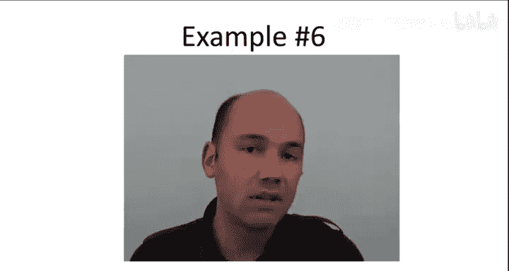

# 斯坦福大学《算法启蒙（第1册）：基础篇｜Algorithms Illuminated, Part 1： The Basics》中英字幕 - P19：-20-4   3   Examples 13 min.zh_en - GPT中英字幕课程资源 - BV1vSVAzXE2r

In this video， we'll put the master method to use by instantating it for six different examples。

 But first， let's recall what the master method says。

So the master method takes as input recurrences of a particular format in particular recurrences that are parameterized by three different constants A B and D A refers to the number of recursive calls or the number of subproblems that get solved。

 B is the factor by which the subproblem size is smaller than the original problem size and D is the exponent in the running time of the work done outside of the recursive calls so the recurrence has the form T of n。

 the running time on input of size N is no more than a。

 the number of subproblem times the time required to solve each subproblem which is t of n over B because the input size of a subproblem is n over B plus O of n to the D the work outside of the recursive calls There's also a base case which I haven't written down so once the problem size drops below a particular constant。

 then there should be no more recursion and you can just solve the problem immediately that is in constant time Now given a recurrence in this permitted formats。

 the running time is given by one of three。dependingepending on the relationship between A。

 the number of recursive calls and B raised to the D power case one of the master method is when these two quantities are the same a equals B to the D。

 then the running time is n to the D log n， no more than that in case2。

 the number of recursive calls A is strictly smaller than B to the D then we get a better running time upper or bound of O of n to the D and when a is bigger than B to the D。

 we get this somewhat funky looking running time of O of n raised to the logbased B of a power。

 we'll understand where that formula comes from a little later So that's the master method it's a little hard to interpret the first time you see it。

 So let's look at some concrete examples。Let's begin with an algorithm that we already know the answer to we already know the running time。

 namely let's look at merge short so again what's so great about the master method is all we have to do is identify the values of the three relevant parameters A B and D and we're done we just plug them in and we get the answer so A remember is the number of recursive calls so in merge short recall we get two recursive calls。

B is the factor by which the subproblem size is smaller than that in the original。

 well we recurse on half the array， sub so the subprom size is half that of the original。

 so B is equal to2。And recall that outside of the recursive calls， all merge or does is merge。

 And that's a linear time subroutine。 So the exponent D is one reflection of the fact that it's linear time。

 So remember， the key trigger， which determines which of the three cases is the relationship between A and B to the D。

So a obviously is2。And B to the D。Is also equal to two。So this puts us in case1。

And remember in case one。We have that the running time is bounded above by O of end to the D log n。

In our case， D equals1， so this is just a analog log gap。

Which of course we already knew but at least this is a sanvy check。

 the master method is at least reconfirming facts which we've already proven by direct means。

 So let's look at a second example。 The second example is going to be for the binary search algorithm in a sorted array Now we haven't talked explicitly about binary search and I'm not planning to So if you don't know what binary searches please read about it in a textbook or just look it up on the web and it'll be easy to find descriptions but the upshot is this is basically how you look up a phone number in a phone book Now I realize probably the youngest viewers of this video haven't actually had the experience of using a physical telephone book but for the rest of you as you know。

 you don't actually start with the A's and then go to the B's and then go to the C's if you're looking for a given name you more sensibly split the telephone book roughly in the middle and then depending on which if you're looking for is earlier or later in the alphabet you effectively recur on the relevant half of the telephone book so binary search is just exactly the same algorithm when you're looking for a given element in a particular sorted array you start in the middle the array and then you recurs。

The leftft or the right half as appropriate， depending on if the element you're looking for is bigger or less than the middle element。

Now the master method applies equally well to binary search and it tells us what its running time is。

 so in the next quiz you'll go through that exercise。

So the correct answer is the first one to see why let's recall what A B and D mean A is the number of recursive calls Now in binary search。

 you only make one recursive call。 This is unlike merge sort。

 remember you just compare the element you're looking for to the middle element。

 if it's less than the middle element you recursse on the left half if it's bigger than the middle element you recurse on the right half。

 so in any case there's only one recursive call。 So a is merely one in binary search Now in any case you recurse on half the array。

 so like in merge short， the value of B equals2 you recursse on a problem of half the size and outside of the recursive call。

 the only thing you do is one comparison， you just determine whether the element you're looking for is bigger than or less than the middle element of the array that you recursed on So that's constant time outside of the recursive call giving us the value for D of zero just like merge sort。

 this is again case one of the master method because we have a equal B to the D。

Both in this case are equal to one。So this gives us a recurrence。

 a solution to our recurrence of Big O of end to the D log n。Since d equals zero。

 this is simply login。And again， many of you probably already know that the running time of binary search is log in or you can figure that out easily again this is just using the master method as a sanity check to reconfirm that it's giving us the answers that we expect let's now move on to some harder examples beginning with the first recursive algorithm for integer multiplication remember this is where we recurse on four different products of n over two digit numbers and then recombine them in the obvious way using padding by zero and some linear time additions。

So the first integer multiplication algorithm， which does not make use of Gauss' trick。

 where we do the four different recursive calls in the naive way， we have A。

 the number of recursive calls is equal to four。Now in each case。

 whenever we take a product of two smaller numbers， the numbers have n over two digits。

 so that's half as many digits as we started with， so just like in the previous two examples。

 B is going to be equal to2 the input size drops by a factor2 when we recurse Now how much work do we do outside the recursive cause well again all it is doing is additions and padding by zeros and that can be done in linear time。

 linear time corresponds to a parameter value of D equal to1。

So next we determine which case of the master method we're in a equals 4。B to the D equals 2。

Which in this case is less than a。So this corresponds to case three of the master method。

And this is where we get the somewhat strange formula for the running time of the recurrence。

To you then。Is big O of end to the log base B of A。

Wwhich with our parameter values is n to the log base2 of4， also known as o of n squared。

 so let's compare this to the simple algorithm that we all learned back in grade school recall that the iterative algorithm for multiplying two integers。

Also takes an n squared number of operations， so this was a clever idea to attack the problem recursively。

 but at least in the absence of Gauss's trick where you just naively compute each of the four necessary products separately。

 you do not get any improvement over the iterative algorithm that you learn in grade school either way it's an n squared number of operations。

But what if we do make use of Gaus's trip where we do only three recursive calls instead of four。

 surely the running time won't be any worse than n squared and hopefully it's going to be better。

 so I'll let you work out the details on this next quiz。

So the correct answer to this quiz is the fourth option。

 It's not hard to see what the relevant values of A B and D are。

 remember the whole point of Gauss's trick is to reduce the number of recursive calls from 4 down to3 so the value of a is going to be3 as usual we're recursing on a problem size which is half of that of the original in this case N over two digit numbers so B remains two and just like in the more naive recursive algorithm we only do linear work outside of the recursive calls all that's needed to do some additions and paddings by zero so that puts us parameter values A B and D then we have to figure out which case of the master method that is so we have a equal3。

B raised to the D equal to2， so a has dropped by one relative to the more naive algorithm。

 but we're still in case3， the master method。 A is still bigger than B to the D。

 so the running time is still governed by that rather exotic looking formula， namely T of n is big O。

Of N to the log。Base B， which in our case， is2 of a， which is now three instead of four。

Okay so the master method just tells us the solution to this recurrence。

 the running time of this algorithm is big of end to a log base two of three。

 so what is log base two of three， will'll plug it in your computer or a calculator and you'll find that it's roughly 1。

59 so we get a running time。OfN to the 1。59。Which is certainly better than n squared。

 it's not as fast as N log n， not as fast as the merge short recurrence。

 which makes only two recursive calls， but it's quite a bit better than quadratic。

 so summarizing you did in fact learn a suboptimal algorithm for integer multiplication way back in grade school。

 you can beat the iterative algorithm using a combination of recursion plus Gaus' trick to save on the number of recursive calls。

Let's quickly move on to our final two examples Ex number five is for those of you that watch the video on Strasson's matrixtri multiplication algorithm。

So recall the salient properties of Stratton's algorithm。

 The key idea is similar to ing a strict for integer multiplication。

 First you set up the problem recursively one observes that the naive way to solve the problem recursively would lead to eight subproblem。

 but if you're clever about saving some computations。

 you can get it down to just seven recursive call7 subproblems。

 So a in Stratton's algorithm is equal to7。

As usual， each subproblem size is half that of the original one。

 so B is going to be equal to2 and the amount of work done outside of the recursive cause is linear in the matrix size。

 so quadratic and n quadratic in the dimension because there's。

quadratic number of entries in terms of the dimension。

So n squared work outside of the recursive cause leading to a value of D equal to2。

 So as far as which case of the mastery method we're in， well。

 it's the same as in the last couple examples， A equals 7 either the D equals 4 just less than a。

 So once again we're in case3。And now the running time of Stratton's algorithm。

 T of n is big O of n to the log base two of7。Which is more or less end of the 2。81。 And again。

 this is a win。Once we use the savings to get down to just seven recursive calls。

 this beats the naive letterer of algorithm， which recall would require cubic time。

 so that's another win for a clever divide and conquer and matrix notplification via stress ands algorithm and once again。

 the master's method just by plugging in parameter tells us exactly what the right answer to this recurrence is。

So for the final example， I feel a little guilty because I've shown you five examples and none of them have triggered case2。

 we've had two in case one of the master method and three now in case three。

 so this will be sort of a fictitious recurrence just to illustrate case two。

 but there are examples of recurrences that come up where case two is the relevant one。

So let's just look at a。At the following recurrence。So this recurrence is just like merge short。

 we recursse twice， there's two recursive calls each on half the problem size。

 the only difference is in this recurrence we're working a little bit harder in the combined step。

 instead of linear time outside of the recursive calls， we're doing a quadratic amount of work。So。

A equals 2。B equals 2 and D equals 2。So meta the D was equal to 4， strictly bigger than a。

 and that's exactly the trigger for case2。Now， recall what the running time is in case2。

It's simply end to the D where D is the exponent in the combined step in our case， d is2。

 so we get a running time of n square and you might find this a little counterintuitive given the merge short all we do with merge short is change the combined step from linear to quadratic and merge short has a running time of n log n you might have expected the running time here to be n squared log n。

 but that would be an overestimate so the master method gives us a tighter upper bound shows that it's only quadratic work so put differently the running time of the entire algorithm is governed by the work outside of the recursive calls just in the outermost call to the algorithm just at the root of the recursion tree。

