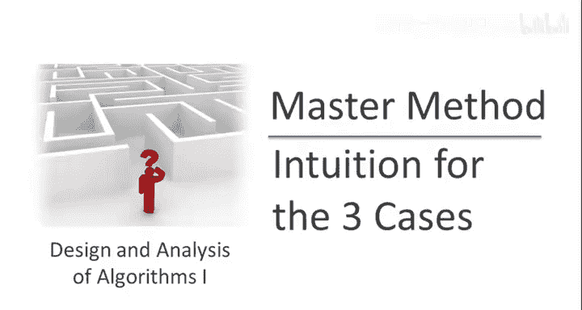
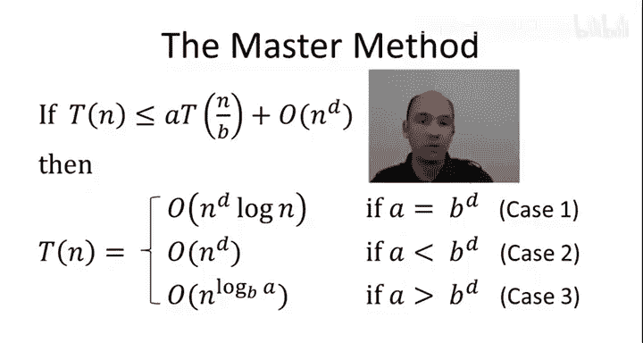

# 斯坦福大学《算法启蒙（第1册）：基础篇｜Algorithms Illuminated, Part 1： The Basics》中英字幕 - P21：-22-4   5   Interpretation of the 3 Cases 11 min.zh_en - GPT中英字幕课程资源 - BV1vSVAzXE2r

This video is the second of three that describes the proof of the master method in the first of these three videos we mimicked the analysis of merge short。

 we used a recursion tree approach which gave us an upper bound on the running time of an algorithm which is governed by a recurrence of the specified form Unfortunately that video left us with a bit of an alphabet soup。

 this complicated expression and so in the second video we're not going to do any computations we're just going to look at that expression attach some semantics to it and look at how that interpretation naturally leads to three cases and also give intuition for some of the running times that we see in the master method。

So recall from the previous video that the way we've bounded the work done by the algorithm is we zoomed in on a particular level J of the recursion tree。

 we did a computation which was the number of subproms at that level a to the J times the work done per subproblem that was the constant C times quantity N over B to the J raised to the D。

 and that gave us this expression， C end to the D times the ratio of a over B to the D raised to the J at a given level J。

 the expression star that we concluded the previous video with was just the sum of these expressions over all of the logarithic number of levels J。

Now as messy as this expression might seem， perhaps we're on the right track in the following sense。

 the master method has three different cases in which case you're in is governed by how a compares to B to the D。

 and here in this expression we are seeing precisely that ratio， A divided by B to the D。

 so let's drill down and understand why this ratio is fundamental to the performance of a divine and conquer recursive algorithm。

So really what's going on in the master method is a tug of war between two opposing forces。

 one which is forces of good and one which is forces of evil。

 and those correspond to the quantities B to D and A respectively， so let me be more precise。

 let's start with the parameter A。So A you'll recall is defined as the number of recursive calls made by the algorithm。

 so it's the number of children that a node in the recursion tree has。

 so fundamentally what A is it's the rate at which subproblems proliferate as you pass deeper in the recursion tree。

 it's the factor by which there are more subproblem at the next level than the previous one。

So let's think of A in this way as the rate of subpro proliferation or RSP。And when I say rate。

 I mean as a function of the recursion level J。 so these are the forces of evil。

 this is why our algorithm might run slowly is because as we go down the tree there are more and more subproblems and that's a little scary The forces of good what we have going for us is that with each recursion level J we do less work per subproblem and the extent to which we do less work is precisely B to the D。

So I'll abbreviate this rate of work shrinkage or this quantity B to the D by RWS。

Now perhaps you're wondering why is it B of the D， Why is it not B。 So remember what B denotes。

 That's the factor by which the input size shrinks with the recursion level J。 So for example。

 if B equals 2， then each subproblem at the next level is only half as big as that at the previous level。

 but we don't really care about the input size of a subproblem except in as much as it determines the amount of work that we do solving that subproblem。

 So that's where this parameter D comes into play。 think， for example。

 about the cases where you have a linear amount of work outside the recursive calls versus a quadratic amount of work that is consider the cases where D equals1 or two。

 if B equals 2 and d equals1， that is if you recur on half the input and do linear work。

 then not only is the input size dropping by a factor2。

 but so is the amount of work that you do per subproble and that's exactly the situation we had in merge sort where we have linear work outside the recursive calls。

 but think about D equals 2。Suppose you did quadratic work per subproblem as a function of the input size。

 then again if B equals 2， if you cut the input at half the recursive call is only going to do 25% as much work as what you did at the current level the input size goes down by a factor2 and that gets squared because you do quadratic work as a function of the input size So that would be B to the D2 raised to the2 or4。

 So in general， the input size goes down by a factor B but what we really care about how much less work we do per subproblem goes down by B to the D that's why B to the D is the fundamental quantity that governs the forces of good。

 the extent to which we work less hard with each recursion level J。

 So the question then is just what happens in this tug of war between these two opposing forces So fundamentally what the three cases of the master method correspond to is the three possible outcomes in this tug of war between the forces of good namely the rate of work shrinkage and the forces of evil。

 namely the rate of subproblem proliferation。There are three cases， one for the case of a tie。

 one for the case in which the forces of evil win， that is in which A is bigger than B to the D。

 and a case in which good wins， that is B to the D is bigger than。

To understand is a little bit better， what I want you to think about is the following。

 think about the recursion tree that we drew in the previous slide and as a function of A versus B to the D。

 think about the amount of work done per level， when is that going up per level。

 when is it going down per level and when is it exactly the same at each level。

So the answer is all of these statements are true except for the third one。

 so let's take them one at a time， so first of all， let's consider the first one。

Suppose that the rate of subproblem proliferation A is strictly less than the rate of work shrinkage B to the D。

 This is where the forces of good。 the rate at which we're doing less work per subproblem is outpacing the rate at which subproblems are proliferating。

 so the number of subproblems goes up that the savings per subproblem goes up by even more。

 So in this case it means we're going to be doing less work with each recursion tree level。

 the forces of good outweigh the forces of evil。 The second one is true for exactly the same reason。

 if subproblems are proliferating so rapidly that it outpaces the savings that we get per subproblem。

 then we're going to see an increasing amount of work as we go down the recursion tree。

 will increase with the level J。 Given that these two are true， the third one is false。

 we can draw conclusions depending on whether the rate of subproble proliferation is strictly bigger or strictly less than the rate of work shrinkage。

 And finally， the fourth statement is also true。 This is the perfect equilibrium between。

Forces of good and the forces of evil subproble are proliferating。

 but our savings per subproblem is increasing at exactly the same rate。

 the two forces will then cancel out and will get exactly the same amount of work done at each level of the recursion tree。

 this is precisely what happened when they analyzed the merge short algorithm。

So let's summarize and conclude with the interpretation and even understand how this interpretation lends us to forecast some of the running time bounds that we see in the master method。

Summarizing the three cases of the master method corresponded to three possible outcomes in the battle between subproble proliferating and the work per subproblem shrinking。

 one for a tie， one for when sub problemsblem is proliferating faster。

 and one for when the work shrinkage is happening faster。

In the case where the rates are exactly the same and they cancel out。

 then the amount of work should be the same at every level of the recursion tree and in this case we can easily predict what the running time should work out to be in particular we know there's a logarithmic number of levels。

 the amount of work is the same at every level and we certainly know how much work is getting done at the root because that's just the original recurrence which tells us that there's asymptically end to the D work done at the root so with end of the D work for each of the log levels we expect a running time of end of the D times login。

As we just discussed when the rate of work done per subproblem is shrinking even faster than subprobles proliferate。

 then we do less and less work with each level of the recursion tree。

 so in particular the biggest amount of work the worst level is at the root level Now the simplest possible thing that might be true would be that actually the root level just dominates the overall running time of the algorithm and the other level really don't matter up to a constant factor so it's not obvious that's true but if we keep our fingers crossed and hope for the simplest possible outcome with the root has the most work we might expect a running time that's just proportional to the running time at the root as we just discussed we already know that that's end of the D because that's just the outermost call to the algorithm。

By the same reasoning when this inequality is flipped and subprom proliferates so rapidly that it's outpacing the savings we get per subproblem。

 the amount of work is increasing the recursion level。

 and here the worst case is going to be at the leaves that's where that level is going to have the most work compared to any other level and again。

 if you keep your fingers crossed and hope that the simplest possible outcome is actually true。

 perhaps the leaves just dominate and up to a constant factor they govern the running time of the algorithm in this third case。

 given that we do a constant amount of work for each of the leaves since those correspondent base cases。

 here we'd expect a running time in the simplest scenario proportional to the number of leaves in the recursion tree。

So let's summarize what we've learned in this video we now understand that fundamentally there are three different types of recursion trees。

 those in which the work done per level is the same at every level。

 those in which the work is decreasing with the level in which case the root is the worst level and those in which the amount of work is increasing in the level where the leaves are the worst level。

 Furthermore it's exactly the ratio between A， the rate of subproblem proliferation and B to the D。

 the rate of work shrinkage per subproblem that governs which of these three recursion trees we're dealing with。

Furthermore， intuitively， we've now had predictions about what kind of running time we expect to see in each of the three cases。

 their end of the D log N that we're pretty confident about there's a hope that in the second case where the root is the worst level。

 that maybe the running time is end of the D and there's a hope in the third case where the leaves are the worst level and we do constant time per leaf per base case that it's going to be proportional to the number of leaves。

 Let's now sanity check this intuition against the formal statement of the master method which will prove more formally in the next video。

So in the three cases we see they match up at least two or to three with exactly what our intuition lies。

 so in the first case we see the expected end to the D times log n in the second case where the root is the worst level indeed the simplest possible outcome of big O of n to the D is the assertion Now the third case there remains a mystery to be explained our intuition said this should hopefully be proportional to the number of leaves and instead we've got this funny formula big O of end of the log based B of A so in the next video we'll demystify that connection as well as a formal proof for these assertions。

