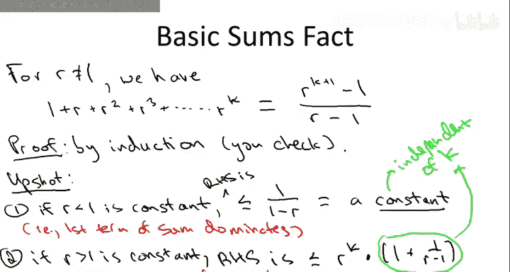
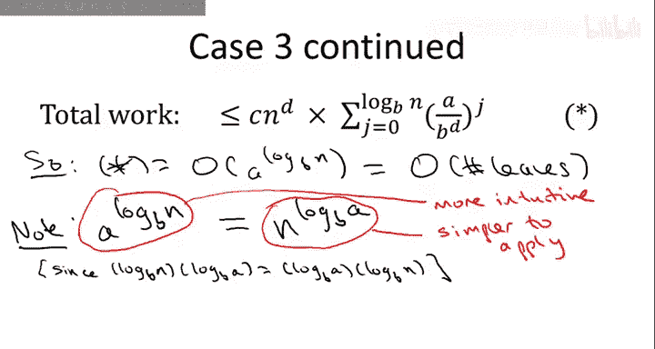
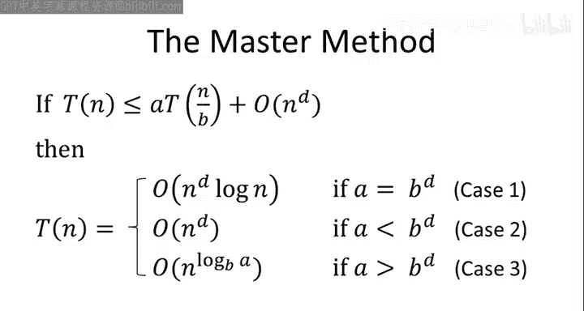

# 斯坦福大学《算法启蒙（第1册）：基础篇｜Algorithms Illuminated, Part 1： The Basics》中英字幕 - P22：-23-4   6   Proof II 16 min.zh_en - GPT中英字幕课程资源 - BV1vSVAzXE2r

Let's complete the proof of the master method。 Let me remind you about the story so far。

 The first thing we did is we analyzed the work done by a recursive algorithm using a recursion tree。

 So we zoomed in a giable level J。 we identify the total amount of work done at level J。

 and then we summed up over all of the levels resulting in this rather intimidating expression star C end to the D times a sum over the levels J from0 to log base B of N of quantity A over B to the D raised to the J。

 Having derived this expression star。 we then spend some time interpreting it attaching to it some semantics。

 and we realized that the role of this ratio A over B to the D is to distinguish between3 fundamentally different types of recursion trees。

 Those in which a equals B to the D and therefore the amount of work is the same at every level。

 Those in which a is less than B to the D， and therefore the amount of work is going down with the level。

 and those in which a is bigger than B to the D， in which case the amount of work is growing with the level。

 This gave us intuition about the three cases of the master method。

even gave us predictions for the kind of running times that we might see so what remains to do is really turn this hopeful intuition into a rigorous proof so we need to verify that in fact the simplest possible scenarios outlined in the previous video actually occur In addition we need to demystify the third case and understand what the expression has to do with a number of leaves of the procursion tree Let's begin with the simplest case which is case1。

 recalling case1 we're assuming that A equals B to the D。

This is the case where we have a perfect equilibrium between the forces of good and evil。

 where the rate of subproblem proliferation exactly cancels out with the rate at which we do less work per subproblem and now examining the expression star。

 we can see how easy our lives get when A equals B to the D。 In that case， this ratio is equal to1。

So naturally， this ratio raised to the J is also equal to1 for all J。And then， of course。

 this sum evaluates to something very simple， namely one sum with itself。

 log base B of n plus one times。 So the sum simply equals。Log base B of N。Plus， one。

And that's going to get multiplied by。The C end to the D term， which is independent of the sum。

 So summarizing when a equals B to the D， we find that star equals C end to the D times。

Log based B of N plus one。Readriing this in Big O notation。

 we would write Big O of end to the D login。And again。

 I'm going to suppress the base of the logarithm， since all logarithms differ only by a constant factor。

 we don't have to specify the base， that's just suppressed by the constant hidden in the big notation。

So that's it for case1。Like I said， this is the easy case。

 So what do we do when a is not equal to B to the D and remember A could be either less than or bigger than B to the D To answer that question。

 let's take a short detour into geometric series。For this single slide detour。

 we're going to think about a single constant number R。Now。

 what you want to think about is R representing that ratio A over B to the B from the previous slide。

 But for this slide only， let's just call it R。 This is a constant。 It's bigger than 0。

 and it's not equal to one。Now， suppose we sum up powers of R stopping。

 let's say at the Ca power of R。😡，I claim that this sum has a nice closed form formula。

 specifically it is exactly R to the K plus1 minus1。Divided by R minus1。

Now whenever you see a general formula like this， it's useful to keep in mind a couple of canonical values of the parameters that you can plug in to develop intuition。

 and for this expression you might want to think canonically about the case as r equal 2 and r equals1 half。

 so when r equals  two we're summing up powers of  two。

 1 plus 2 plus 4 plus8 plus 16 and so on when r is a half we're summing up 1 plus a half plus a quarter plus an eighth and so on。

Now I'm not going to prove this for you， I'd like you to prove this yourself。

If you don't already know this fact， so the way to prove this is simply by induction。

And I will leave this as an exercise What I want to focus on instead is what this fact can do for us。

The way we'll use this fact is to formalize the idea that in recursion trees where the amount of work is increasing in the levels。

 the leaves dominate the overall running time and where recursion trees where the amount of work is decreasing in the level。

 the root dominates the running time in the sense that we can ignore all of the other levels of the recursion tree。

 So in the notation in this slide， we have two upshots。 first of all。

 for the case when R is less than one。And in this case， this expression on the right hand side。

 R to the K plus1 minus1 over r minus1 can be upper bounded by 1 over 1 minus R。

So again remember you might want to have a canonical value of R in mind here。

 namely one half so what we're claiming here is that the right hand side is no more than two for the case of article 1 half and that's easy to see if you think about one plus1 half plus a quarter plus18 and so on that sum is converging to2 as K grows large so in general for R less than one constant。

 the sum is bounded by1 minus1 over R now we're not actually going to care about this formula。

1 minus1 over R the point for us is just that this is a constants。And by constant。

 I mean independent of K， independent of how many terms we sum up， obviously it depends on R。

 the ratio， but it does not depend on how many things we sum up on K。

So the way to think about this is when we sum up a bunch of terms where r is less than one then the very first term dominates。

 the first term is equal to1 and no matter how many terms we sum up。

 we never get grow bigger than sum constant a similar situation holds for the case where r is a constant bigger than one when r is bigger than one a tiny bit of algebra shows that we can upper bound the right hand side by r to the K。

Time something which is constant， independent of K。So again。

 let's interpret the second upshot in terms of a canonical value of R， namely r equals 2。

 then our sum is1 plus 2 plus 4 plus 8 plus 16 and so on。

 and what this is saying is that no matter how many terms we sum up。

 the overall sum is never going to be more than twice the largest and final term So if we sum up to say 128。

 the sum you'll notice will be 255， which is at most twice that largest term 128。

 and that same is true for any K the entire sum is no more than twice that of the largest term in this sense。

 the largest term of the series dominates the whole thing。

So to summarize this slide in just one sentence， when we sum up powers of a constant R。

 when our is bigger than one， the largest power of that constant dominates the sum。

 when R is smaller than one， then the sum is just a constant。

 Let's now apply this to prove case2 of the master method。

In case two of the master method， we assume that A is less than B to the D。

That is the rate at which sub problemsblems are proliferating is drowned out by the rate at which we do less work per subproblem。

So this is the case where the amount of work is decreasing with each level of the recursion tree and our intuition said that well in the simplest possible scenario we might hope that all of the work up to a constant factor is being done at the root。

 so let's make that intuition precise by using the basic sums fact on the previous slide。

So since a is less than B to the D， this ratio is less than1。So let's call this ratio equal to R。

So R you'll notice does depend on the three parameters， A， B， and D， but R is a constant。

 it does not depend on n。So what is this sum， the sum is just we're just summing up powers of this constant R where R is less than1。

 What did we just learned， we just learned that any such sum is bounded above by a constant independent of the number of terms that you sum up So therefore what is this expression star evaluates to。

 it evaluates to C， which is a constant times N to the D times another constant。

 So suppressing the product of these two constant in big O notation。

 we can say that the expression star is upper bounded by a big O of n to the D and this makes precise intuition that indeed the overall running time of the algorithm in this type of recursion tree with decreasing work per level is dominated by the root the overall amount of work is only a constant factor larger than the work done in merely at level zero of the tree。

Let's move on to the final and most challenging part of the proof。 the final case。In case3。

 we assume that A is bigger than B to the D。So in conceptual terms we're assuming the rate at which subprom proliferate is exceeding the rate at which we do less work per subproblem。

 so these are recursion trees where the amount of work is increasing with each level with the most work being done at the leaves and once again using the basic sum fact。

 we can make precise the hope that in fact we only have to worry about the leaves。

 we can throw away the rest of the work losing only a constant factor。So to see that。

 we will again denote this ratio between A and B to the D as R。And in this case。

 R is bigger than1 so this sum is a sum of a bunch of powers of R where R is bigger than1。

 What did we just learn about that two slides ago in the basic sums fact。

 we learned that such sums are dominated by the largest and last term of the sum so they' bounded by a constant factor times the largest term。

Therefore， we can simplify the expression star to the following。

I'm going to write it in terms of big O notation and like on the last slide I'll use it to suppress two different constants。

 on the one hand I'm going to be suppressing the constant C。

 which we inherited way back when from the original recurrence and on the other hand I'm going to use it to also suppress this constant that comes from the basic sums fact。

So ignoring those two constants， what do we have left， we have N to the D。

Times the largest term of the sum。So what is the largest term of the sum where it's the last one so we plug in the biggest value of J that we're ever going to see。

 so what's the biggest value of J we're ever going to see what's just this log based B event。

So we get the ratio A over B to the D。Raised to the log。Baase B event。Power。

Now don't despair how messy this looks， we can do some remarkable simplifications。

So what I want to do next is I want to focus just on this one over B to the D raised to the log base B of n term。

So， that's going to be。You can write that as B to the minus D。Log base B of N。

Which if I factor this exponent into two successive parts， I can write this as B。

Raised to the log base B of n power and only then raised to the minus D。And now， of course。

 what happens is that taking the logarithm of N based B。

 followed by taking raising it to the B power， those are inverse operations to cancel。

 so that leaves us just with the N。So this results in an end of the minus D。And now， remarkably。

 this end of the minus D is just going to cancel out with this end of the D。

Leaving us with merely。A raised the log base B of n。

And thus out of this crazy C of letters rises a formula we can actually understand。

 so A to the log base B of n if we step back and think for a minute is actually a supernaural quantity。

 it describes something about the recursion trees that we already knew was supposed to pop up in the analysis I'll let you think through exactly what that is in the following quiz。

So the correct answer to this quiz is the fourth response。

A race of a log based B of n is precisely the number of leaves of the recursion tree and remember in our intuition for case3。

 recursion trees where the amount of work is increasing per level。

 we thought that perhaps the work would be dominated by the work done at the leaves。

 which is just proportional to the number of leaves。

 So why is this the answer we'll just remember what recursion trees look like at level0。

We have a single node， and then with each level， we have eight times as many nodes as before。

That is with each level of the recursion tree， the number of nodes goes up by a factor of A。

 how long does this process go on， well it goes on until we reach down to the leaves。

Recall that the input size starts at n， but the root it gets divided by a factor B each time and it terminates once we get down to1。

 so the leaves reside at precisely level log based B of n。So therefore。

The number of leaves is just the branching factor， which is a raised to the number of times that we actually multiply by a。

 which is just the number of levels。Just log based B event。So each time we go down a level。

 we increase the number of nodes by a factor of A， and we go down a level log based B of n times。

 leaving us with the number of leaves equal to a raised to the log based B event。

So what we've done is we've mathematically confirmed in a very cool way our intuition about what case3 should look like in the mastermath。

We've proven that in case3， when A is bigger than B to the D。

 the running time is O of the number of leaves in the recursion tree just as the intuition predicted。

 but this leaves us with one final mystery if you go back to the statement of the master method。

 we didn't say A to the log based B of N in case3 it says the running time is n to the log based B of A and not only that we've used this case3 formula over and over again to evaluate Gauss's recursive algorithm for integer multiplication to evaluate Strasin's matrix multiplication algorithm and so on。

 so what's the story， how come we're not getting the same thing as in the statement of the master method。

Well， there's a very simple explanation， which is simply that， believe it or not。

A log based B of N and N of the log based B of A are exactly the same thing。

 This looks like the kind of mistake you' make in freshman algebra。

 but actually if you think about it， these are simply the same quantity if you don't believe me just take the logarithm based B of both sides and you'll get the same thing on both sides Now you might well be wondering why didn't just state in the master method that the running time of case3 is this very sensible and meaningful expression。

 a raised to the log based B of n Ie the number of leaves in the recursion tree。

 Well it turns out that while this expression on the lefthand side is the more meaningful conceptually the right-hand side end of the log based B of a is the easiest one to apply。

 so recall when work through a bunch of examples of the master method this right hand side was super convenient when we evaluated the running times of algorithms when we plug in the numbers of A and B。

In any case， whether or not you want to think about the running time in case3 as proportional to the number of leaves in the tree or as proportional to the end of the log based B of A。

 we're done。 we've approved it。 That's case3。 That was the last one so we're done with a master method。

 QED。

So that was a lot of hard work proving the master method and I would never expect someone to be able to regurgitate all of the details of this proof you know it's something like a cocktail party well maybe except at the neriest of all cocktail parties but I do think there's a few high-lel conceptual points of this proof that are worth remembering in the long term so we started by just writing down a recursion tree for the recursive algorithm and in a generic way going level by level we counted up the work done by the algorithm and this part of the proof had nothing to do with how a and B the D related to each other then we recognize that there are three fundamentally different types of recursion trees those with the same amount of work per level those were increases with a level and those were decreases with the level if you can remember that you can even remember what the running times of the three cases should be in the case where you do the same amount at every work at each level we know there's a logarithmic number of levels we know we do end the D work at the root so that gives us the running time in case1 of end of the D log n。

When the amount of work is decreasing with the levels。

 we now know that the root dominates up to a constant factor we can throw out the rest of the levels and we know end of the D work gets done at the root。

 so that's the overall running time and in the third case where it's increasing in the levels the leaves dominates the number of leaves as a raised to the log base to B of N and that's the same as end to the log base B of A and that's the proportion of the running time in case3 of the master method。

