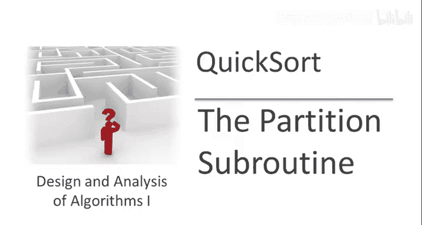
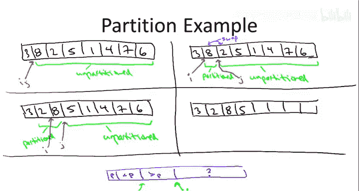
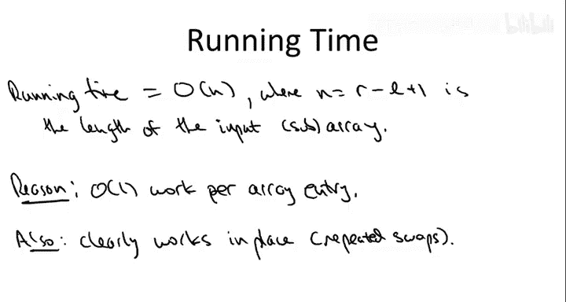
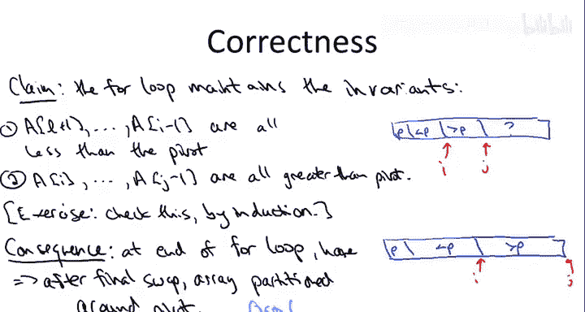

# 斯坦福大学《算法启蒙（第1册）：基础篇｜Algorithms Illuminated, Part 1： The Basics》中英字幕 - P24：-25-5   2   Partitioning Around a Pivot 25 min.zh_en - GPT中英字幕课程资源 - BV1vSVAzXE2r

The goal of this video is to provide more details about the implementation of the Quickword algorithm and in particular here we're going to drill down on the key partition subroutine。

 so let me remind you what the job of the partition subroutine is in the context of sorting an array。

So recall the key idea in quick sort is to partition the input array around a pivot element so this has two steps first you somehow choose a pivot element and in this video we're not going to worry about how you choose the pivot element for concrete issue you might just want to think about you keep the first you pick the first element of the array to serve as your pivot so in this example array the first element happens to be three so we could choose three is the pivot element Now its a key rearrangement step so you rearrange the array so that it has the following property any entries that are to the left of the pivot element should be less than the pivot element or as any entries which are to the right of the pivot element should be greater than the pivot element so for example in this version of the second version of the array we see to the left of the three is the two and the one they're in reverse order but that's okay both the two and the one or to the left of the three and they're both less than three and the five elements to the right of three they're jumbled up but they're all bigger than the pivot element so this is a legitimate rearrangement that satisfies the partitioning property and again。

Call this definitely makes partial progress toward having a sorted array the pivot element winds up in its rightful position it winds up where it's supposed to be in the final sorted array to the right of everything less than it to the left of everything bigger than it Moreoverover we' correctly bucketed the other n minus1 elements to the left or to the right of the pivot according to where they should wind up in the final sorted array so that's the job that the partitioning subroutine is responsible for Now what's cool is we'll be able to implement this partition subroutine in linear time even better we'll be able to implement it so that all it does really is swaps in the array that is it works in place it needs no additional essentially constant additional memory to rearrange the array according to those properties and then as we saw in the highle description of the quick sort algorithm what partitioning does is it enables a divide and conquer approach it reduces the problem size after you've partitioned an array around the pivot all you got to do is recursse on the left side recurursse on the right side and you're done So what I owe you is this implementation how do we actually。

the partitioning property stuff to the left of the pivot smaller than it。

 stuff to the right of the pivots bigger than it in linear time and in place Well， first。

 let's observe that if we didn't care about the in place requirement。

 if we were happy to just allocate a second array and copy stuff over。

 it would actually be pretty easy to implement a partitioning subroutine in linear time。

That is using O of n extra memory。 it's easy to partition around a pivot element in O of n time and as usual you probably I should be more precise and write theta of n in these two cases that would be the more accurate stronger statement。

 but I'm going to be sloppy I'm going just gonna write the weaker but still correct statement using big O so big O of n time using linear extra memory So how would you do this Well let me just sort of illustrate by example I think you'll get the idea。

 So let's go back to our running example of an input array。Well。

 if we're allowed to use linear extra space， we can just preallocate another array of length n。

And then we can just do a single scan through the input array bucketing elements according to whether they're bigger than or less than the pivot。

 And so for example we could fill in the additional array both from the left and the right using elements that are less than or bigger than the pivot respectively so for example。

 we start with the eight we note that the eight is bigger than the pivot So we put that at the end of the output array。

 then we get to the two that choose less than the pivot so that should go on the left hand side of the output array。

 we get to the five， it should go on the right hand side。

And the one should go on the left hand side and so on。

When we complete our scan through the input array， there'll be one whole left and that's exactly where the pivot belongs to the right of everything less than it。

 to the left of everything bigger than it。So what's really interesting then is to have an implementation of partition。

 which is not merely linear time， but also uses essentially no additional space that doesn't resort to this cop out of preallocating an extra array of length and。

So let's turn to how that works first starting at a high level， then filling in the details。

So I'm going to describe the partitioning subroutine only for the case where the pivot is， in fact。

 the first element。

But really this is without loss of generality if instead you want to use some pivot from the middle of the array。

 you can just have a preprocessing step that swaps the first element of the array with the given pivot and then run the subjecting that I'm about to describe okay so with constant time preprocessing。

 the case of a general pivot reduces to the case of where the pivot is the first element。

So here's the high level idea， and it's very cool The idea is we're going to be able to get away with just a single linear scan of the input array。

So at any given moment in this scan， which is just going to be a single for loop。

 we'll be keeping track of both the part of the array we've looked at so far and the part that we haven't looked at so far there's going be two groups。

 what we've seen， what we haven't seen then within the group we've seen we're going to have that be split further according to the elements that are less than the pivot and those that are bigger than the pivot。

So we're going to leave the pivot element just hanging out in the first element of the array until the very end of the algorithm when we correct its position with a swap。

And at any given snapshot of this algorithm， we will have some stuff that we've already looked at。

And some stuff that we haven't yet looked at in our linear scan。

Of course we have no idea what's up with the elements that we haven't looked at yet。

 who knows what they are and whether they're bigger or less than the pivot。

 but we're going to implement the algorithm， so among the stuff that we've already seen。

 it will be partitioned in the sense that all elements less than the pivot come first。

 all elements bigger than the pivot come last and as usual we don't care about the relative order amongst elements less than the pivot or amongst elements bigger than the pivot。

So summarizing， we do a single scan through the input array。

And the trick will be to maintain the following invariance throughout the linear scan。

But basicallyically everything we've looked at in the input array is partition。

 everything less than the pivot comes before everything bigger than the pivot。

 and we want to maintain that invariant， doing only constant work and no additional storage with key each step of our linear scan。

So here's what I'm going to do next。 I'm going to go through an example and execute the partition subroutine on a concrete array。

 the same input array we've been using as an example thus far Now maybe it seems weird to give an example before I've actually given you the algorithm before I've giving you the code。

 but doing it this way， I think you'll see the gist of what's going on in the example and then when I present the code。

 it'll be very clear what's going on whereasas if I've presented the code first。

 it might seem a little opaque when I first show you the algorithm So let's start with an example。

Throughout the example， we want to keep in mind the high level picture that we discussed in the previous slide。

The goal is that at any time in the partition subroutine。

We've got the pivot hanging out in the first entry。Then we've got stuff that we haven't looked at。

So of course， who knows whether those elements are bigger than or less than the pivot and then for the stuff we've looked at so far。

 everything less than the pivot comes before everything bigger than the pivot。

 this is the picture we want to retain as we go through the linear scan。

As this high levell picture would suggest there's two boundaries that we're going to need to keep track of throughout the algorithm。

 we're going to need to keep track of the boundary between what we've looked at so far and what we haven't looked at yet。

 so that's going to be we're going to use the index J to keep track of that boundary and then we also need a second boundary for amongst the stuff that we've seen where is the split between those less than the pivot and those bigger than the pivot so that's going to be I。

So let's use our running example array。So stuff is pretty simple when we're starting out。

 we haven't looked at anything。So all of this stuff is unpartitioned。

And I and J both point to the boundary between the pivot and all the stuff that we haven't seen yet。

Now together get a running time which is linear， we want to make sure that at each step we advance J we look at one new element that way in a linear number of steps we'll have looked at everything and hopefully will' be done and we'll have a partition to so in the next step we're going to advance J。

So the region of the array which is which we haven't looked at， which is unpartitioned。

 is one smaller than before， we've now looked at the eight， the first element after the pivot。Now。

 the8 itself is indeed a partition array。 Everything less than the pivot comes before everything after the pivot turns out there's nothing less than the pivot。

 so e vacuously this is indeed partitioned。So Jay recall delineates the boundary between what we looked at and what we haven't looked at。

 I delineates amongst the stuff we've looked at where is the boundary between what's bigger than and was's less than the pivot。

 so the aid is bigger than the pivot so I should be right here。

Because we want eye to be just to the left of all the stuff bigger than the pivot。Now。

 what's going to happen it in the next iteration， this is where things get interesting。

 Suppose we advance J1 further。 Now， the part of the array that we've seen is an8 followed by a2。

Now an 8 and a2 is not a partition subar， remember what it means to be a partition subaret。

 all the stuff left less than the pivot， all the stuff less than three should come before everything bigger than three。

 so a2 obviously fails that property two is less than the pivot but it comes after the eight。

 which is bigger than the pivot so to correct this， we're going to need to do a swap。

 we're going to swap the two and the8。That gives us the following version of the original array。

So now the stuff that we have not yet looked at is one smaller than before we've advanced J。

So all this stuff is unpartition， who knows what's going on with that stuff？

J is one further entry to the right than it was before， and at least after we've done this swap。

 we do indeed have a partition array。So post swap the two and the eight R&D partition Now remember I delineates the boundary between amongst what we've seen so far。

 the stuff less than the pivot less than three in this case and that bigger than three。

 so I is going to be wedged in between the two and the eight。In the next iteration。

 our life is pretty easy。So in this case。In advancing J。

 we uncover an element which is bigger than the pivot。

 So this is what happened in the first iteration。 when we uncovered the8。

 It's different than what happened in the last iteration when we uncovered the two。 And so this case。

 this third iteration is going to be more similar to the first iteration than the second iteration。

 in particular， we won't need to swap。 We won't need to advance I。 We just advance J and red're done。

 So let's see why that's true。So we've advanced J， we've done one more iteration。

 so now the stuff that we haven't seen yet is only the last four elements。

So who knows what's up with the stuff we haven't seen yet， but if you look at the stuff we have seen。

 the2， the8 and the5， this is， in fact partitioned。

 right all the numbers that are bigger than three succeed come after all the numbers bigger than smaller than three。

So the J， the boundary between what we've seen and what we have in is between the five and the1。

 and the I， the boundary between the stuff less than the pivot and bigger than the pivot is between the two and the eight just like it was before。

 adding a five to the end didn't change anything。So let's wrap up this example on the next slide。

So first let's just remember where we left off on the previous slide。

 so I'm just going to redraw that same step after three iterations of the algorithm。

And now notice in the next iteration we're going to again have to make some modifications to the array if we want to preserve our invariant。

 The reason is that when we advance J， when we scan this1 now again。

 we're scanning in a new element which is less than the pivot and what that means is that the partitioned region or the region that we've looked at so far willll not be partition we'll have 2。

851 remember we need everything less than3 to precede everything bigger than three and this one at the end is not going to cut it so we're going to have to make a swap Now what are we going to swap。

 we're going to swap the one and the8s。So why do we swap the one and the eight well clearly we have to swap the one with something and what makes sense。

 what makes sense is the leftmost array entry which is currently bigger than the pivot and that's exactly the eight that's the first leftmost entry bigger than three so if we swap the one with it then the one will become the rightmost entry smaller than three。

So after the swap， we're going to have the following array。The stuff we haven't seen is the4。

 the 7 and the6。So the J will be between the eight and the four。The stuff we have seen is the2，1，5。

 and8。And notice that this is indeed partitioned， all the elements which are less than three。

 the two and the one precede all of the entries which are bigger than three， the five and the eight。

I remember is supposed to split the boundary between those less than three and those bigger than three。

 so that's going to lie between the one and the five that is one further to the right than it was in the previous iteration。

Okay， so because the rest of the unseen elements， the four the seven and the six are all bigger than the pivot。

 the last three iterations are easy， no further swaps are necessary。

 no increments to I are necessary， Jays just going to get incremented until we fall off the array and then fast forwarding the partition subrtine or this main linear scan will terminate with the following situation。

So at this point， all of the elements have been seen and all the elements are partitioned。

 J in effect has fallen off the end of the array， and I。

 the boundary between those less than in bigger than the pivot still lies between the one and the five。

Now we're not quite done because the pivot element 3 is not in the correct place。

 remember what we're aiming for is an array where everything less than the pivot is to the left of it。

And everything bigger than the pivot is to the right。

 but right now the pivot still is hanging out in the first element。

 So we just have to swap that into the correct place， Where is the correct place， Well。

 it's going to be the rightmost element， which is smaller than the pivot。 So in this case， the one。

So the sub team will terminate with the following array， 1，2，3，5，8，476。And indeed， as desired。

 everything to the less left of the pivot is less than the pivot and everything to the right of the pivot is bigger than the pivot。

 The one and two happened to be in sorted order， but that was just sort of an accident。 and the 4，5。

6 and 7 and 8。 you'll notice are jumbled up。 They're not in sorted order。

So hopefully from this example， you have a gist of how the partition subroutine is going to work in general。

 but just to make sure the details are clear， let me now describe the pseudocode for the partition subroutine。

So the way I'm going to denote it is there's going to be an input array A。

 but rather than being told some explicit link， what's going to be passed to the subroutine are two array indices。

 the leftmost index， which delineates this part of the subarray you're supposed to work on and the rightmost index。

The reason I'm writing it this way is because partition is going to be called recursively from within a quick sort algorithm。

 So at any point in quick sort， we're going to be recursing on some subset。

 contiguous subset of the original input array。 L and R are meant to denote what the left boundary and the right boundary of that subarray are。

So let's not lose sight of the high level picture of the invariant that the algorithm is meant to maintain。

So as we discussed we're assuming the pivot element is the first element although that's really without loss of generality。

 and in a given time there's going to be stuff we haven't seen yet， who knows what's up with that。

 and amongst the stuff we've seen， we're going to maintain the invariant that all the stuff less than the pivot comes before。

 all the stuff bigger than the pivot and J and I denote the boundaries between the scene and the unseen and between the small elements in the large elements respectively。

So back to the pseudocode， we initialized the pivot to be the first entry in the array， and again。

 remember L denotes the leftmost index that we're responsible for looking at。The initial value of I。

Should be just to the right of the pivot， so that's going to be L plus1。

That's also the initial value of J， which will assign in the main four loop。

So this four loop with J taking on all values from L plus1 to the rightmost index R denotes the linear scan through the input right？

And what we saw in the example is that there were two cases， depending on for the newly seen element。

 whether it's bigger than the pivot or less than the pivot。

 the easy cases when it's bigger than the pivot， then we essentially don't have to do anything。

 remember we didn't do any swaps， we didn't change I， the boundary didn't change。

 it was when that the new element was less than the pivot that we had to do some work。

So we're going to check that。Is the newly seen element， A J。Less than P。And if it's not。

 we actually don't have to do anything。Let me just put as a comment。

If the new element is bigger than the pivot， we do nothing。Of course， at the end of the four loop。

 the value of J will get incremented。 so that's the only thing that changes from iteration iteration when we're sucking up new elements that happen to be bigger than P。

 So what do we do in the example when we suck up a new element less than P。

 Well we have to do two things。So in the event that the newly seen elements is less than P。

I'll circle that here in pink。We need to do a rearrangement。

 so we again have a partitioned subaret amongst those elements we've seen so far。

 and the best way to do that is to swap these new elements with the leftmost elements that's bigger than the pivot。

And because we have an index I which is keeping track of the boundary between the elements less than the pivot bigger than the pivot。

 we can immediately access the left to most element bigger than the pivot。

 the I array index that's just the I entry in the array。

Now I am doing something a little sneaky here， I should be honest about which is there is the case where you haven't yet seen any elements bigger than the pivot and then you don't actually have a leftmost element bigger than the pivot to swap with turns out this code still works I'll let you verify that but it does do some redundant swaps really you don't need to do any swaps until you first see some elements bigger than the pivot and then see some elements less than the pivot so you can imagine a different implementation of this where you actually keep track of whether or not that's happened to avoid the redundant swaps I'm just going to give you the simple pseudocode and again for intuition you want to think about the case just like in the picture here in blue where we've already seen some elements that are bigger than the pivot and the next newly seen element is less than the pivot that's really sort of the key case here。

Now the other thing we have to do after one of these swaps is now the boundary between where the pivot elements sorry where the array elements less than the pivot and those bigger than the pivot has moved。

 it's moved one to the right， so we have to increment I。

So that's the main linear scan once this concludes J will have fallen off the end of the array and everything that we've seen。

 the final elements except for the pivot will be arranged so that those less than P or first those bigger than P will be last the final thing we have to do is just swap the pivot into its rightful position and recall for that we just swap it with the rightmost element less than。

So that is it， that is the partition subroutine there's a number of variants of partition this is certainly not the unique implementation if you look on the web or if you look in certain textbooks you'll find some other implementations as well discussion of the various merits but I hope this gives you。

 I mean this is a canonical implementation and I hope it gives you a clear picture of how you rearrange the array using in place swaps to get the desired property that all the stuff before the pivot comes first。

 all the stuff after the pivot comes last。Let me just add a few details about why this pseudocode I just gave you does indeed have the properties required。

 the running time is O of n， really theta of n， but again I'll be sloppy and right the O of n where n is the number of array elements that we have to look at。

So n is R minus L plus 1。Which is the length of the subarray that this partition service team is invoked upon。

And why is this true， well if you just go inspect the pseudocode you can just count it up naively and you'll find that this is true。

 we just do a linear scan through the array and all we do is basically a comparison and possibly a swap and an increment for each array array entry that we see。

Also， if you inspect the code， it is evident that it works in place。

 we do not allocate some second copy of an array to populate like we did in the naive practitioneritioning subroutine。

 all we do is repeated swaps。Correctness of the subbertine follows by induction。

 so in particular the best way to argue it is via invariance， so I'll state the invariant here。

 but mostly leave it for you to check that indeed every iteration of the for loop maintains this invariant。

So first of all， all of the stuff to the right of the pivot element。

 to the right of the leftmost entry and up to the index I is indeed less than the pivot element as suggested by the picture。

And also suggested by the picture， everything beginning with the Ith entry leading just up before the Jath entry is bigger than the pivot。

And I'll leave it as a good exercise for you to check that this holds by induction。

The invariant holds initially when both I and J are equal to L plus1 because both of these sets are e vacuous so there are no such elements so they're trivially satisfied these properties and then every time we advance J。

 well in one case it's very easy where the new element is bigger than the pivot it's clear that if the invariant held before it also holds at the next iteration。

 and then if you think about it carefully this swap in this increment of I that we do in the case where the new element is less than the pivot。

 after the swap once the forward loop completes， again。

 if this invariant was true at the beginning of it， it's also true at the end。 So what good is that。

 well， by this claim at the conclusion of the linear scan。

 at which point J has fallen off the end of the array， the array must look like this。

At the end of the for loop， the question mark part of the array has vanished so everything other than the pivot has been organized so that all of the stuff less than the pivot comes before everything after the pivot。

 and that means once you do the final swap， once you swap the pivot element from its first from the leftmost entry with the rightmost entry less than the pivot you're done okay you've got the desired property that everything to the left of the pivot is less than it。

 everything to the right of the pivot is bigger than it。So now that given a pivot element。

 we understand how to very quickly rearrange the array so that it's partitioned around that pivot element。

 let's move on to understanding how that pivot element should be chosen and how given suitable choices of that pivot element。

 we can implement the Quickword algorithm to run very quickly in particular。

 on average in N log Nton。

