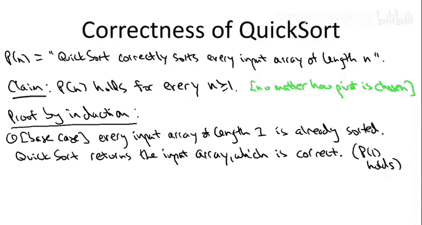
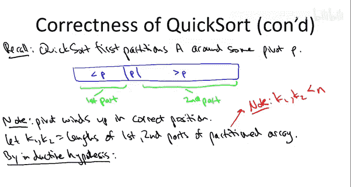

# 斯坦福大学《算法启蒙（第1册）：基础篇｜Algorithms Illuminated, Part 1： The Basics》中英字幕 - P25：-36-5   3   Correctness of Quicksort Review   Optional 11 min.zh_en - GPT中英字幕课程资源 - BV1vSVAzXE2r

We've discussed a number of divide and conquer algorithms and so far I've been giving short shrift to proofs of correctness This has been a conscious decision on my part Com up with the right divide and conquer algorithm for a problem can definitely be difficult but once you have that eureka moment and you figure out the right algorithm you tend to also have a good understanding of why it's correct why it actually solves the problem and every possible input Similarlyly when I present to you a divide and conquer algorithm like say merge sort or a quick sort。

 I expect that many of you have a good and accurate intuition about why the algorithm is correct In contrast。

 the running time with these divide and conquer algorithms is often highly non-obvious so correctness proofs for divide and conquer algorithms tend to simply formalize the intuition that you have via a proof by induction that's why I haven't been spending much time on them but nevertheless I do feel like I owe you at least one rigorous correctness proof for a divide and conquer algorithm and we may as well do it for quick sort So in this optional video we'll briefly review proofs by induction and then we'll show how such a proof can be used to rigorously establish the correctness of quick sort。

The correctness proofs for most of the other divide and conquer algorithms that we discuss can be formalized in a similar way。

So let's begin by reviewing the format for proofs by induction。

 so the canonical type of proof by induction and the kind that we'll be using here is when you want to establish an assertion for all of the positive integers in。

So know some assertion which is parameterized by n where n is a positive integer。

 I know this is a little abstract， so let me just be concrete about the assertion we actually care about for quick sort。

So for us， the assertion P of n is the statement that Quickwordt is always correct on inputs of LinkIn。

 arrays that have n elements。So an induction proof has two parts。The first part is a base case。

 and the second part is an inductive step。For the base case， you have to get started。

 so you show that at the very least your assertion is true and n equals 1。

This is often a trivial matter， and that'll be the case when we establish the correctness of quick just on a arrays with only one elements。

 so the non trivial part of a proof by induction is usually the inductive step。

And in the inductive step， you look at a value of n not covered by the base case。

 so a value of n bigger than1， and you show that if the assertion holds for all smaller values。

 small integers， then it also holds for the integer n。

That is， you show that for every positive integer n that's 2 or greater。

 you assume that p of k holds for all k strictly less than n。

 and under that assumption which is called the inductive hypothesis。

 under the assumption that p of k holds for all K strictly less than n。

 you then establish that p of n holds as well。So if you manage to complete both of these steps。

 if you prove both the base case that p of1 holds， you argue that directly。

 and then also you argue that assuming the inductive hypothesis that the assertion holds for all smaller integers it also holds for an arbitrary integer n then you're done then in fact you have proven that the assertion P of n holds for every single positive integer n right so for any given n that you care about the way you can derive that from one and two is you just start from the base case P of1 holds。

 then you apply the inductive step n minus1 times and boom you've got it so you know that P holds for the integer n that you care about as well and that's true for arbitraryrbitrarily large values of n。

So those are proof by induction in general， now let's instantiate this proof format。

 this type of proof for establishing the correctness of QuickSo。

So let me write again what is the assertion we care about。

 our definition of P of n is going to be the Quickword is always correct on a arrays of Li n。

And of course what we want to prove is that quick sort is correct。

 no matter what size array that you give it， that is we want to prove that P of N holds for every single and at least one so this is right in the wheelhouse of proofs by induction and says that's how we're going to establish it。

Now depending on the order in which you're watching the videos。

 you may or may not have seen our discussion about how you actually choose the pivot recall that the first thing QuickSo does is choose a pivot then it partitions the array around a pivot。

 so we're going to establish the correctness of QuickSo。

 no matter how the Cho pivot subroutine gets implemented so no matter how you choose pivots you'll always have correctness as we'll see in a different video the choice of pivots definitely has an influence on the running time of QuickSo but the correctness of QuickSo is no matter how you choose the pivot。

So let's proceed by approved by induction。So for the base case， when n equals1。

 this is a fairly trivial statement So then we're just talking about inputs that have only one element。

 Every such array is already sorted， Quick sort in the when n equals  one just returns the input array。

 it doesn't do anything。That is indeed a sorted array that it returns。

So by this rather trivial argument， we have directly proven that P of1 holds。

We've proven the rather unimpressive statement that Quicksort always correctly sorts one element arrays。

 okay， no big deal， so let's move on to the inductive step。So in the inductive step。

 we have to fix an arbitrary value of n that's at least to a value of n not covered by the base case。

So let's fix some value of n。

At least two。Now what are we trying to prove， we're trying to prove that Quicksort always correctly sorts every input array of link n。

 so we also have to fix an arbitrary such input。So let's make sure we're all clear on what it is we need to show。

 what are you showing in an inductive step？Assuming。The P of K holds。We're all smaller values。

 all smaller integers。Then。He of N holds as well。And remember， this is the inductive hypothesis。

So in the context of QuickSot， we're assuming that QuickSo never makes a mistake on any input array that has length strictly smaller than N。

 and now we just have to show it never makes a mistake on input arrays that have size exactly n。

So this is the point in the proof where we actually delve into how QuickSot is implemented to argue correctness。

 so recall what the first step of QuickSo is it picks some pivot arbitrarily。

 we don't know how we don't care how， and then it partitions the array around this pivot element P。

Now as we argued in the video where we discussed the partition subroutine。

 at the conclusion of that subroutine， the array has been rearranged into the following format。

 the pivot is wherever it is， everything to the left of the pivot is less than the pivot and everything bigger than the pivot is greater than the pivot。

 this is where how things stand at the conclusion of the partitioning subroutine。

So let's call this stuff less than the pivot the first part of the partition array and the stuff bigger than the pivot the second part of the partition array。

And recall our observation from the overview video that the pivot winds up in its correct position。

 where would the pivot be， where is any element supposed to be in the final sorted array。

 what's supposed to be to the right of everything less than it and to the left of everything bigger than it。

 and that's exactly where this partitioning subroutine deposits the pivot element P。

So now to imply the inductive hypothesis， which you'll recall is a hypothesis about how QuickSot operates on smaller subarrays。

 let's call the length of the first part in the second part of the partition array K1 and K2 respectively。

Now crucially， both K1 and K2 are strictly less than n both of these two parts have length strictly less than that of the given input array A。

 that's because the pivot in particular is excluded from both of those two parts so they can have the most n minus1 elements。

That means we comply the inductive hypothesis， which says the Quick sort never makes a mistake on an array that has size strictly less than n that implies that are two recursive calls to Quick sort。

 the one to the first part and the one to the second part don't make mistakes that guaranteed to sort those sub arrays correctly by the inductive hypothesis。

And to be very precise， what we're using to argue that the recursive calls are correct are P of K1 and p of K2。

 where P is the assertion that Quickword is always correct on a razal length， K1 and K2。

And we know that both of these statements are true because K1 and K2 are both less than n and because of the inductive hypothesis。

So what's theshot， the upshot is quick so it's going to be correct。

So the first recursive call puts all of the elements that are less than the pivot in the correct relative order。

 next comes the pivot which is bigger than all that stuff in the first part and less than all the stuff in the second part and then the second recursive call correctly orders all of the elements in the second part so with those three things pasted together we have a sorted version of the input array and since this array was an arbitrary one of linked N that establishes the assertion P and N and since n was arbitrary that establishes the inductive step and completes the proof of correctness of quick sort for an arbitrary method of choosing the pivot element。

