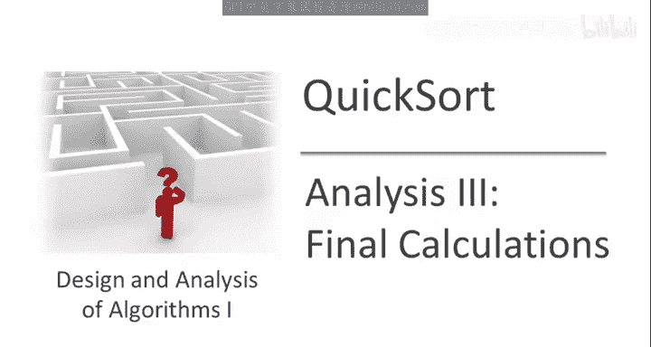
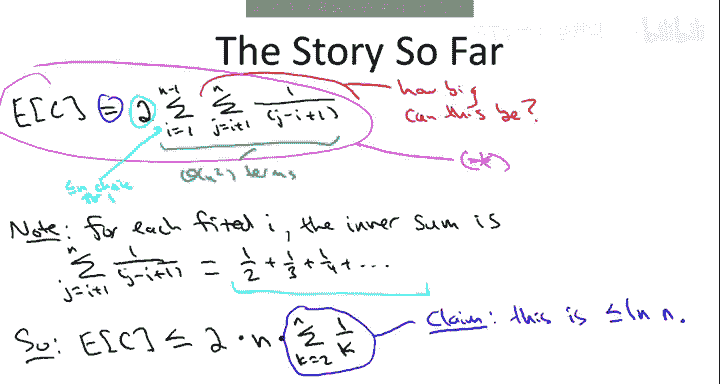
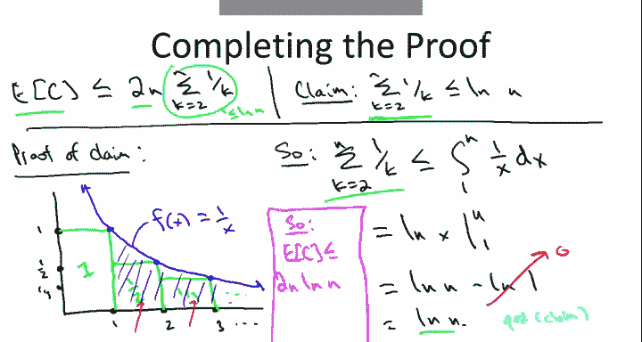

# 斯坦福大学《算法启蒙（第1册）：基础篇｜Algorithms Illuminated, Part 1： The Basics》中英字幕 - P29：-29-6   3   Analysis III  Final Calculations Advanced   Optional 9min.zh_en - GPT中英字幕课程资源 - BV1vSVAzXE2r

So we're almost at the finish line of our analysis of QuickSot， let me remind you what we're proving。

 we're proving that for the randomized implementation of Quick sortt where we always choose a pivot element to partition around uniformly at random。

 we're showing that for every array， every input of length n。

 the average running time of Quick sort over the random choices of pivots is big O of N log。

So we've done a lot of work in the last couple videos， let me just remind you about the story so far。

In the first video what we did is we identified the relevant random variable that we cared about capital C。

 the number of comparisons that Quicksort makes among pairs of elements in the input array。

 then we applied a decomposition approach。 we expressed capital C the overall number of comparisons as a sum of indicator or01 random variables each of those variables X Ij just counted the number of comparisons involving the I smallest and J's smallest entries in the array and that's going to be either zero or1。

 then we applied the linearity of expectation to realize all we really needed to understand was the comparison probabilities for different pairs of elements in the second video we nailed what that comparison probability is specifically for the I smallest and the J smallest elements in the array the probability the quicksort compares them when you always make random pivot choices is exactly two divided by the quantity J minus I plus1 So putting that all together yields the following expression governing the average number of comparisons made by Quicksort。

And one thing I want you to appreciate is is in the last couple of videos。

 we've been sort of amazingly exact as algorithmic analysis goes。Specifically。

 we've done nothing sloppy whatsoever。 We've done no estimates。

 The number of comparisons the Quick sort makes on average is exactly this double sum。 Now。

 surely we'll。😊，Do some inequalities to make our lives a little bit easier， but up to this point。

 everything has been completely exact。 and this lets you see why there's small constants also in quick sort。

 it's basically going to be this factor too。Now， the next question to ask is。

 what are we shooting for。 Remember， the theorem we want to prove is that the expected number of comparisons really expected runtime is O of n log n。

 So are we already done。 Well， not quite。 we're gonna to have to be a little bit clever。

 So if we look at this double sum。And we ask how big the sum ends and how many terms are there。

 well the biggest sum ends we're ever going to see or when I and J are right next to each other were J is1 bigger than I in that case。

 this fraction is going to be one half so the terms can be as big as one half。

 how many terms are there where there's a quadratic number of terms。

So it'd be very easy to derive an upper bound that's quadratican n， but that's not what we want。

 we want one that's in log n， so to derive that we're going to have to be a little bit more clever about how we evaluate this sum。

So the idea is what we're going to do is we're going to think about a fixed value of I in this outermost sum。

 and then we're going to ask how big could the inner sum be？So let's fix some value of I。

 the value of the index in the outer sum。And then let's look at the inner sum where J ranges from i plus 1 up to n。

 and the value of the sum end is 1 over the quantity J minus i plus1。So how big can this be Well。

 let's first understand what the terms actually are。

 so J starts at I plus1 and then it ascends to n and as J gets bigger。

 the denominator gets bigger so the sum mans gets smaller so the biggest sum man is going to be the very first one when J is the smallest possible namely I plus1 When J is I plus1。

 this sumand is12。Then Jake gets incremented in the sum。

 and so that's we're going to pick up a one third term followed by a one fourth term and so on。

So it's going to be for every inner sum is going to have of this form1/ half plus one plus one fourth。

 and then it's going to sort of run out at some point when J equals n and the biggest term we're ever going to see is going to be a1 over n in the case where I equals1。

So。Let's make our lives easier by taking this expression we started with。Star。

And instead of having a double sum， let's just upper bound this with a single sum。

So what are the ingredients of the single sum， while there's this two， can't forget the two。

Then there's n choices for I， actually there's n minus1 choices for I。

 but let's just be sloppy and say n choices。So that gives us a factor n。

And then how big can an inner sum be well inner sum is just a bunch of these terms  one half plus one third and so on。

 the biggest of those inners sums is the one occurring when I equals1 at which point the last term is one over n。

 so we're going to just do a change of variable and express the inner swim an upper bound on each inner sum。

As the sum from k equal 2 to n of 1 over k。So that's looking more manageable just having this single sum involving this index K and life seem to get really good when we prove the next claim。

Which is that。The sum cannot be very big， it's only logarithmic and even though there's a linear number of sum ans。

 the overall value of the sum is only logarithmic。That of course is going to complete the proof because that'll give us an overall bound of two times n times the natural log n so that's an n log n bound with really quite reasonable constants so why is this true。

 why is this sum only logarithmically large？Well， let's do a proof by a picture。

I'm going to write this sum。In a geometric fashion。So on the X axis。

 let me mark off points corresponding to the positive integers。And on the Y axis。

 let me mark off points corresponding to fractions of the form1 overca。

And what I'm going to do is'm going to draw a bunch of rectangles。Of decreasing area。

 specifically they all have width one and the heights are going to be like one over K。

So the area of this guy is one， the area of this guy is one half， the area of this guy is one third。

 and so on。And now I'm going to overlay on this picture。The graph of the function。

 the continuous function， f of x equals 1 over x。So notice that is going to go through these three points。

 it's going to kiss all of these rectangles on their upper right corners。

Now what is it we're trying to prove， the claim we're trying to prove is that this sum of one half plus one third and so on is upper bounded by something。

 so this sum can be just thought of as。Areas in these rectangles， the one half， the one third。

 and so on。And we're going to upper bound it by the area under the blue curve。

So you notice the area under the blue curve is at least as big as some of the areas of the rectangles because the curve hits each of these rectangles in its northeast corner。

So putting that into mathematics， the sum from k equald 2 to n of 1 over k。

Is mountted above by the integral and we'll start the area under the curve at one。

And then we need it to go all the way up to N。Of the function one over x， D X。

So that's the area under the curve。If you remember a little bit of calculus。

 the integral of 1 over x is the natural log of x。So， this equals。The natural log of X evaluated。

And then one。Also known as log n minus log1。And of course， log 1 would be zero。So that gives us。

Our login。So that completes。The proof of the claim。Indeed。

The sum of these one over ks is bounded above by the natural log of n， and that in fact。

 completes the proof of the theorem。We've got that the expected number of comparison is at most 2 n times this sum。

 which is the most log n。Ting all together we find that the expected number of comparisons that Quicksort makes on an arbitrary input of length n is two times n times the natural log of n。

 so that would be big O of n log n with quite reasonable constants Now this is just the number of comparisons。

 but as we observed earlier， the running time of quick sort on average is not much more than that the running time is dominated by the number of comparisons that it makes Moreoverover。

 as we discussed when we were talking about the details of the implementation it works in place。

 essentially no extra storage is necessary so that is a complete and mathematically rigorous explanation of just why Quick sort is so quick。

