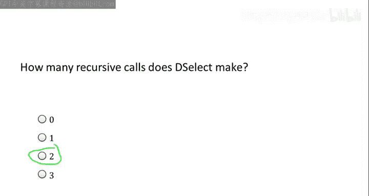
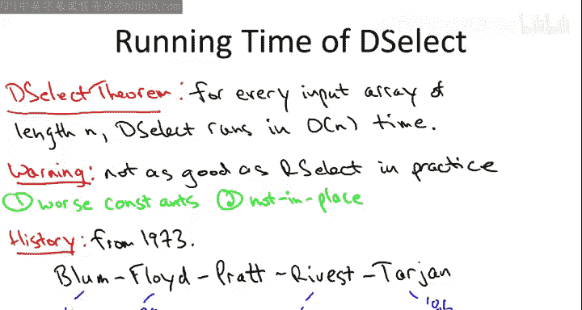

# 斯坦福大学《算法启蒙（第1册）：基础篇｜Algorithms Illuminated, Part 1： The Basics》中英字幕 - P34：-33-8   3   Deterministic Selection   Algorithm Advanced - GPT中英字幕课程资源 - BV1vSVAzXE2r

Previous videos covered an outstanding algorithm for the selection problem。

 The problem of computing the I or statistic of a given array， that algorithm。

 which we called the R select algorithm， was excellent in two senses。 First， it's super practical。

 it runs blazingly fast in practice but also it enjoys a satisfying theoretical guarantee for every input array of length n the expected running time of R select is big O of n where the expectation is over the random choices of the pivots that R select makes during its execution Now in this optional video I'm going to teach you yet another algorithm for the selection problem Well why bother given that our select is so good Well。

 frankly I just can't help myself the ideas that this algorithm are just too cool not to tell you about at least in an optional video like this one the selection algorithm will' cover here is deterministic that is it uses no randomization whatsoever and it's still going to run in linear time big O of n time but now in the worst case for every single input array Thus the same way merge short gets the same asymptotic running time big O of n。

as QuickSo gets on average， this deterministic algorithm will get the same running time O of n as the R select algorithm does on average that said。

 the algorithm we're going to cover here， while it's not slow。

 it's not as fast as R select in practice， both because the hidden constants in it are larger and also because it doesn't operate in place for those of you who are feeling keen you might want to try coding up both the randomized and the deterministic selection algorithms and make your own measurements about how much better the randomized one seems to be。

 but if you have an appreciation for brilliant algorithms。

 I think you'll enjoy these lectures nonetheless。So let me remind you the problem。

 this is the I order statistic problem where we're give it an array it has n distinct entries again the distinctness is for simplicity。

 and you're given a number I between1 and n， you're responsible for finding the I's smallest number。

 which we call the I order statistic， for example， if I is something like n over two。

 then we're looking for the median。

So let's briefly review the randomized selection algorithm we can think of the deterministic algorithm cover here as a modification of the randomized algorithm。

 the R select algorithm。 So when that algorithm is passed an array with length n and when you're looking for the I order statistic as usual there's a trivial base case。

 but when you're not in the base case， just like in quick sort what you do is you're going to partition the array and the pivot element P Now how are you're going to choose p will just like quick sort and the randomized algorithm you choose a uniformly at random So each of the n elements of the input array are equally likely to be chosen as the pivot So call that pivot P now do the partitioning remember partitioning puts all of the elements less than the pivot to the left of the pivot we call that the first part of the partition array anything bigger than the pivot that's moved to be right of the pivot we call that the second part of the array and that J denote the position of the pivot in this partitioned array equivalently let J be what order statistic the pivot winds up happening to B right so if we happen to choose the minimum element than j is going to be equal to1 if we happen to choose the maximum element J is going to be equal to n。

And so on。 So there's always the lucky case， Ch1 and N that we happen to choose the I order statistic as our pivot。

 So we're gonna find that out when we just notice the j equals I and that super lucky case。

 we just return the pivot and we're done。 that's what we're looking for in the first place。

 Of course that's so rare。 It's not worth worrying about。

 So really the two main cases depend on whether the pivot that we randomly choose is bigger than what we're looking for if it's less than what we're looking for。

 So if it's bigger than what we're looking for。 that means j is bigger than I。

 we're looking for the I smallest， we randomly chose the js smallest then remember we know that the I smallest element has to lie to the left of the pivot element and that first part of the partition to。

 So we recurse there it's an array that has J minus-1 elements in it。

 everything less than the pivot and we're still looking for the I smallest among them。

 in the other case this was the case covered in a quiz a couple videos back if we guess a pivot element that is less than what we're looking for。

 Well then we should discard everything less than the pivot and the pivot itself。

 So we should recurse on the second part of a stuff bigger than the pivot。

 We know that's where what we're looking for。And having thrown away J elements。

 the smallest ones at that we're re cursing on an array of length n minus j I'm looking for the I minus J smallest element in that second part。

 So that was the randomized selection algorithm and you'll recall the intuition for why this works is random pivots should usually give pretty good splits so the way the analysis went is we should that each iteration each recursive call with 50% probability we get a 2575 split or better therefore on average every two recursive calls we are pretty aggressively shrinking the size of the recursive call and for that reason we should get something like a linear time bound we do almost as well as if we pick the median in every single call just because random pivots are good enough proxy of bestcase pivots of the median。

So now the big question is， suppose we weren't permitted to make use of randomization。

 suppose this chooser random pivot trick was not in our toolbox。What could we do？

How are we going to deterministically choose a good pivot。 Okay。

 so let's just remember quickly what it means to be a good pivot。

 A good pivot is one that gives us a balanced split after we do the partitioning of the array。

 That is， we want as close to a 50，50 split between the first and the second parts of the partitioned array as possible。

 Now， what pivot would give us the perfect 50，50 split。 Well， in fact， that would be the median。

But that seems like a totally ridiculous observation because we canonically are trying to find the medium。

So previously we were able to be lazy， we just picked a random pivot and use that as a pretty good proxy for the best case pivot。

 but now we have to have some subrout that deterministically finds us a pretty good approximation of the median。

And the big idea in this linear time selection algorithm is to use what's called the median of medians as a proxy for the true median of the inputette So when I say median of medians you're not supposed to know what I'm talking about。

 you're just supposed to be intrigued Now let me explain a little bit further。

Here's the plan。 We're going to have our new implementation of choose pivot and it's going to be deterministic。

 You will see no randomization on this slide I promise so the highleve strategy is going be we're going to think about the elements of the array like sports teams and we're going run a tournament。

 a two round knockout tournament and the winner of this tournament is going to be who we return as the proposed pivot element then we'll have to prove that this is a pretty good pivot element So there's going be two rounds in this tournament each element each team is going to first participate in a world group if you will。

 so there will be small groups of five teams each five elements each and so when your first round you have to be the middle element out of those five so that'll give us n over five first round winners and then the winner of that second round is going to be the median of those n over five winners from the first round Here are the details。

The first step isn't really something you actually do in the program， it's just conceptually。

 so logically we're going to take this array capital A。

 which has n elements and we're going to think of it as comprising n over five groups with five elements each。

 so if n is not a multiple five， obviously there'll be one extra group that has size between one and four。

average each of these groups of five， we're going to compute the median to the middle element of those five now for five elements we may as well just invoke our reduction distort sorting。

 we're just going to sort each group separately and then use the middle element， which is the median。

It doesn't really matter how you do the sorting because after all there's only five elements。

 but you know， let's use merged sort with the heck。

Now what we're going to do is we're going to take our first round winners and we're going to copy them over into their own private array。

Now this next step is the one that's going to seem dangerously like cheating。

 dangerously like I'm doing something circular and not actually defining a proper algorithm。

 so C you'll notice has length over n over5， we started with an array of link n。

 this is a smaller input， so let's recursively compute the median of this array capital C。

That is the second round of our tournament amongst the N over five first round winners。

 the N over five middle elements of the sorted groups， we recursively compute the median。

 that's our final winner and that's what we return as the pivot element from the subroutine。

Now I realize it's very hard to keep track of both what's happening internal to this Cho pivot subroutine and what's happening in the calling function of our deterministic selection algorithm。

 so let me put them both together and show them to you cleaned up on a single slide so here is the proposed deterministic selection algorithm so this algorithm uses no randomization previously the only randomization was in choosing the pivot now we have a deterministic subroutine for choosing the pivot and so there's no randomization at all。

I've taken the liberty of inlining Choose pivot subroutine， so that is exactly what lines one， two。

 and three are。I haven't written down the base case just to say space。

 I'm sure you can remember it so if you're not in the base case， what did we do before。

 the first thing we do is choose a random pivot， what do we do now。

 what we have steps1 through three， we do something much more clever to choose a pivot and this is exactly what we said on the last slide we break the array into groups of five。

 we sort each group， for example， using merge sort。

 we copy over the middle element of each of the n over five groups into their own array capital C and then we recursively compute the median of C so when we recurs on select we pass at the input C C has n over5 element so that's the new link that's a smaller link than what we start with so it's a legitimate recursive call we're finding the median of n over five elements so that's going to be the n over 10th or a statistic as usual to keep things clear I'm ignoring stuff like fractions in your real implementation you would just round it up or down as appropriate。

SoSt one through three are the new Cho pivot sub team that replaces the randomized selection that we had before steps four through seven are exactly the same as before we've changed nothing all we have done is ripped out that one line where we chose the pivot randomly and pasted in these lines one through three that is the only change to the randomized selection algorithm。

So the next quiz is a sanity check that you understand this algorithm。

 at least not necessarily why it's fast， at least just how it actually works。

 and it only asks you to identify how many recursive calls there are each time， so for example。

 in merge sort there's two recursive calls in Quick sort there's two recursive calls in R select there's one recursive call how many recursive calls you have each time outside of the base case in the deselect algorithm。

Allright， so the correct answer is two。 there are two recursive calls in deselect and maybe the easiest way to answer this question is not to think too hard about it and literally just inspect the code and count right namely there's one recursive call in line3 and there's one recursive call in either six or7 So quite literally there's seven lines of code and two of the ones that get executed have a recursive call So the answer is two Now what's confusing is that in the couple things first。

 in the randomized selection algorithm。 we only had one recursive call。

 we had the recursive call in line 6 or7， we didn't have this one in line 3 that one on line3 is new compared to the randomized procedure So we're kind of used to thinking of one recursive call using the divide and conquer approach to selection here we have two Moreover。

 conceptually the role of these two recursive calls are different So the one in line 6 or7 is the one we're used to that's after you've done the partitioning so you have a smaller subproble and then you just recursively find the residual or statistic。

residual array that's sort of the standard divide and conqueror approach What's sort of crazy is this second use of a recursive call。

 which is part of identifying a good pivot elements for this outer recursive call and it is so counterintuitive Many students in my experience don't even think that this algorithm will halt sort of expect it to go into an infinite loop but again。

 that's sort of overthink it so let's just compare this to an algorithm like merge short what is merge sort2 Well。

 it does two recursive calls and it does some other stuff it does linear work that's what it does to merge and then there are two recursive calls on smaller subproblems no issue we definitely feel confident that merge short is going to terminate because the subproblems keep getting smaller What is deselect do if you squint so don't think about the details just at a high level what is the work done in deselect Well。

 there are two recursive calls there's the ones in line3 ones in line6 or7 but there's two recursive calls on smaller subproblem sizes it does some other stuff。

Stuff in steps1 and2 and4 but whatever those aren't recursive calls。 It does some work。

 two recursive calls and smaller subpro It's got to terminate。 we don't know what the runtime is。

 but it's got to terminate Okay so if you're worried about this terminating。

 forget about the fact that the two recursive calls have different semantics and just remember if ever you only recurs on smaller subpro。

 you're definitely going to terminate Now， of course who knows what the running time is。

 I owe you an argument about why it would be anything reasonable， that's going to come later。In fact。

 what I'm going to prove to you is not only does this selection algorithm terminate run in finite time。

 it actually runs in linear time no matter what the input array is。So whereas with our select。

 we could only discuss its expected running time being linear。

 we showed that with disastrously bad choices for pivots。

 our select can actually take quadratic time under no circumstances will deselect to ever take quadratic time so for every input array it's big O of n time there's no randomization because we don't randomly do anything and choose pivot so there's no need to talk about average running time just the worst case running time over all inputs is O of N That said I want to reiterate the warning I gave you at the very beginning of this video which is if you actually need to implement a selection algorithm you know this one wouldn't be a disaster but it is not the method of choice so I don't want you to be misled。

As I said， there were two reasons for this， the first is that the constants hidden in the Big O notation are larger for deselect than for our selectlect。

That will be somewhat evident from the analyses that we give for the two algorithms。

The second reason is recall we made a big deal about how partitioning works in place and therefore Quicksort or select also both work in place that is with no real additional memory storage。

 but in this deselect algorithm， we do need this extra array C to copy over the middle elements the first round winners and so that extra memory as usual slows down the practical performance。

One final comment， so for many of the algorithms that we cover。

 I hope I explain them clearly enough that their elegant shines through and that for many of them you feel like you could have come up with it yourself。

 but if only you'd been in the right place at the right time。

 I think that's a great way to feel and a great way to appreciate some of these very cool algorithms。

That said， linear time selection， I don't blame you if you feel like you never might have come up with this algorithm。

 I think that's a totally reasonable way to feel after you see this code if it makes you feel better。

 let me tell you about who came up with this algorithm。It's quite old at this point。

 about 40 years from 1973， and the authors， there are five of them。

 and at the time this was very unusual。So Manuel Blum。Bob Floyd。Von Prat。Ron the vest。And Bob Trgn。

And this is a pretty heavyweight lineup， so as we've discussed in the past。

 the highest award in computer science is the ACN Turing Award given once each year。

 and I like to ask my algorithms classes how many of these authors do they think have been awarded a Turing award？

I've asked him many times the favorite answer anyone's ever given me has been six。

 which I think is in spirit should be correct， strictly speaking the answer is four。

 so the only one of these five authors that doesn't have a Turing award is von Pratt although he's done remarkable things spanning the gamut from co-founding some systems to having Brad famous theorems about for example。

 testing primality， but the other four have all been awarded the Turing award at some point。

 so in chronological orders for the late Bob Floyd who is a professor here at Stanford。

Was awarded the 1978 T Award， both for contributions to algorithms。

 but also to programming languages and compilers， so Bob Tarjn。

who as we speak is here is a visitor at Stanford and has spent his PhD here and has been here as a faculty at other times。

 was awarded for contributions to graph algorithms and data structures we'll talk some more about some of his other contributions in future courses。

Manuel Blum was awarded the Turing Award in '95， largely for contributions in cryptography。

 and many of you probably know Ron Reves as the R in the RSA crypto system。

 so he won the T award along with Shair and Aelman back in 02 So in summary。

 if this algorithm seems like one that might have allludeed you even on your most creative days。

 I wouldn't feel bad about it， this is a quite clever algorithm。

 so let's now turn to the analysis and explain why it runs in linear time in the worst case。

