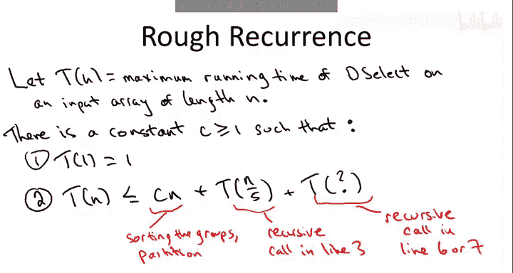
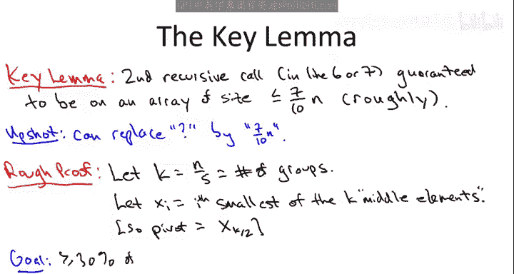
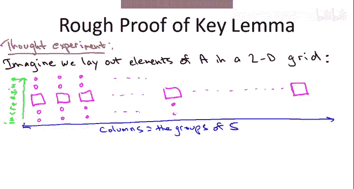

# 斯坦福大学《算法启蒙（第1册）：基础篇｜Algorithms Illuminated, Part 1： The Basics》中英字幕 - P35：-34-8   4   Deterministic Selection   Analysis I Advanced - GPT中英字幕课程资源 - BV1vSVAzXE2r

Now let's turn to the analysis of the deterministic selection algorithm that we discussed in the last slide by Blum。

 Floyd， Pratt， Re and tarn in particular， let's prove that it runs in linear time on every possible input let's remind you what the algorithm is So the idea is we just take our select algorithm but instead of choosing a pivot at random we do quite a bit more work to choose what we hope is going to be a guaranteed pretty good pivot so again lines one through three of the new choose pivot subgroutine and it's essentially implementing a two round knockout tournament so first we do the first round matches so what does that mean that means we take a we think of it as comprising these groups of five elements so the first five elements one through5 than the elements6 through 10 the elements 11 through 15 in the array and so on we sort each of those five using let's say merge sort although it doesn't matter much then the winner of each of these n over5 first round matches is the median of those five that is the third highest elements。

 third largest element out of the five So we take those n over5 first round winners。

The middle element of each of the five and the sortded to groups。

 we copy those over into a new array capital C of Linked N over five and then we are on the second round of our tournament at which we elect the median of these n over five first round winners as our final pivot as our final winner so we do that by recursively calling deselect on C it has linked n over5 relief for the median so that's the n over 10th or statistic in that array so we call the pivot P and then we just proceed exactly like we did in the randomized case that is we part a around the pivot we get a first part of second part and we recursse on the left side of the right side as appropriate depending on whether the pivot is less than or bigger than the element that we're looking for。

So the claim is， believe it or not， that this algorithm runs in linear time。

 Now you'd be right to be a little skeptical of that claim。

 Certainly you should be demanding for me some kind of mathematical argument about this linear time claim。

 It's not at all clear that that's true。 One reason for skepticism is that this is an unusually extravagant algorithm in two senses for something that's going to run in linear time。

 first is its extravagant use of recursion。 There are two different recursive calls as discussed in the previous video。

 and we have not yet seen any algorithm that makes two recursive calls and runs in linear time。

 The best case scenario was always in log end time for our two recursive call algorithms like merge sort or quick sort。

 The second reason is that outside of the recursive calls。

 it seems like it does kind of a lot of work as well。

 So to drill down on that point and get a better understanding for how much work this algorithm is doing。

 The next quiz asks you to focus just on line one。So when we sort groups of five in the input array。

 how long does that take？So the correct answer to this quiz is the third answer。

 maybe you would have guessed that given that I'm claiming that the whole algorithm takes linear time。

 you could have guess that this subertine wouldn't be worse than linear time。

 but you should also be wondering you know isn't sorting all was N log N。

 so aren't we doing sorting here， why isn't the N log N thing kicking in？

The reason is we're doing something much much more modest than sorting the linked and input array。

 All we're sorting are these puny little subars that have only five elements。

 and that's just not that hard。 that can be done in constant time。

 So let me be a little more precise about it。The claim is that sorting an with an array with five elements takes only some constant number of operations。

 let's say 120。Where did this number 120 come from Well， you know， for example。

 suppose we use merge short。If you go back to those very early lectures。

 we actually counted up the number of operations that merge sort needs to sort an array of link M for some generic M here M is5。

 so we can just plug five into our previous formula that we computed from merge sort。

Right if we plug m equal 5 into this formula， what do we get。

 we get6 times 5 times log base two of5 plus1。Who knows what log base 205 is。

 that's some weird number， but it's going to be a most three， right？So if that's in most three。

3 plus1 is four by that by5， then again， time six and boom， you get your 120。

So it's constant time to sort just one of these groups of five now of course we have to do a bunch of groups of five but there's only a linear number of groups。

 constant per each so it's going to be linear time overall。So to be really pedantic。

 we do 120 operations at most per group， there's n over five different groups。

 we multiply those we get 24 in operations so do all the sorting and that's obviously a big O event。

 so linear time for step one。So having warmed up with step one。

 let's look now at the whole seven line algorithm and see what's going on。

Now I hope you haven't forgotten the paradigm that we discussed for analyzing the running time of deterministic divide and conquer algorithms like this one so namely we're going to develop a recurrence and remember recurrence expresses the running time。

 the number of operations performed in two parts first of all there's the work done by the recursive calls on smaller subproblem and secondly there's the work done locally not in the recursive calls so let's just go through these lines one at a time and just do a running tally of how much work is done by this algorithm both locally and by the recursive calls So the quiz was about step number one we just argued that since it's constant time disorder group and there's a linear number of groups we're going to do linear work theta n for step1 So copying these first round winners over into their special array C is obviously linear time。

Now when we get to the third line， we have a recursive call。

 but it's a quite easy recursive call to understand it's just recursing on an array that has size 20% as large as the one we started with on n over five elements so this。

 remember the notation we use for recurrences generally we denote by capital T。

 the running time of an algorithm on arrays at a given length。

 so this is going to be the running time that our algorithm has in the worst case on inputs of length n over5 because N over5 is the length of the array that we're passing to this recursive call。

Good step4， partition。 Well， we had videos about how to implement partition and why it's a linear time。

 We knew that all the way back in Quick sort。 So that's definitely theta in。Step 5 is constant time。

 I'm not going to worry about it and finally we get to line 6 and7 so at most one of these will execute so in either case there's one recursive call。

 so that's fine we know in recurrences when there's recursive call we just write capital T of whatever the input length is。

So we just have to figure out what the input length here is。

 it was n over five and step in line three， so just to figure out what it is in line 6 or seven。

Oh yeah。 Now we're remembering why we didn't use recurrences when we discussed randomized quick sort and the randomized selection algorithm。

 It's because we don't actually know how big the recursive call is how big the input passed to this recursive call in line 6 or 7 is line3。

 No problem。 It's guaranteed to be 20% of the input array because that's how we define it。

 But for line 6 or7 the size of the input array that gets passed to the recursive call depends on how good the pivot is。

 depends on the splitting of the array A into the two parts which depends on the choice of the pivot P。

 So at the moment， all we can write is T of question mark。We don't know。

We don't know how much work gets done in that recursion because we don't know what the input size is。

Let me summarize the results of this discussion。So I'm going to write down a recurrence for the deselect algorithm。

 so let T of N denote the maximum number of operations that deselect ever requires to terminate on an array input of Li N this is just the usual definition of T of N when we use recurrences。

What we established in our tally on the last slide is that Dselect does linear stuff outside the recursive calls。

 it does the sorting of groups of five， it does the copying and it does the partitioning。

 each of those is linears， all of them together is also linear and then it does two recursive calls。

One whose size we understand， one whose size we don't understand。

So for once I'm not going to be sloppy and I'm going to write out an explicit constant about the work done outside the recursive calls。

 and I'm not going to write big O event， I'm going to actually write C times n for some constant C。

So of course no one ever cares about base cases， but for completeness let me write it down anyways。

 when Dselect gets an input of only one element it returns it。

 let's call that one operation for simplicity。And then in the general case。

 and this is what's interesting when you're not in the base case。

 when you have to recurse what happens， where you do linear work outside of the recursive calls so that's c times n for some constant C C is just the expressed constant in all of our big thetas in the previous slide。

Plus， the recursive call in line three and we know that happens on an array of size n over5。

 as usual I'm not going to worry about rounding up or rounding down， it doesn't matter。

 plus our mystery recursive call on an array of unknown size。

So that's where we stand and we seem stuck because of this pesky question mark。

 so let's prove a lemma which is going to replace this question mark with something we can reason with with an actual number that we can then analyze。

So the upshot of this key lemma is that all of our hard work in our choose pivot subroutine in lines1 through to three bears fruit in the sense that we're guaranteed to have a pretty good pivot。

 may not be the median， it may not give us a 50， 50 split。

 then we could replace the question mark with one half times n。

 but it's going to let us replace the question mark by a seven tenth times n。

Now I don't want to live you， I'm going to be honest it's not quite seven1 n it's more like71 n minus5 there's a little bit of additive error so taking care of the additive error adds nothing to your conceptual understanding of this algorithm or why it works for those of you who want a truly rigorous proof there are some posted lecture notes which you go through all the gory details。

 but in lecture I'm just going to tell you what's sort of morally true and ignore the fact we're going be off by three here and four there。

And it will be clear when I show you the proof of this dilemma。

 where I'm being a little bit sloppy and why it really shouldn't matter and it doesn't。

So to explain why this keyle is true， why we get a 30， 70 split or better guaranteed。

 let me set up a little notation。I'm getting sick of writing n over5 over and over again。

 so let's just give that a synonym， let's say K。So this is the number of different sort of first round matches that we have。

 the number of groups。I also want some notation to talk about the first round winners that is the medians of these groups of five。

 the K first round winners， so we're going to call X I。

 the I smallest of those who win their first round match who make it to the second round。

So just to make sure the notation is clear， we can express the pivot element in terms of these x's。

 remember the pivot is the final winner， it wins not only its first round term but it also the second round tournament。

 it's not only the middle element of the first group of five。

 it's actually the median of the n over five middle elements， it's the median of the medians。

That is of the K middle elements， it's the K over tooth order statistic， K over tooth smallest。

 I'm saying this assuming that K is even if K was odd。

 it would be some slightly different formula as you know。

So let's remember what we're trying to prove， we're trying to prove that for our proposed pivot。

 which is exactly this element x subK over two， it's exactly the winner of this two round knockout tournament。

 we're trying to argue that for this proposed pivot we definitely get a 3070 split or better so what that means is there better be at least 30% of the elements that are bigger than the pivot that way if we recurse on the left side in the first part we don't have to deal with more than 70% of the original elements Similarlyly there better be at least 30% of the elements that are smaller than the pivot that way if we recurse on the right hand side。

 we know we don't have to deal with more than 70% of the original input elements。

So if we achieve this goal we prove that there's at least 30% on each side of Xk over two。

 then we're done that proves the klema that we get a 3070 split or better。

 so I'm going to show you why this goal is true， I'm going to introduce a thought experiment and I'm going to lay out it abstractly then we'll sort of do an example to make it more clear and then we'll go back to the general discussion and finish the proof。

So what we're going to do is a thought experiment for the purposes of counting how many elements of the input array are bigger than our pivot choice and how many are smaller。

So in our minds， we're going to imagine that we take the n elements in A and we arrange them in a 2D grid。

So here are the semantics of this grid， each column will have exactly five elements and it will correspond to one of the groups of five。

 so we'll have n over five columns corresponding to our n over five groups in our first round of our tournament。

Fan is on a multiple of five and one of these groups has size between one and four。

 but I'm just not going to worry about it， that's some of the additive loss which I'm ignoring。

Moreover， we're going to arrange each column in a certain way so that going from bottom to top。

 the entries of that group go from smallest to largest。

So this means that in this grid we have five rows and the middle row。

 the third row corresponds exactly to the middle elements to the winners of the first round matches。

So because these middle elements， these first round winners are treated specially。

 I'm going to denote them with big squares， the other four elements of the group。

 two of which are smaller， two of which are bigger are just going to be little circles。

Furthermore， in this thought experiment in our mind we're going to arrange the columns from left to right in order of increasing value of the middle element now remember I introduce this notation x sub I is the I smallest amongst the middle elements so a different way of what I'm trying to say is that the leftmost column is the group that has x1 as its middle elements so among the n over five middle elements。

 one of the groups has the smallest middle elements， we put that all the way on the left。

So this is going to be x1 in the first column， the smallest of the first round winners。

 X2 is the second smallest of the first round winners X3 is the third smallest and so on At some point we get to the median of the first round winners X K over 2。

And then the way at the right is the largest of the first round winners。

And I'm sure that you remember that the median of mediums， which is xk over  two， is exactly R pivot。

So this is our lucky winner。I know this is a lot to absorb and they go ahead and go through an example if what I've said so far makes perfect sense。

 you should feel free to skip the following example。

 but if you' still some details you're wondering about I'm hoping this example will make everything crystal clear so let's suppose we have an input array I need a slightly big one to make it a grid make sense let's say there's an input array of 20 elements。

So there's going to be the input array， which is in a totally arbitrary order。

It's going to be the version of the array after we sort each group of five。

And then I'm going to show you the grid。So here's the input array we're going to use。

Let's now go ahead and delineate the various groups of five。So after sorting this group。

 we get the following。For each group， there's a single winner， name the middle element。

 so that would be the 12 and the six。And the 9。4 those are the four survivors from the first round of the tournament。

And the median of these four elements， which at the end of the day is going to be our pivot is the second smallest of the four that's how we define the median from even number of elements。

 so that's going to be the nine。So this first transformation from the input array to this vaguely mini sorted version of this input array with the groups of five sorted this we actually do in the code this happens in the algorithm Now this grid we're just doing in our minds okay。

 we're just in the middle of proving why the algorithm is fast why the pivot' is guaranteed to give us close to a 3070 split or better so let me show you an example of this grid in our mind what it looks like for this particular input。

So the grid always has five rows， the columns always have five elements because the columns correspond to the groups here because n equals 20 and over5 is4。

 there's going to be four columns and five rows， and moreover we arrange the columns from left to right so that these middle elements go from smallest to largest。

 so our middle elements are 6，9， 12 and 14 and we're going to draw the columns in that order from left to right。

So first we'll write down the middle elements， the middle row from decreasing to increasing 69， 12。

14。Again， the median of these is our pivot， which is the nine。

And then each column is just the other four elements that goes along with this middle element from decreasing to increasing as we go from bottom to top。

So this is the grid that we've been talking about on the other slide in this particular example。

So I hope that makes what we're talking about clear what these x's mean and what we have amongst the rows amongst the columns and so on so let's go back to the general argument。

 here is the key point， here is why we're doing this entire thought experiment it's going to let us prove our key lemma that we get a 370 splitter better。

 30% of the stuff at least is less than the pivot， 30% of the stuff at least is bigger than the pivot。

So why is there at least 30% of the stuff below the pivot， why is the pivot bigger than at least 30%。

 well， it's bigger than everything to the left and everything below the stuff to the left。That is。

 we know that x K over2 is bigger than the k over 2 minus1 elements that is at the left of it。

 those other middle elements that it's bigger then。That's because it's the median of the medians。

So if we just go straight west。From the pivot， we only see stuff which is less。 Furthermore。

 these columns are arranged from decreasing to increasing order as we go from south to north from bottom to top。

 So if you travel south from any of these smaller X subs。

 we only see stuff which is still smaller So all we're using here is transitivity of the less than relation。

 you go straight west， you see stuff which is only smaller from any of those points。

 if you go southward， you'll see stuff which is even smaller than that。So this entire yellow region。

 everything southwest of the pivot elements is smaller than it。

 and that's a good chunk of the grid right so for all of these columns it's basically three out of the five or 60% of them are smaller than the pivot and half of the columns essentially are in this part of the grid。

So if the pivot' is bigger than 60% of the stuff in 50% of the groups。

 that means it's bigger than 30% of the elements overall。

And if we reason in an exactly symmetric way， we find that the pivot is also smaller than at least 30% of your rate。

 so to find things bigger than the pivot， what do we do First， we travel eastward。

That gives us middle elements that are only bigger than it。

 and then we stop wherever we want on our eastward journey and we head north and we're going to see stuff which is still bigger so this entire northeastern corner。

Is bigger than the pivot element， and again that's 50%， that's 60% of roughly 50% of the groups。

Returning to our example， the southwest region of the9 is this stuff1，3，4，56。

 Certainly all of that is smaller than the9。 you'll notice there's other things smaller than the9 as well。

 there's the eighth， there's the two there's the seven which we're not counting but it depends on the exact array whether or not in those positions you're gonna have stuff smaller than the pivot or not so it's this yellow region we're guaranteed to be smaller than the pivot Similarlyly。

 everything northeast of the pivot is bigger than it。

 Those are all double digit numbers in our pivot is9。 Again。

 there's some other stuff in other regions bigger than the pivot， the 20 the 10， the 11。

 but again those are positions where we can't be guaranteed that it will be bigger than the pivot so it's the regions which are guaranteed to be bigger and smaller than the pivot and that gives us the guaranteed 3070 split。

Okay so that proof was hard work showing that this determinist to choose to fit over routine guarantees a 3070 splitter better and you probably feel a little exhausted and like we deserve a QE at this point。

 but we haven't earned it， we have not at all proved that this deterministic selection algorithm runs in linear time Why doesn't a guaranteed 3070 split guaranteed this linear time automatically well we had to work pretty hard to figure out this element guaranteeing this 370 split in particular we had to invoke another recursive call so maybe this was a pureic victory maybe we had to work so hard to compute the pivot that it outweighs the benefit we get from this guaranteed 3070 split so we still have to prove that's not the case even in conjunction doing both of these things we still have our linear time bound will finish the analysis in the next video。

