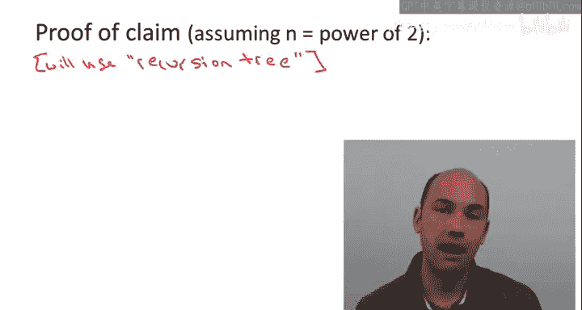
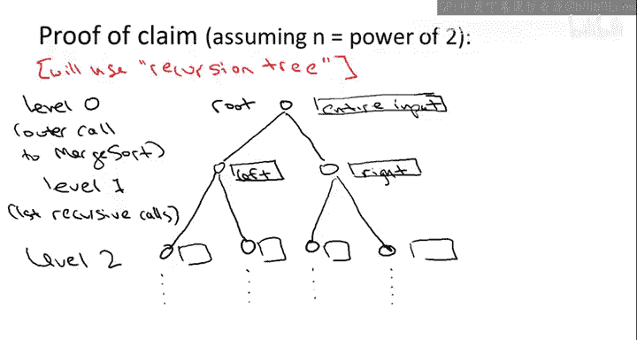
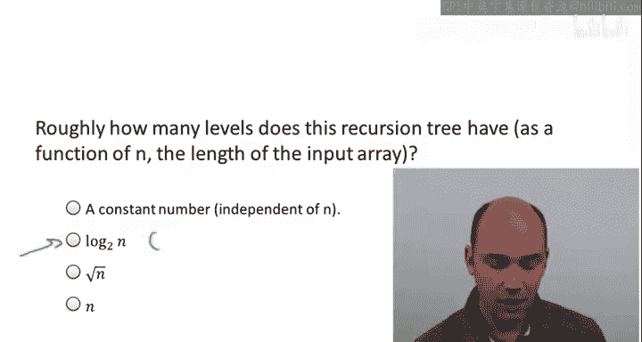
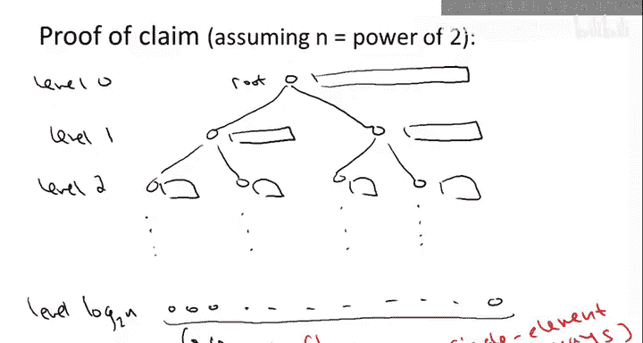
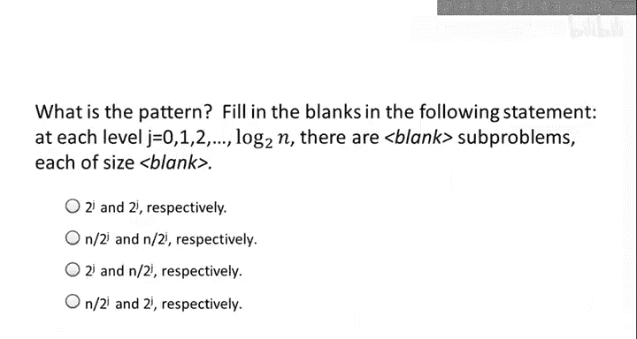

# 斯坦福大学《算法启蒙（第1册）：基础篇｜Algorithms Illuminated, Part 1： The Basics》中英字幕 - P6：-06-1   7   Merge Sort  Analysis 9 min.zh_en - GPT中英字幕课程资源 - BV1vSVAzXE2r

In this video， we'll be giving a running time analysis of the merge sort algorithm in particular。

 we'll be substantiating the claim that the recursive。

 divide and conquer merge sort algorithm is better。

 has better performance than simpler sorting algorithm that you might know like insertion sort selection sort and bubble sort。

 So in particular， the goal of this lecture will be to a mathematically argue the following claim from an earlier video that in order to sort an array n numbers。

 the merge sort algorithm needs no more than a constant times n log n operations。

 That's the maximum number of lines of code it will ever execute。

 specifically six times n log n plus6N operations。

So how are we going to prove this claim， We're going to use what is called a recursion tree method。

The idea of the recursion tree method is to write out all of the work done by the recursive merge sort algorithm in a tree structure with the children of a given node corresponding to the recursive cause made by that node。

 the point of this tree structure is it will facilitate interesting way to count up the overall work done by the algorithm and will greatly facilitate the analysis so specifically what is this tree so at level zero we have a root。

And this corresponds to the outer call of merge short so I'm going to call this level zero Now this tree is going to be binary in recognition of the fact that each indication of merge short makes two recursive calls so the two children will correspond to the two recursive calls of merge short so at the root we operate on the entire input array so let me draw a big array indicating that and at level one we have one subproblem for the left half and another subproblem for the right half of the input array and I'll call these first two recursive calls level1。

Now， of course， each of these two level1 recursive calls will themselves make two recursive calls。

 each operating on then a quarter of the original input array。

So those are the level two recursive calls of which there are four。

 and this process will continue until eventually the recursion bottoms out in base cases when there's only an array of size zero or1。

So now I have a question for you， which I'll give you in the form of a quiz。

 which is at the bottom of this recursion tree corresponding to the base cases。

 what is the level number at the bottom， so what level do the leaves in this tree reside？

Okay so hopefully you guess correctly guess that the answer is the second one。

 so namely that the number of levels of the recursion tree is essentially logarithmic in the size of the input array the reason is basically that the input size is being decreased by a factor2 with each level of the recursion if you have an input size of n at the outer level then each of the first set of recursive calls operates on an array of size n over2 at level2 each array has size n over4 and so on where it the recursion bottom out。

 well down at the base cases where there's no more recursion which is where the input array has size1 or less so in other words the number of levels of recursion is exactly the number of times you need to divide n by2 until you get down to a number that's most1 and recall that's exactly the definition of the logarithm base 2 of n so since the first level is level zero and the last level is level log base2 of n。

 the total number of levels is actually log base2 of n plus1。

And when I write down this expression， I'm here assuming that n is a power of  two。

 which is not a big deal， I mean， the analysis is easily extended to the case where n is not a power of  two。

 but this way we don't have to think about fractions， log base2 of n then is an integer。Okay。

 so let's return to the recursion tree， let me just redraw it really quick。

So again down here at the bottom of the tree， we have the leaves at I。e。

 the base cases where there's no more recursion， which when n is a power of two correspond exactly to single element arrays。

So that's the recursion tree corresponding to an indication of merge sort and the motivation for writing down for organizing the work performed by merge sort in this way is it allows us to count up the work level by level and we'll see that that's a particularly convenient away to account for all of the different lines of code that get executed Now to see that in more detail I need to ask you to identify a particular pattern so first of all the first question is at a given level J of this recursion exactly how many distinct subproblem are there as a function of the level J that's the first question the second question is for each of those distinct subproblems at level J what is the input size so what is the size of the array which is passed to a subproblem residing at level J of this recursion tree。

So the correct answer is the third one。So first of all。

 at a given level J there's precisely two to the J distinct subproblem there's one outermost subproblem at level zero。

 it has two recursive calls， those are the two subproblems at level1 and so on in general。

 since merge short calls itself twice， the number of subproble is doubling each level so that gives us the expression2 to the J for the number of subproblem at level J。

On the other hand， by a similar argument， the input size is having each time with each recursive call you pass it half of the input that you were given so at each level of the recursion tree we're seeing half of the input size of the previous level So after J levels since we started with an input size of n after J levels each sub problem will' be operating on an array of length N over to the J so now let's put this pattern to use and actually count up all of the lines of code that merge sort executes and as I said before the key idea is to count up the work level by level now to be clear when I talk about the amount of work done at level J what I'm talking about is the work done by those two to the J ins of merge sort not counting their respective recursive calls not counting work which is going to get done in the recursion lower in the tree Now recall merge sort is a very simple algorithm it just has three lines of code first there's a recursive call So we're not counting that second there's another recursive call again we're not counting that at level J and then third we just。

Invoke the merge subroutine， so really outside the recursive calls。

 all that merge sort does is a single indication of merge。

Further recall we already have a good understanding of the number of lines of code that merge needs on an input of size M it's going to use at most 6M lines of code that's an analysis that we did in the previous video so let's fix a level J we know how many subproble there are two to the J we know the size of each subproble and over two to the J and we know how much work merge needs on such an input。

 we just multiply by6 and then we just multiply it out and we get the amount of work done at a level J at all of the level J subproblem so here it is in more detail。

All right， so。We start with just the number of different sub problems at level J。

 and we just noticed that that was at most two to the J。

We also observed that each level J subproblem is past an array as input which has length n over 2 to the J。

 and we know that the merge subroutine when given an input given an array of size n over 2 to the J will execute at most six times that many number of lines of code。

 so to compute the total amount of work done at level J。

 we just multiply the number of problems times the work done subproble per subproblem and then something sort of remarkable happens we get this cancellation of the22 to the Js and we get an upper bound6N。

Which is independent of the level J， so we do at most 6N operations at the root。

 we do at most6N operations in level1 at level2 and so on okay it's independent of the level。

Mally the reason this is happening is because of a perfect equilibrium between two competing forces。

 first of all， the number of subproblems is doubling with each level of the recursion tree。

 but secondly， the amount of work that we do per subproblem is having with each level of the recursion trees since those two cancel out we get an upper bound6 n which is independent of the level J Now here's why that's so cool we don't really care about the amount of work just at a given level we care about the amount of work that merge sort does ever at any level but if we have a bound on the amount of work at a level which is independent of the level then our overall bound is really easy what do we do we just take the number of level and we know what that is it's exactly log based2 of n plus1 remember the levels are zero through log base 2 of n inclusive and then we have an upper bound 6N for each of those log n plus one levels。

So if we expand out this quantity， we get exactly the upper bound that was claimed earlier。

 namely that the number of operations merge short， executes as a most6 n times log base2 of n plus 6 n。

So that my friends， is a running time analysis of the merge short algorithm。

 that's why its running time is bounded by a constant times n log N。

 which especially as n grows large， is far superior to the more simple iterative algorithms like insertion or selection sort。

