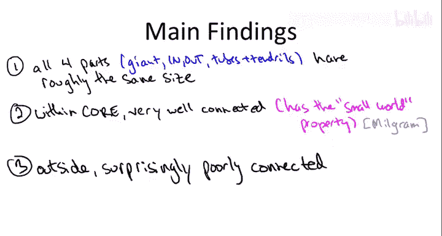
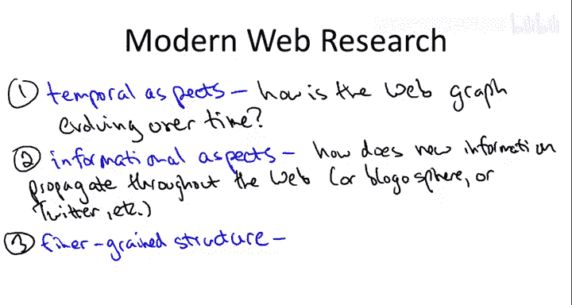

# 斯坦福大学《算法启蒙（第2册）：图算法和数据结构｜Part 2 Graph Algorithms and Data Structures》中英字幕 - P11：-11-10   9   Structure of the Web Optional 19 min.zh_en - GPT中英字幕课程资源 - BV1acVmzNEM8

So we've now put in a lot of work designing and analyzing super fast algorithms for reasoning about graphs。

 so in this optional video what I want to do is show you why you might want such a primitive。

 especially for computation on extremely large graphs。

 specifically we're going to look at the results of a famous study that computes the strongly connected components of the web graph。

So what is the web graph， well it's the graph in which the vertices correspond to web pages？

So for example， I have my own webp page where I list my research papers and also links to courses such as this one。

And the edges are going to be directed and they correspond precisely to hyperlinks。

 so the links that bring you from one web page to another note of course these are directed edges where the tail is the page that contains the hyperlink and the head is the page that you go to if you click the hyperlink。

 and so this is a directed graph。So for my homepage， you can get to my papers。

You can get to my courses。Sometimes I have random links up to things I like。

 like say my favorite record store。And of course， for many of these web pages。

 there are additional links going out or going in， so for example。

 from my papers I might link to some of my co-authors。

Some of my coauors might be linking from their homep pages to me。

 or of course there's webp pages out there which list the currently available free online courses。

And so on。 So obviously， this is just part of a massive。Web graph， just a tiny， tiny piece of it。

So the origins of the web were probably around 1990 or so。

 but it started to really explode in the mid-90s and by the year 2000。

 it was sort of already beyond comprehension， even though in internet years the year 200 is sort of the Stone Age relative to right now relative to 2012。

 but still even by 2000 people were so overwhelmed with the massive scale of the web graph。

 they wanted to understand anything about it， even the most basic things。

Now of course one issue with understanding what the graph looks like is you don't even have it locally right it's distributed over all these different servers over the entire world so the first thing people really focused on when they wanted to answer this question was on techniques for crawling so having software which just follows lots of hyperlinks reports back to the home base from which you can assemble at least some kind of sketch of what this graph actually is so but then the question is even once you have this crawled information even once you've accessed good chunk of the nodes and the edges of this network what does it look like。

So what makes this a difficult question more difficult than say for any other directed graph you might encounter。

 well it's simply the massive scale of the web graph， it's just so big。

 so for the graph used in the particular study I'm going to discuss like we said it was in the year 2000 which is sort of the Stone Age compared to 2012。

 so the graph was small relatively but still the graph was really， really big。

 so it was something like 200 million nodes in 1 billion edges really one in the half billion edges。

So the reference for the work I'm going to discuss is a paper by a number of authors。

 the first author is Andre Broder and then he has many co-authors and this was a paper that appeared in the Dub Dub duub conference of the year 2000 that's the Worldwide Web conference。

 and I encourage those of you who are interested to go track down the paper online and read the original source。

 so Andre Broder， the lead author at this time he was at a company that was called Alta Vista。

 so how many of you remember a company called Alta Vista。Well， some of you。

 especially the youngest ones among you maybe I've never heard of Alta Vista and the youngest ones among you maybe can't even conceive of a world in which we didn't have Google。

 but in fact there was a time when we had web search but Google did not yet exist that was sort of in the maybe 97 or so and so this was in the very embryonic years of Google and this data set actually came out of Alta Vista instead。

So Bro at all wanted to give some answers to this question what does the web graph look like and they approached it in a few ways。

 but the one I'm going to focus on here is they asked。

 well you know what's the most detailed structure we can get about this web graph without doing an infeasible amount of computation。

 really just sticking to linear time algorithms at the worst and what have we seen we've seen that in a directed graph you can get full connectivity information just really using depth for search you can compute strongly connected components in linear time with small constants and that's one of the major things that they did in this study。

Now if you wanted to do the same computation today。

 you'd have one thing going against you and one thing going for you。

 the obvious thing that you have going against you is that the web is still very much bigger than it was here。

Certainly by an order of magnitude。The thing that you'd have going for you is now there's specialized systems which are meant to operate on massive data sets and in particular they can do things like compute connectivity information on graph data so what you have to remember for those of you who are aware of these terms in 2000 there was no mapreduce。

 there was no Hadoop， there were no tools for automated processing large data sets。

 these guys really had to do it from scratch。So let me tell you about what Broder at all found when they did strong connectivity computations on the web graph。

They explained their results in what they called the Bo high picture of the whip。

So let's begin with the center or the knot of the bow tie。

So in the middle we have what we're going to call a giant， strongly connected component。

With the interpretation being， this is the core of the web in some sense。All right。

 so all of you know what an SECCC is at this point。

 a strong candidate component is the region from which you can get from any point to any other point along a directed path。

 so in the context of the web graph with this giant SECCC。

 what this means is that from any web page inside this blob。

 you can get to any other web page inside this blob just by traversing a sequence of hyperlinks。

And hopefully it doesn't strike you as too surprising that a big chunk of the web is strongly connected。

 is well connected in a sense， right so if you think about all the different universities in the world。

 you know probably all of the web pages corresponding to all of the different universities。

 you can get from any one place to any other place。For example。

 from the homepage on which I put my papers I often include links to my co-authors which very commonly are other universities。

 so that already provides a web link from some Stanford page to some page let's say Berkeley or Cornell or whatever and of course I'm just one person I'm just one of many faculty members at Stanford so you put all of these together you would expect all of the different SECCCs corresponding to different universities to collapse into a single one and so on for other sectors as well。

And then of course， if you knew that a huge chunk of the web was in the same strongly connected components。

 let's say 10% of the web， which would be tens of millions of web pages。

 you wouldn't expect there to be a second one it would be super weird if there were two different blobs。

 10 million web pages each that somehow were not mutually reachable from each other that would just all it takes to collapse two SECs into one is a lone arc going from one to the other and then a lo arc in the reverse direction and then those two SECs collapse into one so we do expect a giant SECCC just sort of thinking anecdotally about what the web looks like and then once we realized there's one giant S we don't expect there to be more than one。

All right， so is that the whole story is the web graph just one big SCC Well one of the perhaps interesting findings of this rotor etal paper is that you know there is a giant scCC。

 but it doesn't actually take up the whole web or anything really that close to the entire web So what else would there be in such a picture Well there's the other two ends of a bow tie。

Which are called the in and the out regionsions。In the out regionsions。

 you have a bunch of stronglyline kinetic components， not giant Ss。

 we've established there shouldn't be any other giant Ss。

 but small Ss which you can reach from the giant Strline kinetic component。

 but from which you cannot go back to the giant Strline kinetic component。

I encourage you to think about what types of websites you would expect to see in this out part of the bowtie。

 I'll give you one example very often if you look at a corporate site including those of well-known corporations which you would definitely expect to be reachable from the giant SEC it's actually a corporate policy that no hyperlinks can go from something in the corporate site to something outside the corporate site。

 so that means the corporate site is going to be a collection of web pages which is certainly strongly connected because it's a major corporation。

 you can certainly get there from the giant SEC but because of this corporate policy you can't get back out。

Symmetrically in the in part of the bow tie， you have strongly connected components。

 generally small ones from which you can reach the giant SECCC。

 but you cannot get to them from the giant SECCC。Again。

 I encourage you to think about all the different types of web pages you might expect to see in this in part of the bow tie。

 certainly I think one really obvious example would be new web pages。

 So if you just create something and then you if I just created a web page and pointed it to Stanford University that would immediately be in this in。

Or this in collection of components。Now， if you think about it。

 this does not exhaust all of the possibilities of where nodes can lie。

 there's a few other cases that frankly are pretty weird， but they're there。

You can have passive hyperlinks， which bypass the giant SCC and goes straight from。

The in part of the。Bow tie to the out part。So Broder had all suggested calling these tubes。

And then there's also kind of very curious outgrowths going out of the in componentent。

But which don't make it all the way to the giant SCC， and similarly。

 there's stuff which goes into the out component。And Broder all recommended calling these strange creatures tendrils。

And then in fact， you can also just have some weird isolated islands of FCCs that are not connected even weekly to the giant SCC。

So this is the picture that emerged from Broer etal's strong component computation on the web graph and here's qualitatively some of the main findings that they came up with。

So first of all， that picture on the previous slide I drew roughly to scale in the sense that all four parts。

 so the giant S， the in part， the out part， and then the residual stuff。

 the tubes and tendrils have roughly the same size， you know。

 more or less 25% of the nodes in the graph。I think this surprising people。

 I think some people might have thought that the core that the giant SCC might have been a little bit bigger than just 25 or 28%。

 but it turns out there's a lot of other stuff outside of this strongly connected core。

You might wonder if this is just an artifact of this data set being from the Stone Age being from 2000 or so。

 but people have rerun this experiment on the web graph again in later years。

 and of course the numbers are changing because the graph is growing rapidly。

 but these qualitatively qualitative findings have seemed pretty stable throughout subsequent re-evaluations of the structure of the web。

On the other hand， while the core of the web is not as big as you might have expected。

 it's extremely well connected， perhaps better connected than you might expected。

Now you'd be right to ask the question you know what could I mean by unusually well connected we've already established that this giant core of the web is stronglying connected。

 you can get from any one place to any other place via sequence of hyperlinks what else could you want well in fact it has a very richer notion of connectivity called the Small world property so let me tell you about the small world property or the phenomenon colloquially known as six degrees of separation so this is an idea that had been in the air at least since the early 20th century but really kind of was studied in a major way and popularized by Stanley Milgramm who was a social scientist back in 1967 so Milgram was interested in understanding you are people at great distance in fact connected by shortchan of intermediaries so the way he evaluated this he ran the following experiment gave he identified a friend in Boston Massachusetts a doctor I believe and so this was going to be the target and then he identified a bunch of people who were thought to be far。

way both culturally and geographically specifically Omaha so for those of you who don't live in the US just take it on faith that many people in the US would regard Boston and Omaha as being fairly far apart geographically and otherwise and what he did is he wrote each of these residents of Omaha the following letter who said look here's the name and address of this doctor who lives in Boston your job is to get this letter to this doctor in Boston now you're not allowed to mail the letter directly to the doctor instead you need to mail it to an intermediary。

 someone who you know on a first name basis so of course if you knew the doctor on a first name basis you could mail it straight to them but that was very unlikely。

So you know what people would do in Omaha' is they'd say， well， you know。

I don't know any doctors or I don't know anyone in Boston but at least I know somebody in Pittsburgh and at least that's closer to Boston than Omaha that's further eastward。

 or maybe someone would say， well， I don't really know anyone on the East Coast。

 but at least I do know some doctors here in Omaha and so they'd give the letter to somebody that they knew on a first name basis in Omaha and then the situation would repeat whoever got the letter again they'd be given the same instructions if you know this doctor in Boston on a first name mesis。

 send them the letter， otherwise pass the letter on to somebody who seems more likely closer to them than you are。

Now， of course， many of these letters never reached their destination， but shocking。

 at least to me is that a lot of them did。 so something like 25%。

 at least of the letters that they started with made it all the way to Boston。

 which I think says something about people in the late 60s just having more free time on their hands than they do in the early 21st century I find this hard to imagine。

 but it's a fact so you had dozens and dozens of letters reaching this doctor in Boston and they were able to trace exactly which path of individuals。

 the letter went along before it eventually reached this doctor in Boston。

 and so then what they did is they looked at the distribution of chain lengths。

 So how many intermediaries were required to get from some random person in Omaha to this doctor in Boston。

 Some were as few as two， somewhere were as big as nine but the average number of hops。

 the average number of intermediaries was in the range of five and half or6 and so this is what has given rise to the colloquialism even the name of a popular play the six degrees of separation So that's the origin myth that's where this phrase。

Comes from these sort of experiments with physical letters， but now in network science。

 the small world property is meant to be network which on the one hand is richly connected。

 but also in some sense there are enough cues about which links are likely to get closer to some target so that if you need to route information from point A to point B。

 not only is there a short path， but if you in some sense follow your nose。

 then you'll actually exhibit a short path。So in some sense。

 routing information is easy in small road networks。

 and this is exactly the property that the Bro had all identified with in this giant SCC。

 very rich with short paths and if you want to get from pointing at to point B。

 just follow your nose and you'll do great， you don't need a very sophisticated shortest path algorithm to find a short path。

Some of you may have heard of Sandley Milgram not for this small world experiment but for another famous or maybe infamous experiment he did earlier in the 60s。

 which consisted into tricking volunteers into thinking they are subjecting other human beings to massive doses of electric shocks so that wound up causing a rewrite to certain standards of ethics and experimental psychology you don't hear about that so much when people are talking about networks。

 but that's another reason why Milgramm's work is well known。And just as a point of contrast。

 outside of this giant strongly canic component， which has this rich small world structure of very poor connectivity in the other parts of the web graph。

So there's lots of cool research going on these days about the study of information networks like the webG so I don't want you to get the impression that the entire interaction between algorithms and thinking about information networks has just been this one strong kind component computation in 2000 of course there's all kinds of interactions I just singled one out that was easy to explain and also highly influential and interesting back in the day but you know these days lots of stuff going on people are thinking about information networks in all kinds of different ways and of course algorithms like in almost everything is playing a very fundamental role so let me just dash off sort of a few examples maybe to which your appetite maybe you want to go explore this topic in greater depth outside of this course。

So one super interesting question is rather than looking at a static snapshot of the web like we were doing so far in this video。

 the web's changing all the time， new pages are getting created。

 new links are getting created and destroyed and so on， and how does this evolution proceed。

 can we have a mathematical model which faithfully reproduces the most important first order properties of this evolutionary process？

So a second issue is to think not just about the dynamics of the graph itself。

 but the dynamics of information that gets carried by the graph。

 and you could ask this both about the web graph and about other social networks like say。

 Facebook or Twitter。Another really important topic which there's been a lot of work on。

 but we still don't fully understand by any means， is getting at the finer grain structure in networks。

 including the webGra。

In particular what we'd really like to do is have foolproof methods for identifying communities so groups of nodes these could either to be webp pages in the web for individuals in a social network which we should think of as grouped together we discussed this a little bit when we talked about applications of cuts。

 one motivation for cuts is to identify communities if you think of communities as being relatively densely connected inside and sparsely connected outside and's but that's just a baby step really we need much better techniques for both defining and computing communities in these kinds of networks。

So I think these questions are super interesting both from a mathematical slash technical level but also they're very timely answering them really helps us understand our world better。

 unfortunately these are going to be well outside the course of just the bread and butter design analysis of algorithms。

 which is what I'm tasked with covering here， but I will leave you with a reference book that I recommend if you want to read more about these topics。

Namely， the quite recent book by David Easley and John Kinberg called Networkworks。

 Crowds and Markets。