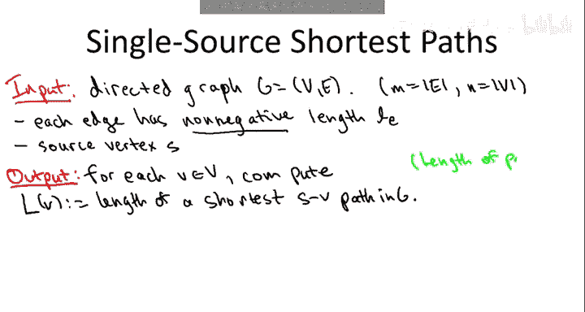
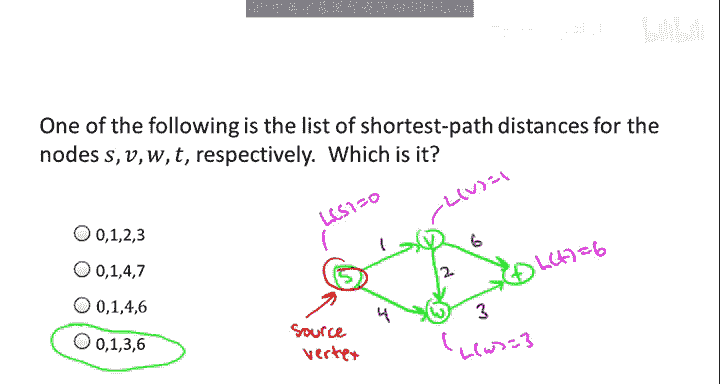
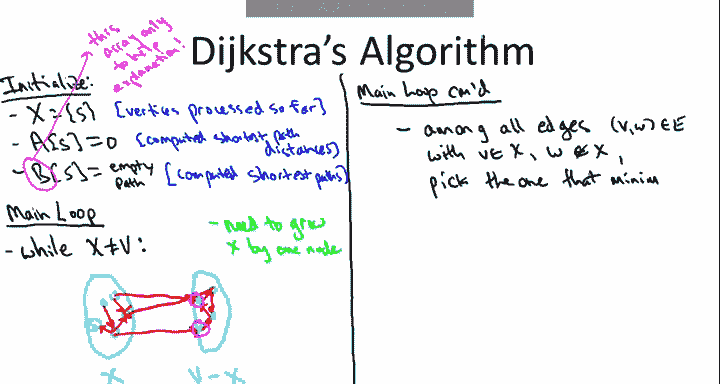

# 斯坦福大学《算法启蒙（第2册）：图算法和数据结构｜Part 2 Graph Algorithms and Data Structures》中英字幕 - P12：-12-11   1   Dijkstra s Shortest Path Algorithm 21 min.zh_en - GPT中英字幕课程资源 - BV1acVmzNEM8

We've arrived at another one of computer sciences's greatest hits。

 namely Dketra's shortest path algorithm。So let me tell you about the problem。

 it's a problem called single source shortest paths。Basically。

 what we want to do is compute something like driving directions。

 so we're given as input a graph in this lecture I'm going to work with directed graphs。

 although the same algorithm would work for undirected graphs with cosmetic changes。As usual。

 we'll use M to denote the number of edges and N to denote the number of vertices。

The input also includes two extra ingredients， first of all for each edge E were given as input a nonnegative length。

 which I'll denote by LCB in the context of a driving directions application。

 LCB could denote the mileage how long this particular road is or it could also denote the expected travel time along the edge。

The second ingredient is a vertex from which we are looking for paths。

 this is exactly the same as we had in breathth first search and depth first search。

 we have an originating vertex， which we'll call here the source。

Our responsibility then is to give in this input computes for every other vertex V in this network。

 the length of a shortest path from the source vertex S to that destination vertex V。

And so just to be clear， what is the length of a path that has， say three edges in it。

 well it's just the sum of the length of the first edge in the path。

 plus the length of the second edge in the path， plus the length of the third edge in the path。

So if you had a path like this with three edges and length  one， two， and three。

 then the length of the path would just be six。And then we define the shortest SV path in the natural way。

 so amongst all of the paths directed from S to V， each one has its own respective path length and then the minimum overall all SV paths is the shortest path distance in the graph G。

So I'm going to make two assumptions for these lectures， one is really just for convenience。

 the other is really important， the other assumption without which Duck's algorithm is not correct。

 as we'll see。So for convenience we'll assume that there is a directed path from S to every other vertex V in the graph。

 otherwise the shortest path distance is something we've defined to be plus infinity。

 and the reason this is not a big assumption is if you think about it。

 you could detect which vertices are not reachable from S just in a preprocessing step using say bread first or depth first search and then you could delete the irrelevant part of the graph and run Dyter's algorithm as will describe it on what remainsAlternatively Dyketer's algorithm will quite naturally figure out which vertices there are paths to from S and which ones there are not so this won't really come up so to keep it simple just think about we have an input graph or you can get from S to V for every different vertex V and the challenge then is amongst all the ways to get from S to V what is the shortest way to do it。

So the second assumption already appears in the problem statement。

 but I want to reiterate it just so it's really clear。When we analyze Jux's algorithm。

 we always focus on graphs where every length is non negative， no negative edge lengths are allowed。

 and we'll see why a little bit later in the video。

Now in the context of a driving directions application。

 it's natural to ask the question why would you ever care about negative edgelinks until we invent a time machine it doesn't seem like negative edge linkss are going to be relevant when you're computing literal paths through literal networks but again。

 remember that paths can be thought of as more abstractly as a just sequence of decisions and some of the most powerful applications of shortest paths are coming up with optimal weight such sequences So。

 for example， maybe you're engaging in financial transactions and you have the option of both buying and selling assets at different times。

 if you sell then you get some kind of profit and that would correspond to a negative edgelink So there are quite interesting applications in which negative edgelinks are relevant if you are dealing with such an application Dykestra's algorithm is not the algorithm to use there is a different shortest path algorithm。

 a couple other ones， but the most well-know one is called Belman Ford。

 that's something based on dynamic programming which we may well cover in a SQL course so for Dykestra's algorithm we always focus on graphs。

have only non negative edge lengths。So with the next quiz I just want to make sure that you understand the single source shortest path problem。

 okay let me draw for you here a simple For node network and ask you for what are the four shortest path lengths so from the source vertex S to each of the four vertices in the network。

All right， so the answer to this quiz is the final option， 0136。To see why that's true。

 well all of the options had zero as the shortest path distance from S to itself。

 so that just seemed kind of obvious so the empty path will get you from S to itself and have zero length Now suppose you wanted to get from S to V。

 well there's actually only one way to do that you have to go along this one hot path so the only path has length1。

So the shortest path distance from S to V is1 Now W is more interesting there's a direct one hop path SW that has length4。

 but that is not the shortest path from S to W。 In fact。

 the two hop path that goes through V is an intermediary has total path length3。

 which is less than the length of the direct arc from S to W。

 so therefore the shortest path distance from S to W is going to be3。And finally， for the vertex T。

 there's three different paths going from S to T， there's the two hop path that goes through V。

 there's the two hop path which goes through W， both of those half path length 7。

 and then there's the three hop path which goes through both V and W and that actually has the path length of 1 plus2 plus3 equal to 6。

 so despite having the largest number of edges， the zigzag path is in fact the shortest path from S to T and it has length 6。

All right so before I tell you how D's algorithm works。

 I feel like I should justify the existence of this video a little bit because this is not the first time we've seen shortest paths。

 you might be thinking rightfully so we already know how to compute shortest paths that was one of the applications of breathth first search。

So the answer to this question is both yes and no Breth first search does indeed compute shortest path。

 so we had an entire video about that， but it works only in the special case where the length of every edge of the graph is one。

At the moment we're trying to solve a more general problem。

 we're trying to solve shortest paths when edges can have arbitrary non negative edge lengths。

So for example， in the graph that we'd explored in the previous quiz。

 if we ran breath first search starting from the vertex S。

 it would say that the shortest path distance from S to T is2 and that's because there's a path with two hops going from S to T。

 put differently t is in the second layer emanating from S。

 but as we saw in the quiz there is not in fact a shortest two hop path from S to T if you care about the edge lengths。

 rather the minimum length path， the shortest path with respect to the edge weights is this three hop path which has a total length of6。

 so breathth first search is not going to give us what we want when the edge lengths are not all the same。

And if you think about an application like driving directions。

 then needless to say it's not the case that every edge of the network is the same。

 some roads are much longer than others， some roads will have much larger travel times than others。

 so we really do need to solve this more general shortest path problem Similarlyly if you're thinking more abstractly about a sequence of decisions like financial transactions in general different transactions will have different value so you really want to solve general shortest paths you not in the special case that bread first search solves。

Now， if you're feeling particularly sharp today， you might have the following objection to what I just said。

 you might say， man， big deal。General edge weights， unit edge weights。

 it's basically the same say you have an edge that has length three how is that fundamentally different than having a path with three edges each of which has length one so why not just replace all the edges with a path of edges of the appropriate length now we have a network in which every edge has unit length and now we can just run breath first search so put succinctly isn't it the case that computing shortest paths with general edge weights reduces to computing shortest paths with unit edge weights。

Well the first comment I want to make is I think this would be an excellent objection to raise and indeed as programmers as computer scientists。

 this is the way you should be thinking， if you see a problem that seems superficially harder than another one。

 you always want to ask， well， maybe just with a clever trick I can reduce it to a problem I already know how to solve that's a great attitude in general for problem solving and indeed know if all of the edge lengths were just small numbers like one two and three and so on。

 this trick would work fine。The issue is when you have a network where the different edges can have very different lengths and that's certainly the case in many applications。

 definitely road networks would be one where you have both sort of long highways and you have neighborhood streets and potentially in financial transactionbased networks you would also have a wide variance between the value of different transactions and the problem then is some of these edge links might be really big。

 they might be1 hundred they might be1 thousand it's very hard to put a priori bounds on how large these edge weights could be so if you start wantonly replacing single edges with these really long paths of length a thousand you've blown up the size of your graph way too much so you do have a faithful representation of your old network but it's too wasteful so even though breath first search runs in linear time it's now on this much larger graph and we much prefer something which is linear time or almost linear time that works directly on the original graph and that is exactly what ditra's shortest path algorithm is going to accomplish。

Let's now move on to the pseudocode for Dyketra's shortest path algorithm。

So this is another one of those algorithms where no matter how many times I explain it it's always just super fun to teach and the main reason is because it exposes the beauty that pops up in good algorithm design。

 so the pseudocode as you'll see in a second is itself very elegant we're just going to have one loop and in each iteration of the loop we will compute the shortest path distance to one additional vertex and by the end of the loop we' have computed shortest path distances to everybody the proof of correctness which we'll do in the next video is a little bit subtle but also quite natural。

 quite pretty and then finally Dykesster's algorithm will give us our first opportunity to see the interplay between good algorithm design and good data structure design so with a suitable application of the he data structure will be able to implement Dykesster's algorithm so it runs blazingly fast almost linear time namely M times login。

But I'm getting a little ahead of myself， let me actually show you this pseudocode。

At a high level you really should think of Dyex's algorithm as being a close cousin of breath first search and indeed if all of the edge lengths are equal to one。

 Dex's algorithm becomes breadth first search， so this is sort of the sick generalization of breath first search when edges can have different lengths so like our generic graph search procedures we're going to start at the source vertex S and in each iteration we're going to conquer one new vertex and we'll do that once each iteration after n minus one iterations will be done and in each iteration will correctly compute the shortest path distance to one new possible destination vertex V。

So let me just start by initializing some notation。

So capital X is going to denote the vertices that we've dealt with so far and by dealt with。

 I mean we've correctly computed shortest path distance from the source vertex to every vertex in X。

 we're going to augment x by one new vertex in each iteration of the main loop。

Remember that we're responsible for outputting n numbers， one for each vertex。

 we're not just computing one thing， we're computing the shortest path distance from the source vertex S to every other vertex。

 so I'm going to frame the output in terms of this array capital A， so for each vertex。

 we're going to have an entry in the array A and the goal is at the end of the algorithm a will be populated with the correct shortest path distances。

Now to help you understand Dyster's algorithm， I'm going to do some additional bookkeeping。

 which you would not do in a real implementation of Dyster's algorithm。

 specifically in addition to this array capital A in which we compute shortest path distances from the source vertex to every other destination there's going to be an array capital B。

 in which will keep track of the actual shortest path itself from the source vertex S to each destination V。

 so the arrays A and B will be indexed in the same way。

 there'll be one entry for each possible destination vertex V capital A will store just a number for each destination。

 shortest path distance， the array B in each position will store an actual path the path the shortest path from S to V。

 but again you would not include this in an actual implementation。

 I just find in my experience it's easier for students to understand this algorithm if we think of the path being carried along as well。

So now that I've told you the semantics of these two arrays。

 I hope it's no surprise how we initialize them。For the source vertex itself S the shortest path distance from S to itself is zero。

 the empty path gets you from S to S with length0， there's no negative edges by assumption so there's no way you can get from S back to S with nonpositive length。

 so this is definitely the shortest path distance for S by the same reasoning the shortest path from S to S is just the empty path the path with no edges in it。

So now let's proceed to the main while loop。So the plan is we want to grow this set capital X like a mold until it covers the entire graph。

 so in each iteration it's going to grow and cover up one new vertex and that vertex will then be processed and at the time of processing we're responsible for computing the shortest path distance from S to this vertex and also figuring out what the actual shortest path from S to this vertex is。

So in each iteration we need to grow x by one node to ensure that we make progress so the obvious question is which node should we pick which one do we add to X next so there's going to be two ideas here。

 the first one we've already seen in terms of all of these generic graph search procedures which is we're going to look at the edges and the vertices which are on the frontier。

 so we're going to look at the vertices that are just one hop away from vertices we've already put into X。

So that motivates in a given iteration of the while loop to look at the stuff we've already processed。

 that's X。And the stuff we haven't already processed， that's v minus x。S of course。

 starts in X and we never take anything out of X so S is still there。

 you in some generic iteration of the while loop， we might have some other vertices that are in X。

 and in a generic iteration of this while loop there might be multiple vertices which are not in x。

And now， as we've seen in our graph search procedures， there are general are edges crossing this cut。

 so there are edges which have one endpoint in each shot。

 one endpoint in X and one endpoint outside of X， this is a directed graph so they can cross in two directions they can cross from left to right or they can cross from right to left。

So you might have some edges internal to X。 those are things we don't care about at this point。

 you might have edges which are internal to v minus x。

 we also don't care about those at least not quite yet。

 and then you have edges which can cross from x to v minus x。

As well as edges that can cross in the reverse direction from v minus x back to x。

And the ones we're going to be interested in， just like when we did graph search and directed graphs are the edges crossing from left to right。

 the edges whose tail is amongst the vertices we've already seen and whose head is some not yet explored vertex。

So the first idea is that at each iteration of the wild loop。

 we scan or we examine all of the edges with tail and X and head outside of X。

 one of those is going to lead us to the vertex that we pick next。So that's the first idea。

 but now we need a second idea because this is again quite underdetermined there could be multiple such vertices which meet this criterion。

 so for example， in the cartoon in the bottom left part of this slide you'll notice that there's one vertex here which is the head of an arc that crosses from left to right and there's yet another vertex down here in D minus x which again is the head of an arc which crosses from left to right so there are two options of which of those two to suck into our set X and we might want some guidance about which one to pick next so the key idea in Dyixtra is to give each vertex a score corresponding to how close that vertex seems to the source vertex S and then to pick among all candidate vertices the one that has the minimum score let me be more precise。

So among all crossing edges with tail on the left side and head on the right side， we pick the edge。

That minimizes the following criterion。

The shortest path distance that we previously computed from S to the vertex V。Plus。

 the length of the edge that connects V to W。So this is quite an important expression。

 so I will call this Dyster's greedy criterion。This is a very good idea to use this method to choose which vertex to add to the set X。

 as we'll see。I need to give a name to this edge which minimizes this quantity over all crossing edges。

 so it's called V star W star。So for example， in the cartoon in the bottom left。

 maybe of the two edges crossing from left to right。

 maybe the top one is the one that has a smaller value of Dyketer's greedy criterion。

 so in that case this would be the vertex V star and the other end of the edge would be the vertex W star。

So this edge of V star W star is going to do wonders for us and will both guide us to the vertex that we should add to x next that's going to be W star is going to tell us how we should compute the shortest path distance to W star as well as what the actual shortest path from S to W star is。

So specifically in this iteration of the wild loop， after we've chosen this E V star W star。

We add W star to X。Remember， by definition， W star was previously not in capital X。

 so we're making progress by adding it to X， that's one more vertex and x。

Now X is supposed to represent all of the nodes that we've already processed。

 so an invariant of this algorithm is that we've computed shortest path distances for everybody in X as well as the actual shortest paths。

 so now that we're putting W star and X we're responsible for all of this information shortest path information。

So what we're going to do is we're going to set the R estimate。

OfW star's shortest path distance from S to be equal to the value of this dixtra greedy criterion for this edge。

 that is whatever our previously computed shortest path distance from S to V star was。

 plus the length of the direct edge from V star to W star。Now。

 a key point is to realize that this code does make sense。

 by which I mean if you think about this quantity AV， this has been previously computed。😡。

And that's because an invariant in this algorithm is we've always computed shortest path distances to everything that's in capital X and of course the same thing holds when we need to assign W star shortest path distance because v star was a member of capital X wed already computed its shortest path distance so we can just look up the V star entry position in the array A so over in our picture in our left we would just say well what did we compute the shortest path distance to v star previously。

 maybe it's something like 17 and then we'd say you know what is the length of this direct edge from v star to W star。

 maybe that's 6 then we would just add 17 and6 and we would put 23 as our estimate of the shortest path distance from S to W star。

So we do something analogous with the shortest paths itself and the array B。That is， again。

 we're responsible since we just added Wstar to Capital X。

 we're responsible for suggesting a path from S to W star in the B array。

So what we're going to do is we're just going to inherit the previously computed path to V star。

 and we're just going to tack on the end one extra hop， namely the direct edge from V star to W star。

 that'll give us a path from S all the way to Wstar via V star as an intermediate pit stop。

And that is the entirety of Dystra's algorithm I've explained all of the ingredients about how it works at a conceptual level so the two things I owe you is why is it correct。

 why does it actually compute shortest paths correctly to all of the different vertices and then secondly how fast can we implement it so the next two videos are going to answer both of those questions but before we do that let's go through an example to get a better feel for how this algorithm actually works and I also want to go through a non-example so that you can appreciate how it breaks down when there are negative edges and that'll make it clear why we do need a proof of correctness because it's not correct without any assumptions about the edge lengths。

