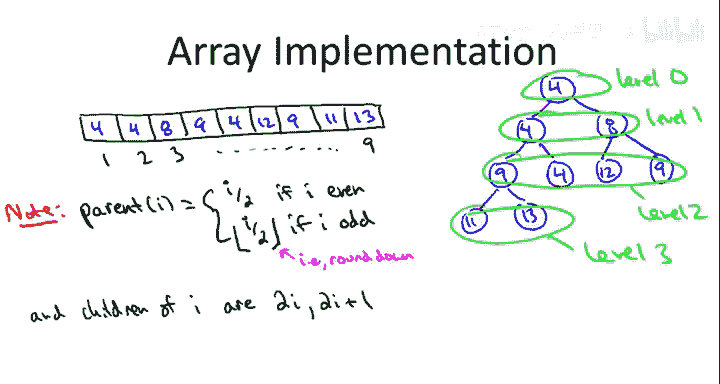
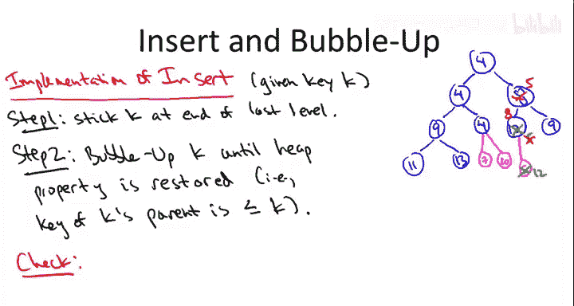
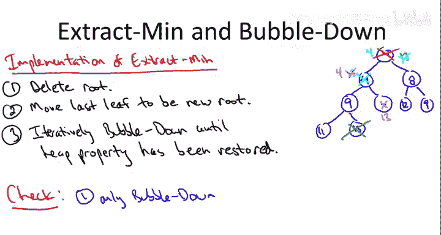

# 斯坦福大学《算法启蒙（第2册）：图算法和数据结构｜Part 2 Graph Algorithms and Data Structures》中英字幕 - P18：-18-12   3   Heaps  Implementation Details Advanced - GPT中英字幕课程资源 - BV1acVmzNEM8

So in this video， we're going to take it at least partway to the next level for the heEAP data structure that is we'll discuss some of the implementation details。

 I。e。 how would you code up a heAP data structure from scratch？

So remember what the point of a heap is it's a container and it contains objects and each of these objects in addition to possibly lots of other data should have some kind of key and we should be able to compare the keys of different objects。

 know Social Security numbers for different employers edge weights for different edges in a network or timestamps on different events and so on Now remember for any data structure the number one thing you should remember is what are the operations that it supports i。

e。 what is the data structure good for and also what is the running time you can count on of those operations So something we promised in a previous video and I'll indicate the implementation of in this video is these two primary operations that a heap exportports first of all you can insert stuff into it and it takes time only logarithmic in the number of objects that the he is storing and second of all you can extract an object that has the minimum key value and again we're going allow duplicates in in our heaps so if there's multiple objects that all have a minimum a common minimum key value the heap will return one of those it's unspecified。

Which one as I mentioned earlier， you can also address the peaps with additional operations like you can do batch inserts in linear time rather than end log in time you can delete from the middle of the heap I'm not going to discuss those in the video I'm just going to focus on how you'd implement inserts and extractment。

If you want to know how heaps really work， it's important to keep in mind simultaneously two different views of a heap。

 one as a tree and one as a array， so we're going to start on this slide with the tree view conceptually this will be useful to explain how the heap operations are implemented。

And conceptually we'll think of a heap not just as any old tree， but as a tree that's rooted。

It'll be binary， meaning that each node will have zero，1 or two children nodes。

 and third it will be as complete as possible。So let me draw for your amusement an as complete as possible binary tree that has nine nodes。

So if the tree had had only seven nodes it would have been obvious what as complete as possible means we just would have had three completely filled in levels if it had had 15 nodes it would have been four completely filled in levels if you're in between these two numbers that are powers of two minus1 well we're going to call a complete tree is just the bottom level you fill in the leaves from left to right so here the two extra leaves on the fourth level are both pushed as far to the left as possible so in our minds this is how we visualize heaps let me next define the heat property。

 this imposes and ordering on how the different objects are arranged in this tree structure。

The heat property dictates that at every single node of this tree it doesn't matter if it's the root。

 if it's a leaf， it's if an internal node， whatever， at every node X。

 the key of the object stored at X should be no more than the keys of x's children now x may have zero children if it's a leaf it may have one child or it may have two children。

 whatever of those cases， zero1 or two children， all of those children's keys should be at least that of the key at X。

For example， here is a heap with seven nodes。Notice that I am allowing duplicates。

 there are three different objects that have the key value4 in this heap。

Another thing to realize is that while the he property imposes useful structure on how the objects can be arranged。

 it in no way uniquely pins down their structure， so this exact same set of seven keys could be arranged differently and it would still be a heap。

The important thing is that in any heap， the root has to have a minimum value key。

 just like in these two organizations of these seven keys， the root is always a four。

 the minimum key value。So that's a good sign， given that one of the main operations we're supposed to quickly implement is to extract the minimum value。

 so at least we know where it's going to be， it's going to be at the root of a heap。

So while in our minds we think of heaps as organized in a tree fashion。

 we don't literally implement them as trees， so in something like search trees you actually have pointers at each node and you can traverse pointers to go from a node to the children。

 from the children to the parents， yada yada yada， it turns out as much more efficient in a heap to just directly implement it as an array let me show you by example how a tree like we had on the last slide maps naturally onto an array representation。

So let's look at a slightly bigger heap one that has nine elements。

So let me draw an array with nine positions labeled one， two， three all the way up to nine。

And the way we're going to map this tree which is in our mind to this array implementation is really very natural。

 we're just going to group the nodes of this tree by their level so the root is going to be the only node at level zero then the children of the root are level one their children constitute level2 and then we have a partial level3 which is just these last two nodes here and now we just stick these nodes into the array one level at a time so the roots winds up in the privileged first position。

 so that's going to be the first the object which is the first copy of the four then we put in the level one object so that's the second copy of the four and the eight then we put in level2。

Which has our third four along with。The two nines。And then we have the last two node from level three rounding out the penultimate and final position of the array。

And you might be wondering how it is we seem to be having our cake and eating it too on the one hand we have this nice logical tree structure on the other hand we have this array implementation and we're not wasting any space on the usual pointers you would have in a tree to traverse between parents and children so where's the free lunch coming from Well the reason is that because we're able to keep this binary tree as balanced as possible we don't actually need pointers to figure out who is whose parent and who is whose child we can just read that off directly from the positions in the array so let me be a little bit more specific。

If you have a node in the I position， I'm assuming I here is not one right so the root have does not have a parent。

 but any other object in position I does have a parent and what the position of that is depends on in a simple way on whether I is even or odd。

 so if I is even then the parent is just at the position I over two。And if I is odd。

 then it's going to be I over2， okay， that's a fraction， so we take the floor。

 that is we round down to the nearest integer。If I is odd。So for example。

 the objects in positions two and three have as their parent， the object in position one。

 those in four and five have the one in position two as its parent。

Six and seven have as their parents the note in the object in position three and so on。

And of course we can invert this function， we can equally easily determine who the children are of a given node so if you have an object that's at position I。

 then you notice that the children of I are going to be at the positions2 I and2 I plus one Of course those going be empty so if you have a leaf of course it doesn't have any children and there may be one node that has only one child but in the common case of an internal node。

 there's going to be two children they're going to be positions2 I and2 I plus1 So rather than traversing pointers it's very easy to just go from a node to its parent or to either one of its children just by doing these appropriate trivial calculations with respect to its position So this slide illustrates some of the lower level reasons that heaps are quite a popular data structure so the first one just in terms of storage we don't need any over at all are just we have these objects we're storing them directly in an array with no extra space second of all。

 not only do we not have to have the space for pointers but we don't even have to do any traversing all we do are these really simple divide by two or multiply by two operations。

And using bit shifting tricks， those can also be implemented extremely quickly So in the next two slides let me indicate at a high level how you would implement the two exported operations。

 namely insertion and extract min in time logarithmic in the size of the heap。

And rather than give you any pseudocode， I'm just going to show you how these work by example。

 I think it will be obvious how they extended the general case。

 I think just based on this discussion， you'll be able to code up your own versions of insert and extract min if you so desire。

So let's redraw the nine node heap that we had on the previous slide and again I'm going to keep drawing it as a tree and I'm going to keep talking about it as a tree。

 but always keep in mind the way it's really implemented is in terms of these array and when I talk about the parent of a node again what that means is you go to the appropriate position given the position of the node from where you started。

So let's suppose we have an existing heap like this blue heap here。

 and we're called upon to insert a new object， let's say， with a key value K。Now remember。

 heaps are always supposed to be perfectly balanced binary trees。

So if we want to maintain the property that this tree is perfectly balanced。

 it's pretty much only one place we can try to put the new keyK and that's as the next leaf。

 that is it's going to be the new rightmost leaf on the bottom level。

Or in terms of the array implementation， we just stick it in the first non empty slot in the arrayette。

 and if we keep track of the array size， we can in constant time， of course。

 know where to put the new key。Now， whether or not we can get away with this depends on what the actual key value K is。

 But， you know， for starters， we could say， what if we insert a key that's 7。Well。

 then we get to say， who， we're done。So the reason we're done is because we have not violated the heat property。

 it is still the case that every node has key no bigger than that of its children in particular this third copy of a four it picked up a new child but its key7 was bigger than its key4 so you can imagine that maybe we get lucky with another insert maybe the next insertion is a 10。

And again， we put that in the next available spot in the last level and that becomes the second child of the third copy of the four。

 and again， we have no violation of the heat property。

 no worries still got a heat and in these lucky events insertion is even taking constant time right really all we're doing is putting elements at the end of an array and not doing any rearranging So what gets interesting is when we do an insertion that violates the heat property So let's suppose we do yet another insertion and the left child of this 12 it becomes a five。

Well now we've got a problem so now we still have a as perfectly balanced as possible binary tree。

 but the heat property is not satisfied， in particular it's violated at the node 12。

 it has one child， the key of that child is less than its own key， that's no good。

So is there some way we can restore the heap property？Well。

 a natural idea is just to swap the positions of the five and the12。

 and that's something that of course can be done in constantsantine because again。

 from any node we can go to the parent or the child in constantine just with a suitable trivial computation。

So we say， okay， for starters we put the five at the end， but that's no good。

 so we're going to swap the five with the 12。And now we see we're not out of the woods。

 no longer is there a heap violation at the node 12 that's been fixed， we've made it a leaf。

 but we've pushed up the heap violation， so now instead it's the eight that has a problem the eight used to have two children with keys 12 and nine that was fine now the eight has two children with keys five and9。

 the five is less than the eight that's a violation of the he property。

 but again that's the only violation of the heat property。

 there's no other node we could have screwed up because eight was the only person whose's children we messed around with。

All right， so now we just do it again， let's try to again locally fix the heat violation by swapping the five with the eight。

And now we see we've restored order， the only place where there could possibly be violation of the heat property is at the root。

 the root， when we did this swap， the only person whose children we really messed with was the Ro four。

 but fortunately its new child has key5， which is bigger than it。

One subtle point is you might be thinking that you know in addition to screwing up the root node by messing around with its children。

 maybe we could have screwed up to 12 by messing around with its parent its parent used to be5 and now its parent is eight so is theres some possibility that this parent would all of a sudden have a key bigger than it but if you think about it this eight in this 12 they were a parent child relationship in the original heap right so back in the blue heap。

 the 12 was under the8s now the 12 was under the eight yet again since we have the heat property for that parent before we certainly have it now so in general。

 as you push up this five up the tree， there's only going to be one possible edge that could be out of order and that's between where the five currently resides and whatever its parent is。

So when the five' parent was 12， that was a violation， when five' parent was eight。

 that was a violation， but now that we've pushed at two levels and five' parents is four。

 that's not a violation because four is less than five。So in general。

 step two of insertion is you do this swap， which it's called a lot of different things。

 I'm going to call it bubble up because that's how I learned it more years ago than I care to admit。

 but also this is called sometimes sift up， Hepaify up and so on。

So I've now told you the gist of how to implement insertion via repeated bubbling ups in a he data structure。

 and this is really how it works， there's nothing I haven't told you。

 but you know I'm not going to really fill in all of the details。

 but I do encourage you to do that on your own time if this is something that interests you and the two main things that you should check is first of all。

 this bubbling up process has got to stop and when it stops。

 it stops with the heat property restored。The second thing that needs to be checked and this。

 I think is easier to see is that we do have the desired runtime logarithmic in the number of elements in the heap。

The key observation there is that because this is a perfectly balanced binary tree。

 we know exactly how many levels there are， so this is basically log base2 of n levels。

Where n is the number of items in the heap。And what is the running time of this insertion procedure。

 well you only do a constant amount of work at each level just doing the swap in a comparison。

 and then in the worst case you have to swap at every single level and there's a logarithite number of levels。

So that's insertion， let's now talk about how to implement the extract min operation。

 and again I'm going to do this by example， and it's going to be by a repeated indication of a bubble down procedure。

So the extract min operation is responsible for removing from the heap an object with minimum key value and handing it back to the client on a silver platter。

 so we pretty much have to rip out the root， remember the minimum is guaranteed to be at the root so that's how we have to begin in the extract min subroutine is we just pluck off the root and hand it back to the client。

So this removal of course leaves a gaping hole in our tree structure and that's no good one of the invaris we're responsible for maintaining is that we always have an as perfectly balanced as possible binary tree and if you're missing a root you certainly don't have almost perfect binary tree so what are we going to do about it how do we fill this hole well there's pretty much only one node that could fill this hole without causing other problems with the tree structure and that is the very last node so the rightmost leaf at the bottom level one simple fix is to swap that up and have that take the place of the original roots so in this case the 13 is going to get a massive promotion and get teleported all the way to be the new root of this tree。

So now we've resolved our structural challenges， we now again have as perfectly balanced as possible binary tree。

 but of course now we've totally screwed up the heat property right so the heat property says that at every node including the root。

 the key value at that node has to be less than both of the children and now it's all messed up so at the root the key value is actually bigger than both of the children。

And matters are a little bit more tricky than they were with insertion right when we insert it at the bottom because every node has a unique parent。

 if you want to push a node upward in the tree， there's sort of only one place that can go right all you can do is swap with your parent unless you're going try to do something really crazy but if you want to do something local pretty much you only have a unique parent you could try to swap with Now when we're trying to push nodes down to the rightful position in the tree there's two different swaps we you could do one for the left child。

 one for the right child and the decision that we make matters to see that concretely let's think about this example。

 there's this 13 at the root which is totally not where it should be and there's the two children。

 the four and the eight and we could try swapping it with either one so suppose we swap it in a misguided way with the right child with the eight So now the eight becomes the new root and the 13 gets pushed down a level。

So on the one hand， we made some progress because now at least we don't have a violation between the 13 and the eight。

On the other hand， we still have violations involving the 13。

 the 13 is still violated with respect to the 12 and9 and moreover we've created a new problem between the eight and the four right so now that the eight is the root that's still bigger than its left child this four so it's not even clear we made any progress at all when we swapped to 13 with the eight so that was a bad idea。

And if you think about it， what made it a bad idea。

 The stupid thing was to swap it with the larger child。 That doesn't make any sense。

 We really want to swap it with the smaller child。 remember every node should have a key bigger than both of its children so if we're going to swap up either the four or the eight One of those is going to become the parent of the other The parent supposed to be smaller so evidently we should take the smaller of the two children and swap the 13 with that。

 so we should swap the 13 with the four， not with the eight and now we observe a phenomenon very much analogous to what we saw and insert when we were bubbling up during insertion。

 It wasn't necessarily that we fixed violations of the heat property right away but we would fix one and then introduce another one that was higher up in the tree and we had confidence that eventually we could just push this violation up to the root of the tree and squash it just like we're trying to win a game of wackamolele。

Here it's the opposite in the opposite direction， so we swap the 13 with the four。

 it's true we've created one new violation of the heat property that's again involving the 13 with its children nine and four。

 but we haven't created any new ones， we've pushed the heat violation further down the tree and hopefully again。

 like in Wacamole we'll squash it at the bottom。So after swapping the 13 and the four now we just got to do the same thing。

 we say okay we're not done， we still don't have a heap， this 13 is bigger than both of its children。

 but now with our accumulated wisdom we know we should definitely swap the 13 with the four we're not going to try swapping with the nine that's for sure so we move the four up here。

And the 13 takes the fours old place and boom now we're done so now we have no violations remaining。

 the 13 in its new position has no children so there's no way it can have any violations and the four because it was the smaller child that's going to be bigger than the nine so we haven't introduced to heap violation there and again we have these consecutive fours but we know that's not going to be a problem because those were consecutive fours in the original heap as well。

So you won't be surprised to hear that this procedure by which you push something down by swapping it with its smaller children is called bubble down and extract min is nothing more than taking this last leaf。

 promoting it to the top of the tree and bubbling down until the heat violation has been fixed。

So again， on the conceptual level that's all of the ingredients necessary for a complete from scratch implementation of extracting the minimum from a heap and as before I'll leave it for you to check the details so first of all you should check that in fact this is bubble down has to at some point halt and when it halts you do have a bona fide heap。

 the heat property is definitely restored and second of all the running time is logarithmic here the running time analysis is exactly the same as before so we already have observed that the height of a heap because it's perfectly balanced is essentially the log base two of the number of elements in the heap and in bubbling down all you do is a constant amount of work per level all you got to do is a couple comparisons and a swap。

So that's a peek at what's under the hood in the heAP data structure a little bit about the guts of its implementation。

 so having seen this， I hope you feel like a little bit more hardcore of a programmer。

 a little bit more hardcore of a computer scientist。

