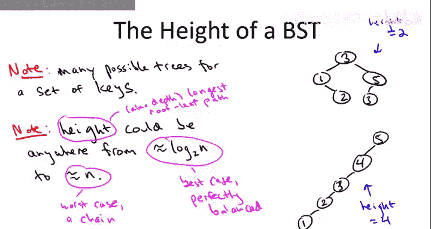

# 斯坦福大学《算法启蒙（第2册）：图算法和数据结构｜Part 2 Graph Algorithms and Data Structures》中英字幕 - P20：-20-13   2   Binary Search Tree Basics, Part I 13 min.zh_en - GPT中英字幕课程资源 - BV1acVmzNEM8

So in this video， we'll go over the basics behind implementing binary search trees。

 We're not going focus on the balanced aspect in this video that'll be discussed in later videos。

 We're going to talk about things which are true for binary search trees in general。

 balanced or otherwise。 let's just recall know why it is are we doing this what is the ra on detra of this data structure。

 the balanced version of a binary search tree。 and basically it's a dynamic version of as sorted array。

 So it does pretty much everything you can do on a sorted array。

 maybe in slightly more expensive time， buts still really fast。 but in addition it's dynamic。

 it accommodates insert searchions and deletions So remember if you want to keep a sorted array data structure every time you insert every time you delete you're probably going to wind up paying a linear factor which is way too expensive in most applications。

 by contrast with a search tree a balanced version you can insert and delete in logarithmic time in the number of keys in the tree。

 And more you can do stuff like search in logarithmic time。

 no more expensive than binary search on a sorted array and also you can say a selection problem and the special cases is the minimum of maximum。

Okay， it's not constant time like an assorted array。

 but still logarithmic pretty good and in addition。

 you can print out all of the keys from smallest to largest in linear time。

 constant time per element just like you could with a linear scan through assorted array so that's what they're good for everything assorted array can do more or less plus insertions and deletions everything in logarithmic time。

So how search trees organized and again what I'm going to say in the rest of this video is true both for balanced and unbalanced search trees。

 we're going to worry about the balancing aspect in the later videos All right。

 so let me tell you the key ingredients in a binary search tree let me also just draw a simple cartoon example up in the upper right part of the slide so there's a one to one correspondence between nodes of the tree and keys that are being stored。

And as usual in our data structure discussions， we're going to act as if the only thing that we care about。

 the only thing that exists at each node is this key when generally there's associated data that you really care about。

 so each node in the tree will generally contain both a key plus a pointer to some data structure that has more information。

 maybe the key is the employee ID number and then there's a pointer to lots of other information about that employee。

Now in addition to the nodes you have to have links amongst the nodes and there's a lot of different ways to do the exact implementation of the pointers that connect the nodes of a tree together for the video I'm just going to keep it as straightforward as possible and we're just going to assume that at each node there's three pointers。

 one to a left child， another one to a right child and then a third pointer which point to the parent。

Now of course some of these pointers can be null and in fact in the five node binary search tree I've drawn on the right for each of the five nodes。

 at least one of these three pointers is null so for example。

 for the node with key1 it has a null left child pointer there's no left child it's right child pointer is going to point to the node with key2 its parent pointer is going to point to the node that has key3 similarly three is going to have a null parent pointer and the root node in this case3 is the unique node that has a null parent pointer here the node with key value3 of course has a left child pointer it points to one it has a right child pointer it points to five。

Now here is the most fundamental property of search trees。

 let's just go ahead and call it the search tree property。

So the search tree property asserts the following condition at every single node of a search tree。

If the node has some key value， then all of the keys stored in the left sub tree should be less than that key。

 And similarly， all of the keys stored in the right subree should be bigger than that key。

 So if we have some node whose stored key value as X。 And this is somewhere， you know。

 say deep in the middle of the tree。 So upward we think of as being toward the roots。

And then if we think about all the nodes that are reachable after following the left child pointer from X。

 that's the left subte， and similarly， the right subte being everything reachable via the right child pointer from X。

 it should be the case that all keys in the left subt are less than x。

And all keys in the right sub are bigger than x。And again。

 I want to emphasize this property hole not just at the root， but at every single node in the tree。

I've defined the search tree property assuming that all of the keys are distinct。

 that's why I wrote strictly less than in the left subte and strictly bigger than in the right subtree。

 but search trees can easily accommodate duplicate keys as well。

 you just have to have some convention about how you handle ties so for example you could say that everything in the left subte is less than or equal to the key at that node and then everything in the right subtree should be strictly bigger than that node that works fine as well。

So if this is the first time you've ever heard of the search tree property， maybe at first blush。

 it seems a little arbitrary。 It seems like I pulled it out of thin air。

 but actually you would reverse engineer this property if you sat down and thought about what property would make search really easy in a data structure The point is the search tree property tells you exactly where to look for some given key So looking ahead a little bit stealing my fire from a slide to come。

 suppose you were looking for say a key 23 and you start at the root and the root is 17 The point of the search tree property is you know where 23 has to be if the root is 17 and you're looking for 23 if it's in the tree no way is it in the left subtree it's got to be in the right subtree so you can just follow the right child pointer and forget about the left subtree for the rest of the search This is very much in the spirit of binary search where you start in the middle of the array and again you can what you're looking for to what's in the middle and either way you can recursse on one of the two sides forgetting forever。

More about the other half of the array and that's exactly the point of the search Street property we're going to search from root on down the search Street property guarantees we have a unique direction to go next and we never have to worry about any of the stuff that we don't see。

We could also draw a very loose analogy with our discussion of heaps。

 You might recall heaps where also logically we thought of them as a tree。

 even though they're implemented as an array。 and heaps had some heap property。

 And if you go back and review the heap property， you'll find that it is not the same thing as the search tree property。

 Those are two different properties。 And that's because they're trying to make different things easy。

 back when we talked about heaps， the property was that this was for the extract minversion。

 Par always have to be smaller than their children。 That's different than the search tree property。

 which says stuff to the left is smaller than you。 stuff to the right is bigger than you in heaps。

 we had the heap property so that identifying the minimum value is trivial。

 It was guaranteed to be at the root。 Heaps are designed so that you can find the minimum them easily。

 Search trees are are defined so that you can search usually。

 That's why we have this different search tree property。 If you want to get smaller， you go left。

 If you want to get bigger， you go right。One point that's important to understand early。

 and this will be particularly relevant once we try to enforce balancing in our subsequent videos。

 is that for a given set of keys， you going have a lot of different search trees。

On the previous slide， I drew one search tree containing the key values 1，2，3，4，5。

 Let me redraw that exact same search tree here。If you stare at this tree a little while。

 you'll agree that in fact at every single node of this tree。

 all of the things in the left subt are smaller， all of the things in the right subre are bigger。

 however， let me show you another valid binary search tree with this exact same set of keys。

So in this second search tree， the root is5， the maximum value。

 and everybody has null right children， only the left children are populated and it goes 5，4，3，2。

1 in descending order。 if you check here again it has the property that at every node。

 everything in the left subt is smaller， everything in the right subte in this case empty is bigger So extrapolating from these two cartoon examples。

 we surmise that for a given set of n keys， search trees that contain these keys could vary in height anywhere from the best case scenario of a perfectly balanced binary tree。

 which is going to have like logarithmic height to the worst case of one of these linked list like chains。

 which is going to be linear in the number of keys N。And so just to remind you。

 the height of a search tree， which is also sometimes called the depth。

 is just the longest number of hops it ever takes to get from a root to a leaf。

So in the first search tree。Here， the height is 2。 and in the second search tree， the height is 4。

 If the search tree is perfectly arranged with a number of nodes essentially doubling at every level。

 then the depth is， you're going to run out of nodes around the depth of log base 2 of n。

And in general， if you have a chain of n keys， the depth's going to be n minus1。

 but let's just call it n amongst friends。So now that we understand the basic structure of binary search trees。

 we can actually talk about how to implement all of the operations that they support。

So as we go through most of the supported operations one at a time。

 I'm just going to give you a really high level description。

 it should be enough for you to code up your own implementation if you want。

 or as usual if you want more details or actual working code。

 you can check on the web or in one of a number of good programming or algorithms textbooks。

So let's start with really the primary operation， which is search。

Search in we've really already discussed how it's done when we discussed the search tree property。

 again the search tree property makes it obvious how to look for something in a search tree。

 pretty much you just follow your nose， you have no other choice。

So you started the root。 It's the obvious place to start。 If you're lucky。

 the root is what you're looking for。 and then you stop and you return the root。

 More likely the root is either bigger than or less than the key that you're looking for。 Now。

 if the key is smaller， the key you're looking for is smaller than the key at the root。

 where you're going to look Well， the search tree property says if it's in the tree。

 it's got to be in the left subree So you follow the left subsald pointer。

 If the key you're looking for is bigger than the key at the root， where is it got to be。

 got to be in the right subtree So you're just going to recurse on the right subtree。

 So in this example， if you're searching for， say the key2 obviously you're going to go left from the root。

 if you're searching for the key for， obviously you're going to go right from the root。

So how can the search terminate will can terminate in one of two ways。

 first of all you might find what you're looking for so in this example if you search for four you're going to traverse a right child pointer then a left child pointer and then boom you're at the for and you return successfully。

The other way the search could terminate is with a null pointer so in this example suppose you were looking for a node with key6 what would happen well you start at the root three is too small so you go to the right。

 you get to five，5 is still too small because you're looking for six so you try to go right but the right tile pointer is null and that means six is not in the tree if it was anywhere in the tree it had to be to the right of the three it had to be to the right of the five but you tried it and you ran out of pointers so the six isn't there and you return correctly with an unsuccessful search。

Next， let's discuss the insert operation， which really is just a simple piggybacking on the search that we just described。

So for simplicity， let's first think about the case where there are no duplicate keys。

 the first thing to do on this insertion is search for the key K。Now。

 because there are no duplicates， this search will not succeed。 This key K is not yet in the tree。

 so for example， in the picture on the right， we might think about trying to insert the key6。

 what's going to happen when we search for6， we follow a right childild pointer。

 we go from three to5 and then we try to follow another one and we get stuck。

 there's a null pointer going to the right of five。

 Then when this unsuccessful search terminates at a null pointer。

 we just rewire that pointer to point to a node with this new key K。

So if you want to permit duplicates in your data structure。

 you got to tweak the code of insert a little bit， but really barely at all you just need some convention for handling the case when you do encounter the key that you're about to insert。

 so for example， if the current node has a key equal to the one you're inserting。

 you could have the convention that you always continue on the left subtreet and then you continue the search as usual again eventually terminating in a null pointer and you stick the new inserted node you rewire the null pointer to point to it。

One good exercise for you to think through， which I'm not going to say more about here is that when you insert a new node。

 you retain the search tree property， that is if you start with a search tree。

 you start with a tree where at every node stuff to the left is smaller。

 stuff to the right is bigger， you insert something and you follow this procedure。

 you will still have the search tree property after this new node has been inserted。

 that's something for you to think through。