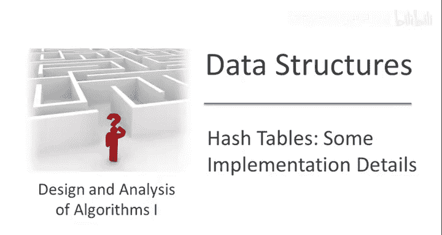

# 斯坦福大学《算法启蒙（第2册）：图算法和数据结构｜Part 2 Graph Algorithms and Data Structures》中英字幕 - P25：-25-14   3   Hash Tables  Implementation Details, Part II 22 min.zh_en - GPT中英字幕课程资源 - BV1acVmzNEM8

Let's begin by building up to an intuition about what we would want from a hash function now that we know how hash functions are usually implemented。

 so let's start with a hash function which is implemented by chaining so what's going to be the running time of our lookup insert and delete operations in the hash table with chaining。

Well the happy operation in the hash table with chaining is insertion。

 insertion we can just say without any qualifications is constant time。

 this requires the sort of obvious optimization that when you do insert。

 you insert something at the front of the list in its bucket there's no reason to insert it at the end that would be silly。

So the plot thinks when we think about the other two operations deletion and the lookup so let's just think about lookup deletion is basically the same so how do we implement lookup Well remember when we get some key X we invoke the hash function we call H of x that tells us what bucket to look in so it tells us 17 we know that know X may or may not be in the hash table but this point we know that if it's in the hash table it's got to be in the linked list that's in the 17th bucket so now we descend into this bucket we find ourselves a linked list and now we have to resort to just an exhaustive search through this list in the 17th bucket to see whether or not X is there so we know how long it takes to search a regular list for some element it's just linear in the list length。

And now we're starting to see why the hash function might matter right so suppose we insert 100 objects into a hash table with 100 buckets if we have a super lucky hash function then perhaps each bucket will get its own object there'll be one object in each of the lists in each of the buckets so theta of the list link is just theta of one we're doing great so constant linked lists means constant time insert delete a really stupid hash function with map every single object to bucket number zero so then if you insert 100 objects。

 they're all in bucket number0， the other 99 buckets are empty and so every time you do insert or delete it's just resorting to the naive link the solution and the running time is going to be linear in the number of objects in the hash table。

So the largest list length could vary anywhere from M over n where M is the number of objects。

 this is when you have equal length lists to if you use this ridiculous constant hash function， M。

 all the objects in the same list。And so the main point I'm trying to make here is that。

 first of all， at least with chaining， where the running time is governed by the list length。

 the running time depends crucially on the hash function。

 how well the hash function distributes the data across the different buckets。

And something analogous is true for hash tables that use open addressing right so here there aren't any lists so you don't there's no list links to keep track of so the running time is going to be governed by the length of the probe sequence so the question is how many times do you have to look at different buckets。

 the hash table before you either find the thing you're looking for or if you're doing insertion before you find an empty bucket in which to insert this new object So the performance is governed by the length of the probe sequence and again the probe sequence is going to depend on the hash function for really good hash functions in some sense stuff that spreads data out evenly you expect probe sequences to be not too bad at least intuitively and for say the constant function you're going to expect these probe sequences to grow linearly with the number of objects you insert into the table So again this point remains true。

 the performance of a hash table in either implementation really depends on what hash function you use。

So having built up this intuition， we can now say what it is we want from a hash function。So first。

 we wanted to lead to good performance。And using the chaining implementations as a guiding example。

 we see that well you know if we have a size of a hash table N that's comparable to the number of objects M。

 it would be really cool if all of the lists had length that was basically constant therefore we had our constantine operations so equal link lists is way better than unequal length lists and hash table with chaining so we want the hash function to do is to spread the data out as equally as possible amongst the different buckets and something similar is true with open addressing in some sense you want hash functions to spread the data uniformly across the possible places you might probe as much as possible。

And in hashing， usually the gold standard for spreading data out is the performance of a completely random function。

 so you can imagine for each object that shows up， you flip some coins with each of the end buckets equally likely you put this object in one of the end buckets and you flip independent coins for every different object。

 so this you would expect you know because you're just throwing darts at the buckets independently you'd expect this to spread the data out quite well。

But of course it's not good enough just to spread data out。

 it's also important that we don't have to work too hard to remember what our hash function is and to evaluate it。

Remember， every time we do any of these operations， an insert or delete or lookup。

 we're going to be applying our hash function to some key X。

 so every operation includes a hash function evaluation。

 so if we want our operations to run in constant time。

 evaluating the hash function also better run in constant time。

And the second property is why we can't actually implement completely random hashing right so there's no way we can actually adjust you know when we say want to insert Alice's phone number。

 flip a new batch of random coins right because suppose we did。

 suppose we flip some random coins and it tells us to put Alice's phone number into the 39th bucket。

Well， later on we might do a lookup for Alice's phone number and we better remember the fact we're supposed to look in the 39th bucket for Alice's phone number but what does that mean that means we have to explicitly remember what choice we made we have to write down in a list in effect that Alice is in bucket number 39 and every single insertion if they're all from into point of coin flips we have to remember all of the different random choices independently and this really just devolves back to the naive listbased solution that we discussed before so evaluating the hash function is going to take us linear time and that defeats the purpose of a hash table so again we want the best of both worlds we want a hash function in which we can store an ideally constant space evaluate in constant time but it should spread the data out just as well as if we had this gold standard of completely random hashing。

So I want to touch briefly on the topic of how you might design hash functions and in particular good hash functions that have the two properties we identified on the previous slide。

But I have to warn you， if you ask 10 different serious hardcore programmers about their approach to designing hash functions。

 you're likely to get 10 somewhat different answers。

 so the design of hash functions is a tricky topic and it's as much ar as science at this point。

 despite the fact that there's a ton of science， it's actually very beautiful theory about what makes good hash functions we'll touch on a little bit of that in a different optional video。

And if you only remember one thing of you know from this video or from these next couple slides。

 the thing to remember is the following。Remember that it's really easy to inadvertently design bad hash functions and bad hash functions lead to poor hasht performance。

 much poor than you would expect given the other discussion we've had in this video so if you have to design your own hash function。

 do your homework， get some examples， learn what other experts are doing and use your best judgment if you do just something without thinking about it。

 it's quite possible to lead to quite poor performance， much poor than you were expecting。

So to drive home this point， suppose that you're thinking about keys being phone numbers。

So let's say， you know I'm going to just be very kind of United States centric here。

 I'm just going to focus on the 10 digit phone numbers inside the US so the universe size here is 10 to the 10。

Which is quite big， that's probably not something you really want to implement explicitly。

 and let's consider an application where you know you're only say keeping track of the most you know 100 or 100 phone numbers or something like that。

So we need to choose a number of buckets， let's say we choose 100 buckets。

 let's say we're expecting no more than 500 phone numbers or so so we double that we get a number of buckets to be equal to a000 and now we got to come up with a hash function and remember a hash function by definition all it does is map anything in the universe to a bucket number so that means it has to take as input a 10 digit phone number and spit as output some number between zero and 999 and beyond that we have flexibility of how to define this mapping Now when you're dealing with things that have all these digits it's very tempting to just project onto a subset of the digits and if you want a really terrible hash function just use the most significant digits of a phone number to define a mapping from phone numbers to buckets。

All right so I hope it's clear why this is a terrible choice of a hash function so maybe you're a company based in the San Francisco Bay Area。

 the area code for San Francisco is 415 so if you're storing phone numbers from customers in your area you know maybe 20。

30， 40% of them are going to have area codes 415 all of those are going to hash to exactly the same bucket bucket number 415 in this hash table so you're going to get an overwhelming percentage of the data mapping just to this one bucket Meanwhile not all thousand possibilities of these three digits are even legitimate area codes。

 not all three digit numbers are area codes in the United States so they'll be buckets of your hash table which are totally guaranteed to be empty。

So you waste a ton of space in your hash table， you have a huge list in the bucket corresponding to 415。

 you have a huge list in the bucket corresponding to 650 area code at Stanford。

 you're going to have very slow lookup time for everything that hashes to those two buckets and there's going to be a lot of stuff which hashees to those two buckets。

 it's a terrible idea。So a better but still mediocre hash function would be to do the same trick but using the last three digits instead of the first three digits。

This is better than our terrible hash function because there aren't ridiculous clumps of phone numbers that have exactly the same last three digits。

 but still， this is sort of assuming you know using this hash function is tantamount to thinking that the last three digit of phone numbers are uniformly distributed among all of the 1000 possibilities and really there's no evidence that that's true so there's going to be patterns and phone numbers that are maybe be a little subtle to see with a naked eye but which will be exposed if you try to use a mediocre hash function like this。

 So let's look at another example， Perhaps you're keeping track of objects just based by where they're laid out in memory。

 So in other words， the key for an object is just going to be its memory location and if these things are in bytes。

 then you're guaranteed that every memory location will be a multiple of four。

So for a second example， let's think about a universe where the possible keys are the possible memory locations。

 so here you're just associating objects with where they're laid out in memory and hash function is responsible for taking as input。

 some memory location of some object and spitting out some bucket number now generally because of know the structure of bytes and so on。

 memory locations are going to be multiples of some power of two。

In particular， memory locations are going to be even。

And so a bad choice of a hash function would be to take。

 remember the hash function takes as input a memory location。

 which is know some possibly really big number， and we want to compress it。

 we want to output a bucket number and again let's think about a hash table where we choose n equals 10 to the  three or 1000 buckets。

 So then the question is you know how is this hash function going to take this big number which is a memory location and squeeze it down to a small number which is one of the buckets And so let's just use the same idea as in the mediocre hash function。

 which is we're going to look at the least significant bits so we can express that using the mod operator So let's just think about we pick the hash function H of x where H is a memory location to be X mod。

1000。Where again， you know the meaning of 1000 is that's the number of buckets we've chosen to put in our hash table because you know we're going to remember roughly at most 500 different objects so don't forget what the mod operation means。

 this means you just essentially subtract multiples of 10 until you get down to a number less than a000 so in this case it means that you write out X based 10 then you just take the last three digits so in that sense this is the same hash function as our mediocre hash function when you're talking about phone numbers。

So we discussed how the keys here are all going to be memory locations。

 so in particular there'll be even numbers， and here we're taking their modulus with respect to an even number。

And what does that mean， that means every single output of this hash function will itself be an even number。

 you take an even number， you subtract it much multiple of a00。

 you're still going to have an even number， so this hash function is incapable。

Outputting an odd number。😡，So what does that mean， that means at least half of the locations in the hash table will be completely empty。

 guaranteed， no matter what the keys your hashing is， and that's ridiculous。

 it's ridiculous to have this hash table， 50% of which is guaranteed to be empty。And again。

 what I want you to remember， hopefully long after this class is completed is not so much these specific examples。

 but more the general point that I'm making， which is it's really easy to design bad hash functions and bad hash functions lead to hasht performance much poorer than what you're probably counting on。

Now that we're equipped with examples of bad hash functions it's natural to ask about you know what are some good hash functions Well it's actually quite tricky to answer that question。

 you know what are the good hash functions and I'm not really going to answer that on this slide I don't promise that the hash functions I'm going to tell you about right now are good in a very strong sense of the word I will say these are not obviously bad hash functions let's say somewhat better hash functions and in particular if you just need a hash function and you just need a quick and dirty one。

 you don't want to spend too much time on it， the method that I'll talk about on this slide is a common way of doing it。

On the other hand， if you're designing a hash function for some really mission critical code。

 you should learn more than what I'm going to tell you about on this slide。

 so you should do more research about what are the best hash functions， what's the state of the art。

 if you have a super important hash function， but if you just need a quick one。

 what we say on this slide will do in most situations。

So the design of a hash function can be thought of as two separate parts。

So remember by definition a hash function takes as input something from the universe， an IP address。

 a name， whatever， and spits out a bucket number， but it can be useful to factor that into two separate parts。

 so first you take an object which is not intrinsically numeric。

 so something like a string or something more abstract and you somehow turn an object into a number。

 possibly a very big number， and then you take the possibly very big number and you map it to a much smaller number。

 namely the index of a bucket。So in some cases I've seen these two steps given the names like the first step is formulating the hash code for an object。

 and then the second step is applying a compression function。In some cases。

 you can skip the first depth， so for example， if your keys are social security numbers。

 they're already integers， if they're phone numbers， they're already integers。Of course。

 there are applications where the objects are not numeric， you know for example。

 maybe there's strings， maybe you're remembering names。

 and so then the production of this hash code basically boils down to writing a subroutine that takes as input a string and output some possibly very big number。

There's standard methods for doing that it's easy to find resources to give you example code for converting strings to integers you know I'll just say you one or two sentences about it so you know each character in a string it's easy to regard as a number in various ways either you know just say it's ASI code and so then you just have to aggregate all of the different numbers one number per character into some overall number and so one thing you can do is you can iterate over the character as one at a time you can keep a running sum and with each character you can multiply the running sum by some constant and then add a new letter to it and then if you need to take a modulus to prevent overflow and the point of me giving you this one to two sentence description of the subbrioutine is just to give you a flavor of what they're like and to make sure that you're just not scared of it at all so it's very simple programs you can write for doing things like converting from strings to integers but again I do encourage you to look it up on the web or in a programming textbook。

So that leaves the question of how to design this compression function。

 so your take as input this huge integer， maybe your keys are already numeric like social security numbers or IP addresses or maybe you've already run some subroutine to convert a string like your friend's name into some big number but the point is you have a number in the millions or the billions and you need to somehow take that and output one of these buckets and again think of there being maybe a thousand or so buckets so the easiest way to do that is something we already saw on the previous slide which is just to take the modulus。

With respect to the number of buckets。Now certainly one positive thing you can say about this compression function is it's super simple。

 both in the sense that it's simple to code and in the sense that it's simple to evaluate。

 remember that was our second goal for a hash function。

 it should be simple to store here there's actually nothing to store and it should be quick to evaluate and this certainly fits the bill Now the problem is。

 remember the first。Property of a hash function that we wanted is it should spread the data out equally and what we saw in the previous slide is that at least if you choose the number of buckets in poorly。

 then you can fail to have the first property in that respect you can fail to be a good hash function so if。

 for example， n is even and all of your objects are even then it's a disaster all of the odd buckets go completely empty。

And honestly， you know this is a pretty simplistic method。

 like I said this is a quick and dirty hash function。

 so no matter how you choose the number of buckets in。

 it's not going to be a perfect hash function in any sense of the word that said there are some rules of thumb for how to pick the number of buckets。

 how to pick this modulus so that you don't get the problems that we saw on the previous slide so I'll conclude this video just with some standard rules of thumb。

 you know if you just need a quick and dirty hash function。

 you're going to use the modulus compression function， how do you choose N。Well。

 the first thing is we definitely don't want to have the problem had on the last slide where we're guaranteed to have these empty buckets no matter what the data is。

 so what went wrong in the previous slide well。The problem was that all of the data elements were divisible by two and the hash function modulus。

 the number of buckets was also divisible by two so because they shared a common factor， namely two。

 that guaranteed that all of the odd buckets remained empty。

And this is a problem more generally if the data shares any common factors within the number of budgets。

 so in other words if all of your data elements are multiples of three and the number of buckets is also a multiple of three。

 you got a big problem then everything's going to hash into bucket numbers which are multiples of three twos of your hash table will go unfilled so the upshot is you really want the number of buckets to not share any factors with the data that you're hashing so how do you reduce the number of common factors where you just make sure the number of buckets has very few factors which means you should choose in to be a prime number a number that has no nontrivial factors。

And let me remind you the number of buckets should also be comparable to the size of the set that you're planning on storing。

 again at no point did we need end to be very closely connected to the number of elements that you're storing just within say some small constant factor。

 and you can always find a prime within a small constant factor of a target number of elements to store。

If the number of buckets in your hash table isn't too big。

 if it's just say the thousands or maybe the tens of thousands。

 then you you can just look up a list of all known primes up to some point and you can just sort of pick out a prime which is about the magnitude that you're looking for。

 if you're going to use a really huge number of buckets in the millions or more then there are algorithms you can use for primity testing which will help you find a prime and about the range that you're looking for。

So that's the first order rule of thumb you should remember if you're using the modulus compression function。

 which has set the number of buckets equal to a prime。

 you're guaranteed did not have nontrivial common factors of the modulus shared by all of your data So there's also a couple second order optimizations which people often mentioned and you also don't want the prime you want the prime to be not too close to patterns in your data So what does that mean patterns in your data well in the phone number example we saw that patterns emerged in the data when we express it base 10 So for example there is crazy amounts of clumping in the first three digits when we express phone number based10 because that correspond to the area code and then with memory locations when we express it base2 there are crazy correlations in the low order bits and these are the two most common examples either there's some digits in the base 10 representation or digits in the base two representation where you have patterns that is non-unformity and so that suggests that the。

And that you choose， all those being equal shouldn't be too close to a power of two and shouldn't be too close to a power of 10。

 the thinking being that that will spread more evenly data sets that do have these patterns in terms of base two representation or base 10 representations。

So in closing， this is a recipe I recommend for coding up hash functions if what you're looking to do is sort of minimize programr time subject to not coming up with a hash function。

 which is completely broken。But I want to reiterate this is not the state of the art in hash function design。

 there are hash functions which are in some sense better than the ones that explained on this slide。

 if you're responsible for some really mission critical code that involves a hash function you should really study more deeply than we've been able to do here we'll touch on some issues in a different optional video but really you should do additional homework you should find out about the state of the art about hash function design you should also look into implementations of open addressing and various probing strategies and above all you really should consider coding up multiple prototypes and seeing which one works the best。

There's no silver bullet， there's no panacea in the design of hash tables。

 I've given you some high level guidance about the different approaches。

 but ultimately it's going to be up to you to find the optimal implementation for your own application。

