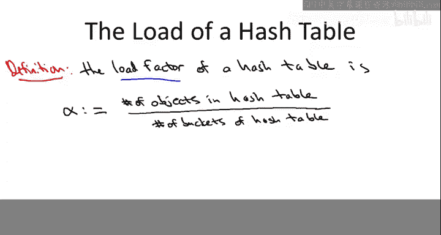
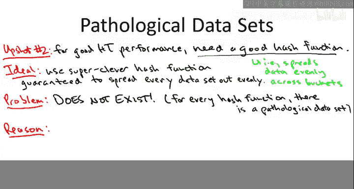
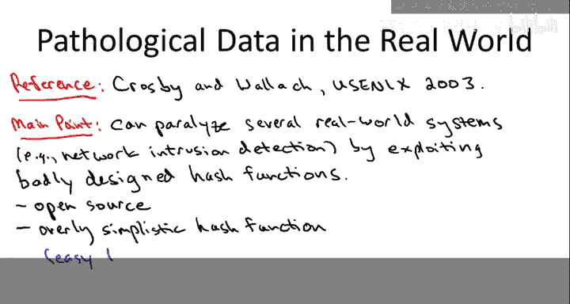
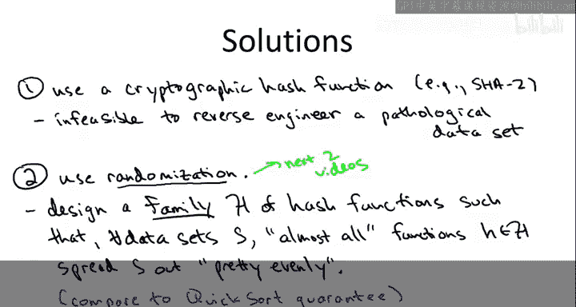
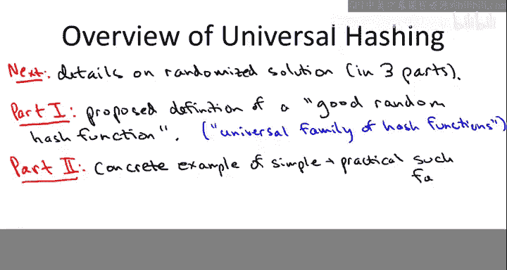

# 斯坦福大学《算法启蒙（第2册）：图算法和数据结构｜Part 2 Graph Algorithms and Data Structures》中英字幕 - P26：-26-15   1   Pathological Data Sets and Universal Hashing Motivation - GPT中英字幕课程资源 - BV1acVmzNEM8

In this sequence of videos we're going to take it to the next level with hash tables and understand more deeply the conditions under which they perform well。

 amazingly well in fact， as you know， we have constantine performance for all of their operations。

 the main point of this first video is to explain a sense in which every hash function has its own kryptonite。

 a pathological data for it， which then motivates the need to tread carefully with the mathematics in the subsequent videos。

So a quick review so remember that the whole purpose of a hash table is to enable extremely fast lookups。

 ideally constant time lookups now of course to have anything to look up you have to also allow insertions so all hash tables you're going to export those two operations and then sometimes the hash table also allows you to delete elements from it that depends a little bit on the underlying implementation so certainly when you have it implemented using chaining that's when you have one linked list per bucket it's very easy to implement deletion sometimes with open addressing it's tricky enough you're just going to wind up punting on deletion。

So when we first started talking about hash tables。

 I encourage you to think about them logically much the way you do as an array。

 except instead of being indexed just by the positions of an array。

 it's indexed by the keys that you're storing so just like an array。

 via our random of access supports constant time lookup， so does a hash table。

There was some fine print， however with hash tables， so remember there are these two caveats。

 so the first one is that the hash table better be properly implemented。

And this means a couple things so one thing it means is that the number of buckets better be commensurate with the number of things that you're storing in the hash table we'll talk more about that in a second。

 the second thing it means is you better be using a decent hash function so we discussed in a previous video the perils of bad hash functions and will be even more stringent with our demands on hash functions in the videos to come a second caveat which I'll try to demystify in a few minutes is that you better have nonpathological data so in some sense for every hash table there's cryryptonite there is a pathological data set that will render its performance to be quite poor。

So in the video on implementation details we also discussed how hash tables inevitably have to deal with collisions so you start seeing collisions way before your hash table starts filling up so you need to have some kind of method for addressing two different keys that map to exactly the same bucket which ones do you put there do you put both there or what so there's two popular approaches let me remind you what they are so first is called chaining so this is a very natural idea where you just keep all of the elements that hash to a common bucket in that bucket。

 how do you keep track of all of them where you just use a linked list so in the 17th bucket you will find all of the elements which ever hased to bucket number 17。

A second approach which also has plenty of applications in practice is open addressing here the constraint is that you're only going to store one item one key in each bucket so if two things map to bucket number 17 you got to find a separate place for one of them and so the way that you handle that is you demand from your hash function not merely one bucket but rather a whole probe sequence so sequence of buckets so that if you try to hash something in bucket 17 and 17 is already occupied。

 then you go on to the next bucket in the probe sequence you try to insert it there if they fail again you go to the third bucket in the sequence you try to insert it there and so on so we mentioned briefly the sort of two ways you can specify probe sequences。

 one is called linear probing so this is where if you fail in bucket 17 you move on to 18 and then 19 and then 20 and then 21 and you stop once you find an empty one and that's where you insert the new elements and another one is double hashing and this is where you use combination of two hash functions where the first hash function specifies the initial bucket that you probe。

And the second hash function specifies the offset for each subsequent probe， so for example。

 if you have a given element， say the name Alice and the two hash functions give you the number 17 and 23。

 then the corresponding probe sequence is going to be initially 17， failing that， you'll try 40。

 failing that you'll try 63 failing that you'll try 86 and so on。

So in a course on the design and analysis of algorithms like this one。

 you' typically talk a little bit more about chaining than you do openAdding。

 that's not to imply that chaining is somehow the more important one， both of these are important。

 but chaining is a little easier to talk about mathematically so we will talk about it a little bit more because I'll be able to give you complete proofs for chaining whereas complete proofs for open addressing would be outside the scope of this course so I'll mention it in passing but the details will be more about chaining just for mathematical ease。

So there's one very important parameter which plays a big role in governing the performance of a hash table。

 and that's known as the load factor or simply the load of a hash table。

And it's a very simple definition， it just talks about how populated a typical bucket of the hash table is。

 so it's often denoted by alpha。And in the numerator is the number of things that have been inserted and not subsequently deleted in the hash table。

Divided by the number of buckets in the hash table。So as you would expect。

 as you insert more and more things into the hash table， the load grows。

 keeping the number of items in the hash table fixed as you scale up the number of buckets。

 the load drops。So just to make sure that the notion of the load is clear and that also you're clear on the different strategies for resolving collisions。

 the next quiz will ask you about the range of relevant alphas for the chaining and open addressing implementations of the hash table。

All right， so the correct answer to this quiz question is the third answer。

That load factors bigger than one do make sense。 they may not be optimal。

 but they at least make sense for hash tables that implement with chaining。

 but they don't make sense for hash tables with open addressing and the reason is simple。

 remember an open addressing you're required to store only one object per bucket。

 So as soon as the number of objects exceeds the number of buckets。

 there's nowhere to put the remaining objects So the hash table will simply crash at load factors bigger than one on the other hand in a hash table with chaining。

 there's no obvious problem with load factors bigger than one so you can imagine a load factor equal to two say So say you insert 2000 objects into a hash table with 1000 buckets。

 you know that means hopefully at least in the best case。

 each bucket' is just going to have a linked list with two objects in it so there's no big deal with having load factors bigger than one in hash tables with chaining。

All right， so let's then make a quite easy but also very important observation about a necessary condition for hash tables to have good performance。

 and this goes into the first caveat that you better properly implement the hash table if you expect to have good performance。

So the first point is is that you're only going to have constant time lookups if you keep the load to be constant。

So for a hash table with open addressing this is really obvious because you need alpha not just o of one。

 but less than one， less than 100% full， otherwise the hash table is just going to crash because don't even have room for all of the items but even for hash tables that you implement using chaining where they at least make sense for load factors which are bigger than one you better keep the load not too much bigger than one if you want to have constant time operations so if you have say a hash table with n buckets and you hash in n log n objects then the average number of objects in a given bucket is going to be logarithmic and remember when you do a lookup after you hash the bucket you have to do an exhaustive search through the linked list in that bucket so if you have n log n objects in a hash table with n buckets you're expecting more like logarithmic lookup time。

 not constant lookup time。And then as we discussed with open addressing， of course。

 you need not just alpha equal O of1， but alpha less than1， and in fact。

 alpha better be well below one， you don't want to let an open addressing table get to a 90% load or something like that。

So I'm going to write need alpha less than less than one。

 so that just means you don't want to let the load grow too close to 100%。

 you will see performance degrade。So again， I hope the point of this slide is clear if you want good hashtable performance。

 one of the things you're responsible for is keeping the load factor under control。

 keep it at most of small constant with open address and keep it well below 100%。

So you might wonder what I mean by controlling the load after all， you writing this hash table。

 you have no idea what some clients going to do with it。

 they can insert or delete whatever they want。 So how do you control alpha Well what you can control under the hood if your hash table implementation is the number of buckets you can control the denominator of this alpha so if the numerator starts growing at some point the denominator is going grow as well So what actual implementations of hash tables do is they keep track of the population of the hash table how many objects are being stored and as this numerator grows。

 this more and more stuff gets inserted， the implementation ensures that the denominator grows at the same rate so that the number of buckets also increases So if alpha exceeds some target that could be say 75%0。

75 or maybe it's 0。5 then what you can do is you can double the number of buckets say in your hash table so you define a new hash table you have a new hash function with double the range and now having double the denominator the load has dropped by a factor two so that's how you can keep it under control Oply if space is at a real premium you can。

So shrink the hash table if there's a bunch of deletions， say in a chaining implementation。

So that's the first takeaway point about what has to be happening correctly under the hood in order to get the desired guarantees for hasht performance。

 you got to control the load so you have to have a hash table whose size is roughly the same as the number of objects that you're storing so the second thing you've got to get right and this is something we've touched on in the implementation videos is you better use a good enough hash function and so what's a good hash function it's something that spreads the data out evenly amongst the buckets。

And what would really be awesome would be a hash function which works well independent of the data。

 and that's really been the theme of this whole course so far。

 algorithmic solutions which work well independent of any domain assumptions。

 no matter what the input is， the algorithm is guaranteed to， for example。

 run blazingly fast and I can appreciate that this is exactly the sort of thing you would want to learn from a course like this take a class in the design analysis of algorithms and you learn the secret hash function which always works well。

Unfortunately， I'm not going to tell you such a hash function and the reason is not because I didn't prepare this lecture。

 the reason is not because people just haven't been clever enough to discover such a function。

 the problem is much more fundamental， the problem is that such a function cannot exist。That is。

 for every hash function it has its own kryptonite。

 there is a pathological data set under which the performance of this hash function will be as bad as the most miserable constant hash function you ever see。

And the reason is quite simple， it's really an inevitable consequence of the compression that hash functions are effectively implementing from some massive universe to some relatively modest number of buckets。

 let me elaborate。

Fix any hash function as clever as you could possibly imagine。😡。

So this hash function maps some universe to the buckets indexed from 0 to n minus1。

 remember in all of the interesting situations of hash functions， the universe size is huge。

 so the cardinality of you should be much， much bigger than n， that's what I'm going to assume here。

So for example， maybe you're remembering people's names and then the universe's strings which have。

 say at most 30 characters， and N I assure you in any application is going to be much， much。

 much smaller than say， 26 raised to the 30th power。

So now let's use a variant on the pigeonhole principle。

And I claim that at least one of these n buckets has to have at least a one over n fraction of the number of keys in this universe。

 that is there exists a bucket I somewhere between0 and n minus1， such that at least。

The cardinality of the universe over n。Keys。Hash to I get mapped to I under this hash function H。

So the way to see this is just to remember the picture of a hash function mapping in principle。

 any key from the universe， all keys from the universe to one of these buckets。

So the hash function has to put each key somewhere in one of the n buckets。

 so one of the buckets have to have at least a one over n fraction of all of the possible keys。

 one more concrete way to think of thinking about it is you might want to think about a hash table implemented with chaining and you might want to imagine just in your mind that you hash every single key into the hash table so this hash table is going to be insanely overpopulated。

 you'd never be able to store it on a computer because it will have the full cordinality of U objects in it。

 but it's got U objects it only has n buckets one of those buckets has to have at least U over n fraction of the population。

So the point here is is that no matter what the hash function is， no matter how clever you build it。

 there's going to be some bucket， say bucket number 31。

 which gets its fair share of the universe maps to it。

 so having identified this bucket bucket number 31 where it gets at least its fair share of the universe maps to it now to construct our pathological data set all we do is pick from amongst these elements that get mapped to bucket number 31。

So for such a data and we can make this data basically as large as we want because the Car out view over n is unimaginably big because U itself is unimaginably big then in this data everything collides the hash function maps every single one to bucket number 31 and that's going to lead to terrible hasht performance。

 hash table performance which is really no better than the naive linked list solution so for example in a hash table with collisions in bucket 31 you will just find a linked list of every single thing that's ever been inserted into the hash table and for open addressing maybe it's a little harder to see what's going on but again if everything collides you're going to basically wind up with linear time performance a far cry from constant time performance。

Now， for those of you to whom this seems like just sort of pointless abstract mathematics。

 I want to make two points。The first is that at the very least。

 these pathological datasets tells us indicates that we will have to discuss hash functions in a way differently than how we've been discussing algorithms so far。

 So when we talked about merge sort， we just said it runs an n log n time no matter what the input is when we discussed dirous algorithm。

 it runs an M log n time no matter what the input is depth first search breath first search linear time。

 no matter what the input is we're going to have to say something different about hash functions。

 we will not be able to say that a hash table has good performance， no matter what the input is。

 this slide shows that that's false。 the second point I want to make is that while these pathological data sets。

 of course， are not likely to arise just by random chance。

 sometimes you are concerned about somebody constructing a pathological data for your hash function for example。

 in a denial of service attack。So there's a very clever illustration of exactly this point in a research paper from 2003 by Crosby and Wallach。

So the main point of Crosbyan and Wallock was that there's a number of real world systems and maybe their most interesting application was a network intrusion detection system for which you could bring them to their knees by exploiting badly designed hash functions。

So these were all applications that made crucial use of hash tables and the feasibility of these systems really completely depended on getting constant time performance from the hash tables。

 so if you could exhibit a pathological data set for these hash tables and make the performance devolved to linear。

 devolve to that of a simple linked list solution， the systems would be broken。

 they would just crash or they'd fail to function。Now we saw in the last slide that every hash table does have its own kryptonite has a pathological data set。

 but the question is。How can you come up with such a pathological data set if you're trying to do a denial of service attack on one of these systems and so the systems that Crosby and Wallag looked at generally showed two properties。

 so first of all they were open source， you could inspect the code you can see what hash function it was that they were using and second of all。

 the hash function was often very simplistic so it was engineered for speed more than anything else and as a result it was easy to just by inspecting the code。

 reverse engineer a data set that really did break the hash table that devolved the performance to linear。

So for example， in the network intrusion detection application。

 there was some hash table that was just remembering the IP addresses of packets that were going through because it was looking for patterns of data packets which would seem to indicate some kind of intrusion。

And Krasby and Wallock just showed how sending a bunch of data packets to the system with cleverly chosen sender IPs really did just crash the system because the hashtag performance blew up to an unacceptable degree。

So how should we address this fact of life that every hash function has a pathological data set and that question is meaningful both from a practical perspective。

 so what hash function should we use if we are concerned about someone constructing pathological data sets。

 for example， to implement a denial of service attack， and secondly， mathematically。

 if we can't give the kinds of guarantees we've given so far， data independent guarantees。

 how can we mathematically say that hash functions have good performance。

So let me mention two solutions the first solution is meant more just on the practical point。

 you know what hash function should you implement if you are concerned about someone constructing pathological data sets。

 so there are these things called cryptographic hash functions for example one cryptographic hash function or really family of hash functions for different numbers of buckets is shot2。

And these are really outside the scope of this course。

 I mean you'll learn more about this in a course on cryptography。

 and obviously using these keywords you could look it up on the web and read more about it。

The one point I want to make is you know these cryptographic hash functions like shot2。

 they themselves， they do have pathological datas， they have their own version of kryptonite。

 the reason that they work well in practice is because it's infeasible to figure out what this pathological data set is so unlike the very simplistic hash functions which Crosby and Walklock found in the source code of their applications where it was easy to reverse engineer bad data sets for something like shot2 nobody knows how to reverse engineer a bad dataset for it。

And when I say in feasible， I mean it in the usual cryptographic sense。

 in a way similar to how one would say it's infeasible to break the RSA cryptoy if you implement it properly or it's infeasible to factor large numbers except in very special cases and so on。

😡，So that's all I'm going to say about cryptographic hash functions。

 I want to also mention a second solution which would be reasonable both in practice and also for which we can say a number of things mathematically about it。

 which is to use randomization。So more specifically。

 we're not going to design a single clever hash function because again。

 a single hash function we know must have a pathological data set。

 but we're going to design a very clever family of hash functions。

 and then at runtime we're going to pick one of these hash functions at random。

AndNow the kind of guarantee we're going to want and we're going to be able to prove on a family of hash functions will be very much in the spirit of Quicksort So you recall that in the quick sort algorithm。

 pretty much for any fixed pivot sequence， there is a pathological input for which Quickst will devolve to quadratic running time So our solution was randomize Quick sort which is rather than committing upfront to any particular method of choosing pivots at runtime we're going to pick pivots randomly what did we prove about Quicksort。

 we prove that for any possible input for any possible array。

 the average running time of Quicks was O of N log where the average was over the runtime random choices of Quicksortt here we're going to do the same thing we're going to now be able to say for any datas on average with respect to our runtime choice of the hash function the hash function will perform well in the sense that it will spread out the data of the data evenly so we flipped the quantifiers from the previous slide there we said if we pre commitmit to a single hash function if we fix one。

HaThen there's a data that breaks the hash function here we're flipping it。

 we're saying for each fixed data set， a random choice of a hash function is going to do well on average on that data。

 just like in Quick。This doesn't mean notice that we can't make our program open source。

 we can still publish code which says here is our family of hash functions and in the code will be make a random choice from this set of hash functions。

 but the point is by inspecting the code you'll have no idea what was the real-time random choices made by the algorithm so you'll know nothing about what the actual hash function is。

 so you won't be able to reverse engineer pathological data set for the real-time choice of a hash function。

So the next couple of videos are going to elaborate on the second solution of using a real time random choice of a hash function as a way of saying you do well on every data set。

 at least on average。

So let me just give you a roadmap of where we're going to go from here。

So I'm going to break the discussion of the details of this randomized solution into three parts spread over two videos。

So in the next video， we're going to begin with a definition of what do I mean by a family of hash functions so that if you pick one at random you're likely to do pretty well。

 so that's a definition which is called a universal family of hash functions。

Now a mathematical definition by itself is worth approximately nothing for it to be valuable。

 it has to satisfy two properties， so first of all there have to be interesting and useful examples that meet the definition so that is they better be useful looking hash functions that meet this definition of a universal family so the second thing will be to show you that they do indeed exist and then the other thing a mathematical definition needs is applications so that if you can meet the definition then good things happen so that'll be part three。

😡。

