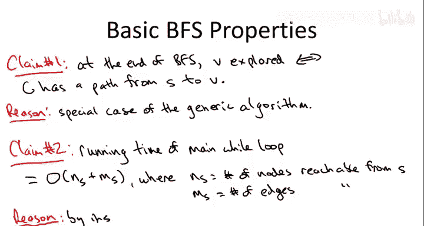

# 斯坦福大学《算法启蒙（第2册）：图算法和数据结构｜Part 2 Graph Algorithms and Data Structures》中英字幕 - P4：-04-10   2   Breadth First Search BFS  The Basics 14 min.zh_en - GPT中英字幕课程资源 - BV1acVmzNEM8

So in this lecture， we're going to drill down into our first specific search strategy for graphs and also explore some applications。

 namely Bth first search。So let me remind you the intuition and applications of breath first search。

The plan is to systematically explore the nodes of this graph beginning with the given starting vertex in layers。

So let's think about the following example graph。Where S is the starting point for our breath first search。

So the star vertex S will constitute the first layer， so we'll call that L0。

And then the neighbors of us are going to be the first layer。

 and so those are the vertices that we explore。Just after S， so those are L1。

Now the second layer is going to be the vertices that are neighboring vertices of L1 but are not themselves in L1。

 or for that matter， L0。So that's going to be C and D。That's going to be the second layer。

Now you'll notice， for example， S is itself a neighbor of these nodes in layer 1。

 but we've already counted that in the previous layer so we don't count S toward L2。

 and then finally the neighbors of L2， which are not already put in some layer is E。

 so that'll be layer 3。Again， notice C and D are neighbors of each other。

 but they've already been classified in layer  two， so that's where they belong not in layer three。

So that's the high level picture of B first search you should have。

 we'll talk about how to actually precisely implement it on the next slide again。

 just a couple of the things that you can do with Beth first search。

 which we'll explore in this video is computing shortest paths。

So it turns out shortest path distances correspond precisely to these layers， so for example。

 if you had as S， you had that as the Kevin Bacon note in the movie graph。

 then John Ham would pop up in the second layer from the B search from Kevin Bacon。

I'm also going to show you how to compute the connected components of an undirected graph that has compute its pieces。

 we'll do that in linear time and for this entire sequence of videos on graph primitiveatives we will be satisfied with nothing less than the holy grail of linear time and again remember in a graph you have two different size parameters。

 the number of edges M and the number of nodes N for these videos I'm not going to assume any relationship between M and N the one could be bigger so linear time is going to mean O of M plus N。

So let's talk about how you'd actually implement B first search in linear time。

So the silverine is given as input both a graph G I'm going explain this as if it's undirected。

 but this entire procedure will work in exactly the same way for a directed graph again。

 obviously in an undirected graph you can traverse an edge either direction for a directed graph you have to be careful only to traverse arcs in the intended direction from the tail to the head that is traverse them forward so as we discussed when we talked about just generic strategies for graph search we don't want to explore anything twice that would certainly be inefficient so we're going to keep a boolean of each node marking whether we've already explored it or not and by default we're just going to assume that nodes are unexplored。

 they're only explored if we explicitly mark them as such。

So we're going to initialize the search with the starting vertex S so we marked S as explored and then we're going to put that in what I was previously calling Coned territory。

 the node we've already started to explore so to get linear time we're going to have to manage those in slightly non-naive but pretty straightforward way namely via a queue which is a first in first out data structure that I assume you've seen if you've never seen a queue before。

 please look it up in a programming textbook or on the web。

 but basically a queue is just something where you can add stuff to the back in constant time and you can take stuff from the front in constant time。

 you can implement these for example using a doubly linkeded list。

And recall that in the general systematic approach to G search。

 the trick was to in each iteration of some while loop to add one new vertex to the Coned territory to identify one unexplored node that is now going to be explored。

So that while loop is going to translate into one in which we just check if the queue is non empty。

So we're assuming that the Q data structure supports that query in constant time。

 which is easy to implement。And if the Q is not empty， we remove a node from it and because it's a Q。

 removing nodes from the front is what you can do in Constantine。

 so call the node that you get out of the Q V。So now we're going to look at these neighbors。

 vertices with which it shares edges， and we're going to see if any of them have not already been explored。

So if W is something we haven't seen before， if it's unexplored。

 that means it's in the unconqueered territory， which is great， so we have a new victim。

 we can mark W as explored， we can put in our queue and we've advanced the frontier and now we have one more explored node than we did previously。

And again， in Q by construction， it supports adding constant time additions at the end of the Q。

 so that's where we put W。 So let's see how this code actually executes in the same graph that we were looking at in the previous slide。

And what I'm going to do is I'm going to number the nodes in the order in which they are explored。

So obviously the first node to get explored is S。 that's where the Q starts。

 So now when we follow the code。 what happens。 Well in the first iteration of the Y loop。

 we ask is the Q empty。 No it's not because S is in it。 So we remove in this case。

 the only node of Q It's S。 and then we iterate over the edges incident to S。

 Now there are two of them， there is the edge between S and a and there's the edge between S and B。

 And again， this is still a little underspecified in the sense that the algorithm doesn't tell us which of those two edges we should look at。

 turns out it doesn't matter either those is a valid execution of breathth for search。

 But for concreteness， let's suppose that of the two possible edges we look at the edge S comma A。

 So then we ask has a already been explored。 No it has't。

 This is the first time we've seen it So we say oh goody this is sort of new grist for the middle so we can add a to the Q at the end and we mark W as sorry mark a as explored。

 So a is going to be the second vertex。

That we mark。So after marking a is explored and adding it to the Q So now we go back to the for loop。

 and so now we move on to the second edge incident to S。 that's the edge between S and B。

 So we ask how we already explored Bpe this is the first time we've seen it So now we do the same thing with B。

 So B gets marked as explored， it gets added to the Q at the end So the Q at this juncture has first the record for a because that was the first one we put in it after we took S out and then B follows a in the Q。

 And again， depending on the execution this could go either way but for completeness I've done it so that a got added before B。

 So at this point this is what the Q looks like So now we go back up to the while loop we say is the Q empty certainly not it actually has two elements。

 now we remove the first node from Q in this case that's the node A that was the only put in before the node B。

 And so now we say well let's look at all of the edges incident to A and in this case A has two incident edges it has one that it shares with S and has one that it shares with C。

 And so if we look at the edge between。And S then we'd be asking in the if statement hass S already been explored Yes it has that's where we started so there's no reason to do anything with S that's already been taken out of the Q so in this for loop for a there's two iterations one involves the edge with S and that one we completely ignore but then there's the other edge that a shares with C and C we haven't seen yet so at that part of the for loop we say aha C is a new thing new node we can Mark is explored and put in the Q so that's going to be our number four。

And so now how has the Q changed， well， we got rid of A。

And so now B's in the front and we added C at the end。And so now the same thing happens。

 we go back to the wild loop， the Q is not empty， we take off the first vertex in this case that's going to be B B has three incident edges it has one incident to S。

 but that's irrelevant we've already seen S it has one incident to Cs relevant that's also irrelevant because we've already seen C true we just just saw it very recently but we've already seen it but the edge between B and D is new and so that means we can take the node D market is explored and added to the Q。

 so D is going to be the fifth one that we see。And now the Q has the element C followed by D。

 So now we go back to the Y loop and we take C off of the queue。It again has four now edges。

 the one with A is irrelevant， we've already seen A， the one with B is irrelevant。

 we've already seen B， the one with D is irrelevant， we've already seen D， but we haven't seen E yet。

 so when we get to the part of the for loop of the edge between C and E， we say aha E is new。

 so E will be the sixth and final vertex to be marked as explored。

And that will get added at the end of the queue。So then in the final two iterations of the while loop。

 the D is going to be removed， we'll iterate through its three edges。

 none of those will be relevant because we've seen all of the other three endpoints and then we'll go back to the while loop and we'll get rid of E E's are relevant because it has two edges we've already seen other endpoints and now we go back to the while loop。

 the Q is empty and we stop and that is breath first search and to see how this simulates the notion of the layers that we were discussing。

InThe previous slide notice that the nodes are numbered according to the layer that they're in。

 so S was layer0。And then the two nodes that S caused to get added to the Q， the A and the B。

Our number two and three。And the edges of layer three are precisely ones edges of layer2 are precisely the ones that got added to the Q while we were processing the nodes from layer1。

 that is C and D are precisely the nodes that got added to the Q while we were processing A and B。

So this is level zero， level1。And level 2。E is the only node that got added to the Q while we were processing level layer 2。

 the vertices C and D， So E will be。Thirdly。So in that sense。

 by using a first and first data structure， this queue。

 we do wind up kind processing the nodes according to the layers that we discussed earlier。

So the claim is that breathth first search is a good way to explore a graph in the sense that it meets the two high- levelve goals that we delineated in the previous video。

 first of all， it finds everything findable and obviously nothing else and second all it does it without redundancy。

 it does it without exploring anything twice， which is the key to its linear time implementation so a little bit more formally claim number one。

At the end of the algorithm。The vertices that we've explored are precisely the ones such that there is a path from S to that vertex。

again， this claim is equally valid whether you're running BFS in an undirected graph or directed graph。

 of course in an undirected graph， we mean an undirected path from S to V。

 whereas in a directed graph， we mean a directed path from S to V。

 that means a path where every arc in the path gets traversed in the forward direction。

So why is this true， well this is true， we basically prove this more generally for any graph search strategy of a certain form of which breathth first search is one。

If it's hard for you to see the right way to interpret breathth first search as a special case of our generic search algorithm。

 you can also just look at our proof for the generic search algorithm and copy it down for breathth first search So it's clear that you're only again the forward direction of this claim is clear if you actually find something if something's marked as explored it's only because you found a sequence of edges that led you there So the only way you mark something that is explored is if there's a path from S to V conversely to prove that anything with an S to the path from V will be found you can proceed by contradiction you can look at the part of the path from S to V that BFs does successfully explore and then you can ask why didn't it go one more hop It never would have terminated before reaching all the way to V so you can also just copy that same proof that we had for the generic search strategy in the previous video So again the upshot breath first search it finds everything you'd want to find so it only traverses path so you're not going to find anything where there isn't a path to it but it never misses out anything where there's a path。

 BfS guaranteed to find it no problem。あ？Cimear number two is that the running time is exactly what we want。

And I'm going to state it in a form that will be useful later when we talk about connected components。

So the running time of the main while loop， ignoring any kind of preprocessing or initialization is proportional to what I'm going to call NS and MS。

 which is the number of nodes that can be reached from S and the number of edges that can be reached from S。

And the reason for this claim， this just becomes clear if you inspect the code。

 which we'll do in a second。

So let's return to the code and just tally up all the work that gets done。

So I'm going to ignore this initialization， I'm just going to focus on the main while loop。

So we can summarize the total work done in this while loop as follows first we just think about the vertices So in this search we're only going to deal ever deal with the vertices that are findable from S。

 So that's ns。 And what do we do with a given node well we insert it into the Q and we delete it from the Q so we're never going to deal with a single node more than once so that's constant time overhead per vertex that we ever see so that's the proportional to the Ns part Now given an edge we might look at it twice So for an edge to Vw we might consider it once when we first look at the vertex v and we might consider it again when we look at the vertex W each time we look at an edge we do constant work so that means we're going to do constant work per edge so we look at each vertex and most once we look at each edge findable from S at most twice we do constant time constant work and when we look at something So the overall running time is going to be proportional to the number of vertices findable from S plus the number of edges findable from S。

So that's really cool。 We have a linear time implementation of a really nice graph search strategy。

 Moreoverover， we just need very basic data structures。

 A queue to make it run fast with small constants， But it gets even better。

 We can use breathth first search as a work course for some interesting applications。

 So that's what we'll talk about in the rest of this video。😊。

