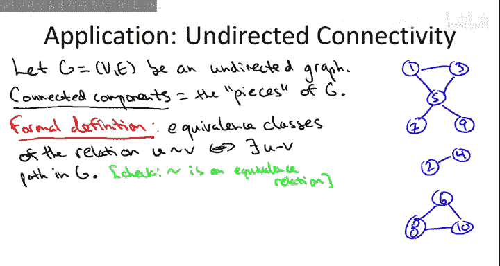

# 斯坦福大学《算法启蒙（第2册）：图算法和数据结构｜Part 2 Graph Algorithms and Data Structures》中英字幕 - P6：-06-10   4   BFS and Undirected Connectivity 13 min.zh_en - GPT中英字幕课程资源 - BV1acVmzNEM8

So what's the problem Well so I did say most of the stuff about graph search it really doesn't matter undirected or directed。

 it's pretty much cosmetic changes， but the big exception is when you're computing connectivity。

 when you're computing the pieces of a graph， so right now I'm only going to talk about undirected graphs the directed case we can again get a very efficient algorithms for it。

 but it's quite a bit harder work so that's going to be covered in detail in a separate video。

So for now， I focus just on an undirected graph G。And we're certainly not going to assume that G is connected。

 indeed， part of the point here is to figure out whether or not it's connected i。e in one piece。

 so maybe the graph looks like this。So for example。

 maybe the graph has 10 vertices and looks like this on the right。And intuitively。

 especially given that I've drawn it in such a clean way。

 it's clear that this graph has three pieces and those are the things that we want to call the connected components。

But we do want a somewhat more formal definition， something which is actually you in math that we could say is true or false about a given graph and roughly we define the connectedine components of an undirected graph as the maximal regions that are connected in the sense you can get from any vertex in the region from any other vertex in the region using a path so maximal connected regions in that sense Now the slick way to do this is using an equivalence relation and I'm going to do this here in part because it's really the right way to think about the directed graph case which we'll talk about in some detail later。

So front edge graphs。So this isn't super important。

 but let me go ahead and state the formal definition just for completeness about what is a connected component。

 what do I mean by a maximal region that's mutually connected？

So a good formal definition is as the equivalence classes。Of the relation on vertices。

 which we define by U being related to V， if and only if there's a path between U and V and the graph sheet。

So I'll leave it for you to do the simple check that this swiiggle is indeed an equivalence relation。

Let me remind you what equience relations are。 This is something you generally learn in your first class on proofs or your first class in discrete math So it's just something which may or may not be true about pairs of objects to be an equivalence relation you have to satisfy three properties So first you have to be reflexive meaning everything has to be related to itself and indeed in a graph there is a path from any node to itself。

 namely V empty path So also equivalence relations have to be symmetric。

 meaning if you and V are related and V and U are related because this is an undirected graph it's clear that this is symmetric if there's a path from U to V in the graph there's also a path from V to U so no problem there。

 Finally equivalence class has got to be transitive so that means U and V are related and so are V and W then so are U and W if you and V have a path V and W have a path then so does U and W and you can prove transitivity just by pasting the two paths together and so the upshot is when you want to say something like the maximal subset of something where everything is the same the right way to make that mathematical is using equi。

So over in this blue graph we want to say1，3，57 and9 are sort of all the same in the sense that they're mutually connected。

 and so that's exactly what this relation is making precise。

 All of five of those nodes are related to each other two and four related to each other6。

8 and 10 all pairs of them are related to each other so the so equivalence relations always have equivalence classes the maximal mutually related stuff and in this graph context that's exactly these connected components it's exactly what you want。

So what I want to show you is that you can use a bread first search wrapped in an outer four lure the vertices to compute to identify all of the kinetic components of a graph in time linear in the graph and over n plus M time Now you might be wondering you know why do you want to do that？

Well， there's a lot of reasons， so an obvious one which is relevant for physical networks is to check if a network has broken into two pieces。

So certainly if you're an internet service provider。

 you want to make sure that from any point in your network。

 you can reach any other point in the network。And that boils down to just understanding whether the graph that represents your network is a connected graph that is if it's in one piece or if it's not in one piece so obviously you can ask this same question about recreational examples。

 so if you return to the movie graph， maybe you're wondering can you get from every single actor in the IMDB database to Kevin Bacon or are there actors for which you cannot reach Kevin Bacon via a sequence of edges a sequence of movies in which two actors have both played a role so that's something that boils down to a connectivity computation？

If you have network data and you want to display it。

 you want to visualize it and show it to a group of people so that they can interpret it。

 obviously one thing you want to do is you want to know if there's multiple pieces and then you want to display the different pieces separately。

So let me mention one probably a little less obvious application of undirected connectivity。

 which is it gives a nice quick and dirty heuristic for doing clustering if you have pairwise information about objects。

 so let me be a little more concrete， supposeupp you have a set of objects that you really care about so this could be a set of documents。

 maybe web pages that you crawl something like that， it could be a set of images。

 either your own or drawn from some database or it could be for example， a set of genomes。

Suppose further that you have a pairwise function which for each pair of objects tells you whether they're very much like each other or very much different。

 And so let's suppose that if two objects are very similar to each other。

 like they're two web pages that are almost the same or they' are two genomes where you can get from one to the other with a small number of mutations。

 then they have a low score so low numbers close to zero indicate that the objects are very similar to each other。

 high numbers， let's say they could go up to even1 thousand or something。

 indicate that they're very different objects， two web pages that have nothing to do with each other。

 two genomes for totally unrelated parts or two images that seem to be of completely different people or even completely different objects。

Now here's a graph you can construct using these objects and the similarity data that you have about them。

 so you can have a graph where the nodes are the objects so for each picks for each image。

 for each document， whatever you have a single node and then for a given pair of nodes you put in an edge if and only if the two objects are very similar so for example。

 you could put in an edge between two objects， if and only if the score is at most 10 so remember the more similar two objects are the closer their scores to zero so you're going to get an edge between very similar documents。

 very similar genomes， very similar images now in this graph you've constructed。

 you can find the connected components。So each of these genetic components will be a group of objects which more or less are all very similar to each other。

 so this will be a cluster of closely related objects in your database and you can imagine a lot of reasons why given a large set of unstructured data。

 just a bunch of pictures， a bunch of documents or whatever。

 you might want to find clusters of highly related objects。

So we'll probably see more sophisticated heuristics for clustering in some SQL course。

 but already undirected connectivity gives you a super fast， linear time。

 quick and dirty heuristic for identifying clusters of similar objects。

 given pairwise data about similarity。So that's some reasons you might want to do it now let's actually talk about how to compute the connected components in linear time using just a simple for loop and breadth first search as its inner workhorse。

So here's the code to compute all the connected components of an undirected graph。So first。

 we initialize all nodes as being unexplored。I'm also going to assume that the nodes have names。

 let's say the names are from one to n so these names could just be the position in the node array that these nodes occupy so there's going to be an outer for loop which walks through the nodes in an arbitrary order。

 let's say from one to end it's outer for loop is to ensure that every single node of the graph will be inspected for sure at some point in the algorithm Now again。

 when our maxims is we should never do redundant work so before we start exploringing from some node we check if they've already been there。

And if we haven't seen eye before， then we invoked the Bth first search sub team we were talking about previously in the lecture。

In the graph G， starting from the node I。So to make sure this is clear。

 let's just run this algorithm on this blue graph to the right。So。

We start in the outer for loop and we set I equal to1 and we say have we explored node number one yet。

 and of course not we haven't explored anything yet。

 so the first thing we're going to do is we're going to invoke BFS on node number one here。

So now we start running the usual breath for search subroutine starting from this node1。

 and so we explore you know layer one here is going to be node3 and5。

 so we explore them in some order， for example， maybe node number three is what we explore second。

 then node number five is what we explore third。And then the second layer in this component is going to be the nodes 7 and 9。

 so we'll explore them in some order as well。 let's say 7 first followed by9。

 So after this BFS initiated from node number one completes， of course。

 it will have found everything that it could possibly find。

 namely the five nodes in the same connected component as node number one， and of course。

 all of the five of these nodes will be marked as explored。So now we return once that exits。

 we return to the outer four loop， we increment I， we go to I equal2 and we say。

 oh we already explored node number two No we have not and so now we invoke BFS again from node number two so that'll be the sixth node we explore there's not much to do from two all we can do is go to node number four so that's the seventh node we explore that BFS terminates finding the nodes in this connected component then we go back to the outer four loop。

 we increment I to3 we say oh we already seen node number three Yes we have we saw that in the first breathth first search so we certainly don't bother to BFS from node3。

Then we increment item 4， have we seen four， Yes we have in the second call the BFS。

 have we seen node 5， Yes we have in the first call to BFS have we seen node 6， No。

 we have not So the final limitation of breath first search begins from node number6 that's going to be the eighth node overall that we see and then we're going to see the nodes 8 and 10 in some order So for example。

 maybe we first explore node number 8 that's one of the first layer in this component and then node number 10 is the other node of the first layer in this component。

So in general， what's going on， well about what we know what will happen when wevo breath for search from a given node I。

 we're going to discover exactly the nodes in I's connected component。

 anything where there's a path from I to that node we'll find it， that's the BFS guarantee。

 that's also the definition of a connected component， all the other nodes which have a path to I。

Another thing that I hope was clear from the example but just to reiterate it is every B for search call。

 when you explore a node， you remember that through the entire for loop so when we invoke bread for search from node number one。

 we explore nodes 1，3，5，7 and9 and we keep those marked as explored for the rest of this algorithm and that's so that we don't do redundant work when we get to later stages of the for loop。

So as far as what does this algorithm accomplish， well， it certainly finds every connected component。

There is absolutely no way it can miss a node because this for loop literally walks through the nodes all of them one at a time and so you're not going to miss a node。

 moreover， we know that as soon as you've hit a ten component for the first time and you do breathth first search from that node you're going to find the whole thing that's the breadth first search guarantee。

As far as what's the running time？Well it's going to be exactly what we want。

 it's going to be linear time which again means proportional to the number of edges plus the number of vertices and again depending on the graph one of these might be bigger than the other so why is it o of n plus n well as far as the nodes we have to do this initialization there where we mark them all as unexplored so that takes' constant time per node we have just the basic overhead of a four loop so that's constant time。

Per node， and then we have this check constant time per node， so that's O of N。And then recall。

 we prove that within breathth first search， you do amount of work proportional。

 you do constant time for each node in that connected component Now each of the nodes of the graph is in exactly one of the connected components。

 so you'll do constant time for each node in the BFS in which you discover that node so that's again then over all of the connected components and as far as the edges note we don't even bother to look at edges until we're inside one of these breadth first search calls they play no role in the outer for loop or in the preprocessing and remember what we proved about an indication of breathth first search the running time you only do constant amount of work per edge in the connected component that you're exploring in the worst case you look at an edge once from either endpoint and each of that triggers a constant amount of work so when you discover and given connected component the edge work is proportional to the number of edges in that connected component each edge of the graph is is in exactly one of the connected components so over this entire for loop over all of these BFS calls for each edge of the graph you'll only be responsible for a constant amount of work of the algorithm。

So summarizing because breath for search from a given starting node does works in time proportional to the size of that component。

 piggybacking on that subroutine and looping over all of the nodes of the graph。

 we find all of the connected components in time proportional to the number of edges and nodes in the entire graph。

