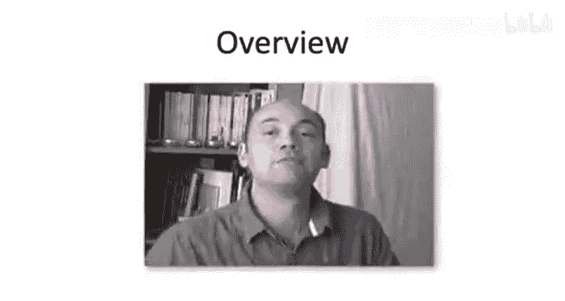
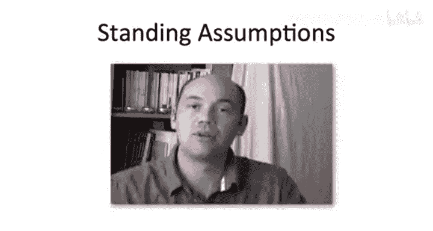
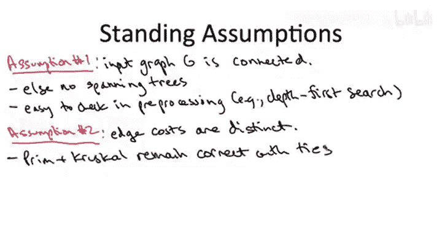

# 斯坦福大学《算法启蒙（第3册）：贪心算法和动态规划｜Part 3 Greedy Algorithms and Dynamic Programming》中英字幕 - P13：-13-PRIMS MINIMUM SPANNING TREE ALGORITHM_ MST Problem Definition.zh_en - GPT中英字幕课程资源 - BV1fNVUznEtT

So in this sequence of videos， we're going to apply the greedy algorithm design paradigm to a fundamental graph problem。

 the problem of computing minimum spanning trees。 the MST problem is a really fun playground for greedy algorithm design because it's this singular problem in which pretty much any greedy algorithm you come up with seems to work。

 So we'll talk about a couple of the famous ones show why they're correct and show how they can be implemented using suitable data structures to be blazingly fast。

So I'll give you the formal problem definition on the next slide。

 but first let me just say informally what it is we're trying to accomplish。

Essentially， what we want to do is connect a bunch of points together as cheaply as possible。

And as usual with an abstract problem， the objects could mean something very literal。

 so maybe the points we're trying to connect are servers in some computer network。

 or it could represent something more abstract， like maybe we have a model of documents like web pages。

 where we represent them as points in space， and we want to somehow connect those together。

Now the main reason I'm going spend time on the minimum spanning tree problem is pedagogical。

 it's just a great problem for sharpening your skills with greedy algorithm design and proofs of correctness it'll also give us another opportunity to see the beautiful interplay between data structures and fast implementation of graph algorithms that said the minimum spanning tree problem does have applications one very cool one is in clustering and that I'll talk about in detail in a later video it also comes up in networking so if you do a web search on spanning tree protocol you'll find some information about that。

So as I said at the beginning， the minimum spanning tree problem is remarkable in that it doesn't just admit one greedy algorithm that's correct。

 but in fact its multiple greedy algorithms that are correct We're going to talk about two of them the two most wellknown ones。

 but there are even some others， believe it or not。

So the first one we're going to discuss beginning in the next video is Prim's MST algorithm。

This dates back over 50 years to 1957， in fact， as you'll see Prim's algorithm shares a remarkable number of similarities with Dykester's shortest path algorithm。

 so you might not be surprised to know that Dykester also independently discovered this algorithm a couple years later。

But in fact， it was only noticed much later that this exact same algorithm had been first discovered over 25 years earlier by a mathematician in Yarnnic。

 for that reason you'll sometimes hear this called Yarnnic's algorithm or the Pri yaarnnic algorithm for brevity and to be consistent with some of the main textbooks in the area I'm going to just call this Prims algorithm throughout the lectures。

The other algorithm we're going to cover， which is also rightfully famous， is Kscoll's MST algorithm。

As far as I know this was indeed first discovered by Ksco。

 roughly the same time as Pri was doing his algorithm in the mid 50s。

And in what sense do I say these algorithms are blazingly fast where they run an almost linear time。

 linear in the number of edges of the graph， specifically we'll see how using appropriate data structures we'll get each of them to run in time BigO of M log n。

 where M is the number of edges in the graph and n is the number of vertices in the graph？

We'll employ data structures to speed up Prim's algorithm in exactly the same way we did for Dykester's algorithm that is we'll be using the HeAP data structure。

 one thing that's cool about Ksco's algorithm is it'll give us an opportunity to study a new data structure。

 namely the Union find data structure and that's a lot of fun to think about in its own right as you'll see。

So to put this amazing running timing perspective， I want to emphasize that not only is it awesome in the sense it's you know barely it's almost linear。

 it takes barely more time to compute the spanning tree than it does to read the input graph。

 reading the input graph alone， remember would take linear time O of M time。

 but moreover graphs can have an enormous number of different spanning trees an exponential number so somehow these algorithms are homing in really quickly on a needle in a haystack。

 there's no way they have time to look at all of the spanning trees and yet they find the one which is the best which is optimal amongst all of them。

How do these seemingly magical algorithms do it well to discuss the details。

 let's start by formalizing the minimum spanning tree or MST problem on the next slide。

So in the MST problem， this is a graph problem， so the main part of the input is a graph comprising vertices and edges。

I do want to emphasize for the MST problem we will be considering only undirected graphs。

 This is different notice than when we discussed shortest path problems in part one of the course there we worked with directed graphs。

 there is an analogous problem to the minimum spantry problem for directed graphs。

 It's often called the optimal branching problem and there are fast algorithms for it。

 but those algorithms are just slightly beyond the scope of this course so we're not going to cover we're going to discuss only undirected graphs and minimum spanning trees for them。

Now whenever you talk about graph problems you need to talk about how is the graph actually represented so that's something we discussed at length in Part1。

 if you don't remember I suggest going back and reviewing the video on graph representations for the MST problem we're going to assume that the graph is given as an adjacency list。

 that means we're given an array of vertices， an array of edges and we have pointers wiring vertices to their incident edges and wiring edges back to their two endpoints。

In addition to the graph itself， the input includes a cost for each of the edges。

 we're going to use the notation C subs thatote the cost of an edge E。

And in another contrast to our discussion of shortest path problems。

 we're actually not going to care if the edge costs are positive or negative。

 there can be any number whatsoever。

So no prizes for guessing what the output is supposed to be。

 it's right there in the problem definition， the output is supposed to be a minimum cost spanning tree of the graph。

 but let's drill down and explain exactly what we mean by that。So first of all。

 what do we mean by the cost of a tree and we're generally the cost of a subgraph as a subset of the edges。

 while we're just going to be looking at summing up the edges in the tree that we output。

Now the other question is what do I mean by a tree that spans all vertices。

 so let me tell you exactly what this means。This subgraph T should have two properties， First of all。

 there cannot be any cycles， there cannot be any loops in this tree。And by spanning all vertices。

 what I mean is that this subgraph is what's called connected。

 that is there's a path using the edges in T from any vertex of the graph to any other vertex。

 that's what it means to span all of the vertices。So for example。

 consider the following graph with four vertices and five edges。

I've labeled each of the five edges with a cost which in this case is just an integer between one and five。

 so let's look at some example subgraphs， let's start with the three edges， A B， B D and C。

This subgraph satisfies properties 1 and2。 That is， it has no cycles。 There's no loops。

 and it spans all of the vertices。 If you started any one of these four vertices。

 you can get to any of the other four vertices by using only red edges。 So in that sense。

 this red subgraph is a spanning tree。 However， it is not the minimum cost spanning tree。

 There is another spanning tree， which is even cheaper， has a smaller sum of edge costs。

 namely the edges A C， A， B and B， D。This also has no cycles。 It is also connected。

 but the sum of the edge costs is only 7 smaller than the8 of the previous spanning tree。 In fact。

 this pick subgraph is the unique minimum spanning tree of this graph。

 There is a subgraph that has three edges， which has an even smaller sum of edge costs。

 namely the triangle A， B， B D， and A D。But this light blue subgraph。

 this triangle is not a spanning tree。 In fact， it fails on both counts。

 It does obviously have a cycle。 It has a loop。 that's what it is by definition。

 It's also not connected。 So there's no way to get from C the vertex to any of the other three vertices by following only light blue edges It's disconnected And so it fails property one as well。

 So the MST problem in general， is you're given an undirect graph， like， for example。

 this four node 5 edge graph or presumably something much larger in an interesting problem。

 And you're supposed to quickly identify the minimum spanning tree like in this example。

 the pink subgraph。So what I want to do next is something you're probably quite accustomed to me doing by this point is I want to make a couple of mild simplifyiming assumptions just among friends。

 so these assumptions are not important in the sense that all of the conclusions of these lectures will remain true will remain valid even if these assumptions are violated。

 but it'll make the lectures a little bit easier， it allow us to focus on the main point to not get distracted by less relevant details。

So here are the two assumptions that we're going to make throughout all of the lectures on minimum spanning trees。

The first assumption we're going to make is that the input graph G is itself connected。

 that is G contains a path from any vertex to any other vertex。So why am I making this assumption。

 well if this assumption is violated then the problem isn't even well defined。

 if the graph isn't connected， then certainly none of its subgraphs are connected so it has no spanning trees and it's not clear what we're trying to do。

So those of you who still remember the stuff we covered in part1 in particular graph search should recognize that this condition is easy to check in a preprocessing step。

 Just run something like breath first search or depth first search。

 Remember we know how to implement those in linear time and those will in particular。

 tell you whether or not the input graph is connected。

 Now another thing you might be wondering is well， suppose it was disconnected。

 Then what should we really just sort of throw up our hands and give up you can define a version of the minimum spanning tree problem。

 more general one called minimum spanning forest where basically you want the minimum cost subgraph that spans as much stuff as possible。

 essentially it's responsible for computing a spanning tree within each of the connected components of the original graph and using the algorithms I'll show you here。

 Prims algorithm Crucle's algorithm， they're easily modified to solve the more general problem with disconnected input graphs as well。

 But again， for simplicity， among friends， let's just focus on the connected graph case it contains all of the main ideas。

Our second standing assumption throughout all of the minimum expenditure tree lectures will be that in the input graph。

 the edge costs are distinct， so you're already used to this sort of no ties kinds of assumption from our foray into scheduling algorithms and we're going to do something similar here。

 Now again， this assumption is not important in the sense that the algorithms we cover Prims algorithm crustcals algorithm。

 they remain correct， even if the input has equal cost edges irrespective of how ties are broken。

 so the algorithms are correct as widely as you would want。

That said， I'm not going to actually prove for you that they're correct with ties。

 remember in our scheduling application， it was a little bit easier to give a proof of correctness without ties。

 I gave you that。 and then optionally there was a slightly more complicated argument that handled ties。

 You can do the same thing here， but I'm just not going to give it to you。

 I'll leave that for the keen viewer to work out for themselves。

