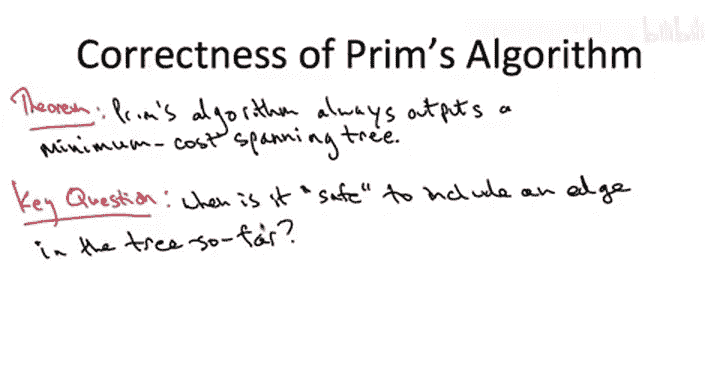
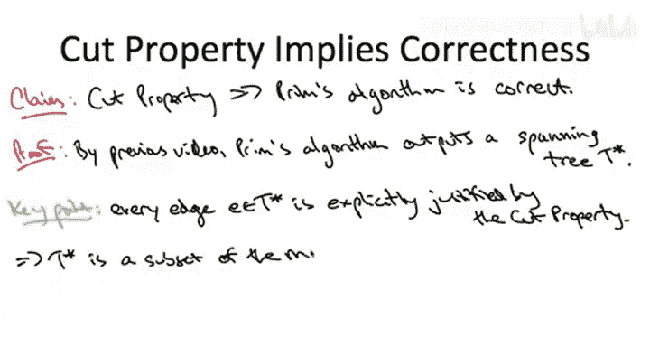

# 斯坦福大学《算法启蒙（第3册）：贪心算法和动态规划｜Part 3 Greedy Algorithms and Dynamic Programming》中英字幕 - P18：-18-_ Correctness Proof 2.zh_en - GPT中英字幕课程资源 - BV1fNVUznEtT

All right， so now that we've completed our warmup by showing that the very least Pris algorithm outputs a spanning tree。

 let's move on and actually show it outputs a minimum cost spanning tree。And to prove this theorem。

 we're going to have to tackle head on the kind of crisis which you always face when designing a greedy algorithm。

 So in a greedy algorithm， you're making an irrevocable decision， like in Prim's algorithm。

 we're including an edge in our tree and never revisiting it later。

 And how can you be sure that you're not making mistake。

 How can you have a guarantee that the decision you're making seemingly myopically right now is actually a good decision won't come back to bite you later。

So it turns out for minimum spanning trees， there's a beautiful condition which tells you when you're guaranteed to not regret including an edge in a spanning tree that guarantees when an edge has to belong to the minimum spanning tree。

 so that's called the cut property， it's the subject of the next slide。

So this is a cool enough property that we're going to bestow it not just with all caps。

 but even with a box。That's a pretty good property。So what is its states？Well。

 consider an edge of a graph， an edge that we are wondering if it's safe to include it in a tree so far。

So here's the sufficient condition guaranteeing that you won't regret including this edge in the tree so far。

 The condition is stated in terms of the cut。So suppose you can find a cut A comma B。

With the property that amongst all edges in the graph G that happen to cross this cut。

 the edge E is the cheapest edge crossing this cut。 so not only should our edge E cross this cut A B。

 but it should be the cheapest such edge。If this condition is met。

 then we definitely want to include the E E in our solution。 Indeed。

 the edge E has to be a member of any minimum spanning tree of the graph。So in this video。

 we're going to assume that the cut property is true。 It is by no means obvious。

 Defly requires a proof。 I'll give you the proof in a separate video。

 It's not it's a little bit tricky。 It's based on a subtle exchange argument for this video。

 we're going to assume that it's true。 however， and we just want to be clients of it。

 We want to figure out what it's good for。 Now， I will soon show you that it actually implies correctness of Pris algorithm。

 But just to get a few for it。 let's look at it in a much simpler graph。

 Let's just look at a four cycle，4 nodes，4 edges with edge costs 1，2，3 and 4。

 So let's look let's look at a few cuts。So let's look at the cut where on one side of the cut。

 I put the upper right vertex and on the other side of the cut， I put the other three vertices。

 so there are two edges crossing this cut， the edge that has cost one， the edge that has cost2。

 so the edge with cost one is the cheapest edge crossing this cut so by the cut property。

 the edge of cost one has to be in the MST。Okay， so we looked at one cut and both the cut property。

 It told us an edge to stick in the MST。 and that was pretty cool。 Let's look at another cut。

 Let's look at a cut where on one side， we just put the bottom right vertex。And on the other side。

 you put the other three vertices。 Now， this cut has two edges crossing it。

 the edges that have cost 2 and cost 3。 The edge of cost 2 is the cheapest edge crossing this cut。

 So by the cut property， it has to be in the MST。 So that's cool。

 So we know the twos got to be there。Now， let me point out something interesting that's happened。

 which is that it is not the case that this edge of cost2 is the cheapest crossing every single cut that it crosses。

 Remember when we look at cut number one， this edge of cost2 is actually the most expensive edge crossing that cut。

 but we found a different cut。 That is the cheapest crossing。

 and that's enough to justify the cut property。 So in other words。

 all that's important for the cut property， I just got to find you one cut for which an edge is the cheapest。

 That's enough to conclude is presence in the MST。So similarly。

 we can look at a third cut just consisting of the bottom left vertex and the other three vertices。

And it's the same story。 There are two edges crossing this cut。 The edge of cost 3。

 The edge of cost 4。 the edge of cost 3 is the cheapest edge crossing this cut。

 So we know it's got to be in the MT。 And again， if when we looked at cut number 2。

 it didn't tell us whether or not the edge of cost 3 is in the MT。

 But when we looked at cut number 3， that was enough to conclude that the edge of cost 3 has to be in the M。

 So there we go。 So we could use the cut property to construct an entire MT。On the other hand。

 there's no way to use the cut property to try to justify the edge of cost 4。

 any cut that you pick for which the edge of costt4 crosses there'll be some other cheaper edge crossing it。

 so you can never use the cut property as one would hope to justify the inclusion of the edge of cost 4 and you better not be able to because 4 is not in the MST。

Now， a quick side note， some of you might be wondering what I wrote in the conclusion of the cut property。

 I said the MST of G。 so that would seem to indicate that the minimum spanning tree is unique。

 So that deserves a quick comment So first of all， if the edge costs are not distinct if you have ties between edges。

 then you can certainly have multiple different minimum spanning trees and you have to state the cut property a little bit differently。

 But again， in the lectures we're just going to assume distinct edge costs so that's not a problem。

 And in fact， something that' will be a consequence of the next slide。

 We'll notice that the minimum spanning tree is unique with distinct edge costs。

 It's not obvious but we'll prove it shortly。

Alright， so what I want to do to finish up this video is I want to assume that the cut property is true。

 and then from that I want to derive， I want to argue that Prim's algorithm is correct。

 always outputs an MST。 The proof of the cut property is nontrivial and deserves its own video。

 which you can see separately。All right， so given the tools that we've developed。

 this argument' is actually going to be quite short。

 so let's assume that the cut property is a true statement and let's begin by building on the previous video。

 the previous video argued that Prim's algorithm outputs a spanning tree。

 didn't argue it was a minimum one， but it argued it's a spanning tree。

 it spans all the vertices and it has no cycles。Let's call the output of Prim's algorithm at the end of the algorithm T star now。

Stare at the cut property。 St at the pseudocode of Pris algorithm。

 What happens in each iteration of Pris algorithm。 Well， we have our set capital X。

 That's what we span so far is the rest of the stuff。 V minus x。 So that's a cut X V minus X。

 What does Prim choose to include next。 Well， it brute force searches through the edges that cross this cut。

 and it adds the cheapest one of them。 Well， that is right in the wheelhouse of the cut property。

 What is the cut property says it says cheapest edges crossing cuts have to be in the MT。

 So they just fits together beautifully。 Prims algorithm explicitly picks an edge at each iteration。

 which satisfies the hypothesis of the cut property， and therefore has to be in the MT。😊。

So remember the conclusion of the cut property says edges so justified must belong to the MST。

 so if everything in T star is justified by the cut property。

 then everything in T star is in the MST， so T star is a subset of the MST。

But T star， of course， as we've argued， is already a spanning tree in and of itself。

 And if you add more edges to T star， it's no longer going to be a spanning tree because you're going to pick up cycles。

 right， If you ever have something that's connected。

 there's a path from each pair of vertices and you add a new edge。 You're going to close a path。

 You're going to get a loop。 Okay so T star is already a spanning tree and you can't have anything bigger and still be a spanning tree。

So therefore this has to be the minimum spanning tree， there cannot be anything else。

So for this reason， T star must in fact be the minimum cost spanning tree of the graph since the input graph was arbitrary。

 assuming only was connected， this completes， assuming the cut property。

 the proof of correctness of Prim's minimum spanning tree algorithm。

