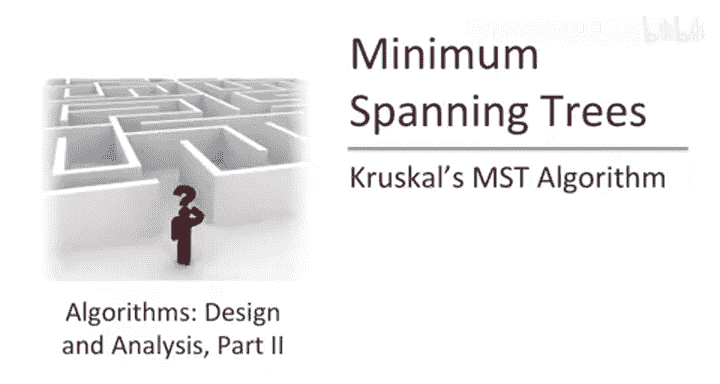
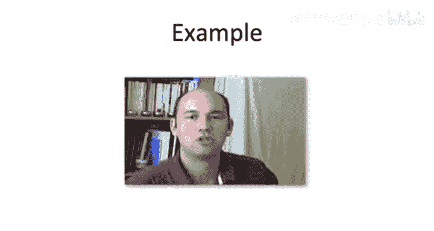
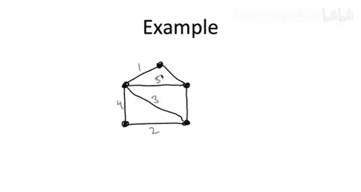
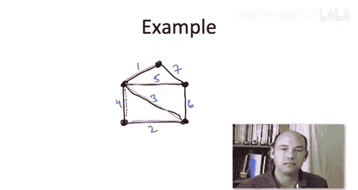
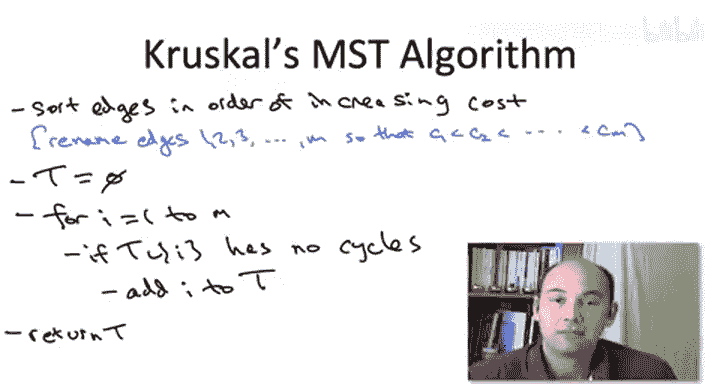
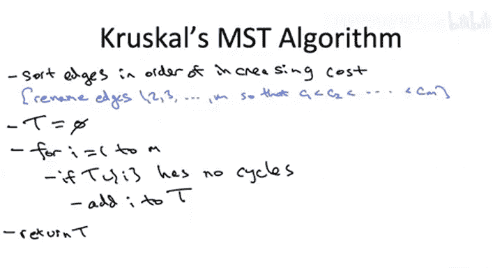

# 斯坦福大学《算法启蒙（第3册）：贪心算法和动态规划｜Part 3 Greedy Algorithms and Dynamic Programming》中英字幕 - P19：-19-_ Kruskals MST Algorithm.zh_en - GPT中英字幕课程资源 - BV1fNVUznEtT

So in these next few videos， we're going to continue our discussion of the minimum cost spanning tree problem。

 and I'm going to focus on a second good algorithm， good greedy algorithm for the problem。

 namely Cruscle's algorithm。 Now， we already have an excellent algorithm for computing the minimum cost spanning tree in Pris algorithm。

 So you might wonder why bother spending the time learning a second one。 Well。

 let me give you three reasons。 So the first reason is this is just it's a cool algorithm。

 It's definitely a candidate for the greatest hits。

 It's something I think you should know it's competitive with Pris algorithm both in theory and practice。

 So it's another great greedy solution for the minimum cost spanning tree problem。😊。

The second reason is it'll give us an opportunity to learn a new data structure when we haven't discussed yet in this course。

 it's called the Union find data structure， So in exactly the same way or in a similar way to how we used heEaps to get a superfa implementation of Primzi algorithm will use a union fine data structure to get a superfa implementation of Cruscoll's algorithm so that'll be a fun topic just in its own right The third reason is is there's some very cool connections between Crscoll's algorithm and certain types of clustering algorithms。

 so that's a nice application that'll spend some time talking about I'll discuss how natural greedy algorithms in a clustering context are best understood as variants of Cruscoll's minimum span tree algorithm。

So let me just briefly review some of the things I expect you to remember about the minimum cost spanning tree problem。

 so the input of course is an undirected graph G and each edge has a cost and what we're trying to output the responsibility of the algorithm is a spanning tree that is a subgraph which has no cycles and is connected。

 there's a path between each pair of vertices and amongst all potentially exponentially many spanning trees。

 the algorithm is supposed to output the one with the smallest cost， smallest sum of edge costs。

So let me reiterate the standing assumptions that we've got through the minimum spanning tree lectures。

 So first of all， I'm assuming the input graph is connected。

 That's obviously necessary for it to have any spanning trees。

 That said Crusco's algorithm actually extends in a really just easy。

 elegant way to the case where G is disconnected， but I'm not going to talk about that here。

 Secondly， remember we're going to assume that all of the edge costs are distinct。

 that is there are no ties。 Now， don't worry， Crusco's algorithm is just as correct。

 if there are ties amongst the edge costs。 I'm just not going to give you a proof that covers that case。

 but don't worry a proof does indeed exist。 Finally。

 of the various machinery that we developed to prove the correctness of Prims algorithm。

 Perhaps the most important and most subtle point was what's called the cut property。

 So this is a condition which guarantees you're not making a mistake in a greedy algorithm。

 It guarantees that a given edge is indeed in the minimum spanning tree。

 And remember the cut property says if you have an edge of a graph and you can find just a single cut。

For which this edge is the cheapest one crossing it okay so the E e crosses this cut and every other edge that crosses it is more expensive that certifies the presence of this edge in the minimum spanning tree it guarantees that it's a safe edge to include so we'll definitely be using that again in crosscals algorithmm when we prove it's correct。

So as with Prim's algorithm， before I hit you with the pseudocode。

 let me just show you how the algorithm works in an example。 I think you'll find it very natural。

 So let's look at the following of graph with five vertices。

So the graph has seven edges and I've annotated them with their edge costs in blue。

 So here's the big difference in philosophy between Prims algorithm and Crusco's algorithm。

 In Prims algorithm， you insisted on growing like a mold from a starting point。

 always maintaining connectivity in spanning one new vertex in each iteration。

 Cruesco' is going to just throw out the desire to have a connected subgraph at each step of the iteration。

 Cruesco's algorithm will be totally content to grow a tree in parallel with lots of simultaneous little pieces。

 only having them coalesce at the very end of the algorithm。 So in Pris algorithm。

 while we were only allowed to pick the cheapest edge subject to this constraint of spanning some new vertex and Cresco's algorithm。

 we're just going to pick the cheapest edge that we haven't looked at yet。 Now there is an issue。

 of course， we want to construct a spanning tree at the end。

 we certainly don't want to create any cycles。 So we'll skip over edges that we create cycles but other than that constraint。

 We'll just look at the cheapest edge next in Cruesco's algorithm and pick it。 if there's no cycles。

 So let's look at this five vertex example。Again， there's no starting point。

 We're just going to look at the cheapest edge overall。 So that's obviously this unit cost edge。

 And we're going to include that in our tree。 right， Why not？

 why not pick the cheapest edge as a greedy algorithm。 So what do we do next， Well。

 now we have this edge of cost2 That looks good。 So let's go ahead and pick that one cool。

Notice these two edges are totally disjoint。 Okay， so we are not maintaining a connectivity of our subgraph at each iteration of Ksco's algorithm。

 Now， it just so happens that when we look at the next edge， the edge of cost 3。

 we will fuse together the two disjoint pieces that we had previously。

 Now we happen to have one connected piece。 Now， here's where it gets interesting。

 when we look at the next edge， the edge of cost 4。

 we notice that we're not allowed to pick the edge of cost 4。 Why， well。

 that we create a triangle with the edges of across 2 and3。 and that， of course， is a no note。

 we want a span tree at the end of the day。 So we can't have any cycles。

 So we skip over the four because we have no choice。 we can't pick it。 We move on to the five。

 and the five is fine。So when we pick the edge of cost5。

 there's no cycles we go ahead and include it and now we have a spanning tree and we stop or if you prefer you could think of it that we do consider the edge of cost6 that would create a triangle with the edges of cost3 and5 so we skip the6 and then for completeness we think about considering seven but that would form a triangle with the edges of cost one and5 so we skip that so after this single scan through the edges in sorted order we find ourselves with these four pink edges in this case it's a spanning tree and as we'll see not just in this graph but in every graph it's actually the minimum cost spanning tree。

So with the intuition hopefully solidly in place， I don't think the following pseudocode will surprise you。

 We want to get away with a single scan through the edges in sorted order。

 so obviously in the preprocessing step， we want to take the unsorted array of edges and sort them by edge cost to keep the notation in the pseudocode simple。

 let me just for the purposes of the algorithm description only rename the edges1，2，3。

4 all the way up to M conforming to this sorted order right so the algorithm is just going scan through the edges in this newly found sorted order。

So we're going to call the tree in progress capital T like we did in Pris algorithm。

 and now we're just going to zip through the edges once in sorted order。

And we take an edge unless it's obviously a bad idea， and here a bad idea means it creates a cycle。

 that's a no no， but as long as there's no cycle， we go ahead and include the edge。

And that's it after you finish up the for loop， you just return the tree capital T。

It's easy to imagine various optimizations that you could do， so for example。

 once you've added enough edges to have a spanning tree。

 so n minus1 edges where n is the number of vertices。

 you can get go ahead and abort this for loop and terminate the algorithm。

 but let's just keep things simple and analyze this three line version of Crusco's algorithm in this lecture。

So just like in our discussion of Prim's algorithm。

 what I want to do is first just focus on why is Crusco's algorithm correct。

 why does it output a spanning tree at all， and then the spanning tree that it outputs why on earth should it have the minimum cost amongst all spanning trees。

 the once we're convinced of correctness we'll move on to a naive running time implementation and then finally a fast implementation using suitable data structures。

