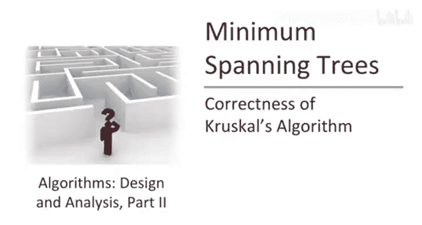
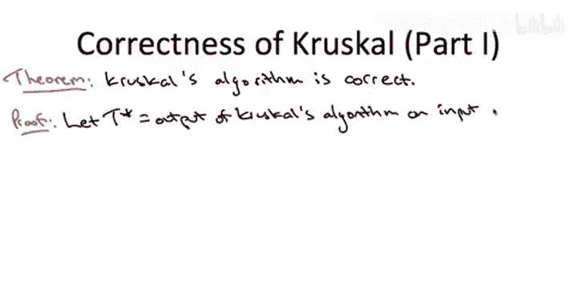
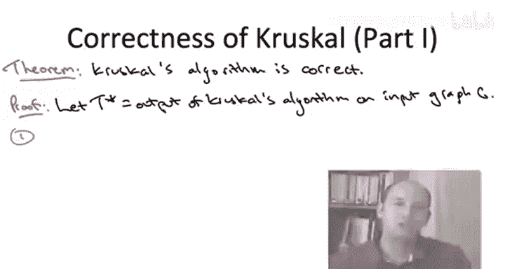
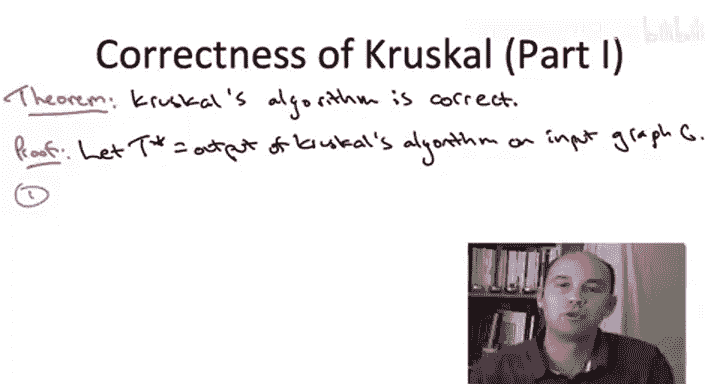
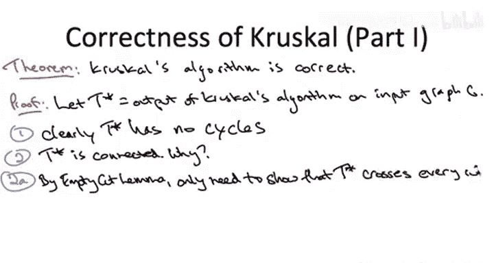
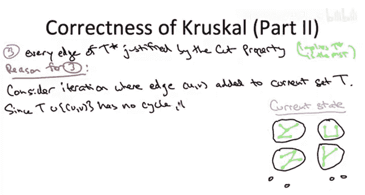

# 斯坦福大学《算法启蒙（第3册）：贪心算法和动态规划｜Part 3 Greedy Algorithms and Dynamic Programming》中英字幕 - P23：-23-_ Correctness of Kruskals Algorithm. - GPT中英字幕课程资源 - BV1fNVUznEtT

So in this algorithm， we'll prove the correctness of Crusco's minimum cost spanning tree algorithm。

So to prove this correctness theorem， let's fix an arbitrary connected input graph G。

 and let's let T star denote the output of Crusll's algorithm when we invoke it on this input graph。

So just like with our high levelve proof plan for Pris algorithm。

 we're going to proceed in three steps， we're first going to just establish the more modest goal that Cruscoll's algorithm outputs a spanning tree。

 we're not going to make any initial claims about optimality So those are the first two steps one to argue there's no cycles one to argue that the outputs connected and then in the third step relying on the cut property will say it's not just a spanning tree it's actually the minimum cost spanning tree For this proof I am' going to assume you're familiar with the machinery we developed to prove that Pris algorithm is correct。

So the first step of the prove is going to be very easy。

 so one important property of a Spanish tree is that there's no cycles and it's quite obvious looking at the pseudocode of Crusco's algorithm that it's not going to produce any cycles。

 every edge that creates a cycle is explicitly excluded from the output。

What's a little less obvious is that as long as the input graph is connected。

 then Crusco's algorithm will output a connected subgraph and therefore a spanning tree。

 So to argue the outputs connected， we're going to have two subparts of the proof。

The first thing I want you to do is recall what we call the empty cut lemma。

 so this was a way of talking about when a graph is disconnected or equivalently when a graph is connected and you'll recall that a graph is connected if and only if for every cuts。

 there's at least one crossing edge， so to prove this second step of this proof that T star is connected。

 we just have to prove that for every single cuts it has at least one edge crossing that cut。

So that's what we're going to show to get started， let's fix an arbitrary cut a comma B。

Using the assumption that the input graph is connected。

 it certainly contains at least one edge that crosses this cut。

 The question is whether or not T star contains a crossing edge。

 but certainly the original graph G contains a crossing edge。So here's the key point of the argument。

 Crusco's algorithm， by definition， it makes a single scan through all of the edges。

 that is it considers every edge of the original input graph exactly once。

 so what I want you to do is I want you to think about this cut AB which has at least one edge of G crossing and I want you to fast forwardward Cruescle's algorithm until the moment that it first considers an edge crossing this cut AB。

The key claim is that this first edge seen by Kesco's algorithm is definitely going to be included in the final output T star。

So why this true， Well， let me remind you of the lonely cut corollary。

 The lonely cut corollary says that if an edge is the sole edge crossing a cut。

 if it's lonely in a cut， then it cannot participate in any cycle right if it was in a cycle。

 that cycle would loop back around in cross the cut a second time Now what does that have to do with a picture here。

 Well， if this is the first edge that crustscocle Cs crossing this cut。

 then certainly the tree so far t star contains nothing crossing this cut it hasn't even seen anything crossing this cut yet。

 So at the moment it encounters the first edge， there's no way including that first edge will create a cycle because that first edge is going to be lonely in this cut AB So again summarizing the first edge crossing a cut is guaranteed to be chosen by Crescoll's algorithm it cannot create a cycle。

 That's why there's at least one edge of Cruescoll's output crossing this particular cut AB since AB was arbitrary。

 all edges all cuts have some edge of t star crossing them， that's why t star is connected。

So this completes the part of the proof where we argue that Crsco's algorithm outputs a spanning tree。

 now we have to move on and argue that it's actually a minimum cost spanning tree。

We're going to argue this in the same way as we did for Prims algorithm。

 we're going to argue that every edge ever selected by Krescoll's algorithm is justified by the cut property。

 satisfies the hypotheses of the cut property。

Recall from our correctness proof for Prims algorithm。

 This is enough to argue correctness that the output is a minimum cost spanning tree， right。

 it is justified by the cut properties not a mistake。

 It's got to belong to the minimum cost spanning tree。 If you have an algorithm。

 it outputs a spanning tree and it never made a mistake。

 that's got to be the minimum cost spanning tree。 And that's going to be the case for crustesco。

Now this statement was easy to prove for Prims algorithm and that's because the definition of Prims algorithm it selects edges based on being the cheapest in some cut so it's tailor made for the application of the cut property not so for Crsco's algorithm if you look at the pseudocode nowhere does the pseudocode discuss picking cheap edges across cuts so we have to show that Crusco's algorithm in effect is inadvertently at every edge picking the cheapest edge crossing some cut and we actually have to exhibit what that cut is in our proof of correctness so that's what we have to do here。

So to argue that let's just sort of freeze Cruesco's algorithm at some arbitrary iteration where it adds a new edge。

 we need to show that this edge is justified by the cut property。

 so maybe this edge has endpoints U and V and let's let capital T denote the current value of the edges selected by the algorithm so far。

So let's think about what this state of the world looks like at a sort of intermediate iteration of Crsco's algorithm。

So Crsco's algorithm maintains the invariant that there's no cycles。

 but remember it doesn't maintain any invariant of the current edges forming a connected set。

 so in general， in an intermediate iteration of crsco's algorithm you've got a bunch of pieces。

 a bunch of little mini trees floating around the graph。Connect the components， if you like。

 with respect to the current edgedge She capital T。

 and there can be some isolated vertices floating around as well。What more can we say， Well。

 if the current edge has endpoints U and V and Cruscoll is deciding to add this edge U V to the current set capital T。

 we certainly know that capital T has no path between U and V， right if it did have a path。

 then this new edge would create a cycle and Cruessco would skip the edge。

 So since it isn't skipping the edge， U and V are currently in different pieces They're in different connected components with respect to the current edge set。

Now， remember， ultimately， if we're going to apply the cut property。

 we have to somehow exhibit some cut from somewhere justifying this particular edge。

 So here is where we get the cut from。 And it's going to be a very similar argument to when we proved the empty cut lemma characterizing disconnectedness in terms of empty cuts。

 We're going to say， look， with respect to the tree edges we have so far with respect to the green edges。

 there's no path from U to V。 That means we can find a cut such that use on one side。

 theses on the other side and there's no edges crossing the cut。So here's the cool part of the proof。

 and this is also the part where we actually use the fact that crustco is a greedy algorithm that it considers the edges from cheapest to most expensive。

 notice we haven't actually used that fat up to this point and we better use that fact。

So the claim is that not only is this edge we're adding U， not only does it cross this cut A B。

 but actually it's the cheapest edge crossing the cut。

 Nothing from the original input graph G that crosses it can be cheaper。So why is that true， Well。

 let's remember how we wrapped up the previous slide when we were arguing that the output of Cressco's algorithm is connected。

 What do we argue， we said， well， fix any cut you like。

 any cut of the graph and freeze cressco's algorithm the very first time it considers some edge crossing that cut。

 We noticed that cresco's algorithm is guaranteed to include that first edge crossing the cut in its final solution。

 There's no way that that first edge considered can create a cycle with respect to the edge is already chosen。

 so it's not going to trigger the exclusion criterion in crsco's algorithm and that edge is going to get picked。

So what's the significance about being the first edge crossing a cut。

 well because of the greedy criterion， because crust will considers edges from cheapest to most expensive。

 the first edge it encounters crossing a cut is also necessarily the cheapest edge that's crossing the cut。

So here's how we weave these different strands together to complete the correctness proof。 All right。

 so let's remember where we are。 We're focusing on a single iteration of Crsco's algorithm。

 It's about to add this edge U comma V to the edges capital T that is' chosen in the past。

 We've exhibited a cut a comma B with the property that no previously chosen edges。

 no edges of capital T cross this cut edge Uv is going to be the first chosen edge crossing this cut。

 We just argued that Crsco's algorithm is guaranteed to pick the first edge crossing a cut。

 So by virtue of there not yet being any chosen edges crossing the cut A B。

 It must be the case that this current edge Uv is the first one that's ever been seen by Ksco's algorithm that crosses this cut A B。

 Now in being the first edge it's ever seen crossing this cut It must also be the cheapest edge of the input graph that crosses this cut。

 That is the hypothesis of the cut property that is why this edge U V in this current arbitrary。

Deration is justified by the cut property。