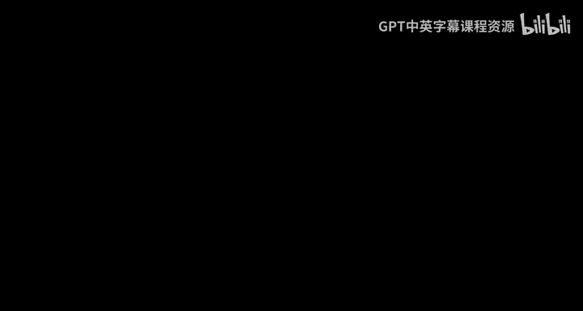
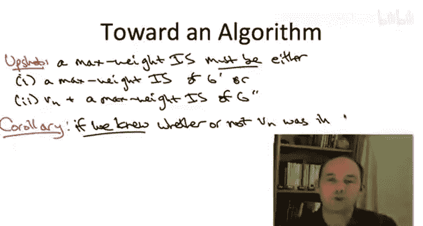

# 斯坦福大学《算法启蒙（第3册）：贪心算法和动态规划｜Part 3 Greedy Algorithms and Dynamic Programming》中英字幕 - P26：-26-WIS in Path Graphs - Optimal Substructure.zh_en - GPT中英字幕课程资源 - BV1fNVUznEtT

So having now iterated through all of our algorithm design paradigms and noticing that none of them seem to work very well for computing the maximum weight independent set of a path graph。

 we're going to develop some ideas for a new paradigm and the key approach in this new paradigm is to first reason about the structure of an optimal solution。

What I mean by this is we're going to seek out statements of the following form。

 the optimal solution， whatever it may be， has to possess a certain form。

 it has to have been built up from an optimal solution to a subprom in a prescribed way。So in fact。

 in much of our discussion of both divide and conquer and greedy algorithms。

 this kind of reasoning was implicit with dynamic programming we're going to make it systematic。

 for example， implicit in the correctness of many a divide and conquer algorithm is the fact that an optimal solution to the whole problem has to be expressible has to be constructable in a prescribed way from solutions to smaller subproblem。

So what's the motivation for doing this thought experiment trying to understand what the optimal solution could possibly look like Well the plan is we're going to narrow the possible candidates for the optimal solution down to a relatively small set of candidates with a small set we can get away with brute for search to pick the best one。

So one lesson you learn once you get good at dynamic programming is that it's not at all circular to reason about the very object that you're trying to compute remember the goal here is to devise an algorithm to compute an optimal solution and now I'm telling you to do a thought experiment as if you had already computed it as if I had handed to you on a silver platter but that kind of daydreaming can be very productive in thinking hey。

 what if I did have an optimal solution what could I say about it what would it look like Obations of that form can actually light up a trail to the computation of that exact object and we'll see that in the next couple of videos？

All right so that's enough lofty philosophy for now。

 let's get concrete okay so we've got this path graph， the vertices have weights。

 we want the max weight independence set， let's again do this thought experiment。

 What if someone handed to us what can we say about its structure We'll be using the following notation when we reason about this maximum weight independence set。

S denotes the vertices in that oimmost solution in that max weight independent set。

 and we're going to let v sub n denote the right most， the final vertex of the input graph。

So here's a content free statement， this last vertex of the path， v sub n， either it's an S。

Or it isn't。So that's going to give us two cases when we reason about the optimal solution。

 let's start with a case where VN is excluded from the optimal solution capital S。

So let's let G prime denote the path graph you get by plucking off VN。

 plucking off the rightmost vertex from the original graph G。

So let's make a couple of trivial observations to first of all， this set capital S。

 it's an independent set in G。 It doesn't include the last vertex。

 so we can regard this set S equally well as an independent set of the smaller graph G prime。

 if it didn't contain consecutive vertices in G， nor does it in G prime。But actually。

 we can say more， not only is S any old independent set in G prime， it has to be an optimal。

 that is maximum weight In set in G prime。 Why， well。

 if there was something better than S in G prime， we could take that exact same independent set S star regarded as an independent set in G。

 and of course， it would still be better than S in G。

 but that contradicts our assumption that S was a max weight independent set in G。

So summarizing if the max weight independence set S of the original path graph G does not include the rightmost vertex。

 it can be very simply described in terms of an optimal solution to a smaller subproblem。

 it literally is a max weight independent set of G prime， the path graph with one fewer vertex。

Al right， so case1 is a warm up for case2， which is similar but slightly more complicated。

 Now let's assume that the Max independence set S does in fact use the rightmost vertex VN。

Now by the definition of an independent set， no two consecutive。

 no two adjacent vertices can be chosen， so by virtue of choosing choosing v sub n。

 the right most vertex， S in this case， absolutely cannot include the penultimate vertex v sub n minus1。

So we're going to note by G double prime， the path you get from G by plucking off both of the rightmost two vertices。

So now let's do our best to mimic the argument in case1。 In case1， we said， well。

 S has to also be an independent set of G prime。 Now here that doesn't make sense。 right here。

 S contains the last vertex， so we can't talk about it even being a subset of any smaller graph。

 However， if we think about S except for the last vertex of V sub n。

 S with Vn removed is an independent set， in fact， of G double prime because remember S can't contain the second to last vertex。

And once again， just like in case1， we can say something stronger。

 S with VN removed is not any old independent set of G double prime。 it actually must be an optimal1。

 it must have maximum possible weight， The reasoning is similar。

 suppose S with VN removed was not the best possible independent set in GW prime。

 then there is something else called it S star which is even better， has even bigger weight。

How do we get a contradiction Well， if we just add VN to this even bigger independent set S star that lies in G double prime。

 we get a bona fide independent set of the entire graph G with overall weight even bigger than that of S。

 but that contradicts the optimality of S。So for example。

 you could imagine that this purported optimal solution capital S had total weight 1100 in two parts。

 It had 1000 weights coming from vertices in the G prime。

 but it also had v sub n which had weight 100 on its own and so now in the contradiction you say well suppose there was an independent set that had even more than 1000 weight just in G prime say 1050。

 Well then we just add this last vertex v sub n to that we get an independent set with weight 1150 and the original graph g but that contradicts the fact that S was supposed to be optimal with weight nearly 1100 So notice that the reason we're using the graph G double prime in this argument it's to make sure that no matter what S star is no matter what this independent set of G prime is we can just add Vn to it blitheively and not worry about feasibility so the rightmost vertex S star could possibly possess is the third to last vertex Vn minus2 So there's no worries about feasibility when we extend it by adding in the rightmost vertex v sub n。

So to make sure you don't lose the forest for the trees， let me just point。

 let me remind you what our high levelvel plan was and let me point out that we actually just executed that plan quite successfully in this problem。

 The plan was to narrow down the candidates for what the optimal solution could be to reason about the form of the optimal solution and argue that it has to look in a particular way。

 what did we just prove on the previous slide， we said that the optimal solution actually can only be one of two things either it excludes the final vertex and it is nothing more than the max weight independence set from G prime or if it includes the rightmost vertex。

 then it must be a maximum weight independence set from G double prime augmented with this last vertex v sub there's only two possibilities for what the optimal solution could possibly look like in terms of optimal solutions of smaller subproblems。

So a corollary of this is that if a little birdie told us which case we were in。

 whether or not V sub n was in the optimal solution。

 we could just complete this by recursing on the appropriate subproble if the little birdie tells us the optimal solution doesn't have VN we just recurse on G prime if the little birdie tells us V sub n is in the optimal solution we recur on G double prime and then add V sub n to the result。

Now， of course， there is no little birdie， and we have no idea whether this rightmost vertex is in the optimal solution or not。

But hey， there's only two possibilities right， here's an idea， maybe it seems crazy。

 but why not try both possibilities and just return whichever one is better？

Why do I suggest that maybe this is crazy？ Well， if you stare at this and you think about it and you think about the ramifications of trying both possibilities as you recurse down the graph。

 this may start feeling a little bit like brute force search。 And in fact， it is。

 this is just a recursive organization of a brute force search。 Nevertheless。

 as we'll see in the next video if we're smart about eliminating redundancy。

 we can actually implement this idea in a linear time。

