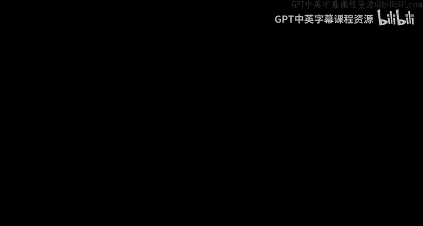
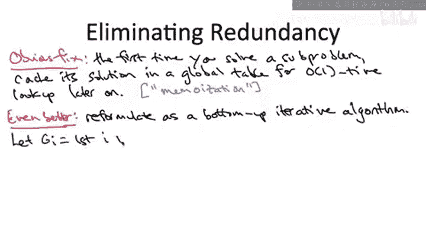

# 斯坦福大学《算法启蒙（第3册）：贪心算法和动态规划｜Part 3 Greedy Algorithms and Dynamic Programming》中英字幕 - P27：-27-WIS in Path Graphs - A Linear Time Algorithm.zh_en - GPT中英字幕课程资源 - BV1fNVUznEtT

So now that we've done some work with our thought experiment。

 understanding exactly what the optimal solution， the maximum weight independence set has to look like in a path graph。

 let's turn that work into a linear time algorithm。

Let me quickly remind you the bottom line from the previous video。

So we argued two things first of all， if the max weight independent set of a path graph happens to exclude the rightmost vertex。

 then it has to in fact be a max weight independent set of the smaller graph G prime obtained from G by plucking off the rightmost vertex。

 if on the other hand， a max weight independent set does include the rightmost vertex v sub n。

 then if you take out V sub n and look at the remaining part of the independent set。

 that has to be max weight among the smaller graph G double prime defined by plucking their two rightmost vertices off of the original graph G。

Ergo， if we happen to know if a little birdie told us which of these two cases we were in。

 we could recursively compute the optimal solution of either G prime or GW prime as appropriate and be done if we recurse on G prime。

 we just return the result， if we recurse on G double prime。

 we augment it by Vi n and return the result。Now， there is no little birdie。

 we don't know which of the two cases we're in， so we concluded the previous video by proposing just trying both cases。

 so let's write down what that proposed algorithm would look like before we take a step back and critique it。

So the good news about this algorithm is it is correct。

 it's guaranteed to return the maximum weight independence set。

So how would you prove this formally well it would be by induction in exactly the same way we proceeded with divide and conquer algorithms and for the same reason I'm not going to talk about the details here。

 if you're interested I'll leave it as an optional exercise to write this out formally。

 but intuitively the inductive hypothesis guarantees correctness of our recursive cause so computing the maximum weight solution and either G prime or G double prime and then the previous video the whole point of that in effect was arguing the correctness of our inductive step。

 given the correct solution to the subproblem， we argued what has to be the optimal way to extend it to a solution to the original graph G。

The bad news， on the other hand， is that this algorithm takes exponential time。

 it's essentially no better than brute force search。

So while the correctness of this kind of recursive algorithm follows the template of divide and conquer pretty much exactly。

 the running time has blown up to exponential and the reason for that difference is in our divide and conquer algorithms think of merge sort as a canonical example。

 we made a ton of progress before we recursed right we threw out half of the array。

 50% of the stuff before we bothered with any recursion how much progress we making in this algorithm well very little it's positive progress but very small we throw out either one or two vertices out of maybe this graph would say a million vertices before recursing so we're branching by a factor two at making very little progress before each branch。

 that's why we get this exponential running time rather than something more in the neighborhood of N log N。

So this brings us to the following question， this is an important question。

 I want you to think about it carefully before you respond。

 so we have this exponential time algorithm， it makes an exponential number of recursive calls。

 each recursive call is handed some graph for which it's responsible for computing the maximum weight independence set。

The question is this。Over all of these exponentially many different subprom。

 each of which is past some graph as a subproblem， how many distinct。

 how many fundamentally different subproble are ever considered across these exponentially many recursive calls。

So the answer to this question and the key to unlock the crazy efficiency of our dynamic programming implementation is B。

So despite the fact that there's an exponential number of recursive calls。

 we only ever solve a linear number of distinct subproble。 In fact。

 we can explicitly say what are the different subproblems that get solved throughout the recursion What happens before you recurse while you pluck vertices from the graph you were given off from the right。

 maybe you pluck off one vertex that's in the first recursive call or in the second recursive call you pluck off two vertices。

 but both from the right So an invariant maintained throughout the recursion is that the subproblem you're handed was obtained by successive plucking off of vertices from the right part of the graph from the end end of the graph So however you got to where you are。

 whatever the sequence of recursive calls led to where you are now。

 you are guaranteed to be handed a prefix of the graph the graph induced by the first I vertices or I is some number between0 and n So therefore there's only a linear number of subproms you ever have to worry about。

The prefixes of the original input graph。From this。

 we conclude that the exponential running time of the previous algorithm arises solely from the spectacular redundancy of solving exactly the same subproblem from scratch over and over and over and over again。

So this observation offers up the promise of a linear time implementation of this algorithm。

 After all， there's no need to solve a sub problem more than once。 Once you've solved it once。

 you know the answer。 So an obvious way to speed up this algorithm。

 speed it up dramatically is to simply cache the results of a subpro the first time you see it。

 Then you can look it up in some array。Constant time at any point later on in the algorithm。

So there's a word for this， I won't really use it in this class。

 but just so that you know what it is， it's called memmoization。So in case this is a little vague。

 what I mean is you would have some array， some global array indexed1 to n or maybe zero to n with the semantics that the Ih entry of this array is the value of the solution of the Ith subproblem。

 Now， when you do a recursive call and you're handed the first I vertices of the graph。 and again。

 remember， we know that the subproblem has to look like the first I vertices of the graph for some I。

 you check the array， if it's already been filled in， if you already know the answer great。

 you just return it in constant time， you don't bother to re。

 If this is the first time you've ever seen this subproblem。

 then you recur and you solve it as we saw as we suggested in the previous slot。

So with this simple memorization fixed， this axis this algorithm is linear time。

 the easiest way to see that and actually in fact a better implementation is to go away from this recursive top down paradigm and instead implement the solution in a bottom up way。

 so solving subpros in a principled way from the smallest to the original one the biggest。

So a little bit more precisely， let me use the notation G sub I to denote the subgraph of the original graph consisting of the first i vertices。

So we're again going to have an array with the same semantics system in the recursive version。

 the Ith entry denotes the solution to the Ith subprom。

 that is the max weight independent set of G subI and the plan is to populate that bottom up that is from left to right。

So we'll handle the edge cases of the first two entries of this array special。

G sub 0 would be the empty graph。 So there's no independent set。

 So let's define the max weight In set in that graph to be 0。

 And if you graph in G1 where the only vertex is V1。

 the max weight independent set is obviously that one vertex。 Remember， weights are not negative。

So our main for loop just builds up solutions to all of the subproblems in a systematic way going from the smallest graph G sub2 up to the biggest graph。

 the original and G sub n， and when we consider the graph G sub I。

 how do we figure out what the max weight independent set is of that graph。

 well now we use completely directly。The work that we put in in the previous video。

 the previous video told us what an optimal solution has to look like。

 and it has to have one of two forms。 We know we proved either the max weight independence set of g sub I excludes the last vertex v sub I and then is merely an optimal solution of the graph g sub minus1。

 If it's not that there's nothing else that can be other than including the last vertex v sub I and being an optimal max weight independence set for the graph G sub minus2。

 We know it's one of those two things。 we don't know which we do brutefor a search among the two possibilities and that gives us the optimal solution for the I subproblem crucialcily when we need to do this rootte for search for the I subproble we already know we've already computed the optimal solutions to the smaller subproblem that are relevant those can be looked up in constant time and that's what makes each iteration of this for loop run in constant time。

So we've done a fair amount of work to get to this point。

 but after seeing that the greedy algorithm design paradigm fell us。

 the D and conquer algorithm design paradigm was inadequate brute force search is too slow with this as we'll see dynamic programming algorithm we now have a one line solution effectively to the max weight independence set problem in path graphs pretty cool what's the runtime well this is probably the easiest algorithm is runtime we've ever had to analyze obviously its linear time constant time for each iteration of the for loop。

Why is the algorithm correct well it's just the same as our recursive algorithm makes exactly the same decisions。

 the only difference is it doesn't bother with the spectacular redundancy of resolving subproblems it's already solved again if you wanted to prove it from scratch it would just be a straightforward induction like in our divide and conquer algorithms。

 the recursive calls are correct by the inductive hypothesis。

 the inductive step is justified by the case analysis of the previous video。

