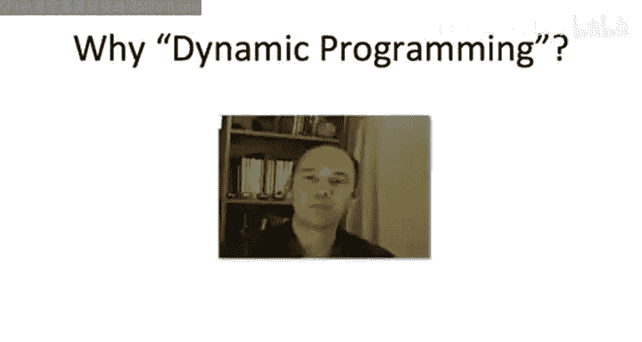

# 斯坦福大学《算法启蒙（第3册）：贪心算法和动态规划｜Part 3 Greedy Algorithms and Dynamic Programming》中英字幕 - P29：-29-Principles of Dynamic Programming.zh_en - GPT中英字幕课程资源 - BV1fNVUznEtT

Hey， so guess what we just designed our first dynamic programming algorithm。

 that linear time algorithm for computing the max weight independent set in a path graph is indeed an instantiation of the general dynamic programming paradigm。

 Now I've deferred articulating the general principles of that paradigm until now because I think they're best understood through concrete examples。

 Now that we have one to relate them to let me tell you about these guiding principles。

 We will in the coming lectures， see many more examples。

So the key that unlocks the potential of the dynamic programming paradigm for solving a problem is to identify a suitable collection of subprobles。

 and these subproblems have to satisfy a number of properties。

In our algorithm for computing MaxW independent sets and Pa graphs， we had n plus1 subproblem。

 one for each prefix of the graph， so formerly our Ith subproblem in our algorithm。

 it was to compute the MaxW independent set of G subI of the path graph consisting only of the first I vertices。

So the first property that you want your collection of sub problemsm to possess is it shouldn't be too big。

 You shouldn't have too many different sub problemsble。 The reason being is。

 in the best case scenario， you're going to be spending constant time solving each of those subproble。

 So the number of sub problems is a lower bound on the running time of your algorithm。 Now。

 in the max independence set example， we did great。 We had merely a linear number of subproble。

 and we did indeed get away with a mere constant work for each of those sub problems。

 giving us our linear running time bound overall。The second property you want。

 And this one's really the kicker is there should be a notion of smaller sub problemsble and larger sub problemsble In the context of independent sets of path graphs。

 This was really easy to understand。 The sub problemsm were prefixes of the original graph and the more vertices you had。

 the bigger the subproble。 So in general， in dynamic programming。

 you systematically solve all of the subproble。 beginning with the smallest ones and moving on to larger and larger subproble。

 And for this to work， it better be the case that at a given subproble。

 given the solutions to all of the smaller sub problemsble。

 it's easy to infer what the solution of the current sub problemble is。

 That is solutions to previous subproble are sufficient to quickly and correctly computes the solution to the current sub problemble。

The way this relationship between larger and smaller subprobles is usually expressed is via a recurrence and it states what the optimal solution to a given subproblem is as a function of the optimal solutions to smaller subproblems and this is exactly how things played out in our independent set algorithm we didn't indeed have a recurrence。

 it just said that the optimal value， the max independence set value for G sub I was the better of two candidates and we justified this using our thought experiment。

 either you just inherit the max independence set value from the preceding subproblem from the I minus-1 subproblem or you take the optimal solution from two subproblems back from G minus-2 and you extended by the current vertex v sub I that is you add the I vertices weight to the weight of the optimal solution from two subproblems back。

So this is a pattern we're going to see over and over again。

 we'll define subproblem for various computational problems and we'll use recurrence to express how the optimal solution of a given subproblem depends only on the solutions to smaller subproblems。

So just like in our In set example， once you have such a recurrence。

 it naturally leads to a table filling algorithm where each entry in your table corresponds to the optimal solution to one subproblem。

 and you use your recurrence to just fill it in moving from the smaller subproms to the larger ones。

So the third property you probably won't have to worry about much。

 usually this just takes care of itself， but needless to say。

 after you've done the work of solving all of your subproblem。

 you better be able to answer the original question。

This property is usually automatically satisfied because in most cases， not all， but in most cases。

 the original problem is simply the biggest of all of your subproble。

 Not this is exactly how things worked in independent sets。

 Our biggest subpro G sub n was just the original graph。 So once we fill up the whole table， boom。

 waiting for us in the final entry was the desired solution to the original problem。

So I realized you know this is a little abstract at the moment。

 we only have one concrete example to relate to these abstract concepts。

 I encourage you to revisit these again after we see more examples and we will see many more examples。

Something that all of the forthcoming examples should make clear is the power and flexibility of the dynamic programming paradigm。

 This is really just a technique that you have got to know。

Now when you're trying to devise your own dynamic programming algorithms。

 the key at the heart of the matter is to figure out what the right subproblems are。

 if you nail the subproblems， usually everything else falls into place in a fairly formulaic way Now if you've got a black belt and dynamic programming。

 you might be able to just stare at a problem and intuitively know what the right collection of subproblem are and then boom you're off to the races。

 but of course， for white belts in dynamic programming， there's still a lot of training to be done。

 So rather in the forthcoming examples rather than just plucking the subproblems from the sky。

 we're going to go through the same kind of process we did from independent sets and try to figure out how you would ever come up with these subproblem in the first place by reasoning about the structure of optimal solutions。

 that's a process you should be able to mimic in your own attempts at applying this paradigm to problems that come up in your own projects。

So perhaps you were hoping that once you saw the ingredients of dynamic programming。

 all would become clear why on earth it's called dynamic programming。And probably it's not。

 So this is an anachronistic use of the word programming。

 It doesn't mean coding in the way I'm sure almost all of you think of it。

 It's the same anachronism in phrases like mathematical or linear programming。

 it more refers to a planning process。 But you know for the full story。

 let's go ahead and turn to Richard Bellman himself。

 he's more or less the inventor of dynamic programming。

 you will see his Belman Ford algorithm a little bit later in the course。

 So he answers his question in his autobiography and he he talks about when he invented it in the 1950s and he says those were not good years for mathematical research。

 He was working at a place called Rand he says we had a very interesting gentleman in Washington named Wilson。

 who was the secretary of defense。 and he actually had a pathological fear and hatred of the word research。

 I'm not using the term lightly， I'm using it precisely his face would suffuse he would turn red and he would get violent if people use the term research and his presence。

You can imagine how he felt then about the term mathematical。

 So the RAand Corporation was employed by the Air Force， and the Air Force had Wilson as its boss。

 essentially， Hence， I felt I had to do something to shield Wilson and the Air Force from the fact that I was really doing mathematics inside the RAand Corporation。

 What title， What name could I choose。 In the first place I was interested in planning in decision making。

 but planning， it not a good word for various reasons。

 I decided therefore to use the word programming。Dynamic has a very interesting property as an adjective in that it's impossible to use the word dynamic in a pejorative sense。

 Try thinking of some combination that will possibly give it a pejorative meaning。 It's impossible。

 Thus， I thought dynamic programming was a good name。

 It was something not even a congressman could object to。

 So I used it as an umbrella for my activities。