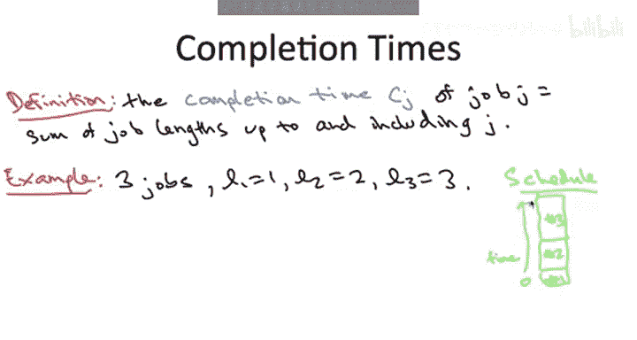
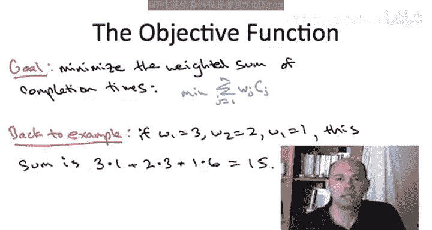

# 斯坦福大学《算法启蒙（第3册）：贪心算法和动态规划｜Part 3 Greedy Algorithms and Dynamic Programming》中英字幕 - P2：-02-A SCHEDULING APPLICATION_ Problem Definition.zh_en - GPT中英字幕课程资源 - BV1fNVUznEtT

For our next case study of how to use greedy algorithms。

 we're going to turn to the application domain of scheduling。

 that is how to use schedule jobs on shared resources in order to accomplish some objective。

 So the domain of scheduling， there's lots of different applications of greedy algorithms。

 we'll see two in this course。 We'll start for today just with the following simple scenario。

So we'll assume for today that there's just one shed resource。

 This resource could represent any number of things for concreteness。

 you can think of it as a computer processor， and then there's a lot of different things that got to get done。

 So for example， there's a lot of processes that have to be handled by this processor。

And the algorithmic question we're going to study is in what order should we sequence these jobs。

 Which one should we do first， Which one should we do second and so on all the way up to which one should we do last。

 So obviously， to answer this question， we need to pin down the mathematical model a little bit more precisely。

 And let's start with just， know， what are the characteristics of jobs。 What information do we have。

 that might lead us to prefer one job over another。 Well， for this problem。

 we're going to assume that each job comes with two known parameters。 So first of all。

 a job J has what we're going to call a weight W sub J。 That's a non negative real number。

 And you should think of the weight of a job as quantifying its importance。

 That is jobs with a higher weight in some sense， deserve to be processed earlier than those with a lower weight。

And secondly， each job J is going to come with a non-negative length L sub J Now depending on the application you may or may not have a good estimate of how long jobs are going to take。

 but for today let to keep things simple， let's assume that we know what the length of every job is and that's L sub J。

 It's part of the input to our problem So we've now defined the input to this computational problem we get n jobs each specified by a weight and a length and we know that the output is going to be a sequence of these n jobs in some order So what we have to understand now is what criterion do we want to optimize what are we trying to accomplish with this sequence to explain that I need to tell you about completion times of jobs。

So the completion time of a job is defined hopefully and exactly the way you'd think so for the job which is scheduled first it's just the length of the job because that's how long it takes to process that job for whatever job gets scheduled second。

 its completion time is the length of the first job and then the length of that job itself so in other words it's just the total time which elapses before that job gets completed Okay so in general。

 the completion time of a job is just the sum of the length of the job scheduled to before that job plus the length of that job itself to make sure this is clear let's go through a quick example。

So suppose there are three jobs with lengths 1，2 and three I'm not going to tell you the job weights because they're irrelevant for the purposes of computing the completion time and let's suppose we do the schedule where we just schedule job one first then job two then job3 so pictorially I'm going to represent that schedule just by stacking the jobs on top of each other with the interpretation that time starts at the bottom so time zero is where we schedule job one and then time increases as we go from the bottom to the top of the diagram and the question then is what are the completion times of these three jobs。

Okay， so the correct answer is answer C。So for the first job， it gets scheduled first。

 so it's very happy and it just takes one unit of time to complete。 So it's completion time is one。

 The second job， well it has to wait for the first job to complete。

 So one unit of time elapses and then it itself has to complete So that's two more units so that gives it a completion time of three for the third job。

 it has to wait for the first two to complete so that adds three to the clock and then plus it takes three units of time for a total of six。

 So that's the definition of job completion times in some sense we obviously want completion times to be as small as possible but it's not so simple in any given schedule。

 the jobs that are early on are going to have small completion times and the jobs toward the end are going to have big completion times。

 So inevitably we're going to be trading off the completion times between different jobs。

 What is the optimal way to do that Well that depends on our objective function and in scheduling there's a many different objective functions you might want to use today I'm just going to tell you about one it's not the only natural objective function but it's one of several most natural objective functions。

 It's called minimizing the weighted sum of completion times。

You translate this English phrase into mathematics in the obvious way。

 what you want to do is you want to minimize the sum over all in jobs of their completion time。

 but then multiplied by their weight WJ with the sum over J of WJ times CJ WJ is the weight and CJ is the completion time as defined on the previous slide if you think about it for a second。

 you'll realize this is equivalent to minimizing the weighted average of the completion times with the weights given as in the input。

 So just to make sure this makes sense， let's go back to the example that we saw In that example we had jobs with length to 1。

2 and3 and we thought about the schedule where we schedule them in that order to evaluate this objective function I have to tell you their weights。

 So let's suppose their weights are 3，2 and1 respectively in this case。

 the weight is sum of completion times in the schedule in the previous slide， well。

 first we begin with the first job which has weight 3 itss completion time remember was one。

 then we have the second job with weight 2， itss completion time。Three。

 then we have the third job with weight one， its completion time was6。

 so we sum up the weighted completion times and we get a total of 15 and I'll let you verify that in fact of all of the three factorial or six schedules in that example this is in fact the schedule that minimizes the weighted sum of completion times and the algorithmic question we're going to study next is how do we do this in general。

 given arbitrary input in jobs， weights and lengths。

 what is the sequence that minimizes the sum over all in factorial sequences you might consider。

