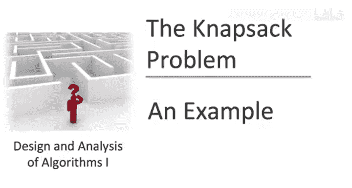
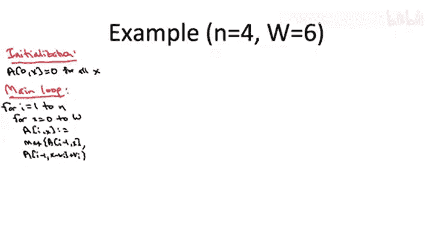

# 斯坦福大学《算法启蒙（第3册）：贪心算法和动态规划｜Part 3 Greedy Algorithms and Dynamic Programming》中英字幕 - P32：-32-THE KNAPSACK PROBLEM_ Example.zh_en - GPT中英字幕课程资源 - BV1fNVUznEtT

We've now got two dynamic programming algorithms under our belt。

 we know how to compute weighted independent sets in path graphs。

 we also know a dynamic programming solution to the famous NApsack problem。

 but before we proceed to still more useful and famous dynamic programming algorithms。

 let's pause for a sanity check， let's go through a worked example for that dynamic programming algorithm for NApsAC just to make sure that everything is crystal clear。

So for reference let me just rewrite the key point to the K NApsack algorithm。

 so first we have a  2D array A and for initialization just whenever I equals0 that is you can't use any items at all。

 of course the optimal solution value is zero and then I'm just going to rewrite the same recurrence that we had in the previous couple of videos。

So you'll recall that in the main loop， when you're considering a given item A and a residual NApsack capacity X。

 you take the better of two solutions， either you inherit the solution on minus1 and the same residual capacity x that corresponds to not taking item I。

 or if you do take item I， you get a credit of v sub by， the value for that item。

 but the residual capacity drops from x to x minus the weight of item I。

 and you look up the optimal solution for that smaller subpro。

So for our concrete example， let's just look at a case with four items。

 an initial NApsack capacity capital W equal to6， and the values and weights of the four items as follows。

So I'm going to describe the most straightforward implementation of the dynamic programming algorithm for NASack we're literally just going to explicitly form the 2D array A one index for I will range between0 and n。

 the other index for X will range between zero and capital W the original capacity there's certainly a lot of optimizations。

 you can apply when filling in these tables， in fact。

 the future programming assignment will ask you to consider some。

 but just to make sure the basic algorithm is totally clear let's just stick with a naive implementation for now。

So we begin with the initialization and setting a0 x to equal to zero for all x just means we take the leftmost column corresponding to I equals zero and we fill that in entirely with zeros now in a real implementation there's no reason to explicitly store these zeros。

 you know they're there， but again to keep the picture clear let's just fill in the zeros in the left column。

Now， we proceed to the main while loop and recall the outer for loop just increments the index I for the item that we're considering。

 So the outer for loop is considering each of the columns in turn from left to right。 Now。

 for a fixed value of I for a fixed column in the inner for loop。

 we consider all values of x from 0 to capital W。 So that just corresponds in a given column。

 we're going to fill in the entries from bottom to top。

 So we begin this double for loop with the second column I equal 1 and at the bottom x equals 0。Now。

 in general， when we fill in one of these table entries。

 we're going to take the better of two solutions， Either we just inherit the solution from the column to the left in the same row。

 This corresponds to skipping item I or we add the value of the current item to the optimal solution that we extract from the column1 to the left but also w sub I rows down So that corresponds to reducing the residual capacity by w sub I Now for the early subproblems in a column where you have essentially zero residual capacity。

 it's kind of degenerate So if your residual capacity X is actually less than the weight of the current item you're considering w sub I。

 you have no choice but to inherit the previous solution。

 you're actually not allowed to pack the current item I So concretely in this example in the first column notice the weight of the first item is4。

 So that means if x equals0 or1 or two or3 we're actually not permitted to choose item1 we don't have enough residual capacity So in the first bottommost four rows for I equals 0 to 3。

Forced to inherit the solution from the column to the left。

 so that is the first four zeros from the left column get copied over to column with i equals 1。

Now in this outereration in the first outer iteration of the for loop， once x reaches4。

 now there's actually an interesting decision to make。

 we have the option of inheriting the zero immediately to the left or we can take item1。

 therefore getting a value of 3 and then we inherit the solution from a00 and now a00 has a0 but we're obviously happy to get this value of 3 so that's going to determine the max we're going to accept v sub I plus a of 0 comma 0 and that gives us a3 in this next table entry。

By the same reasoning we're going to fill in the uppermost rows of column1 with these threes where we certainly would prefer just taking the item1。

 which we're now allowed to do， we have enough residual capacity as opposed to just inheriting the zero from the column one to the left。

So that's how we fill in the column with I equal1 moving on to I equal 2 again。

 so here notice that item  two has a weight of three。 So again。

 the bottommost three rows when x equals0 or1 or2， there's nothing we can do。

 We don't have the option of picking item number two。

 we don't have enough residual capacity so we just copy the values from column i equal1 over those happen to be zeros so that gives us three zeros to start column2。

Now when I equals 2 and x equals 3， now we have enough residual capacity to take item 2。

 and we're certainly much happier to take the value of two。

 which is the value of item number two as opposed to inheriting the01 column to the left。

 so that gives us a2 in the column I equals 2 with the residual capacity x equal to 3。

So perhaps the first truly interesting table entry to fill in is when I equals to an x equals4 because in this case。

 we actually have two different nontrivial solutions we have to pick from。 So one solution， as usual。

 we can just copy over the number， which is one column to the left。 But actually in this case。

 there's a three。 There's no longer a0 to the left。

 There's a3 to the left right A 1 comma 4 is equal to3。

 Our other option is to take the second item getting us the value of2 and add that to whatever is in the leftmost column。

 but shift it down by3 because3 is the weight of the second item。

 And you'll note that a of one comma 1 is 0。 So picking the current item would just give us two plus 0 equals 0。

 we'd prefer to just inherit the three from the column one to the left。

 That is we'd prefer to skip item2 so that we get the value from item 1 instead。

The upper two rows of the second of the column with I equals 2 are filled in with threes for exactly the same reason。

 So for example， in the top row， what are our options。

 where we can inherit the three that's one to the left。

 if we actually use item number two that knocks our residual capacity down to3 and a of1 comma 3 equals 0。

 So again， we'd rather have the three than the two。

Moving on to the penultimate column when I equals3 for the usual reasons we have to fill in the two bottommost rows with a0。

 notice that the weight of the third item equals 2。

 so we need a residual capacity x equal to2 before we can actually use it Now when x equals 2。

 we'd much rather have the value of4 for the current item than the copy of the zero over so we're going to fill in the entry a of3 comma 2 with 4。

 the value of the third item。

Similar reasons apply when x equals 3 or 4。 So here， the alternative starts looking better。

 right So in the in the row where x equals 3， the value that we'd inherit would be 2 and the row where x equals 4。

 the value we'd inherit would be 3。 But in both of those cases。

 we'd prefer to have the immediate gratification of a value of 4 from the third item and just inherit the empty solution with a residual capacity。

 So when x equals 3 and x equals 4。 we're just going to take the third item and get a value of4。

Now good things really start happening once x equals5 because at that point we can both grab the third item and get its value of4。

 but now we knock down the residual capacity only to 5 minus2 which equals3 and when you have I equal 2 and x equal 3。

 you actually get2 a value of2 in that case。 So we're going to fill in the entry for I equals 3 and x equal 5 with4。

 the value of the current item plus2 the optimal solution to the corresponding subprom。

It gets even better when x equals 6， we're again going to take the third item， get its value of 4。

 but now in the smaller subproblem when I equals 3 and x equals4， we actually get a value of 3。

 so the value here is going to be 4 plus3 or7。Moving to the last column when I equals4 so here the fourth item has weight3。

 so that means when x equals0 or1 or two， we don't even have the option of picking it。

 we have no choice but the copy over the number from the column to the left。

 so that's going to give us a0 and a0 and a4 for the first three rows of the final column So now in column3 we do have the option of picking the fourth item thatll give us a value of4。

 we also have the option of just copying over the value and the column to the left that'll also give us a4 so we have a tie and in some sense it doesn't matter。

 So we're going to fill in the entry with a four when I equals 4 and x equals3。

The exact same reasoning applies when x equals4， we're making the comparison between two things that have equal value both equal to4。

Now when x equals5， we let the good times roll， we both can take the fourth item and we get a value of4 for the five fourth item。

 but now when we subtract out its weight， we get a residual capacity of 2 and when x equals 2 and I equals 3。

 we also get a value of4 so in this century we're going to write 4 plus 4 or8。

And that's superior to the alternative， which is just inheriting the six from the column to the left same story holds when x equals to6。

 we can take the fourth item， get the immediate gratification of four。

 get four from the smaller subproblem when I equals 3 and x equals three and that eight beats out the alternative inheriting the seven from the column to the left。

So that completes the forward path of the dynamic programming algorithm filling in the table systematically using our recurrence。

 when it completes， of course the optimal solution value is in the upper right corner。

 it's the value of the biggest subproblem， so we know at this point that the max value of any feasible solution to this Napsack instance is8。

And as we've discussed after you've filled in the table in the forward pass。

 if you want to get your grubby little hands on the optimal solution itself。

 you can do that with a reverse pass。 There's a reconstruction postproces step。

 How does that work Well you start with the biggest subproblem in this case when I equals 4 and x equals 6 and then you ask by which branch of the recurrence did we fill in this table entry。

 and that gives us guidance over whether to pick this item or not？ So how did we get this8。

 did we inherit it from the column one to the left corresponding to not taking item 4 or did we get it from the column to the left and the subproblem with decrease with residual capacity decreased by the weight of item 4 corresponding to taking item 4 Well。

 if you look at it， we didn't just inherit the solution one column to the left this does indeed correspond to taking item 4 that was the better of the two options we used to fill in this table entry So that means that in the optimal solution item 4 will be there。

So having figured that out， we traced back through the table， we say， okay。

 well let's look then at the table entry that we used to build up to this optimal solution to the big problem。

 so that corresponds to going one column to the left and number of columns down equal to the weights of this fourth item that is three rows down。

Now we ask exactly the same question， did we inherit the solution from the previous column corresponding to picking this item or did we use this item and build from a solution to a smaller subproblem from the previous column Well again。

 you know where did this four come from it didn't come from immediately to the left it came from the value of item three plus the optimal solution with a decreased residual capacity and so that means that the optimal solution also includes item number three。

So what do we do then， we trace back， we go one column to the left and we have to go now two rows down。

 two rows because the weight of the third item is two。

So that leads us to a of two comma1 and at this point the residual capacity is so small that we have no choice but to inherit the numbers from the left so we're not going to be able to pack either item1 or item two into the optimal solution So at this point we just go left during our trace back and then when we get to I equal0 we're done we know we've constructed the optimal solution。

 which in this case is item number three and item number four that's how you get an optimal value of8 in this particular NApsack instance。

