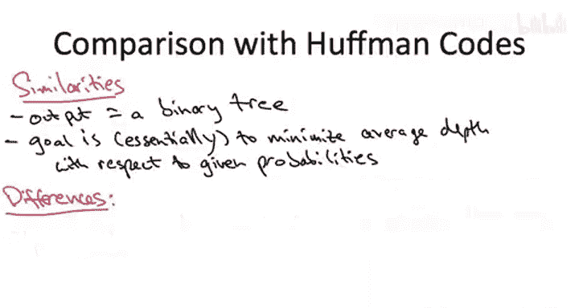

# 斯坦福大学《算法启蒙（第3册）：贪心算法和动态规划｜Part 3 Greedy Algorithms and Dynamic Programming》中英字幕 - P35：-35-OPTIMAL BINARY SEARCH TREES_ Problem Definition.zh_en - GPT中英字幕课程资源 - BV1fNVUznEtT

In this next sequence of videos， we're going to study a slightly more intricate application of the dynamic programming paradigm。

 namely to the problem of computing optimal search trees。

 search trees that minimize the average search time with respect to a given set of probabilities over the keys。

So I'm going to assume in these videos that you remember the basics of the search tree data structure so if you need to jog your memory you might want to review the relevant video from part1 so search trees that contain objects。

 each object has a key drawn from some totally ordered set and the search tree property states that at each node of a search tree say it contains some object with a key with value X it better be the case that everything in the left subtree of that node has keys less than x and everything in the right subtree under the node with key X has to have keys bigger than X that has to be true simultaneously at every single node of a search tree。

The motivation for the search tree property is so that searching in a search tree just involves following your nose。

 just like binary search in a sorted array， so if you're looking for say an object with key17。

 you know whether to go left or right from the root is based on the root's key value if the root has key value 12。

 you know a 17 if it exists has to be in the right subt so you recursively search the right subtree。

 if the root has value 23， you know a 17 has to be in the left subte so that's where you recursively search。

Something we originally discussed in the context of balanced binary search trees like red black trees。

 And I'm going to reiterate now is that for a given set of keys， there are many。

 many valid search trees containing those keys。 So just to remind you how this works。

 let's even just suppose there were only three keys in the world， X。

 Y and Z with X less than Y less than Z。One obvious search tree would be the balanced one so that would put the middle element Y at the root。

 it would have left childil X and right childil Y， but there's also the two chain search trees containing these three keys。

 one with the smallest element X at the root， the other with the largest element Z at the root。

So given the multiplicity of solutions， all of the different search trees one could use to store objects with a bunch of keys。

 an obvious question is which one is the best， what's the best search tree to use out of all of the possibilities？

So don't b you if you've got a sense of deja vu， we did already ask and answer this question in one sense when we discussed red black trees。

 there we argued that the best thing to have is a balanced binary search tree that keeps the height as small as possible and therefore the worst case search time。

 which is proportional to the height， as small as possible。

 namely logarithmic in the number of objects in the search tree。

But now let's make the same kind of assumption that we made when we discussed Huffman codes， that is。

 let's assume that we actually have accurate statistics about how frequently each item in the tree is going to be searched for。

 so maybe we know that item X is going to be searched for 80% of the time whereas Y and Z will only be searched for 10% each could we then improve upon the perfectly balanced search tree solution。

So let me make this question more concrete just by asking you to compare two candidate solutions。

 on the one hand， the balance tree， which has y at the root， and x and z is children。

 on the other hand of the chain， which has x is a root。

 y is its right child and then z is the right child of Z。

Excuse me Z is the right style of Y so what is the average search time in each of these two search trees with respect to the search frequencies as I told you。

 80% for x 10% for y and 10% for Z and when I say the search time for a node I just mean how many nodes do you look at on route to discovering what you're looking for including that last node itself so the search time for something that's at the root for example。

 that would be a search time of just one because you only look at the root to find it。

AllSo the correct answer to this quiz is the fourth option 1。9 and 1。3。

 so to see why let's just compute the average search time in each of the two proposed search trees in the first one with y at the root well 80% of the time we're going to suffer a search time of 2 whenever we look for x we have to look at the root Y then we look at the x so we pay2。

 80% of the time that contributes 1。6， 10% of the time we get lucky we see a y that contributes a 0。

1， 10% of the time we see a Z that contributes another 0。2 for a total of 1。9。By contrast。

 think about the chain that has X at the root here。

 80% of the time we get lucky and we only have to pay one to for every search for x。

 so that contributes only 0。8 to the total。 It is true our worst case search time has actually gone up when we see a Z。

 we suffer a search time of  three which never ever happened in the balance case。

 but we pay that three， only 10% of the time that contributes a 0。3。

 the remaining 10% of the time we suffer a search time of 2 to live for y so that gives us a total of 1。

3。And the moral of the story， of course， is that this example exposes an interesting algorithmic opportunity。

 so the obvious quote unquote solution of a perfectly balanced search tree need not be the best search tree when frequency of access is nonuniform you might want to have unbalanced trees like this chain。

 if it gets extremely frequent searches closer to the roots to have smaller search time。

 So the obvious question is then given a bunch of items and known frequencies of access。

 what is the optimal search tree， which search tree minimizes the average search time。

So that brings us to the formal problem definition。

 we're told n objects that we got to store in a search tree and we're told the frequency of access of each。

 so let's just keep things simple and the notation straightforward。

 let's just say the items are named from one to all the way up to n and that is also the order of their respective keys。

 so P1 is the frequency of searching for the item with the smallest key and so on。

You might wonder where these frequencies come from。

 How would you know exactly how frequently every possible key will be searched for。

 It's going to depend on the application。 and you know there will be applications where you're not going to have these kinds of statistics。

 and that's where you'd probably want to turn to a general purpose balanced binary search tree solutions。

 something like a red black tree， which guarantees you that every search is going to be reasonably fast。

 but it's not hard to think about applications where you are going to be able to learn pretty accurate statistics about how frequently different things are searched for。

 One example might be something like a spell checker。

 So if you implement that by storing all of the legally spelled words in a search tree and as you're scanning a document and every time you hit a word you look it up in the search tree to see it's correctly spelled or incorrectly spelled。

 you can imagine that after scanning through a number of documents。

 you would have pretty good estimates about how frequently different things get searched for and then you could use those estimates to build a highly optimized binary search tree for all future documents。

 if you're in some other kind of application where you're concerned about these frequencies changing over time。

 So for example， if they're privy to trends in the industry， you can imagine rebuild。

The search tree every day or every week or whatever， based on the latest statistics that you've got。

In any case， if you're lucky enough to have such statistics。

 what you're going to want to do is build the search tree。

 which on the one hand is valid to satisfy the search tree property and on the other hand should make the average search time as small as possible。

Let me go ahead and write down a formula for the average search time。

 It's the one that you would expect it to be and also introduce some notation。

 namely capital C of T we' denote the average search time of a proposed search tree T。

 So for these lectures we're going to focus on the case where all searches are successful。

 the only thing that ever gets searched for is stuff that's actually in the tree。

 but everything we'll talk about in these lectures in the algorithm is easily extended to accommodate the case where you also have unsuccessful searches and statistics about how frequent the various unsuccessful searches are but if there's only successful searches。

 then we average only over the n elements that are stored in the tree So a sum over each of the items I we weight it by the probability or the frequency of its access piece sub I and then that gets multiplied by the search time required in the tree T to find the item I。

And as we discussed in the quiz， the search time for a given key I and a given tree T is just the number of nodes that you have to visit until you get to the one containing I。

 So if you think about it， that's exactly the depth of this node in the tree plus one。

 So for example， if you're lucky enough that the key is at the root。

 the depth of the root is0 and we're counting that is a search time of1。 So it's the depth plus one。

So one minor point， it's going to be convenient for me to not insist that the PI sum to one。

 of course that the PIs were probabilities they would sum to one。

 but I'm going to go ahead and allow them to be arbitrary positive numbers。

 and that for the same reason I'm going to sometimes call capital CFT the weighted search time rather than the average search time because I won't necessarily be assuming that the PIs sum to one。

 but that said， go ahead and think of that as the canonical special case in your mind as we go through these lectures。

😡，So for example， in the case where these are probabilities where the PI suma 1， we could always。

 as a reference point， use a red black tree as our search tree。But as we've seen。

 when these PIs are not uniform， you can generally do better。

 and so that's the point of this computational problem。

 exploit the non uniformities and the given probabilities to come up with the best possibly unbalanced search tree as possible。

So I'm sure many of you will have noticed some of the similarities between this computational problem of optimal binary search trees and one that we already solved back in the greedy algorithm section。

 namely Huffman codes， which amongst all prefixfr binary codes minimize the average encoding length。

 so let's just be precise about the similarities and differences between the two problems and in particular why we can't just reuse the algorithm we already saw off the shelf to solve the optimal BST problem。

So what's of course super similar in the two cases is the format of the output in both problems。

 the responsibility of the algorithm is to output a binary tree。

 and the goal is to minimize the average depth more or less。

 where the average is with respect to provided frequencies over a bunch of objects that we care about characters from an alphabet in the case of Hpman codes and a bunch of objects with keys from some totally ordered set in the binary search tree case。

And it is true that in the optimal BST case， we're not really averaging depths。

 we're averaging depths plus one， but if you think about it， that's exactly the same thing。

More important is to understand the differences between the problem solved by Huffman codes and the computational problem that we have to solve here。

In the Huckman code case， we had to output a binary code and the key constraint was that it be prefix free。

 and in the language of trees， what that meant is that the symbols that were encoding had to correspond to the leaves of the tree。

 symbols could not correspond to internal nodes of the tree that we output。

Now in the optimal binary search tree problem， we do not have this prefixfr constraint。

 so we're going to have a label that is an object at every single node of our tree。

 whether it's a leaf or not， but we have a different。

 seemingly quite a bit harder constraint to deal with namely the search tree property。

 So remember back in the Huffman code case， we didn't even have an ordering on the symbols of the alphabet。

 there wasn't a sense that one of them was less than another。

 it wouldn't have even made sense to talk about the search tree property in that context here by contrast。

 we're given these keys and there's just totally ordering on them and we better satisfy the search tree property in the tree that we output。

 that is that every single node in the tree that we output。

 it better be the case that all keys in the left subtree are less than the key at that node and all keys in the right subt are bigger than the key at that node。

 That's a constraint that we have no choice to satisfy。

This constraint is harder in the sense that no greedity algorithm。

 Huffman's algorithm or otherwise solves the optimal binary search tree problem。

 rather we're going to have to turn to the more sophisticated tool of dynamic programming to design an efficient algorithm for computing optimal binary search trees。

 that's the solution we'll start developing in the next video。

