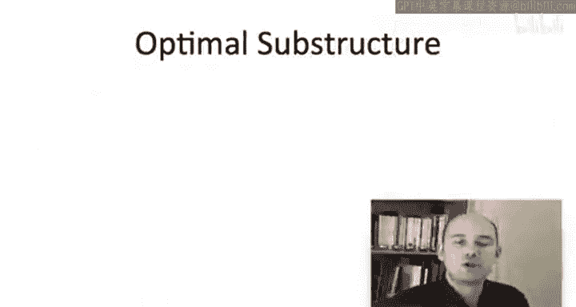
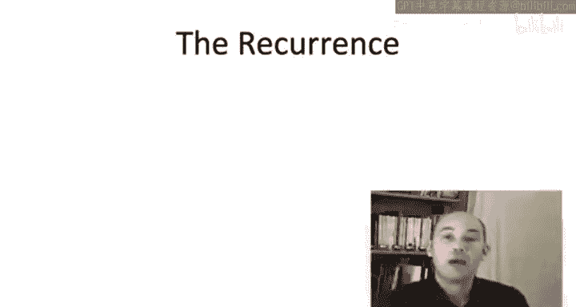
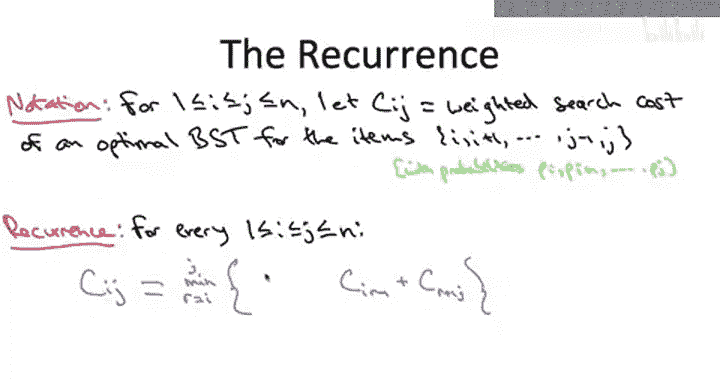

# 斯坦福大学《算法启蒙（第3册）：贪心算法和动态规划｜Part 3 Greedy Algorithms and Dynamic Programming》中英字幕 - P38：-38-_ A Dynamic Programming Algorithm 1.zh_en - GPT中英字幕课程资源 - BV1fNVUznEtT

So now that we understand the structure of optimal solutions for this optimal binary search tree problem that is we understand how an optimal solution must be one of a relatively small number of candidates。

 let's compile that understanding into a polynomial time dynamic programming algorithm。

Let me quickly remind you of the optimal substructure lemma that we approved in the previous video。

Suppose we have an optimal binary search tree for a given set of keys1 through n with given probabilities and suppose this optimal binary search tree has the root R。

 Well， then it has two subtrees t1 and t2 by the search tree property we know exactly the population of each of those two subtrees T1 has to contain the keys1 through R minus1 as usual we're assuming these are in sorted order whereas the right subtre T2 has to contain exactly the keys are plus1 through n Moreover。

 t1 and T2 are in their own right valid search trees for these two sets of keys and finally and this is what we proved in the last video they're optimal for their respective subproblem T1 is optimal for keys1 through R 1 and the corresponding weights or probabilities and T2 is optimal for r plus1 through n and their corresponding frequencies。

So let's now execute our dynamic programming recipe。

 so now that we understand the way in which an optimal solution must necessarily be composed in a simple way from solutions to smaller subproblem。

 let's take a step back and ask， well， given that at the end of the day。

 we care about the optimal solution to the original problem， which subpro are relevant。

 which sub problemsblem are we going to be forced to solve。For example。

 with independent sets in line graphs， we observed that to solve a subprom we needed to know the answers to the subproble where we pluck either one or two vertices off of the right-hand side。

 So overall what we cared about was subproblems corresponding to prefixes of the graph in the Napsack problem we needed to understand subproblem that involved one less item and possibly a reduced residualnapsack capacity so that led to us caring about solutions to subproblems corresponding to all prefixes of the items and all integer possibilities for the residual capacity of anapssack in sequence alignment when we looked at subproblem we were plucking a character off of one or possibly both of the strings so we cared about subproblem corresponding to prefixes of each of the two strings Now here's one of the things that's interesting about the binary search tree problem which we haven't seen before is that when we look at a subproble in the optimal substructure limma there's two that we might consider we don't just pluck off from the right we care about both the subprom induced by the left subre and that induced by the right subree In the first case we're looking at a prefix。

of the items we started with。 and that's like we've seen in our many examples。

 But in the second case， the subprom corresponding to T sub 2。

 that's actually a suffix of the items that we started with。 so put differently。

 the subproms we care about are those that can be obtained by either throwing away a prefix from the items that we started with or throwing away a suffix from the items that we started with。

So in light of this observation that the value of an optimal solution depends only immediately on subproblem that you obtain by throwing out a prefix or a suffix of the items。

 what I want you to think about on this quiz is what is the entire set of relevant subproble that is for which subsets S of the original items one through n。

 is it important that we compute the value of an optimal binary search tree on the items only in S？

So before I explain the correct answer which is the third one。

 let me talk a little bit about a very natural but incorrect answer， name the second one。

 indeed the second answer seems to have the best correspondence to the optimal substructure lemma。

 the optimal substructure lemma states that the optimal solution must be composed of an optimal solution on some prefix and an optimal solution on some suffix united under a common root R so we definitely care about the solutions to all prefixes and suffixes of the items but we care about more than just that。

So maybe the easiest way to see that is to think about the recursive application of the optimal substructurelema and again。

 relevant subproms at the end of the day are going to correspond to all of the different distinct subprobles that ever get solved over the entire trajectory of this recursive implementation So let me just think about one sort example path in the recursion tree so in the atommost level recursion you've got the whole item set let's there's 100 items1 through 100 you're going through and trying all possibilities of the route So at some point you're trying out root number 23 to see how it does you have to recur once on items1 through 22 to optimally build a search tree for them and similarly for items 24 through 100 Now let's sort of drill down into this first recursive call where you recurs on items just one through 22 Now here again you're going to be trying all possibilities of the route is 22 choices at some point you'll be trying root number 17's again going to be two recursive calls and the second recursive call is going to be on items 18 through 22 it's going to be the items that were passed to this recursive call a prefix of the original items and then。

Andmercurs of call here locally is going to be on some suffix of that prefix。 So in this case。

 the items 18 through 22， a suffix of the original prefix1 through 22。 So in general。

 as you think through this recursion multiple levels at every step。

 What you've got going for you is you're either deleting a chunk of items from the beginning a prefix or you're deleting a chunk of items from the end。

 but you might be interleaving these two operations。

 So it is not true that you're always going to have a prefix or a suffix of the original set of items。

 but what is true is that you will have some contiguous set of items。

 It's going to be if you have I is your smallest item in the subproblem and j is the biggest you're going to have all of the subproblem in between。

 and that's because you were only plucking off items from the left or from the right。

 So that's why C is the correct answer， you need more subproblem than just prefixes and suffixes。

All right， so that was a little tricky identifying the relevant subproble。

 but now that we've got them in our grubby little hands。

 the dynamic programming algorithm as usual is just going to fall into place。

 the relevant collection of subproblem unlocks the power in a very mechanical way of this entire paradigm。

 so let's now just fill in all the details。

The first step is to formalize the recurrence that is the way in which the optimal solution of a given subproblem depends on the value of smaller subproblem this is just going to be a mathematical formula which encodes what we already proved in the optimal substructure lemma and then we're going to use this formula to populate a table in a dynamic programming algorithm to solve systematically the values for all of the subproble so let's have some notation to put in our recurrence in our formula。

We're going to be indexing subpro with two indices， I and J。

 and this is because we have two degrees of freedom where the contiguous interval of items starts I and where the contiguous interval of items ends J。

So for a given choice of I andJ where of course I should be at the most J。

 I'm going to denote by capital C sub IJ the weighted search cost of an optimal binary search tree just on the contiguous set of items from I to J。

 and of course the weights of the probabilities are exactly the same as in the original problem they're just inherited here。

 P through PJ。So now let's state the recurrence， so for a given subpro， CIJ。

 we're going to express the value of an optimal binary search tree in terms of those of smaller subpro。

 the optimal substructure Lemma tells us how to do this。

The optimal subspeciallema says that if we knew the roots， if we know the choice of the root R。

 which here is going to be somewhere between the items I and J， then in that case。

 the optimal solution has to be composed of optimal solutions to the two smaller subproblem united under the root。

 Now we don't know what the root is。 there's a J minus I plus one possibilities。

 It could be anything between I and J inclusive。 So as usual。

 we're just going to do brute force search over the relatively small set of candidates that we've identified。

 So brute force search， we encode by just explicitly having a minimum。

So it choose some root R somewhere between I and J inclusive。And given a choice of R。

 we're going to inherit the weighted search cost of the optimal solution on just the prefix of items I through R minus1 so in our notation that would be C of I R minus1。

 similarly we pick up the weighted search cost of an optimal solution to the suffix of items R plus1 through J and if you go back to our proof of the optimal substructure lemma。

 you'll see we did a calculation which gives us a formula for how the weighted search cost of a tree depends on that of its subtes。

 and in addition to the weighted search cost contributed by each of the two search trees。

 we pick up a constant namely the sum of all of the probabilities in the items we're working with。

 so here that's sum of P sub K where K ranges from the first item in this subproblem I to the last item in the subproble J。

So one extra edge case we should deal with is if we choose the root to be the first item。

 then the first recursive term doesn't make sense， then we would have C I minus1。

 which is not defined， Similarlyly， if we choose the root to be J。

 then this last term would be C of J plus1 j which is not defined。

 remember indices are supposed to be an order So in that case we just interpret these capital Cs as0。

And so why is the recurrence correct， while all of the heavy lifting was done in our proof of the optimal substructure lemma。

 what did we prove there， we prove the optimal solution has to be one of just J minus I plus one possible things。

 it depends only on the choice of the root， given the route the rest is determined for us。

 the recurrence is by definition doing brute force search through the only set of candidates。

 so therefore it is indeed a correct formula for the optimal solution value in terms of optimal solutions to smaller subpro。

