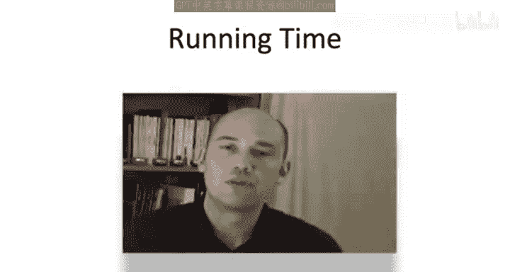

# 斯坦福大学《算法启蒙（第3册）：贪心算法和动态规划｜Part 3 Greedy Algorithms and Dynamic Programming》中英字幕 - P39：-39-_ A Dynamic Programming Algorithm 2.zh_en - GPT中英字幕课程资源 - BV1fNVUznEtT

So now that we have our magic formula， our recurrence。

 all that's left to do is to systematically solve the subproblem As usual it is crucial that we solve the sub problemsblems in the right order from smallest to largest how should we measure the size of a subproble in the optimal binary search tree problem the natural way to do it is the number of items in the subproblem so if you're starting at I and you're going till J the number of items in that subproblem is J minus I plus1 and that's going to be our measure of subproblem size。

So let's bust out our trusty array， the number of dimensions of this array is going to be two。

 that's because we have two different degrees of freedom for indexing sub problems。

 one for the start of the contiguous interval， one for the end。

So the outer for loop is going to control the subproblem size。

 it's going to ensure that we solve all smaller subproblem before proceeding to larger subproblems。

 specifically we'll be using an index S and in the iteration of this outer for loop。

 whatever the current value of s is， we're only going to consider subproble of size S plus1。

 so you should think of s as representing the difference between the larger index J and the earlier index I。

The inner for loop controls the first item in the contiguous interval that we're looking at。

 so that's just I。And now all we have to do is rewrite the recurrence in terms of the array entries and with this change variable where S corresponds to J minus I。

That is for a given subprom starting with the item I and ending with the item I plus S。

 we just by brute force， pick the best root to the root here iss going to be somewhere between I and I plus S。

 regardless of the choice of the root， we pick up the constant。

 the sum of the PKs or here K is ranging from the first item I to the last item I plus S and then we also look at the previously computed optimal solution values for the two relevant subproblem。

 one starting an I ending at R minus1， the other starting at r plus1 and ending at I plus S。

So a couple quick comments about the two array lookups on the right hand side of this formula。

 so first of all， if we choose I to be the root to be the first item I then the first lookup doesn't make sense if we choose it to be the last item the second array lookup doesn't make sense in that case it's understood we're just going to interpret these lookups as zero of course in our actual implementation you'd have to include that code but I'll let you take care of that on your own。

So the second comment is just our usual sanity check and again you should always do this when you write out a dynamic programming algorithm when you write down your formula to populate the array entries make sure that on the right-hand side。

 whenever you do an array lookup that is indeed already computed and available for constantine lookup so in this case。

 whatever our choice of the route is the two relevant subproblems are going to involve strictly fewer items than what we started with and therefore the two subproblem lookups on the right hand side will indeed have been computed and some previous iteration of the outer for loop remember the outer for loop is ensuring we solve subproblem from smallest number of items up to the largest number of items。

And of course， after the two four loops complete， what we really care about is the answer in a of1 comma n that is the optimalim binary search tree value for all of the items that's the eventual output。

Some students like to think about these double4 loops pictorially。

 so let's imagine A the 2D array is laid out as a grid。

So imagine the x axis corresponding to the index I。

 that is the first item in the set of items we're looking at in the y axis corresponding to J。

 the last item in the current set。And let me single out the diagonal of this grid。

 So these are sub problemsm corresponding that I equals J that is sub problems with a single element。

Now we only ever solve problems where J is at least as large as I。

 so that means we're really only filling in the upper left or northwestern part of this table。

 so we never bother to fill in the southeastern， the bottom right part of this table we just sort of think of it all as zero。

Now in the first outer iteration， so when S equals0。

 that's when our dynamic programming algorithm solves in turn each of the n single item problems。

 so in the first iteration of this double for loop it's going to solve the subproblem A11 and the next iteration of the inner for loop is's going to proceed A22 then a33 and so on in each of those both of the array lookups are going to just correspond to zero and we're just going to fill in this diagonal with the base cases where AII is just the probability of item I。

Then as the dynamic programming algorithm proceeds。

 we're going to be filling in the upper left portion of this table diagonal by diagonal。

 each time we increment S the index in the outer for loop。

 we're going to march up to the next northwesternmost diagonal。

 and then as we step through the possible values of I。

 we're going to fill in that diagonal one at a time moving from southwest to northeast。

When we're filling in the value of a subprom on one of these diagonals。

 all we need to do is look up the value for two subproblem on lower diagonals。

 lower diagonals correspond to subproblem with strictly fewer items。So that's it。

 that's a dynamic programming algorithm that computes the value of an optimal binary search tree given a set of items with probabilities I'm not letting to say anything about correctness it's the same stories we've seen in the past all the heavy lifting is in proving the optimal substructure lemma that gave us the correctness of our recurrence given that our magic formula is correct and we're just applying it systematically correctness of the dynamic programming algorithm follows in a straightforward way just by induction let me however make some comments about the running time。

So let's just follow the usual procedure， let's just look at how many sub problemsms got to get solved and then how much work has to be done to solve each of those subproble so as far as the number of subproble it's all possible choices of I and J where I is at most J。

Or in other words， it's essentially half of that n by n grid， so this is roughly n squared over two。

 let's just call it theta of n squared， so a quadratic number of subproble。

Now， for each of the sub problems， we have to evaluate this recurrence。

 we have to evaluate the formula， which conceptually is a brute force search through the number of candidates that we've identified and a distinction between this dynamic programming algorithm and all of the other ones that we've seen recently。

 sequence alignment， Napssack， Comp independence sets line graphs is there's actually kind of a lot of options for what the optimal solution could be that is our brute force search for the first time is not over a merely constant number of possibilities。

 We have to try every possible route。 Each of the items in our given subproblem is a candidate root and we try them all。

 So given a start item of I and the end item of J， those J minus I plus1 total items and we have to do constant work for each of those choices。

So there will be some subpro that we can evaluate quickly and only say constant time if I and J are very close to each other。

 but for a constant fraction of the subproms we have to deal with， this is going to be linear time。

 theta of n time， so overall that gives us a cubic running time， theta of N cubed。

Alright， so I would say this running time is sort of okay， not great。 So it is polynomial time。

 That's good。 It's certainly way， way， way faster than enumerating all of the exponentially many possible binary search trees。

 So it blows away brute force search， but it's not something I would call blazingly fast or for free primitive or anything like that。

 So you're going be able to saw problem sizes would N in the 100s， but probably not end in the 100s。

 So that will cover some applications where you'd want to use this optimal binary search tree algorithm。

 but not all of them。 So it's good for some things， but it's not a universal solution。

 On the other hand， here's a fun fact。😊。

And the fun fact is you can actually speed up this dynamic programming algorithm significantly。

 you can keep with the exact same 2D array with the exact same semantics。

 again each index is going to correspond to the subproblem with the optimal binary search tree between items I andJ inclusive。

 but you can actually fill up this entire table all n squared entries using only a total of n squared time that is on average constant work per subproblem。

So this fun fact it's very clever， it's certainly more intricate than what we've discussed in this video here。

 but it's not impossible to read so if you're interested I encourage you to go back to the original papers or search the web for some other resources on this optimized speedup version of this dynamic programming algorithm I mean at a very high level sort of from 30000 feet the goal is to avoid doing this brute force search over all possible routes in every single subproblem and it turns out there's structure。

 nice structure in this optimal binary search tree problem that allows you to piggyback on the work done in smaller subproblem so in smaller subpro you're already searched over a bunch of candidate routes and it turns out using the results of those previous brute force searches you can make inferences about which subset of the current set of routes might conceivably be the ones that determine the recurrence and so that lets you avoid searching over all of the possible candidates for the roots instead focusing just on a very small set in fact average on average constant number of possible routes over all of the subproblem and needless to say this speeding up the running time from cubic to quadratic really。

Significantly increases the problem sizes that you can now apply this algorithm to。

 so now instead of being stuck in the hundreds， you'd certainly be able to solve problem sizes in the thousands。

 possibly even in the 100 using this quadratic time algorithm， very cool。

