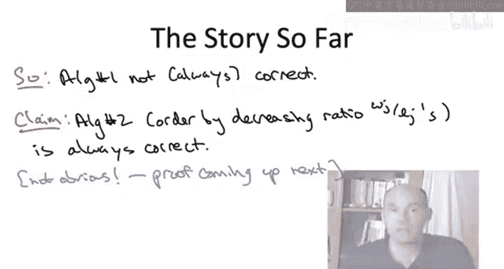

# 斯坦福大学《算法启蒙（第3册）：贪心算法和动态规划｜Part 3 Greedy Algorithms and Dynamic Programming》中英字幕 - P3：-03-A SCHEDULING APPLICATION_ Greedy Algorithm.zh_en - GPT中英字幕课程资源 - BV1fNVUznEtT

So the plan for this video is to develop a greedy algorithm that always minimizes the weighted sum of the completion times of a given set of end jobs。

 But more than the specific problem， more than this specific algorithm。

 I want you to focus on the process by which we arrive at this greedy algorithm。

 because I think this process is really something which you can use yourself in your own applications。

 The process we're going to use is we're going to first look at just a special case of the problem。

 where it's reasonably intuitive what should be the optimal thing to do。

 looking at these special cases， we'll then motivate a couple of natural greedy algorithms。

 Then we'll figure out how to narrow a couple greedy algorithms down to just a single candidate。

 And that， in fact， as we'll prove in the following lectures will always be correct。

So let's just briefly recall what is it we're trying to do， The computational problem。

 an instance is specified by n jobs which come along with weights and lengths。

 and amongst all n factorial ways that we can sequence the jobs。

 we want to somehow home in on the one that minimizes the sum of weighted completion times。

Recall from the previous video that the completion type of the job is just the amount of time that elapses before it's done。

 so that's going to be the length of all of the previous jobs plus the length of job J itself。

What we're hoping is going to work out is that we can devise a greedy algorithm that always solves this problem。

So maybe I should take a step back and ask you know why do greedy algorithms seem like a sensible way to approach the scheduling problem Well you know in general greedy algorithms are not guaranteed to work。

 you may have to do something more complicated， but scheduling still seems like a good place to try them out remember what a greedy algorithm does it iteratively makes my optic decisions and then you hope you have a reasonably good result at the end Now what are we doing we're studying a sequencing problem the definition of the problem is to schedule a job then another job then another job all the way up to the last job and so this iterative nature of the solution suggests that at least if you're lucky if the problem simple enough maybe there's a greedy algorithm which simply schedules the jobs in the correct order one at a time so we're gonna to see if that works for minimizing the sum to completion times。

So let's start by thinking positive， being optimistic。

 So let's posit that a greedy algorithm does exist for this problem。

 given that we're in the greedy algorithm section of the course。

 you know probably you don't find this hard to believe。 But suppose one existed。

 How would we discover what it is。 Well， a useful technique， not just for this problem， but you know。

 more generally in real life， First focus on some special cases of the problem where it's relatively clear how you should proceed。

 And the two special cases I want you to think about for this problem are， first of all。

 supposeupp I told you all of the jobs had exactly the same length， But they had different weights。

 Then what order do you think it makes sense to schedule the jobs in。 Secondly。

 suppose I told you that all of the jobs had exactly the same weights。

 but they had different lengths。 Then what order do you think you should schedule the jobs in。

So first of all， all the jobs have the same length。 You should prefer jobs with larger weights。

 Certainly， you this intuitively jobs with our semantics of weights that says more importance。

 which suggests that higher weight jobs should go first。

 if you look at the actual formula of minimizing the sum of weight to completion times。

 if the jobs all have the same length， then the completion times are going to be the same。

 You're gonna to see the same set of them。 If all the jobs have length 1。

 the completion times of the jobs are going be 1，2，3，4， all the way up to n。

 no matter what sequence you use。 So to make this the smallest possible。

 you want the highest weights to be associated with the smallest completion times。

 that is you want them upfront as early as possible。

 The second special case where jobs have equal weights， but varying lengths。

 I think is a little more subtle， here what you want to do is you always want to favor small jobs。

 Jo with the smallest length。 Everything else being equal。

 The reason for that is that scheduling a job in a given position forces all the other jobs to wait for that job to complete。

 So whatever job you schedule first has a negative impact on all of the。

To the n minus1 jobs so all else being equal you want the smallest job there that minimizes the consequences for the jobs that are to follow if you find this a little unintuitive I suggest just looking at a very simple example two jobs both have weight one。

 one has length one， one has length two if you schedule a small job first you'll have completion times of one and three for a total of four but if you schedule a bigger job first you get completion times of two and three for the bigger sum of completion times of five。

So the next step is to move beyond special cases， which we understand well to the general case。

 which perhaps we don't understand。 So suppose all of the weights are different and all of the lengths are different。

 Well， if we have two jobs in both of these rules of thumb， give us the same advice we're good。

 if there's one job， which is both higher weight and smaller than another job。

 then clearly that jobs should go first， But one of our two rules of thumb to prefer high weight jobs and def small jobs give us conflicting advice。

 What if we have a pair of jobs where one of them is， on the one hand， higher weight。

 higher priority， but on the other hand， bigger than the other one。 Which one should go first。 Well。

 let's again， stay positive， and let's try to think about the simplest kind of algorithm that could conceivably work。

 there won't be a guarantee that it works。 But it might work。

 So we have these two different parameters， length than weights。

 Maybe we can aggregate these two parameters into a single one into a single sort of score for each of the jobs。

 so that if we schedule the jobs from high score to low score， will always be optimal。

 That would be great。You can just have compile these two numbers into one for each job and then just sort and be done。

There is， of course， the question of exactly how do we choose this aggregation function。

 How do we compile length and weight into a single number Well， as guidelines。

 we should recall our special case and make sure we respect our two rules of thumb。

 So all being equal， we should prefer jobs with higher weight So that says higher weight should lead to higher scores if we're going to schedule the jobs from high score to low score And then also if a length is bigger that should decrease the score we should prefer jobs that have a small length。

 So this idea leaves open the question of exactly how do we aggregate the length and the weight of a job into a single number So to want you to do now is I want you to think for a minute about what kind of simplest possible functions you could use。

 So again， these are mathematical functions。 they take as input two numbers a length and the weight of a job and they output a single number of score and the function should have the properties that it's increasing in the jobss weights and it's decreasing in the jobs length So there's more than one answer to this question。

 but just sort of dream up some ideas of what this function might look like。All right。

 so there's certainly any number of functions which have these properties。

 but I'm just going to write down for concreteness two of what I think are of the simplest functions that have these properties。

 So one is going to be based on taking the difference of the two numbers。

 and one is going to be based on taking the ratio of the two numbers。

 So if you're going to use a function based on the difference and you want it to be increasing in the weight and decreasing in the length and of course。

 the obvious difference to use is weight minus length。 This can be negative sometimes。

 but that doesn't bother us。 The algorithm is still well definedfin。

And if you're going to use a ratio and you want it to be increasing in weight decreasing in length。

 then the sensible ratio to use is the weight of a job divided by the length of a job。It is。

 of course， possible that you have ties for you to one of you scoring functions。

 So let's just allow ties to be broken arbitrarily。 Now。

 what we're seeing here is a concrete instantiation of something I promised you in our high level discussion of greedy algorithms。

 Namely， it's both a strength and a weakness of them that they're really easy to come up with and proposed。

 So here we have just， you know this one simple problem。

 and we now have two different competing greedy algorithms for the problem。 Now。

 because these two algorithms don't do the same thing。

 only one of them at most can be always correct。 At least one of them has to be wrong sometimes。

 So as the algorithm designer， the process now is maybe we can rule out at least one of these two proposed greedy algorithms by showing an example where it doesn't do the right thing。

 So I want to emphasize this is the type of scenario that's very likely to arise in your own algorithm design adventures。

 You might have some problem。 You're not sure how to solve it yet。

 You've brainstormed up a couple of proposed algorithms and a good thing to do。

A good time saver is to quickly rule out some of those algorithms as not the right way to go as a poor approach to the problem。

 So in this context， we have these two greedy algorithms。 Let's quickly break one of them。

 show that it's not always correct。 How do we do that？ Well。

 a smart way to go would be to come up with an input where the two algorithms do different things。

 If they do different things at most one of them is going to be correct。

 At least one of them is going to be incorrect。 So that's the plan。Now， to execute this goal。

 as usual， we want to keep things as simple as possible， but no simpler。

 So what's the simplest possible instance that could lead to different behavior by a two algorithms。

 Well， obviously， one job is not enough because there's only one possible feasible solution。

 but already with two jobs， we might be able to have one algorithm。

 flip them one way and the other algorithm schedule them in the opposite order。 In fact。

 it is not difficult to come up with an instance with two jobs where they do different things。

 and let me just go ahead and write such an instance down for you now。So suppose I give you two jobs。

 The first one is both longer and more important than the other one。  specifically， its length is 5。

 its weight is 3。 The second job is length is merely2， but its weight is merely one。

 So what I want you to do is I want you to take our two proposed greedy algorithms。 The first one。

 which orders by difference， the second one， which orders by ratio。

 I want you to execute them on this two job input and compute the sum of weighted completion times and then answer what is the sum of weighted completion times of the corresponding two schedules。

All right， so the correct answer is answer B。 Let's just briefly go through Y。

 So first let's just make sure we understand which algorithm produces which schedule。

 So the first job has the better ratio。Its ratio is five thirds。

 whereas the ratio of the second job is one half， which is smaller whereas the second job has the larger difference。

 It has a difference of -1， whereas the first job has the more negative difference of-2 So the first algorithm which orders by difference will schedule the second job first then the first job。

 the second algorithm will schedule the first job first than the second one。

 so it just remains to compute to the objective function value of those two schedules。

 So for the first schedule with the second job first， however the second job has weight of one。

 it has a completion time of2 the second job has a weight of three and a completion time of 7。

 so that gives us a total of 23， whereas the schedule produced by the second algorithm we have the weight three job first。

 its completion time now that it' first is only5 and then the second job with weight one gets the completion time of 7 for a total of 22 So ordering by difference gives us value of 23 ordering by ratio。

Give us a value of 22 so in this case， the ratio does better than the difference。

 so certainly the difference is not optimal for this specific example。So what have we accomplished。

 Well， what we've done is we very quickly ruled out one of our natural proposed greedy algorithms。

 We know that ordering by difference is not always correct。 Again。

 it's going to be correct in special cases。 like when all the links are equal or all the weights are equal。

 but it is not correct in general。 That said， please remember the warning I gave you in the high level discussion of greedy algorithms。

 which is greedy algorithms are very often wrong。 just because we know algorithm number one is incorrect。

 sometimes does not at all implied that algorithm number two is guaranteed to be correct。

 It's really easy to come up with multiple incorrect。 greedy algorithms for the same problem。

 It does， however， turn out in this case for this greedy algorithm。

 algorithm number two ordering by ratio， It is happily always correct。

 But you certainly shouldn't believe this claim until I provide you with a proof。

 a rigorous argument explaining the correctness。 Always maintain healthy skepticism about the performance of a greedy algorithm until you learn otherwise。

So this fulfills another promise I gave you in the high level discussion of greedy algorithms。

 namely when they're correct， it's often quite difficult to prove it。

 So this will be the topic of the next couple videos。

 The correctness proof for this greedy heuristic。 The third and final thing we discussed about greedy algorithms typically is that the running time is not difficult to analyze。

 So that's a break that we catch relative to divide and conquer algorithms。 And again。

 that's certainly true here So what does this algorithm do All it does is compute these ratios and then sort the jobs by ratio。

 So essentially， the algorithm reduces to a single sort in computation and of course， from part1。

 we know very well how to sort in n log n on。

