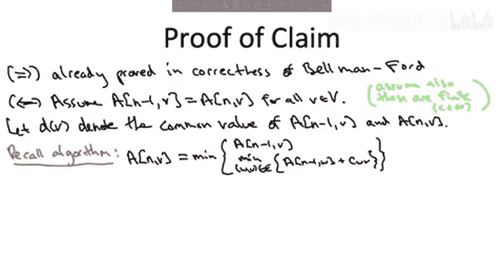

# 斯坦福大学《算法启蒙（第3册）：贪心算法和动态规划｜Part 3 Greedy Algorithms and Dynamic Programming》中英字幕 - P44：-44-THE BELLMAN-FORD ALGORITHM_ Detecting Negative Cycles.zh_en - GPT中英字幕课程资源 - BV1fNVUznEtT

Thus far， we've seen how in input graphs without negative cost cycles。

 the Belelman Ford algorithm correctly computes shortest pass from the source verts S to all destinations V。

 but what about input graphs that do have negative cost cycles In this short video。

 we'll see how to extend the the Belel and Ford algorithm。

 leaving its running time essentially unchanged so they can easily check whether or not the input graph has a negative cost cycle。

So the following claim is going to indicate the appropriate extension of the Belman Ford algorithm in particular。

 this claim characterizes the presence or absence of a negative cost cycle in the input graph in terms of behavior of the Belman Ford algorithm okay well actually the Belman Ford algorithm if we ran it for one extra iteration So currently we stop the Belman For algorithm when the outer index I is equal to n minus1 for the claim we're going to envision running that outer for loop for one extra iteration when I equals n running the same old recurrence for all of the destinations V。

So the assertion then is that G， the input graph has no negative cycle。

 if and only if we don't get any new information from this extra batch of subproms。

 that is if and only if A and V is exactly the same thing as AN minus1 V for every possible destination V equivalently。

 the input graph does have a negative cost cycle， if and only if there exists some subprom。

 there exists some destination V， where we see an improvement at V by running the development Ford algorithm for this extra iteration。

So we're gonna prove the claim in the next slide。 It's not too hard。

 but I hope it's immediately clear what the implications of the claim are how we check for a negative cost cycle。

 So now， given an arbitrary input graph with no promises， it might have a negative cost cycle。

 it might not， what do you do， you run Belman forwardd， but you run it for one more iteration。

 you run it for the outer for loop index I going all the way up to N。 and you check。

 does some subproblem value change in that final iteration or not。 If not。

 if all of your A-1 vs are the same as your A andvs， then by the claim。

 you know there's no negative cost cycle。 by our previous work。

 we know the Belman For algorithm is correct。 So we happily return the A-1 vs as the correct shortest path distances as before。

 If on the other hand， you notice that there's a vertex v so that A and V is different is smaller than A N-1 V。

 Then you say， hey， there's a negative cycle by the claim。

 So I'm not going to compute shortest path distance for you that wouldn't make sense。

 There is a negative cost cycle and you pun。And of course。

 this one extra iteration in the Belmon Ford algorithm has a negligible effect on its running time。

 it's still big O M times n。So I'm lying a little bit in this claim。

 there's an edge case I'm not handling properly When I wrote down the claim I was thinking about arguably the common case of input graphs G。

 where there exists a path from s to every other destination B that is input graphs where all of the shortest path distances are finite。

 So if that's not the case then the claim as stated is not correct。

 one way to see that would be just a degenerate instance where the source vertex S has no outgoing arcs at all。

 and maybe the rest of the vertices form a negative cost cycle and that kind of graph the lefthand side of this claim is false but the right hand side of this claim is satisfied。

 So to modify it for graphs that may have some infinite distances I'm just going to modify the lefthand side to say G has a negative cost cycle that is reachable from the source vertex S。

Now， if you actually wanted to detect in the input graph。

 whether there was a negative cycle at all reachable from S or otherwise。

 there are various tricks you can do to solve that problem again using the Dumin 4 algorithm。

 So for example， given an input graph， you can add a dummy sort of fictitious extra vertex and add arcs from that vertex to everybody else with link0。

 run Dumman 4 on that graph and that will detect a negative cost cycle if one exists。

So now that we know why we want the claim to be true， let's understand why it is true。

 Let's go to the proof。So the claim asserts something that's if and only if on the left hand side is the property of the input graph having no negative cost cycle on the right hand side is the property that the Belman For algorithm does not make any changes if you run one extra iteration。

 So proofs like this have two parts assuming the left proved the right。

 assuming the right prove the left。 One of these two parts。 if you think about it， we already did。

 when we prove that the beman For algorithm is correct，4 graphs with no negative cost cycles。

 that is if the lefthand side holds if the input graph doesn't have a negative cost cycle。

 we already argued that you don't have to run the outer for loop beyond I equals n minus1。

 that's sufficient to capture the shortest path。 So in particular， take I as big as you like。

 for example， I equals N， you're not going to see even shorter path。

 You're going to get exactly the same subproblem solutions。The content then is the reverse direction。

 So let's assume that we run Beling forward an extra iteration。

 and none of the sub problem solutions change。Now I warned you there is this edge case when the input graph doesn't have a path from S to all other vertices and you have infinite distances。

 I'll leave those details to you， so let's just focus on the case when there is a path from S to everything else and in particular these subproblem values are going to be finite。

So a little notation， I'm going to use lowercase D of a vertex v to denote the common value of its subproble in the final two iterations when i equals n minus1 and when I equals n。

So now the plan is we're just going to stare at the formula that we use to evaluate these subprobles。

 it's right there staring at us in the pseudocode for the Belman Ford algorithm from that we will get an inequality relating these dvalue to each other and from that inequality we will be easily able to deduce that every cycle of the input graph is indeed non-negative that's the left hand side of the statement。

So what formula did we use to fill in this extra iteration of the table， the ANVs。

 but we just took the better of on the one hand， AN minus1 v。

 the solution for the previous iteration， and then also the best of the candidates that use a last hop WV and concatenate a path with the most n minus1 edges to W along with that edge WV。

Let's also note that with our new notations， these little D values。

 the common value of a subproblem in the n minus1 and n iterations。

 we can write the left hand side of this formula as D of V and in the case2 subpros we can write AN minus1 w as D of W。

Now because the left hand side of this equation is a minimum over a bunch of candidates on the right hand side。

 if we instantiate， if we zoom in on any one candidate on the right hand side。

 so any choice of this last top WV， we get something which is at least as big as the left hand side。

 again the left hand side is the smallest of all of the candidates。So in particular。

 for a given choice of the last hop W comma V， we get the D of V is at most D of W plus the length of the edge from W to V。

Really， all this inequality is saying is that one way to get a path from S to V is to take a path from S to W and concatenate the final hop W comma V。

 the shortest path to V can only be better than this one particular candidate that goes via W。

Now remember what it is we're trying to prove， we're trying to prove that the input graph has no negative cost cycles。

 let's just pick our favorite cycle capital C and show that it has non negative cost。

This is going to be a sneaky application of the inequality that we just wrote down in pink。

 specifically we're going to sum that inequality over all the edges in the cycle。

 it's going to be clear if I just rearrange that pink inequality a little bit。

So now let's look at these some of the edge links in the cycle capital C。 Remember。

 this is what we want to prove is non negative。So we sum over the edges W comma V in big C。

 and for each edge， we look at its cost， little C of W V by the pink inequality。

 we can lower bound this by a sum over the edges in the cycle capital C of the difference between the dvalue of that edge。

 the endpoints of the edge。Notice that for a given arc WV on the cycle， the tail of this arc W。

 its dvalue appears with a coefficient of plus1 and the dvalue of the head of this arc V appears with a coefficient of minus1。

But cycles， of course， have the very special property that every vertex of the cycle appears exactly once as the tail of sumA and exactly once as the head of sumar。

 so each Dvalue of a vertex on the cycle is going to appear once with plus one coefficient。

 once with  one coefficient。 so what we get massive cancellation， we're left with just zero。

So the cycle capital C has nonne cost that was an arbitrary cycle so it's true simultaneously of all of the cycles in the input graph that's exactly what we are trying to prove。

 so again the presence of negative cost cycles in an input graph is characterized by the behavior of Belman Ford in an extra iteration。

 that's why it's easy to extend the basic algorithm to check negative cycles without affecting the running time。

