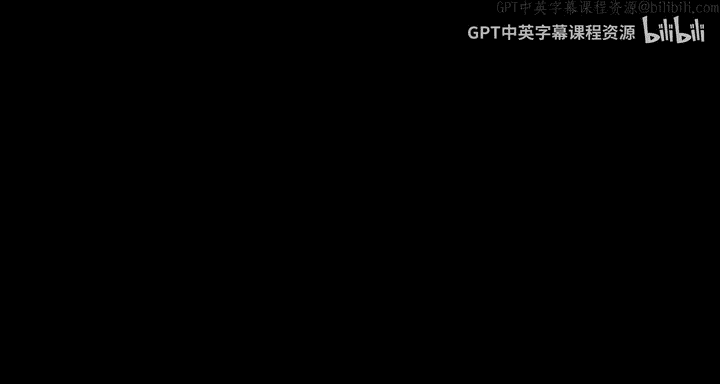
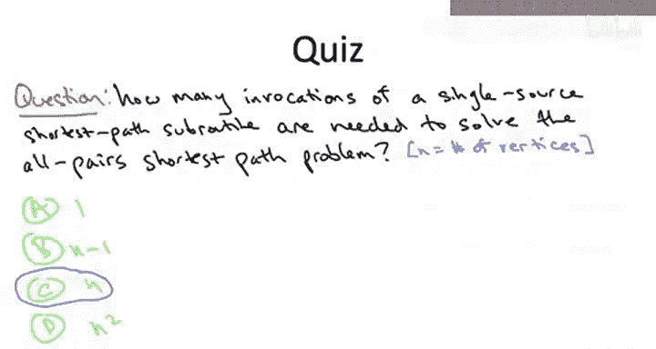

# 斯坦福大学《算法启蒙（第3册）：贪心算法和动态规划｜Part 3 Greedy Algorithms and Dynamic Programming》中英字幕 - P45：-45-ALL-PAIRS SHORTEST PATHS_ Problem Definition.zh_en - GPT中英字幕课程资源 - BV1fNVUznEtT

So why should we be content computing shortest paths from merely one source vertex to all possible destinations What if we want to know shortest path distances from every vertex to every other vertex？

The formal definition of the all pair shortest paths or APPSP problem is as follows。

 we are given as usual， a directed graph G with edges that have lengths C sub B。

 you can think if you want about the special case when all edges are non negative。

 but we're also going to be interested in the case where edges can have negative lengths as well。

In contrast to the single source shortest path problem， there is no distinguished source vertex。

And the goal of the problem is to compute for every pair of vertices， U and V。

 the length of a shortest path starting at U and ending at V。

So just as with a single source version of the problem， this isn't quite the full story。

 if the input graph G has a negative edge cycle， then either depending on how you define shortest paths。

 the problem doesn't make sense or it's computationally intractable。

 So if there is a negative cost cycle， we're off the hook from having to compute shortest path distances。

 but we do need to correctly report in that case that the graph contains a negative cost cycle。

 That's our our excuse for not computing the correct shortest path lengths。

So you know what would make me really happy if when you see this problem， you thought to yourself。

 don't we pretty much already have a rich enough tool box to solve the all pair's shortest path problem。

 If that's what you thought， that's a great thought。 And the answer in many senses is yes。

 So let's explore that idea， make it precise。 in the following quiz I'm going to ask you。

 Suppose I gave you as a black box。 A subroutine that solves the single source shortest path problem correctly and quickly。

 How many times would you need to invoke that black box。

 That subroutine to correctly solve the all pairs shortest path problem。😊，So the correct answer is C。

 you need n ins of the single source shortest path subroutine or n is the number of vertices in the input graph。

 Why， well， if you designate an arbitrary vertex as a source vertex S and then run the provided subroutine。

 it will compute for you shortest path distances from that choice of S to all of the destination。

 So that computes for you N shortest path distances out of the n squared that you're responsible for all of the shortest path distances that has this particular vertex S as the origin。

 So there's n different choices of the possible origin。

 So you just iterate over all of those choices invoke the provided algorithm once for each and boom。

 you've got the n squared shortest path distances that you're responsible for。

So should we be happy with this reduction， Should we be happy with this algorithm that simply runs a single source shortest path algorithm n times or do we expect to do better？

 Well the answer is going to depend。 It's going to depend on two factors。 First of all。

 does the input graph have only non negative edge costs or does it more generally also have negative edge costs。

 The second thing we want to look at is whether the graph is sparse， meaning M。

 the number of edges is relatively close to n or is it dense。

 meaning M is relatively close to n squared。 So let's start with a case of just non negativegative edge costs。

The reason it matters is whether or not the edge costs are all non negativeative or not is it governs which single source shortest path subber routineout routineine we get to use。

 so if the happy case， all edge costs are not negative。

 then we get to use dixsters algorithm as our workhorse and remember Dxsters algorithm is blazingly fast our heatbased implementation of it。

 random in time M log n。 So if you run that n times your running time is naturally n times M times log n。

So in the sparse case， this is going to be n squared log n。 In the dense case。

 this is going to be n cubed the log n。So for Spe graph， this frankly is pretty awesome。

 You're not going to really do much better than running diyktra n times once for each choice of source of the source vertex。

 The reason is we're responsible for outputting n squared values。

 a shortest path distance for each pair UV a vertices。

 and so here the running time is just that n squared times an extra log factor。

The situation for dense graphs， however， is much murkier。

 and it is an open question to this day whether there are algorithms fundamentally faster than cubic time for the all pairs shortest path problem in dense graphs。

 If you wanted to try to convince somebody that maybe you couldn't do better than cubic time。

 you might argue as follows。 Theres a quadratic number of shortest path distances that have to be computed。

 And for a given pair U and V， the shortest path might well have a linear number of edges in it。

 So surely you can't compute the shortest path between one pair better than linear time。

 So did it do a quadratic number， It's going to have to be cubic time。However。

 I want to be clear this is not a proof。 This is just a wishy washy argument。 Why is it not a proof。

 Well， for all we know， we can do some amount of work。

 which is relevant simultaneously for lots of these shortest path problems。

 and you don't actually have to spend linear on average time for each as a tale of inspiration。

 Let me remind you about matrix multiplication。 If you write down the definition of what it means to multiply two matrices。

 you look at the definition， and it just seems like its an obviously cubic problem。

 It just seems like by definition， you have to do a cubic amount of work。 Yet。

 that intuition is totally wrong。 beginningg with stressin and then many follow on algorithms。

 We now know that there are algorithms for matrix multiplication。

 fundamentally better than the naive cubic time algorithm。

 If you have a nontrivial approach to decomposing the problem。

 you can eliminate some of the redundant work and do better than the straightforward solution。

 is a strin like improvement possible for the all pair shortest path problem Nobody knows。

Now let's discuss the general case input graphs that are allowed to have negative edge links。

 So in this case， we cannot use Dyxter's algorithm as our workhor as our single source shortest path subroutine。

 we have to resort to the Belman Ford algorithm instead stick because that's the only one of the two that accommodates negative cost edges。

 Remember the Belman Ford algorithm is slower than Dyxster algorithm。

 the running time bound that we proved was O of M times n。 If we run that n times。

 we get a running time of M times n squared。How good is a running time of n squared M。 Well。

 if the graph is sparse， if M is theta of n， then this is cubic and n， and if the graph is dense。

 M is theta of n squared， we're now seeing our first ever for this course， quattic running time。

And I hope you're not really especially happy with the cubic running time bound for the Sprsecraft case。

 But now when we're talking about Quartic running time， now， this really just seems exorbitant。

 And so hopefully， you're thinking this's got to be a better approach to this problem than just running Belmand Ford End times in the densegraph case。

 Indeed， there is the Floyd Warshaw algorithm。 We'll start talking about it next video。😊。

