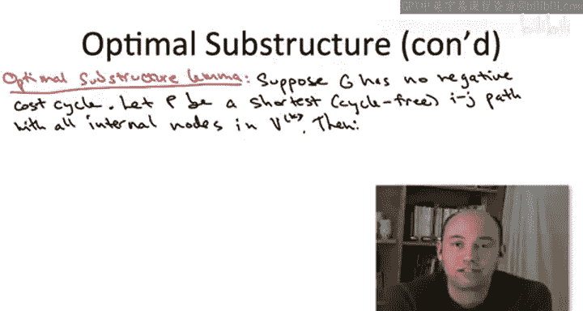

# 斯坦福大学《算法启蒙（第3册）：贪心算法和动态规划｜Part 3 Greedy Algorithms and Dynamic Programming》中英字幕 - P46：-46-ALL-PAIRS SHORTEST PATHS_ Optimal Substructure.zh_en - GPT中英字幕课程资源 - BV1fNVUznEtT

In this video in the next we're going to develop from scratchratch algorithm for the All pair' shortest path problem rather than by relying on the aforementioned reduction to the single source version of the problem。

 so in this video we're going to develop the relevant optimal substructure Lemma in the next video will culmininate the dynamic programming algorithm。

 it is a famous one the Floyd Warshald algorithm。Before developing the optimal substructure。

 let me just tell you a little bit about where we're going。

The optimal substructure we're about to identify will lead to a dynamic programming solution via the usual recipe。

 which we've now seen over and over and over again。

 it's going to solve the all pair's shortest path problem in O of N cubed time so we get a bound independent of the sparsity。

 n cubed even if the graph has negative edge lengths。

This algorithm is known as the Floyd Warsshaw algorithm。Last video。

 we discussed the performance that you get by just running single source shortest path subroutine and times。

 and the Flod Warhell algorithm is a better solution in many situations。So first of all。

 for graphs that have general edge links that is edge links that are allowed to be negative。

 then Floyd Warsshaw' is looking pretty good。 Remember with the previous solution was to run the Belman Ford algorithm n times。

 we can't use Dykesster's algorithm because that's not generally correct with negative edge costs。

 And if you run the Belman Ford algorithm n times， you get a running time of n squared M。

 So even in the best case for Bel and Ford Sprse graphs。 We're doing just as well with Fd Warsshaw。

 We've got a cubic running time and we're doing quite a bit better for dense graphs。

 there n times Belman Ford。 we give us n to the fourth a Quartic running time whereas here or get N cubic。

Now， for graphs with non negative edge costs， reducing to the single source problems is actually a pretty good solution because diyktra is so fast。

 So if you run Dytra n times， your running time is gonna be n times M times log n。

 So for sparse graphs， you'd really want to use Dyktra n times rather than Ford Warshaw because you'd get a running time roughly quadratic and n as opposed to the cubic running time we're going get here for dense graphs。

 it's not so clear if you run Dkestra n times you're gonna get a running time。

 which is ballpark cubic。 So that's gonna be roughly the same as Ford Warsshaw and you'd expect them to be comparable。

 It's not clear which one would do better in practice。

 if you had to choose between those two solutions for dense graphs。

 you'd really want to code them both up and pick whichever one seemed to do better in your domain。

One place you see the Floyd Warholll algorithm used quite a bit is for computing the transitive closure of a binary relation。

And in graph theoreticaloretic language， you can think of the transitive closure problem as computing all pair's reachability。

 so that's a special case of all pair's shortest path where you just want to know whether the shortest path distance is finite or infinite for each pair of vertices you want to know。

 does there exist a path from the one vertex to the other or not。

And if all you care about is the transitive closure problem。

 if all you care about is one bit of information for each pair of nodes connected or not as opposed to more generally what the shortest path length is。

 then you can do some optimizations in the floord Warsholl algorithm to speed up the constant factors。

 but I'll leave it to you to read up on the web about that if you're interested。Now。

 I realize that this cubic running time is maybe not super impressive in general。

 as we've been talking about dynamic programming algorithms。

 we've been starting to see for the first time in these courses a proliferation of algorithms， which。

 you know， while polynomial time while way better than exponential time。

 you wouldn't really call blazingly fast。 We've seen a lot of quadratic running times Now we're seeing some cubic running times。

 So that's kind of a bummer， but I am still teaching you the state of the art。

 As we mentioned this on the last video， it remains an open question to this day whether they are significantly subcubbic algorithms that solve the all pairs shortest past problem。

So now let's formalize the optimal substructure in all pair's shortest paths。

 which is exploited by the Floyd Warsshaw algorithm。A quick diggression first， though。

 at the beginning of the class， I hope that you if I'd shown you this Fyd Warsholll algorithm you would have said。

 wow， that's a really elegant algorithm， how could I have ever come up with this。

 whereas now that you're approaching the black belt level in dynamic programming and you see just how mechanically the algorithm this famous algorithm is going to fall out of the really quite easy optimal substructure I hope you say how could I not have come up with this algorithm。

Now I don't mean to take any credit away from the solutions of Floyd and Warshaw there is one really great idea in how they phrase this optimal substructure remember we talked about this before the development For algorithm it can be tricky to apply dynamic programming to graph problems it' because there isn't really an ordering in the input you just get this bag of vertices in this bag of edges and it's often unclear how to define bigger and smaller subproblems。

So the really nice solution in the Belman Ford algorithm was to introduce this extra parameter I。

 I was a budget on the number of edges， or roughly equivalently。

 the number of vertices that you were allowed to use in a path between the origin and destination for a given subpro。

 This naturally induces an ordering on sub problemsble， The bigger the edge budget。

 the bigger the subpro。 We're going to do something similar。

 but even a little bit more stringent in the Floyd Warsshalaw solution were again。

 going to restrict the number of vertices that can appear in the middle of the path between a given origin and destination and a subproble。

 But more than just the number of the vertices were allowed to use。

 We're going to restrict exactly which vertices。 The identities of the vertices that the algorithms permitted to use to get from the given origin to the given destination。

And in many ways， the restriction we're going to impose pose is totally analogous to say the Napsack problem。

 where there wasn't an intrinsic ordering on the items， but we imposed one anyways。

 And then we just look at prefixes of the items and bigger sub problems were ones with bigger prefixes of items。

 Here， we're going to impose an arbitrary ordering on the vertices。 and in a given sub problem。

 you're only allowed to use some prefix of the vertices as internal nodes in a path。 And then。

 of course， the bigger the prefix are permitted to use the bigger the sub problemble。

So to be a little bit more formal about it， let's just impose some arbitrary ordering on the vertices capital V。

 name the vertices 1，2，3 all the way up to n， I don't care how。

 and I'm going to use the notation capital V superscript K to denote the prefix of the first K vertices。

 vertices 1 through K。So let me start now setting up the optimal substructure Lemma。

In contrast to the Belman Ford case， I'm only going to prove the optimal substructure dilemma。

4 input graphs that have no negative cycle will address the case of negative cycles after we're done with the algorithm。

 Suppose for now， there isn't one。So what then are the subprom is going to be。

 Well it's going to be quite analogous to Belman Ford in Belman Ford。

 we were solving the single source shortest path problem。

 So we needed to compute something for each destination so that gave us a linear number of subproblem。

 And then for a given destination， we had this parameter I controlling the edge budget。

 So that was another linear factor。 So we had a quadratic number of subproblem。

 here it's going to be the same except we also have to range overall origin。

 So we're going to get a cubic number of subproblem。

 specifically a choice for the origin and choices a choice for the destination。

 that's n more choices plus which prefix of vertices were allowed to use。

 So that's still another n choices。 So cubic total。

So now we focus on an optimal solution to this subpro。

 by which I mean amongst all paths which begin at the vertex I and at the vertex J and strictly in between INJ as internal nodes contain only vertices from one through K amongst all of those paths。

 we look at the one with the shortest length and because we're looking at the case of no negative cycles。

 we can assume that this path has no cycles as the cyclefr path。

So rather than state the conclusion of the optimalim subsspecial lemma right now。

 let me just make sure you understand what one of these subproblem is。

 So let's suppose that the origin is the vertex that we've labeled arbitrarily 17。

 The destination J is the vertex we've labeled 10。 and let's suppose K at the moment is only 5。

Consider the following graph。 Imagine this is a little piece of some much bigger graph。Now。

 I hope it's clear what the shortest path is between 17 and 10。 It's the bottom2 hop path。

 that path has total length-20。 On the other hand， for the subprom we're dealing with， K equals 5。

 So what that means is we have this extra constraint on which vertices we can use in the middle of our paths。

 Now， to be clear， this constraint K at most 5 that can't apply to the origin in the destination。

 right I is 17 j is 10。 Both of those are bigger than 5， but we don't care。 Obviously。

 any path from I to j has to include both the vertices I and J。

 So the constraint only applies to vertices in the middle of the path。

 but this bottom2 hop path unfortunately makes use of the node 7。

 So that path does not obey the constraint， it is not at most 5。 So that path is disallowed。

 We cannot use it。 Therefore， the shortest path from 17 to 10 that makes use only of the first5 the five labelbeled vertices as intermediate ones would be the top three hop path which has the bigger length of3。

Okay， so I hope it's clear what a sub problemm corresponds to。 It corresponds to a choice of I。

 the origin。 that's， again， just some vertex labeled something from one to N。

 Similarlyly as a choice of the destination， some other vertex J。

 which is labeled something from1 to N。 And then there's a choice of the bound K。

 which governs which vertices you're permitted to use internal to your paths。 Again。

 the constraint doesn't apply to the endpoints just the vertices in between the endpoints。

 And in the subproblem， the choice of K says you can only use vertices1 through K internal to your paths。

 So hopefully that makes sense。 Let's move on to the full statement of the optimal substructure limitma。

Alright， so this is actually going to be one of the simpler optimal substructure lamas that we've seen in a while we're back to the glory days of only two cases。

 the first is trivial if the shortest path from I to J using only vertices 1 through k as intermediaries doesn't even bother to use the vertex K。

 well then it better well be a shortest path from I to j that uses internal nodes only from1 to K minus1。

Now it's in case two， it's going to become apparent what a great idea ordering the vertices。

 looking at prefixes the vertices is when you're considering the all pairs version of the shortest path problem。

Suppose this path P from out of J does indeed use the vertex K in the middle。 Well。

 then we can think of the path P as comprising two subpaths， the first path P1。

 which starts at I and goes to the vertex K， and then a path P 2， which starts at K。

 and goes to the destination J。Now， here's what's cool。 So on this path P。

 the internal nodes between I and J all lie in one through K。 Moreover。

 this path P remembers cyclefr， So the vertex K appears exactly once， not more than once。

 So therefore， if we split the path P into these two parts， P1 and P2， internal to P1。

 strictly in between I and K， there's only vertices between1 and K -1。 Similarlyly。

 strictly between K and J and P2。 there's only vertices between1 through K -1。 Thus。

 both of these path P1 and P2 can be thought of as feasible solutions to smaller subproble。

 subproble with an even tighter budget of K -1 on the internal nodes that are allowed。

 And these aren't just feasible solutions for smaller subproblem， they're optimal solutions as well。

So how slick is that that the maximum indexed internal node just splits the shortest path into two shortest paths for smaller subproblem。

 And you know what， at this point， I am so confident in your facility with dynamic programming。

 I am not going to even bother to prove this statement。

 You are totally capable of proving as yourself。 The argument is really quite similar to Belman forward。

 I encourage you to do it as an exercise。