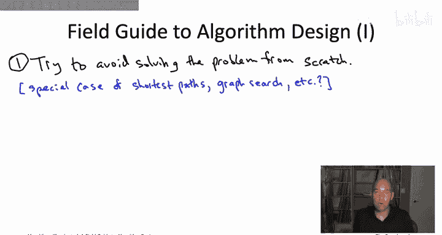
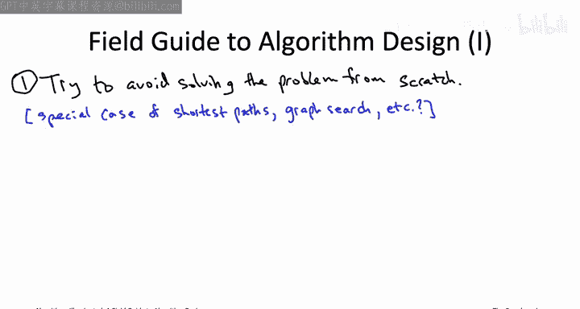
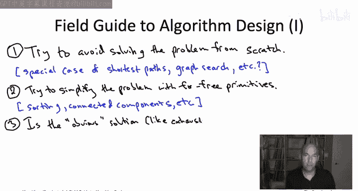
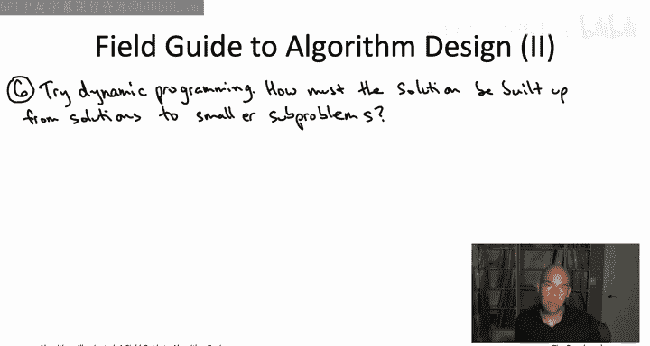
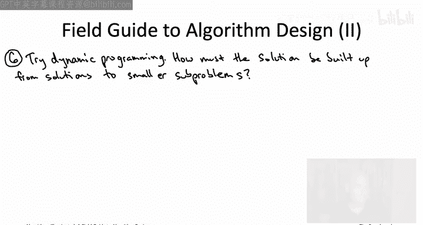
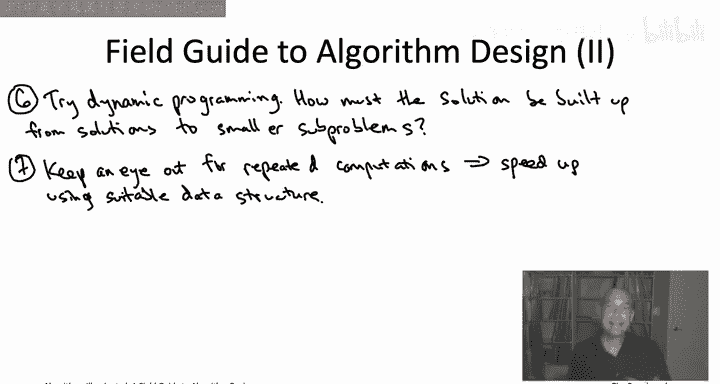
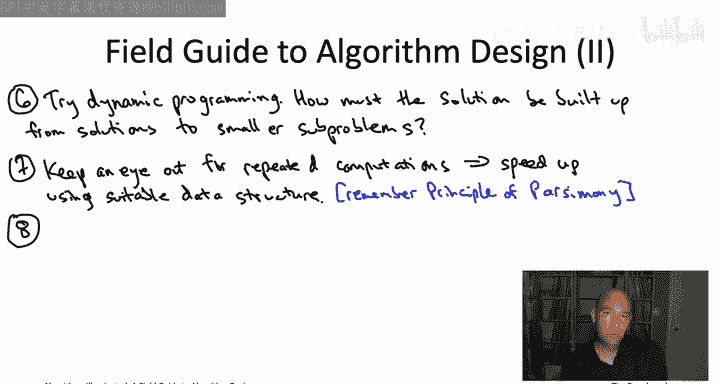
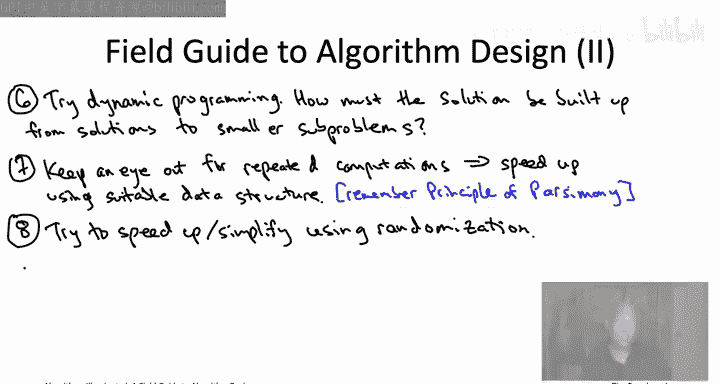
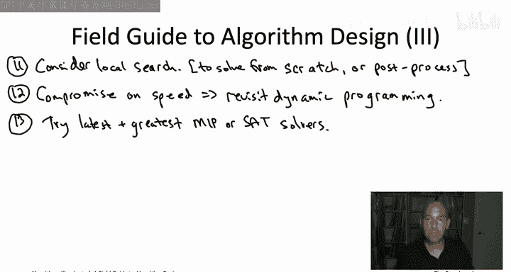
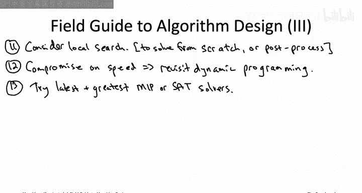

# 斯坦福大学《算法启蒙（第3册）：贪心算法和动态规划｜Part 3 Greedy Algorithms and Dynamic Programming》中英字幕 - P48：-48-A Field Guide to Algorithm Design - GPT中英字幕课程资源 - BV1fNVUznEtT

Hi， everyone， and welcome to this video that accompanies the epilogue of the book Arithms illuminated Part 4 about the field guide to algorithm design。

 So， congratulations， you have now reached the end of the algorithms illuminated book series。

 And as a result， you now possess a rich algorithmic toolbox suitable for tackling a wide range of computational problems。

 In fact， you may now have so many tools that is just overwhelming。

 so many algorithms to choose from， so many data structures， so many different design paradigms。

 What's the most effective way to put all of these tools to use。😊，Well。

 to give you a starting point in this video， I want to tell you about the typical recipe that I use when I need to understand a new computational problem as you develop more and more of your own experience。

 I highly encourage you to come up with your own recipe that works best for you。

So suppose you're confronted with a new computational problem that you haven't seen before。

 What should you do， Well， I hope you've learned a lot of things from this book series and from these video playlists。

 Probably one of the things you've learned is that designing algorithms from scratch can be can be pretty hard。

 So the first several steps of this recipe are honestly just trying to be lazy。

 trying to get out of the difficult task of coming up with an algorithm from scratch and hopefully tackling the problem using the tools that you already have。

In the best case scenario， your problem will literally boil down to a disguised version of or maybe a special case of a problem that you already know how to solve。

 So just to give one example， lots and lots of problems turn out to be shortest path problems。

 and you can solve them quickly using， say Dykester's algorithm。

 or maybe you can even just use breath first search， depending on the situation。

One of the cool things that will happen if you push past to the scope of this book series and pursue a deeper study of algorithms is you'll learn about additional problems which are well solved。

 meaning we can solve them in polynomial time using pretty practical algorithms。

 but also problems that show up in disguise all over the place。

 So some good examples would include like the fast Foury year transform。

 which is another killer application of the divide and conquer algorithm design paradigm。

 or there's some ubiquitous graph optimization problems like say maximum flow， minimum cuts。

 bipartite matching， or you even have sort of very general optimization procedures sort in the spirit of the MIPS solvers that we talked about。

 but for polynomial time solvable problems namely linear programming and convex programming。

In any case， whenever you're tackling a new computational problem。

 the first thing to do is see if it fits into one of your off the shelf algorithms that you can just apply immediately。

 and if it does among all the algorithms that apply。

 you want to use the fastest one sufficient to solve that problem。So if that first step fails。

 you know we have to work a little bit harder， but we still want to err on the side of being as lazy as possible and just sort of using our off the shelf tools as much as we can。

 So the next thing to consider is the array of four free primitives that we've studied in this book series So again these are subroutines that run in linear near linear time So the amount of time is barely more than what you need to read the input anyways and you know if a four free primitive has the potential to simplify the problem you're looking at。

 why not just apply it so like if you have an array。

 maybe it helps to sort the array first if you have a graph maybe it helps to compute the connected components of the graph first。

The third step， again， is to try to be lazy to not work too hard coming up with an algorithm。

 So you first just want to identify what would be the totally obvious naive way to solve the problem。

 So maybe that would be something like exhaustive search。 And then you want to just double check。

 maybe this naive solution is already good enough。 Like if you just need to solve the traveling salesman problem on a graph that has 10 vertices。

 Exhausive search is going to be just fine。 Or if you're counting the number of inversions in array that only has length like 1000。

 you can go ahead and use the quadratic time of exhaustive search algorithm for counting inversions。

If the obvious solution is not good enough， now you need to actually start thinking about algorithm design paradigms。

 and as we've said many times， often the best place to start brainstorming is the greedy algorithm design paradigm。

 So for many problems， you can try to brainstorm a bunch of different greedy algorithms and try them out on small examples。

 Most likely all those greedy algorithms will be wrong， they will fail on some inputs。

 but actually seen concretely the inputs on which those greedy algorithms fail and why they fail that inevitably helps you understand the problem better and see more clearly what tools are actually going to be needed。

So let's assume that you've made it through step 4 and you're not happy with the results。

 So maybe it was a problem where kind of you actually couldn't didn't seem to lend itself to the greedy algorithm design paradigm。

 or maybe you did come up with a bunch of greedy algorithms。 none of them work。

 you'd really like an algorithm that does work and you're willing to move on to graduate to a more sophisticated paradigm to come up with an exact algorithm Well depending on the type of problem you're looking at you might next consider the divide and conquer algorithm design paradigm。

 So this is the very first one we discussed actually back in the first half of part1 with merge sort being a completely canonical example and of course we saw many other examples。

 quicks carrotub multiplication， Str and matrix multiplication closest pair etc。

 So you've seen lots of examples of divide and conquer That said there's certain types of problems that tends to work well for and other types of problems it tends to not work well for。

 So if you're dealing with a computational problem where the inputs in an array and it's sort of very obvious a way to split it in half the left half in the right half you can try recursively solving the problem on each subar and combining the。

That may or may not work， but at least it's sort of clear how you would approach the problem。

 what you try There's other problems you know like problems involving graphs where honestly it's not so obvious how to even get started with divide and conquer I mean you can split the vertices into two groups of size n over2 each if there's in vertices but like which n over2 do you put over here and which N over two you put over here it's not totally clear So for that reason it's a little unusual to see divide and conquer applied to say graph problems but if you're dealing with the kind of problem where divide and conquer is natural where there's a natural way to divide the input into multiple independent subproble give it a shot if it works you'll probably wind up with a quite fast correct algorithm。

From the divide and conquer paradigm it's very natural to segue into the dynamic programming paradigm because that also deals with smaller subproblem and actually especially if you're trying to apply divide and conquer and it seems to not be working and the reason it's not working is because to combine the recursively computed solutions what you always have to seem to recompute a lot of stuff that's often a signal that you should probably be looking at dynamic programming instead So you're all graduates of the algorithms illuminated dynamic programming boot camps so you've had lots of practice with this and you know what the game is so to apply dynamic programming you have to understand in what sense the optimal solution to the problem that you want to solve。

 how must it be built up from optimal solutions to smaller subproblem。

And your task then is to prove that there's really only a limited number of candidates vying to be an optimal solution。

 and then in dynamic programming you can exhaustively search over that small number of candidates for what the optimal solution could possibly look like。

And if you do have this type of insight， if you can see how optimal solutions must be built up from a small number of ways from smaller subproble。

 then you're usually off to the races so that usually lends itself naturally to a recurrence just by which involves exhaustive search over all of the candidates for an optimal solution that usually sort of tells you what the subproblem have to be and then of course the dynamic programming algorithm rights itself。

 you just solve the subproblem from smallest to largest。

 using the recurrence to solve each subproblem given the answers you've already computed to the smaller subprom。

Okay the next two steps， step7 and step8， they're going to be conditional on you having some success in the previous few steps if you haven't。

 then we'll get to step9 where you start talking about what to do with NP hard problems but let's consider the happy case where in one of these first six steps you actually came up with a reasonably good algorithm that solves the problem you care about exactly so maybe you actually came up with a greedy algorithm that winds up working or maybe you figured out how to apply the divide and conquer paradigm to this problem or maybe you built on the skills you developed in the dynamic programming boot camp and you figured out how to design a dynamic programming algorithm for the problem。

In any case， as soon as you have an algorithm for a problem， that's great， but again。

 the good algorithm designer is never complacent is always asking can we do better so then you want to ask can we somehow speed up the algorithm that you have so far and one thing you always want to be on the lookout for is opportunities to deploy data structures in your programs and the clarion call for a data structure is repeated computations of the same type。

So for example， suppose you're just doing minimum computations over and over and over again。

 as we were doing in for example， Prim's algorithm and Dychestra's algorithm。

So repeated minimum computation， that kind of algorithm calls out for a heap data structure because the razone de of a heap is exactly to speed up minimum or maximum computations from linear time。

 which is what you get by exhaustive search all the way down to logarithmic time。Similarly。

 imagine you had a program that over and over and over again did lookups。

 so it wanted to know whether or not a given element was in a given set。Well。

 then that's an algorithm that is calling out for a hash table because the whole razon detra of hash tables is to keep track of an evolving set of objects while supporting effectively constant time insertions and lookups。

In any case， if you're deploying a data structure in your program。

 you want to remember the principle of parsimony， which is loosely inspired by the famous quote of Albert Einstein that a theory should be as simple as possible but no simpler same thing in your programs the data structure you use should be as simple as possible but no simpler so identify what are the repeated operations that are being performed by your program exactly which operations is it that you want to speed up and then use the minimal most lightweight data structure that does support that collection of operations because that way those operations will be as fast as possible so for example。

 if all your program does is repeated lookups and it doesn't need to say maintain ordering information over a bunch of keys。

 then you do not want to be using a balance binary your search tree for your lookups because that would be logarithmic time lookups you want to be using a hash table to get those constant time lookups。

After you've scrutinized your program for opportunities to deploy data structures。

 now you want to scrutinize it again， to see if there's any opportunities to simplify or speed up your algorithm using randomization。

 We， of course， have seen a couple killer apps of randomization in this book series。

 sort of most famously， the quickword algorithm way back in part1。

 but also in part4 in this video playlist， we talked about the color coding algorithm for computing long paths and graphs that also crucially used randomization to have a random coloring of the vertices so that you could then look for a panchatic path。

 So for example， suppose at some point in your algorithm。

 the algorithm needs to choose one element from among many。 So like a position in an array。

See what happens if you choose it randomly， maybe it'll speed things up。

If all of the first eight steps fail and you still do not find yourself with a correct algorithm solving your problem in a reasonable amount of time。

 unfortunately， it's then time to contemplate the possibility， which， as we've seen。

 you know is really quite a plausible possibility that there's no efficient algorithm for the problem that you care about。

 for example， because the problem is NP heart。Step 9 then is to diagnose the problem to see if it is NP hard so that you avoid wasting any more time trying to come up with a too good to be true algorithm for it。

 So， you know， one thing you can do is you can just ask a colleague who's an expert in NP hardness if they think your problem is NP hard。

 or alternatively， you know if you made it through chapterer 22 of this book if you got your mastery of NP hardness up to what we were calling level 3。

 you can try to prove the problem is NP hard yourself。 Remember。

 we have a twostep recipe for doing that， you just choose a known NP hard problem。 And again。

 we've covered 19 in this book。 and there's hundreds more out there。

 So in the first step of the recipe， you pick a known NP hard problem and then the second step。

 you reduce that known hard problem to yours。 because reduction spread intractability in the same direction of the reduction by reducing the hard problem to yours。

 you've proven that yours is also an NP hard problem。

If you do in fact， prove that your problem is NP hard or alternatively。

 if a colleague tells you it is and you believe them， now as we discussed。

 you can't have it all with NP hard problems， so you have to compromise and so you're going to have to decide which compromise is most appropriate for your application Do you want to compromise on correctness so the algorithm is going to be incorrect for some inputs or do you want to compromise on speed and have an algorithm that's going to be slow on some inputs。

For step 10， let's suppose you decided that you wanted to compromise on correctness。

 So you really want an algorithm that's fast and you're willing to be incorrect on some inputs in order to always be fast。

Well， actually， all of the algorithm design paradigms， which we just iterated through。

 which are useful for the design of exact， meaning polynomial time algorithms。

 all of them are also useful for the design of fastturistic algorithms。

 including the divide and conquer in dynamic programming paradigms。 however。

 for the design of fastturistic algorithms， there really is one design paradigm that stands above the rest is being the most frequently useful。

 and that is the greedy greedy design paradigms。 remember always the flaw of greedy algorithms is that they're usually not correct。

 know but with an NPpr problem， all of the polynomial time algorithms are going to be incorrect。

 So the flaw of greedy algorithms is really a perfect fit for the design of fastturistic algorithms。

 So that's probably the most sensible place to start in most cases。😊。

While all the algorithm design paradigms that we learned in parts1 through three are relevant for the design of fastturistic algorithms。

 there's actually one more design paradigm which we learned in this part that we learned in part 4。

 which is also really useful for that purpose。 mainly the local search algorithm design paradigm。

 So whenever you have a computational problem and it's clear in your mind what are the feasible solutions。

 So corresponding to the vertices of that metagraph we were talking about。

 So if it's clear in your mind what are the feasible solutions what's the objective function that you want to minimize or maximize And if you can come up with a natural notion of local moves。

 so how to go from one feasible solution to a different feasible solution that isn't too different from the first one。

 And if you have clear answers to all three of those questions in mind。

 it's well worth taking a crack with local search。 And remember there's sort of two different ways you can apply local search So one is the same way you invoke any other fastturistic algorithm。

 you just give the local search algorithm and input and you'd say come up with the best solution that you can。

So local search can be very useful for that coming up with solutions from scratch。

 but also don't forget that there's kind of a no brainer use of local search whenever you have a little bit of extra computation time。

 which is you can always tack it on as a postproces step to some other heuristic algorithm that you're using like say you a greedy heuristic so you run the greedy heuristic it produces a pretty good solution you feed that into local search postpro and that solution can only get better。

So now let's consider the other fork in the road where instead of compromising on correctness。

 you decide to compromise on speed。 So you really want an exact algorithm。

 You wanted to output the correct answer on every possible input。

 but you're willing to live with the fact that it's going to be slow。

 presumably exponential time on some of those inputs。 Well。

 we did see in part  for a couple killer apps of dynamic programming。

 a paradigm we were very familiar with from polynomial timeslvable algorithms。

 but now we've seen it applied several times again to come up with exact algorithms for n hard problems。

 I mean， there dynamic programming algorithms。 they still take an exponential amount of time in the worst case。

 for example， because they might use an exponential number of subproble。

 but still we've had many examples where dynamic programming can beat the pants off of the exhaustive search。

 So still maybe the most compelling example， I would say， would be thenapsack problem。 but also。

 we saw a nice dynamic programming algorithm for the traveling salesman problem。

 The Bellllman Health carp algorithm。

And finally， if you're after an exact algorithm， but dynamic programming doesn't seem applicable or if the dynamic programming algorithms are just too slow。

 then you probably want to consider using one of these semi-reliable magic boxes， for example。

 for mixed integer programming or satisfiability。 So remember mixed integer programming that's most natural for encoding optimization problems where satisfiability tends to be more directly useful for search problem where you're just trying to find out whether or not these is a feasible solution and if so get your hands on a feasible solution。

 So whenever you have a problem which is easily encoded as either a mi problem or a SAAT problem well worth throwing the latest and greatest Mi or satAT solvers at the problem and crossing your fingers and seeing how well it does。

That concludes the 13 step checklist that I wanted to tell you about。

 the checklist that I go through， and I'm trying to make sense of a new computational problem that I've been confronted with。

 Neless to say， you know， this is not gospel。 This is just take this as a starting point or a model。

 if you like， as you develop， you know your experience with algorithms and as you acquire skills beyond what you've learned in this book series。

 you'll， of course， want to develop your own personalized recipe。

And that my friends， is the end of our journey。 at least for now。

 and concludes the algorithms illuminated book series。 And， you know， I've been teaching this stuff。

 I've been teaching algorithms now for many， many years。 And I've got to tell you， it never gets old。

 It never stops being fun。 studying algorithms is an excuse to learn about many of the greatest hits of computer science。

 Many of the most brilliant ideas in the history of the discipline have made appearances in this book series in these videos。

 So along the way， you've learned a number of elegant and clever algorithms and concepts。

 you've learned a bunch of practical techniques that you can apply in your own programming projects。

 And there's always been a remarkable confluence between those two things。 So look。😊。

I know it hasn't always been easy algorithms and data structures。

 especially once you get to the cutting edge， it's a quite difficult topic。 After all。

 those computer scientists that preceded us， those were some creative and brilliant individuals。

 but you are now in a position to stand on the shoulders of those giants and apply their ideas in your own projects。

 And， you know， if I wanted to get a little bit starry eyeed about things。

 I might even hope that these books or these videos have left you just a little bit changed。

 maybe a little bit more curious or passionate about computer science。

 or maybe just a little bit smarter than when we started。See you next time。

