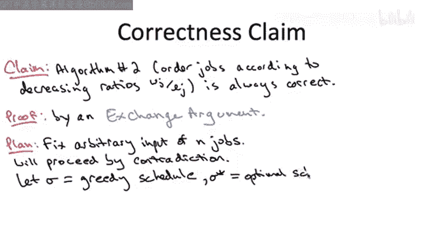
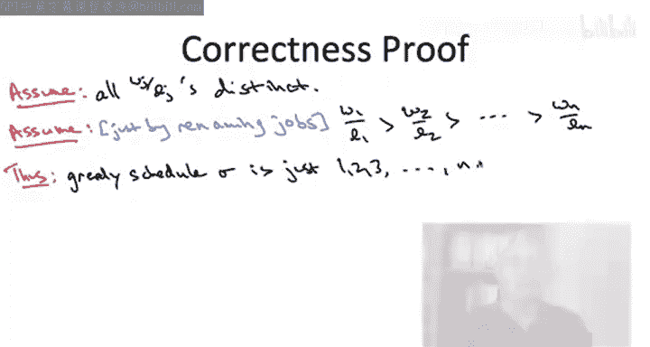
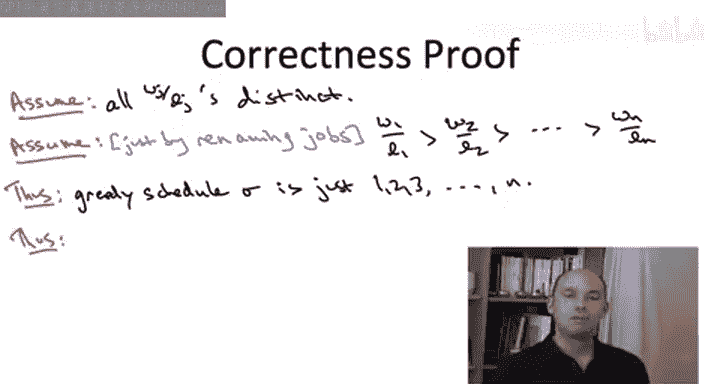
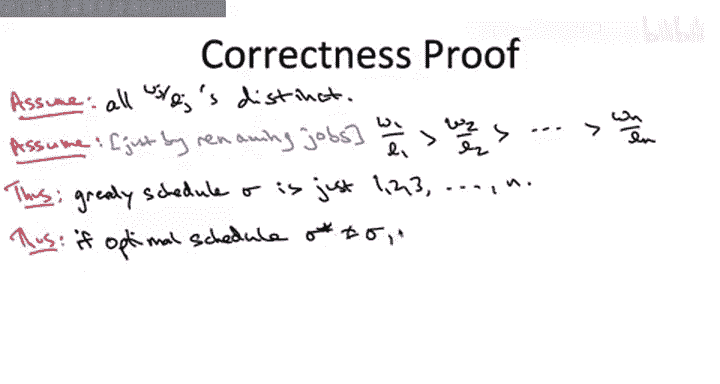
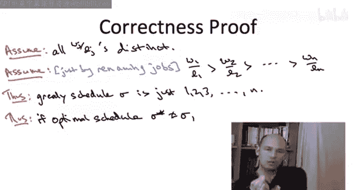
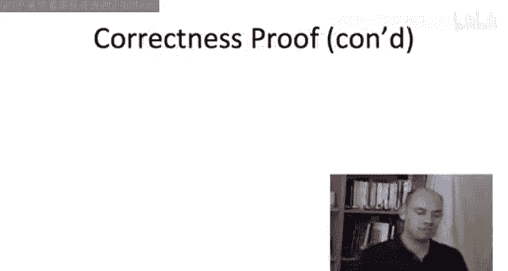
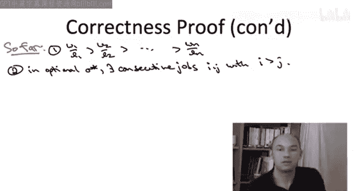

# 斯坦福大学《算法启蒙（第3册）：贪心算法和动态规划｜Part 3 Greedy Algorithms and Dynamic Programming》中英字幕 - P4：-04-A SCHEDULING APPLICATION_ Correctness Proof - Part I.zh_en - GPT中英字幕课程资源 - BV1fNVUznEtT

So now let's turn our attention to proving the correctness of this greedy algorithm we've devised that purportedly minimizes the sum of the way the completion chimes。

Let me remind you of the formal correctness claim。 The claim is that our second greedy algorithm。

 the one which looks at the ratio of each job， the ratio of the weight to the length and sorts them in decreasing order is always correct for every possible input。

 it outputs the sequence of jobs which minimizes the weighted sum of completion times。

And as promised it wasn't hard to devise this greedy algorithm。

 it's certainly not hard to analyze its running time， which is end log n the same time as sorting。

 but it is quite tricky to prove it correct。 The way we're going to do that is going to be our first example of what's called an exchange argument。

 which is one of the few recurring principles in the correctness proofs of greedy algorithms。

So I'm actually going to give you proofs of two different versions of this claim。

 Both will make use of an exchange argument in slightly different ways。

 For starters that's going be in this video in the next one。

 I'm going to make a simplifying assumption that there are no ties amongst the ratios that each job has its own distinct ratio of its weight versus its length in this case we'll be able to get away with a proof by contradiction So on this slide let me give you the highleve proof plan of how this is going go we'll start doubling into the details on the next slide So at a high level we're going to begin by fixing an arbitrary instance by which I mean just the description of the weights and lengths of end jobs。

 remember we have to prove that our algorithm is always correct so we just fix an arbitrary instance and proof correctness on this arbitrary instance。

So as I said for the case with no ties， we're going to proceed by contradictions。

 remember this means we assume what we're trying to prove is false and from that we derive something which is obviously false and consistent。

 So what would it mean to assume that this claim is false。

 it means there exists an instance for which this greedy algorithm does not produce an optimal solution for which there's some other solution not output by the greedy algorithm。

 which is better than that of the greedy algorithm。

 So let me just give you some notation to set this up。

We're going to let Sigma denote the greedy schedule。And if our claim is false。

 that means this is not an optimal schedule， there's some other one which is better。

 so call this better optimal schedule Sigma star。

So to complete a proof by contradiction， we need to derive something which is obviously false and the we're going to do that here might strike you initially as a little weird。

 but it turns out to work really well in this context from this assumption that the greedy algorithm is not optimal and there's a better schedule Sigma star。

 we're actually going to exhibits yet another schedule which is even better than Sigma star strictly smaller objective function value than Sigma star has why is that a contradiction well by assumption Sigma star is optimal。

 So if we show that there's something even better than Sigma star Sigma star is not optimal and that completes the proof by contradiction。

So now let's start filling the details of this proof plan and making it rigorous。

 So as I said in this video in the next， we're going to be assuming that all of the ratios are distinct。

 in general， of course， that need not be true。 And I'll give you a separate argument to handle the case of ties。

I'm going to make a second assumption， but unlike the first assumption。

 the second assumption has no content， it's just an assumption about notation。

 I'm going to assume by renaming jobs that job one number one is the one with the highest ratio。

 job number two is the one with the second highest ratio and so on。

 job n being the one with the smallest ratio。As a consequence of this switch in notation。

 the greedy schedule is very simple to describe it just schedules job 1 first， then job 2， second。

 then job 3， third， and so on all the way up to job N。 Okay。

 so we have one assumption which is not without loss of generality and we'll have a separate argument for handling ties。

 We have a second assumption which is without loss of generality。

 It's just an agreement amongst friends who want to minimize notation。

 And now let's actually derive something with content。

So given that the greedy schedule is just the jobs in order，1，2，3 all the way up to n。

 and given our assumption that the greedy solution is not optimal， and instead。

 there's some other distinct optimal schedule， Sigma star。

I claim that Sigma star must contain consecutive jobs that is somewhere in the schedule， Sigma star。

 I can isolate a pair of jobs， one executed after the other。

 such that the earlier of those two consecutive jobs has a larger index。

I'm going to call these jobs I and J with I being earlier， so again。

 by virtue of the optimal solution Sigma star being something other than the schedule 1，2，3 up to N。

 there must be two jobs somewhere in the schedule executed in a row。

 one after the other so that the earlier job I has a higher index than the subsequent job J。

Why is this true， Well， the reasoning is that the only schedule that has the property that indices only go up as you go from the earliest job to the latest job。

 the only way the indices will always go up is if you schedule the jobs 1，2，3 all the way up to N。

 So is no other schedule with the property that indices always go up other than 1，2。

3 all the way up to N。 So this is an observation that's going to be important in the rest of the proof。

 So make sure you pause， give yourself enough time to stare at it and convince yourself it is。

 in fact， true。 Any any schedule other than 1，2，3 all the way through N has to have consecutive jobs。

 the earlier one， having a higher index than the later one。

 So I'm now in a position to explain the exchange in the exchange argument。

 So let me just distill the two key points from the discussion so far。

So first of all， we have changed notation so that ratios are decreasing with index and this is exactly the same as the schedule that the greedy algorithm will output。

 and then assuming that the optimal schedule Sigma star is something else。

 we know it has consecutive jobs with the earlier one having a higher index。

Keep in mind our high level proof plan from the first slide of this video where we're doing a proof by contradiction。

 we need to derive a contradiction and what we're going to do is we're going to exhibit a schedule even better than Sigma star there by contradicting its purported optimality So how do we do that We do that with an exchange So these exchange is going to take the form of a thought experiment。

 We're going to take this purportedly optimal schedule Sigma star and we're going to switch the order just of the two jobs I andJ leaving all of the other jobs unchanged。

So SignA star consists of various jobs， let's call them stuff collectively， then next is job I。

 and after that immediately is job J， and then there's possibly some more jobs that get executed after J and remember we've observed that we can choose I and J so that I has a higher next than J despite being scheduled earlier。

Then we execute this exchange。The stuff before INJ is the same as before。

 the more stuff after J& I is the same before， but we're going to have them occur in opposite order。

And the key thing we have to understand next is what are the ramifications of this exchange。

 what are the costs， what are the benefits， that's how we'll begin the next video。

