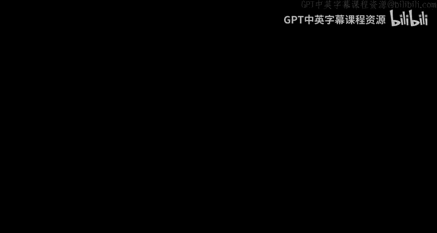

# 斯坦福大学《算法启蒙（第3册）：贪心算法和动态规划｜Part 3 Greedy Algorithms and Dynamic Programming》中英字幕 - P9：-09-HUFFMAN CODES_ A Greedy Algorithm.zh_en - GPT中英字幕课程资源 - BV1fNVUznEtT

So in this video， we'll finally discuss Huffman's algorithm。

 which is a greedy algorithm that constructs the prefix free binary code minimizing the average encoding length。

So let me just briefly remind you the formal statement of the computational problem that I left you with last time。

 So the input is just a frequency for each symbol I coming from some alphabet sigma。

 So the responsibility of the algorithm is to get optimal compression。 So to compute an optimal code。

 So the code has to be binary。 we have to use only zeros and ones。 it has to be prefix free。

 meaning the encodings of any two characters， neither one can be a prefix of the other。

 that's to facilitate unambiguous decoding。And finally。

 the average number of bits needed to encode a character where the averages with respect to the input frequencies should be as small as possible Now remember these kinds of codes correspond binary trees。

 the prefix free condition just says that the symbols of sigma should be in one to one correspondence with the leaves of the tree and finally remember the encoding lengths to the various symbols just correspond to depths of the corresponding leaves so we can formally express the average encoding length which given a legal tree capital T I'm using the notation capital L of T so what do we do we just take the average over the symbols of the alphabet weighted by the provided frequencies and we just look at the number of bits used to encode that symbol equivalently depth of the corresponding leaf in the tree T so we want the tree that makes this number as small as possible。

So this task is a little bit different than any that we've seen so far in this course all we're given as an input is an array of numbers and yet we have to produce this actual full blown tree。

 So how can we just take a bunch of numbers and produce them in a sensible， principled way。

 some kind of tree whose leaves correspond to the symbols of the alphabet So let's spin a slide just thinking about a high level where would this tree come from。

 How would you build it up given this unstructured input。

So there's certainly no unique answer to this question， and one idea which is very natural。

 but that turns out to be suboptimal is to build a tree using a top down approach。

 which you can also think of as an instantiation of the divideivide and conquer algorithm design paradigm。

The divide and conquer parannom youll recall involves breaking the given sub problemm into usually multiple smaller subproblems they're solved recursively and the solutions are then combined into one for the original problem。

Because trees， the desired output here， have a recursive substructure。

 it's natural to think about applying this paradigm to this problem。Specifically。

 you'd love to just lean on a recursive call to construct for you the left subree。

 another subca constructing the right subree， and then you con fuse the results together under a common root vertex。

So it's not clear how to do this partitioning of the symbols into two groups。

 but one idea to get the most bang for your buck， the most information out of the first bit of your encoding。

 you might want to split them in the symbols into groups that have roughly as close to as possible of 50% of the overall frequency。

So this top down approach is sometimes called Fo Shannon coding。

 Fhano was a Huffman's graduate advisor， Shannon is the Claude Shannon inventor of Information theory。

But Huffman in a term paper， believe it or not， realized that the top10 approach is not the way to go。

 the way to go is to build the tree bottom up， not only are we going to get optimal codes。

 but we're going to get a blazingly fast greedy algorithm that constructs them。

So what do I mean by bottom up， I mean， we're going to start with just a bunch of nodes。

 each one labeled with one symbol of the alphabet。 So in effect。

 we're starting with the leaves of our tree， and then we're going to do successive mergers。

 We're going to take at each step two subtes thus far and link them together as subtrees under a common internal node。

 So I think you'll see what I mean in a picture。So imagine we want to build a tree where the leaves are supposed to be just A。

 B， C and D， so one merger would be oh， well， let's just take the leaves C and D and link them as siblings under a common ancestor。

Now in the second step， let's merge the leaf B with the subtree we got from the previous merge。

 the subtre comprising the node CD in their common ancestor。

So now of course we have no choice but to merge the only two subtrees we have left。

 and then that gives us a single tree， which is in fact exactly the same lopsided tree we were using in the previous video as a running example。

So let me explain what I hope is clear and what is maybe unclear at this juncture。

 I hope what's intuitively clear is that the bottom up approach is a systematic way to build trees that have a prescribed set of leaves。

 So what do we want， We want trees whose leaves are labeled with the symbols of the alphabet Sigma。

 So if we have an alphabet with n symbols， We're going to start with just the n leaves。

 What does a merger do。 What does two things。 First of all。

 it introduces a new internal node and unlabeled node。 And secondly。

 it takes two of our old subtrees infuses them into one， merges them into one。 We take two subtrees。

 We make one， the left child of this new internal node， the other。

 the right child of this new internal node。 So that drops the number of subtes we're working with by one。

So if we start with the n leaves and we do n 1 successive mergers。

 what happens while on the one hand， we introduce n minus one new unlabeled internal nodes。

 and on the other hand we construct a single tree and the leaves of this tree that we get are in one to one correspondence with the alphabet letters as desired。

Now， what I don't expect you to have any intuition for is what should we be merging with what and why forget about you know how do we get an optimal tree at the end of the day。

 I mean even just if we wanted to design a greedy algorithm。

 if we just wanted to make a myopic decision that looks good right now， how did we even do that。

 What's our greedy criterion that's going to guide us to merge a particular pair of trees together。

So we can reframe this quandary in the same kind of question we asked for minimum cost spanning trees and really more generally with greedy algorithms。

 when you're making irrevocable decisions， what strikes fear in your heart is that this decision will come back and haunt you later on。

 You'll only realize that the end of the algorithm that you made some horrible mistake early on in the algorithm。

 So just as for MSTs， we ask， you when can we be sure that including an edge irrevocably is not a mistake is safe in the tree that we're building here we want to ask you know we have to do a merger We want to do successive mergers and how do we know that a merger is safe。

 that it doesn't prevent us from eventually computing an optimal solution。Well。

 here's the way to look at things that will at least give us an intuitive conjecture for this question。

 we'll save the proof for the next video。So what are the ramifications when we merge two subtrees。

 each containing a collection of symbols。 Well， when we merge two subtrees。

 we introduce a new internal node which unites these two subtes under them。

 And if you think about it at the end of the day in the final tree。

 this is yet another internal node that's going to be on the root to leaf path for all of the leaves in these two subtrees。

 That is， if you're a symbol。 And you're watching your subt get merge with somebody else。

 you're bummed out。 You're like， man， that's another bit in my encoding， that's yet one more node。

 I have to pass through to get back to the root。 I think this will become even more clear。

 if we look at an example。😊，So naturally we'll use our four simple alphabet ABCD and initially before we've merged anything。

 each of these is just its own leaf， ABCD， so there's no internal nodes above them in that sense。

 everybody's encoding length at the beginning is zero bits。So now imagine we merge C And D。

 we introduce a new internal node， which is the common ancestor of these two leaves。 And as a result。

 C And D are bunummed out。 They say， well， there's one bit that we're going have to incur in our encoding length。

 There's one new internal node。 We're always going have to pass through on route back to the root of the eventual tree。

Now it bows next， we merge B with the subt containing both C andD。Well。

 everybody about A is bummed out about this merger because we introduce another internal node and it contributes one bit to the encoding of each of B。

 C and D， it contributes an extra1 to the encoding of C and D and it contributes zero to the encoding of B。

 so all their encodings in some sense get incremented go up by one compared to how things were before。

Now in the final iteration， we have to merge everything together。 we have no choice。

 there's only two subtes left so here everybody's encoding length gets bumped up by one so a finally picks up a bit namely zero to encode it and B C and D each pick up an additional bit of one which is prepened to their encodings thus far and in general。

 what you'll notice is that the final encoding length of a symbol is precisely the number of mergers that its subte has to endure every time your subt gets merged with somebody else you pick up another bit in your encoding and that's because there's one more internal node that you're going to have to traverse on root to the root of the final tree。

In this example， the symbol C and D， well they got merged with somebody else in each of the three iterations。

 so they're the two symbols that wind up with an encoding length of three， the symbol B。

 it didn't get merged with anybody in the first iteration only in the second two。

 that's why it has an encoding length of two。So this is really helpful so this lets us relate the operations that our algorithm actually does。

 namely mergers back to the objective function that we care about。

 namely the average encoding length， mergers increase the encoding length of the participating symbols by one So this allows us to segue into the design of a greedy heuristic for how to do mergers let's just think about the very first iteration so we have our n original symbols and we have to pick two to merge and remember the consequences of a merge is going to be an increase in the encoding length by one bit of whichever two symbols we're going pick Now what we want to do is minimize the average encoding length with respect to the frequencies that we were given So which pair of symbols are we the least unhappy to suffer and increment to their encoding length what's going to be the symbols that are the least frequent that's going to increase our a codingding length by the least So that's the greedy emerging heuristic something's got to increase pick the ones that are the least。

Frequent to be the ones that get incremented。So that seems like a really good idea of how to proceed in the first iteration。

 the next question is how are we going to recurse， so I'll let you think about that in the following quiz。

So let's agree that the first iteration of our greedy heuristic is going to merge together the two symbols that possess the lowest frequencies。

 Let's call those two symbols， little A and little B。

 The question is then how do we make further progress， What do we do next， Well。

 one thing that would be really nice is if we could somehow recurse on a smaller sub problem。 Well。

 which smaller subproble。 Well， what does it mean that we merge together the symbols A and B， Well。

 if you think about it in the tree that we finally construct by virtue of us merging A and B。

 We're forcing the algorithm to output a tree in which A and B are siblings in which they have exactly the same parent。

 So what does it mean for the encoding that we compute that A and B are going to be siblings with the same parent。

 It means they encoings are going to be identical， save for the lowest order bits。

 So a will get encoded with a bunch of bits followed by a 0。

 B will be encoded by exactly the same prefix of bits followed by a one。

 So they're going to have almost the same encoding。 So for our recursion， let's just treat them as。

the same symbol so let's introduce a new meta symbol， let's call it A B。

 which represents the conjunction of A and B， so it's meant to represent all of the frequencies of either one all of the occurrences of either one of them。

But remember， the input to the computational problem that we're studying is not just an alphabet。

 but also frequencies of each of these symbols of that alphabet。

 so my question for you is when we introduce this new meta symbolbol AB。

 what should be the frequency that we define for this metay？All right。

 so hopefully your intuition suggested answer C that for this recursion to make sense for to conform to our semantics of what this merging does。

 we should define the frequency of this new metayal to be the sum of the frequencies of the two symbols that it's replacing。

 That's because remember this metayal A B is meant to represent all occurrences of both A and B。

 so it should be the sum of their frequencies。So I'm now ready to formally describe Huffman's greedy algorithm。

 let me first describe it on an example， and then I think the general code will be self evident。

So let's just use our usual example， so we're going to have letters AB，CD with frequencies 60， 25。

 10 and 5。So we're going to use the bottom of approach so we begin with each symbol just as its own node。

 ABCD， I'm annotating in red the frequencies 60， 25，105。

The greedy heuristic says initially we should merge together the two nodes that have the smallest frequencies。

 So that would be the C and the D with their frequencies of 10 and 5。Now。

 based on the idea of the last slide， when we merge C and D， we replace them with a meta symbol C D。

 whose frequencies is the sum of the frequencies of C And D， namely 15。 Now。

 we just run another iteration of the greedy algorithm， meaning we merge together the two nodes。

 the two symbols that have the smallest frequencies。 So this is now B25 and C D 15。

So now we're down to just two symbols， the original symbol A， which still has frequency 60。

 and the in some sense meta meta symbol BCD， who is now cumulative frequency is 40。

So when we're down to two nodes， that's going to be the point in Huffman's algorithm where we hit the base case and the recursion begins to unwind so if you just have two symbols to encode this pretty much only one sensible way to do it。

 one is a0 and one is a one。So at this point， the final recursive call just returns now a tree with two leaves corresponding to the symbols A and VCD。

And now as the recursion on winds， we in effect undo the mergers。

 so for each merge we do a corresponding split of the metaode and we replace that with an internal node and then two children corresponding to the symbols that were merged to make that meta node。

 so for example， when we want to undo the merge of the B and the CD。

 we take the node labeled BCD and we split it into2， the left child being B， the right child being C。

So the original outermost call， what it gets from its recursive call is this tree with three nodes and it has to undo its merger and merge C&D。

 so it takes the leaf labeled with the symbol CD and splits it into two。

 it replaces it with a new unlabeled internal node， left childil C， right childil D。

So how does the algorithm work in general， well， just as you'd expect。

 given the discussion on this concrete example？I'm going to take is the base case when the alphabet has just two symbols in that case。

 the only thing to do is encode one with a0， the other with a one。Otherwise。

 we take the two symbols of the alphabet that have the smallest frequencies。

 you can break ties arbitrarily， it's not going to matter， it's going to be optimal either way。

We then replace these two low frequency symbols， A And B。

 with a meta symbol A B intended to represent both of them， in some sense。

As we just discussed with those semantics， we should be defining the frequency of the medicine symbolable AB as to sum of the frequencies of the symbols that it comprises。

We now have a well defined smaller subprom， it has one fewer symbol than the one we are given。

 so we can recursively compute a solution for it。So what the recursive call returns is a tree whose leaves are in one to1 correspondence with sigma prime。

 that is it does not have a leaf labeled A， it does not have a leaf labeled B。

 it does have a leaf labeled AB， so we want to extend this tree T prime to be one whose leaves correspond to all of sigma。

 and the obvious way to do that is to split the leaf labelbeled AB replace that with a new internal unlabeled node with two children which are labeled A and B。

The resulting tree capital T with leaves in correspondence to the original alphabet sigma is then the final output of Huffman's algorithm。

 As always with a greedy algorithm， we may have intuition， it may seem like a good idea。

 but we can't be sure without a rigorous argument that is the subject of the next video。

