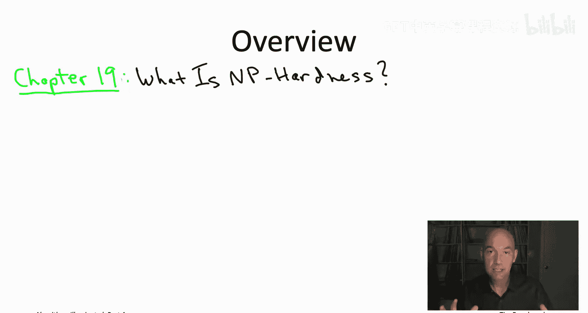
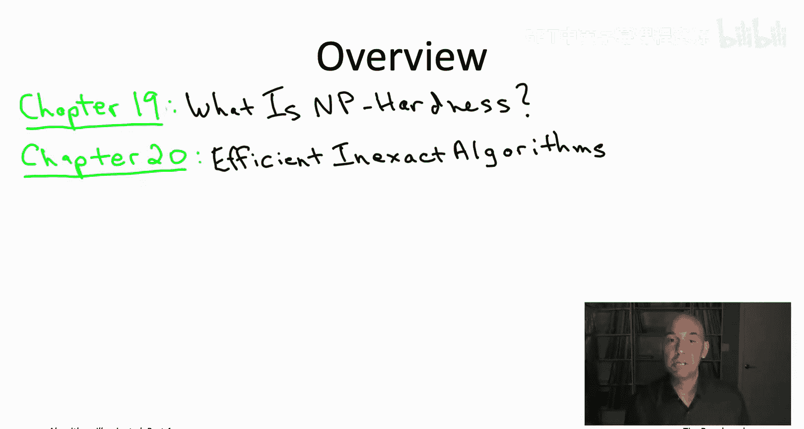
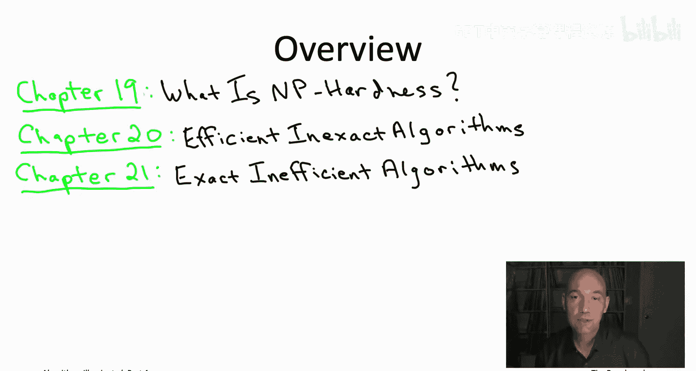
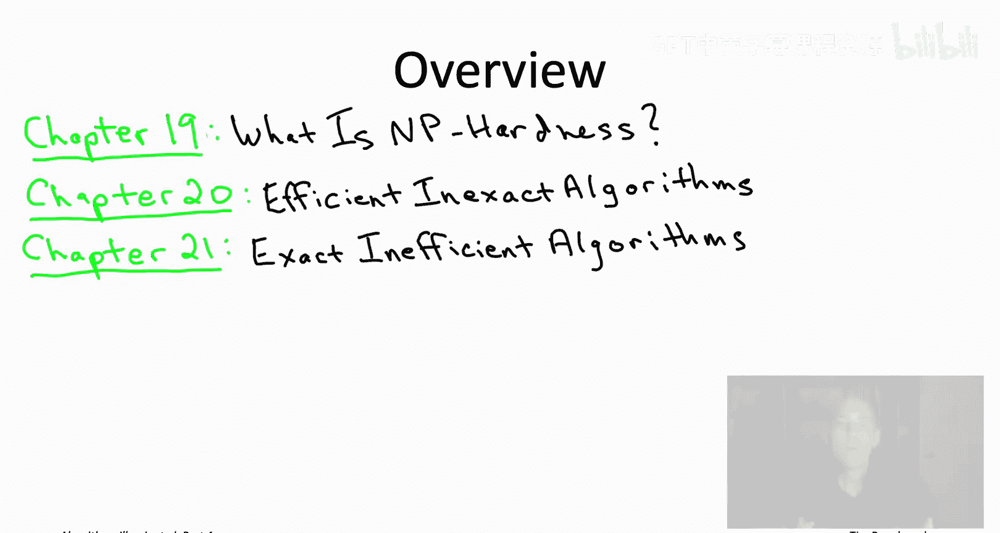
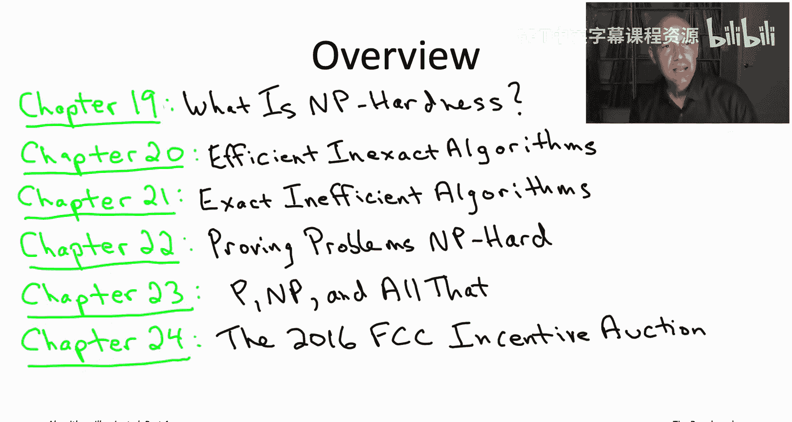

# 斯坦福大学《算法启蒙（第4册）：NP难｜Part 4 Algorithms for NP-Hard Problems》中英字幕（deepseek-R1） p01 -01-19.0_ Overview and Prerequisites).zh_en -BV1FAVUzXEum_p1-

Hi everyone， my name is Tim Roughgar and I'd like to welcome you to this video playlist that accompanies the bookArims illuminated Part four Alrithms for NP hard Proble So in this opening video I just wanted to say a little bit about the background that I'm going to be expecting you to have throughout this video playlist and also give you a brief overview of the contents。

So as far as prerequisites， I mean you know this is part four of a four part series。

 so I will be assuming you have basic familiarity with some of the most important concepts from the first few parts。

 So for example， asymptotic notation， I will assume you've seen before。

 especially big notation for analyzing the running time of algorithms I hope you've seen a couple of basic data structures。

 things like heataps or search trees， I hope you have at least some familiarity with graphs。

 So for example， the fact that you can search a graph efficiently using an algorithm like breadth or depth for search and that you can compute shortest paths sufficient using an algorithm like Dykester's algorithm and finally I hope you've seen a couple of the most important algorithm design paradigm。

 so for example， a few examples of greedy algorithms and dynamic programming algorithm。

Now you don't have to be a math whiz to make it through this video playlist。

 but I hope math isn't completely foreign to you， so for example。

 if I write down a summation sign on a slide to sum up over a bunch of numbers。

 I hope that's something that you've seen before， hopefully you've seen examples of proof by induction and proof by contradiction and if I write down a function like the logarithm function or the exponential function。

 I very much hope that that doesn't frighten you too much。

 I hope you've seen that in the recent past。So you know maybe you have this background because you've watched the previous three playlists。

 maybe you even got it because you read the previous books of the series that would be awesome。

 maybe you took a class from a different textbook a long time ago。

 that's fine however you have the background that's great。

 that's what I'm expecting you to know as we go forward。

So what is the book about the book is about NP hard problems and what to do about them。

 So it's a sad fact that a lot of the computational problems that show up in the real world are what are called NP hard and these are problems that we believe are fundamentally unsolvable by the types of always correct and always fast algorithms that have starred in the first few playlists in the first three books of this book series。

 So what that means is if you're confronted with tackling an NP hard problem in one of your own projects。

 you must compromise either on correctness or on speed。If you compromise on correctness。

 that puts you in the realm of fast heuristic algorithms。

 algorithmms that are always going to run quickly， but at least in some cases。

 will not output a correct solution。 So the goal then for the algorithm designer is you'd like a fast heuristic algorithm。

 which is at least approximately correct， in some sense。

So we'll revisit a old algorithm design paradigm， the greedy paradigm。

 and we'll see its application to the design of fast heuristic algorithms。

 And we'll also look at a technique that maybe you haven't seen before， namely local search。

 which is very effective for lots of different empty heart problems in practice。

 Our case studies in this part of the playlist will include the famous traveling salesman problem。

 problems in scheduling in team hiring and even influence maximization in social networks。😊。

The alternative is to compromise on speed， so here you're going to be designing an algorithm which is always guaranteed to be correct。

 but will not on all inputs run quickly and even you'd expect will learn in exponential time。

 at least in some cases。So here the goal is to design an algorithm which at least is an improvement over some naive algorithm like exhaustive search。

 So we'll again revisit an old algorithm design paradigm namely dynamic programming。

 and we'll see its application to beating exhaustive search for different NP hard problems and again。

 we'll look at some tools that maybe you haven't seen before specifically state of the art solvers for mixed integer programming and satisfiability problems So our case studies in this part of the playlist will include the traveling salesman problem yet again。

 finding a signaling pathways and protein protein interaction networks and even a high stakes a which was run in the US for wireless spectrum a few years ago。

This book will also give you the skill to recognize NP hard problems when they show up in the wild。

 when they show up in your own work。 And this is actually a super important skill。

 because you don't want to inadvertently waste time。

 trying to design always correct always fast algorithm for a problem If that algorithm doesn't even exist。

 So you'll acquire familiarity with several famous MP hard problems。

 ranging from say satisfiability to graph coloring to the Hamiltonian path problem。

 And you'll through examples， you'll also learn the tricks of the trade and NP hardness reductions。

 And this will give you the skills to be able to prove the new problems or NP hard as well。

 when they show up in your own work。😊，Finally， if you've ever heard of the P versus NPP conjecture and wondered what it was all about。

 that is also something you will learn in this video playlist。

 so let's look at a more detailed overview of the book's contents。

So first chapterpt 19 is all about what is NP hardness。

 so this chapter explains at a high level you know what the NP hardness is。

 what it means for the algorithm designer， what are the tools you have available to tackle problems that are NP hard and what's a simple recipe for recognizing NP hard problems when they come up in your own work and so the goal of this first chapter is really twofold。

 so first of all after this sequence of videos， you'll already have a accurate but pretty superficial understanding of what NP hardness is that already I think is useful in its own rights。

 but also this first series of videos will get you oriented and it'll give you the context when we do a deeper dive into the later chapters into the later videos。

So in the second chapter chapterpt 20， we're going to be looking at compromising on correctness so we're going to look at algorithms which are guaranteed to run quickly。

 but are only in some sense approximately correct The first half of the chapter will focus on heuristic algorithms of provable guarantees that are guaranteed to be close to optimal primarily using greedy algorithms。

 and the second part of the chapter will discuss local search and its variance。

 which often does not have provable guarantees， but is nonetheless unreasonably effective at tackling many NP hard problems in practice Chapter 21 will talk about the other type of compromise you can make with NP hard problems。

 which is compromising on speed， so you want to be guaranteed to always be correct， however。

 you're willing to run in more than polynomial time at least some of the time So here again we'll talk about half of the chapter on provable guarantees will'll show how dynamic programming algorithms can beat exhaustive search for some interesting problems。

 including the traveling salesman problem。

And we'll also look at some methods that don't really have provable guarantees。

 but again unreasonably effective in practice specifically state of the art solvers for mixed integer programming and satisfiability So those two chapters chapter 20 and chapter 21 that's really about enriching your algorithmic toolbox So if someone hands you a problem and tells you that it's NP hard then you kind of know it to do you have some things you can throw at it but there's still the question like what if there's a problem and you don't know if it's NP hard or not how do you know whether you should apply this toolbox you've just learned or go back to the old toolbox for designing fast and exact algorithms Well that's the point that chapter 22 so we want to give you the skills to allow you to quickly recognize NP hard problems So no one needs to tell you it's NP hard you can figure it out for yourself and then it is NP hard then you can default to the skills that you already gained in the previous two chapters So in these first four chapters 19 through 22 a quite superficial understanding of NP hardness will be sufficient for everything we want to discuss So as an algorithm designer if you just want the theory of NP hardness。

To guideuide you about how you should tackle various problems。

 you can get away with a pretty superficial understanding and that's all we'll be using in these first four chapters。

That said I'm sympathetic and very excited if you want to know more if you want to know say no no what really what is the mathematical definition of NP and NP Harness Maybe you heard of the P versus NP conjecture。

 maybe you want to know what is that really what is P what is NP Why should they be the same redience。

 What's the state of the art and mathematics and understanding the conjecture So we'll talk about all that in chapter 23 that's an optional set of videos for those of you that want to dig deeper into the mathematics and in particular we'll highlight the P versus N conjecture and some stronger variance like the exponential time hypothesis So to conclude as a sort of desert in the last chapter chapterpt 24。

 we're going to talk about this algorithmic toolbox in action in a real highs stakes application involving tens of billions of dollars So the application concerns an auction that was run by the FCC in the United States back in 2016 extending in the 2017 the point of this auction was to sell licenses for wireless spectrum So one of these licenses gives you the right to use a portion of this certain frequency。

In a certain geographic area， so the government wanted to sell a whole bunch of these licenses all at once in effect to the highest bidder。

Now it turns out the auction that they wanted to use for this application fundamentally involved computationally difficult problems。

 NP hard problems and so for the actual deployment of the auction that was rolled out in 2016。

 that implementation used a surprisingly wide swath of the toolbox that you will learn in this playlist in that case study we'll see everything from graph coloring problems to fasturistic algorithms based on greedy algorithms to the use of satisfiability solvers so all of that is meant to sort of tie all of the themes of the book and of this video playlist together in one place。

 but also I hope it just kind of shows you that you know this is a pretty sophisticated toolbox you will have mastered by the end of this playlist and it's actually something that can be a make or break skill in important applications so that's an overview of what you'll learn if you go ahead and go through this whole playlist or go through the book let's proceed to what is NP hardness。

