# 斯坦福大学《算法启蒙（第4册）：NP难｜Part 4 Algorithms for NP-Hard Problems》中英字幕（deepseek-R1） p02 -02-19.1_ The Algorithmic Mystery of MST vs. TSP).zh_en -BV1FAVUzXEum_p2-

Hi everyone and welcome to this video that accompanies Section 19。

1 of the book algorithms illuminated Part 4。 It's a section about an algorithmic mystery between two similar seeming but computationally very different problems。

 the minimum standing tree problem and the traveling sales problem。

 This video is the first one from Chapt 19 about what is in peak hardness Now。

 many introductory books on algorithms， including the first three parts of algorithms illuminated。

 they suffer from a sort of selection bias They focus on problems where they are always correct and always fast and usually quite ingen algorithms。

 because after all， what's more fun and empowering to learn than a clever algorithmic shortcut。

Unfortunately， this cherry-picked collection of problems misrepresents the reality where the specter of computational intractability haunts the algorithm designer。

 So even though there are a lot of problems that do have these always fast and always correct algorithms。

 You've seen many examples sort of in searching computer connected components of a graph short as path。

 sequence alignment etc ceter， there are a lot of important problems with always fast。

 always correct algorithms， there's a lot of other problems。

 including ones that are likely to show up in your own work or that seems to not be the case。

 problems that are fundamentally unsolvable by always fast and always correct algorithms。

 newly aware of this stark reality， two questions come immediately to mine So first of all。

 how can you recognize when a problem is one of these hard problems。

 so that you don't inadvertently waste time trying to come up with an always fast。

 always correct algorithm for it。 Secondly， when you do know that a problem is intrinsically computationally difficult。

 how should you revise your ambitions。 and what tools do。

Have in your algorithmic toolbox to achieve those relaxed ambitions so the point of this video playlist and the point of part four of algorithms illuminated is to equip you with very thorough answers to both of these questions。

So hard computational problems can actually look a lot like easy ones。

 and you do need appropriate training to be able to tell them apart。

 Let's start with a problem which I hope is familiar to you。

 the famous minimum spanning tree problem。So the input in the minimum spanning tree problem is an undirected graph the graph should be connected。

 meaning it's all in one piece so you can go from any vertex to any other vertex in the graph using a path that is you do not have disconnected pieces So a connected underdirected graph where each edge has a real valued edge cost or I'm going to denote that by c sub B for an edge E the responsibility of an algorithm for the MST problem is to compute a spanning tree of the graph and among all spanning trees it should compute one that minimizes the sum of the cost of the edges in the tree So just to remind you by spanning tree it's what it sounds like it's a tree so there's no cycles and in other hand it's spanning so it covers all of the vertices of the graph in other words for each pair of vertices V and W there should be a path in the spanning tree capital T from V to W So for example。

 let's consider a graph with four vertices in five edges。

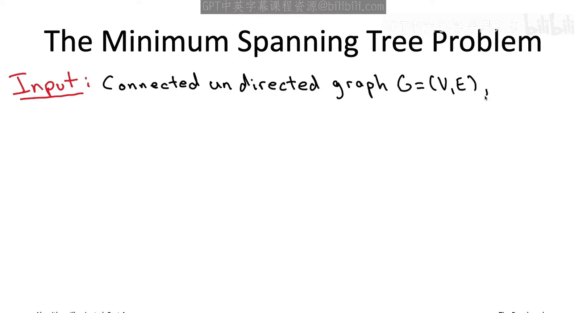

Each of the edges is labeled with its cost。So if you stare at this graph for a little while。

 you realize that the minimum cost spanning tree has the edges of cost 1，2 and4。

 So if you think about it because you have four vertices you need to connect together。

 you're really going to need three edges to do it and the only triple of edges with less cost than the one two and the four is the one two and the three so they form a triangle so that would be neither acyclic nor would it span So the best you can do is the one and the two and the four So the minimum spanning tree in this example has total cost7。

 So how hard is the minimum spanning tree problem。Now on the one hand。

 a graph can have an awful lot of spanning trees。 So for example。

 there's a famous result in combinatorics known as Kaley's theorem which says that if you have a graph with n vertices and it's the complete graph。

 meaning all n choose to edges are present the complete graph on n vertices has n raised to the n minus2 different spanning trees So at this stage of the book series you should be very sort of familiar with the idea that exponential numbers get very big very quickly So for example an n to the n minus2 already if you plug in n equals 50 that that winds up being more than the estimated number of atoms in the known universe。

 So what does that mean for us graph can have a ton of spanning trees Well that says that the most naive algorithm you can think about exhaustive search where you literally just go spanning tree by spanning tree and remember the best one that you've ever seen that is a totally hopeless algorithm to implement except in the tiniest of graphs So there's a lot of spanning trees is exhaust search is definitely not going to be a fast algorithm but the other thing that you hope。

do know is that despite the exponential number of possibilities。

 there are fast algorithms that sort of very quickly home in into the best of all of the spanning trees So two that we talked about at length in previous videos were Prims algorithm that's the one that's a little bit like Dykster's algorithm or sort of slowly grows a tree to spread over the whole graph。

And then we also talked about Crusco's algorithm， which sorts the edges and goes through them in a single pass and sort of grows the spanning tree like the little pieces that fuses together at the end and we saw both of those algorithms if you use the appropriate data structures so heaps for ps algorithm or union find data structure for Cruescoll's algorithm both of those have blazingly fast implementations they can be implemented to run an almost linear time linear plus an extra logarithmic factor so barely more time needed than to read the input is pretty amazing and even more amazing when you think about the needle in the haystack that they're finding this is huge huge number of spanning trees and some of the very quickly identify which is the best of them all Now let's look at a second famous problem the traveling salesman problem so we actually have not even mentioned this problem in in the previous playlist in the previous books but as we'll see in part four the traveling salesman problem will really play a starring role it's one of the most famous NPpR problems What's funny is the problem sounds an awful lot like the minimum spanning tree problem So the input like in the MS。

T problem is going to be an undirected graph and the MST problem we assume it was connected for the TSP it's convenient to assume that it's a complete graph。

 meaning all n choose to edges are present or n is the number of vertices like in the MST problem each edge is going to have a real valued edge cost Now don't get put off by the fact that it was connected in the MST problem and complete in the TSP really that's a totally superficial distinction So for example you know the regular MST problem is totally equivalent to the MST problem on complete graphs because if you gave me an incomplete graph I could just add in all of the missing edges and give them super high costs so the MST would never use one of these super highcot edges it would just find the MST in the original graph so it's more or less without loss of generality when we say the graph is complete。

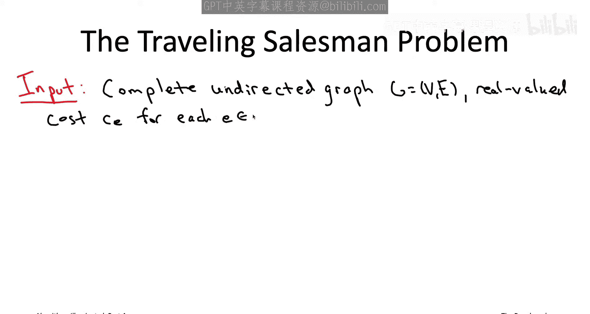

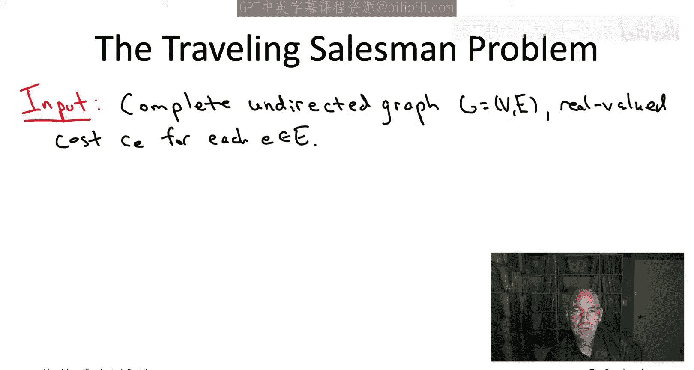

The responsibility of an algorithm for the TSP is to return not a spanning tree。

 but a tour or traveling salesman tour， again with the minimum possible sum of edge costs。

 So what is a traveling salesman tour， Well， it's just a walk through a graph that visits every single vertex exactly once and ends where it began。

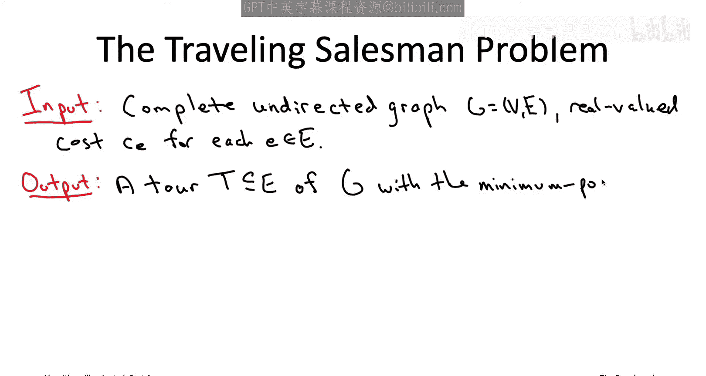

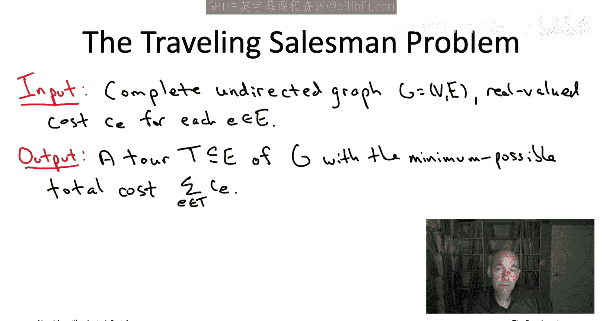

So， for example， imagine a complete graph with four vertices。

 One tourra would just follow the perimeter， So the four edges around the boundary。

 A different tourra would use the zigzag edges。 So just as a sanity check that you see what I mean by a tour of a complete undirected graph。

 let's move on to a quiz。

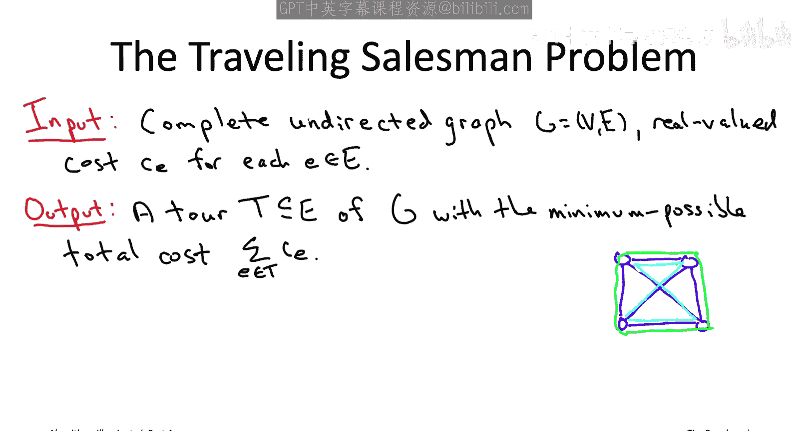

So the question is in a traveling salesman problem instance that has n vertices where n is at least three how many distinct traveling salesman tours are there and here in the answers。

 the end with the explanation part that's the n factorial function so that's the product of all of the integers between1 and n so for example。

 three factorial is 64 factorial is 24，5 factorial is 120 and so on note that the factorial function grows even faster than the function2 to the n So as usual when I give you a quiz。

 I encourage you to pause the video here and think about the quiz for a while then come up with your guess of the answer and then unpos the video and we'll discuss the solution。

Okay， so the correct answer is B1 half times n minus1 factorial。 So for example。

 if n was equal to four， this would be three different tours。 So on the last slide。

 we looked at the complete graph on four vertices。 We looked at two of the tours there's also a third tour。

 which again uses the zigzag edges， but this time uses the edges on the side rather than the edges on the top and bottom in general。

 the formula is one half times n minus-1 factorial。 So why is the answer B。

 you may sort of see that there's an intuitive correspondence between traveling salesman tos and orderings of the vertices the tor kind of feels like。

 oh yeah， you just choose an ordering in which you visit the vertices。

 So that would sort of suggest D might be the right answer。

 But actually all of the vertex orderings that that double counts tos actually counts each to total of two times n times。

 First of all， it overcounts a to because it counts at n times for each choice of the starting vertex doesn't matter what starting vertexes you wind up with the same tour at the end of the day。

 Also a tourr。

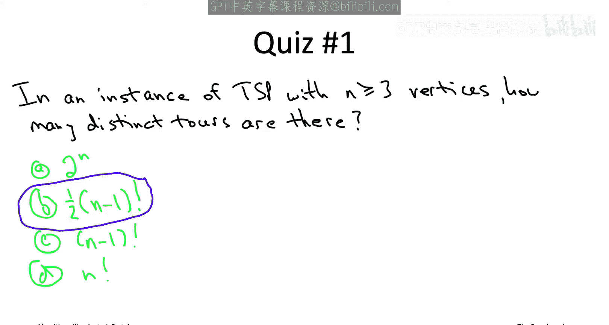

traversed in either direction to those give you two different orderings so each distinct tour gives you two n different orderings there's n factorial orderings。

 so that leaves you with one half times n minus1 factorial distinct tours So that's a lot of tours。

 but it does at least show that the traveling salesman problem can be solved in a finite amount of time finite but large amount of time If nothing else you could solve the traveling salesman problem by exhaustive search systematically enumerating each of these one half times n minus1 factorial tours and remembering the best one Try exhaustive search out yourself in a four vertex example。

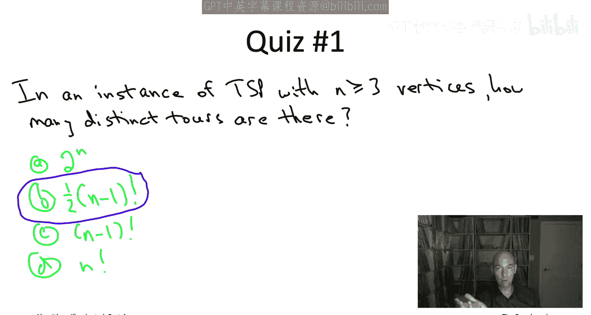

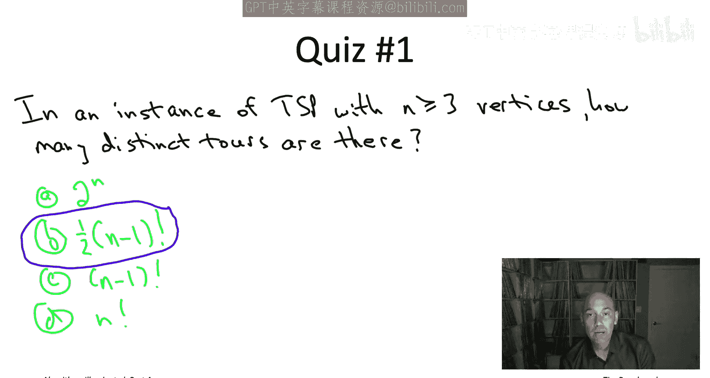

Okay so the correct answer to this quiz is the second one B13。 And again。

 one way you can see this is just to enumerate the three different tours you have in this four vertex graph。

 So there's the one around the sides， that does indeed have 13。

 there's the zigzag path that uses the top and the bottom edge that has overall cost 15 And then there's the one that uses the zigzag and the edges on the side and that has overall cost 14。

 So the cheapest of those options is 13 the tor that goes around the perimeter。 So that's fine。

 if you have a tiny instance like this So four vertices or maybe five or six vertices。

 no big deal to just enumerate the exponentially many tos and remember the best one。

 But this is going to work out only in the smallest of instances and as algorithm designers。

 it is our duty to ask the question can we do better than naive exhaustive search。

 Could there be analogous to the MST problem an algorithm that magically ho in on the minimum cost needle and the exponential size haystack of traveling salesman。

And despite the superficial similarity of the statements of the two problems。

 the traveling salesman problem actually appears to be fundamentally much more difficult than the minimum spantry problem。

 So I could tell you a cheesy story about the traveling salesman problem involving a traveling salesman but that would really do a disservice to the problem which is actually quite fundamental whenever you have a whole bunch of task that you want to get solved and the cost of completing a task depends on the preceding task that you completed boom。

 you've got an instance of the TP。 So for example， you could imagine that you're assembling a bunch of different cars in a factory and you could imagine that the factory needs to be kind of in a certain configuration in order to assemble a particular car and you can also imagine that there might be a setup cost transition cost while you reconfigure the factory for a car of type A with a car of type B So if you have a bunch of different cars you need to assemble and you're trying to figure out the right sequence in which to sequence them so that they're all assembled as quickly as possible with the minimum setup time。

that's exactly the traveling salesman problem or for a very different application and computational genomics。

 you could imagine that maybe you have a bunch of short fragments of a genome that are partially overlapping and you would like to reverse engineer the most plausible ordering in which those fragments appear on the genome So if I give you a sort of pairwise plausibility measure for each para fragments。

 how likely they are to be adjacent for example， maybe based on the length of their long longest common substream。

 then to reverse engineer the most plausible ordering that again is exactly a traveling salesman problem So if you want to learn more about the many applications to the traveling salesman problem and also a lot about its fascinating history。

 there's a nice book from 2006 by Applegate Dixby Faal and cook which you can check out So the TSP has always had a lot of natural applications it also evidently has tremendous aesthetic appeal and so because of those two reasons many of the greatest minds and optimization have that long and hard about。

Algorithms for the TSP dating back at least to the 1950s there's been very。

 very serious people thinking hard about how to solve the TSP and despite 70 years of effort with many brilliant minds involved at this day。

 currently it's 2020 there is no known vast algorithm for the traveling salesman problem。

 no one has yet come up with even close to as good a algorithm as the Pris and Cruescos algorithms that we have for the minimum spanry problem。

SoTo be a little more precise， I should say what I mean by a fast algorithm and remember way back sort of in part one of the book series or early on in these video playlists。

 we agreed that by a fast algorithm we should mean an algorithm whoses running time scales linearly or close to linearly in the size of the input Now thatll be a blazingly fast algorithm Now here I'm actually just talking about a very relaxed notion of the fast algorithm and talking about an algorithm with any polynomial running time so forget about blazingly fast running times no one even knows an algorithm for the traveling salesman problem guaranteed to run and end the 100 time or and is the number of vertices or even ended the 10。

000 time we don't even know that Now there are two possible explanations for this dismal state of the art the fact that we don't know any algorithm with guaranteed polynomial running time solving the TSP explanation number one would be actually there is a fast algorithm out there and just we haven't been smart enough to figure out what it is it's waiting to be discovered。

It's possibility one Po number two is that actually the reason we haven't found such an algorithm is because there literally is no algorithm。

 that type of algorithm does not exist。 So to this day we don't know which of these two situations is the real one whether there is an algorithm and we haven't found it or whether there's no algorithm but most experts believe in the second of those explanations that's equivalent to what's known as the P nu equal to NP conjecture and actually all the way back to 1967。

 which is actually before the P versus NP question was formally identified Jack Edmonds in a famous 1967 paper called optimum branchings。

 he conjectured that in fact， there is no good algorithm for the TSP whereby good Edmonds meant with running time scaling like a polynomial function in the input size So the TSP is an example of an NP hard problem and that means under this famous mathematical conjecture。

 the P nu equal to NP conjecture if that conjecture is true。

 then indeed Edmds is right There is in fact no。

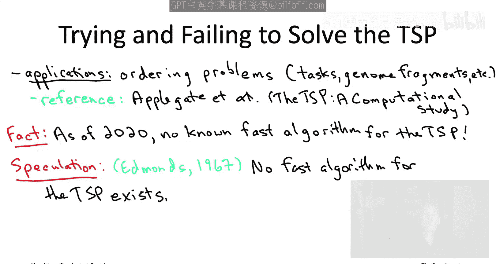

Garanteed polynomial time algorithm for the TP and what we'll see as we go on is that it's not just the TSP that's NP hard unfortunately computational intractability is actually a widespread phenomenon many many many many problems or NP hard just as computationally difficult as the traveling salesman problem so moving on to the next video we'll talk about the different levels of expertise in NP hardness that you might want and which part of the playlist is best suited for that desired level of expertise I'll see you then。

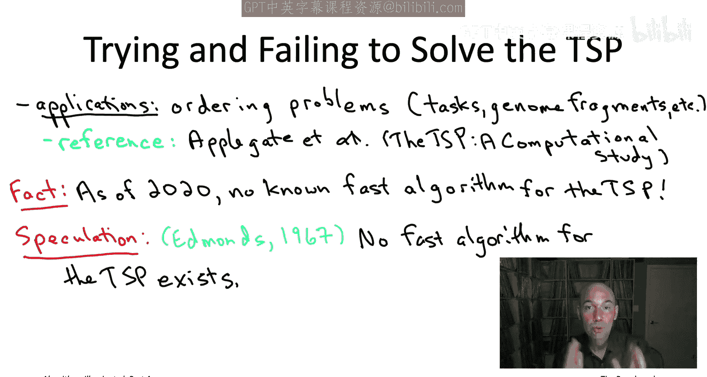