# 斯坦福大学《算法启蒙（第4册）：NP难｜Part 4 Algorithms for NP-Hard Problems》中英字幕（deepseek-R1） p03 -03-19.2_ Possible Levels of Expertise).zh_en -BV1FAVUzXEum_p3-

Welcome to this video that accompanies section 19。2 of the bookArims illuminated Part4。

 This section is about identifying what level of expertise you're after in terms of mastering NP hardness and its algorithmic implications。

 So what are the levels of expertise that you might have now and that you might want in the future Well let's start with the sort of level of total ignorance level0 So at level0。

 you've literally never heard about NP hard problems。

 you're unaware that certain computational problems seem fundamentally intractable and unsolvable by fast algorithms and of course you don't know what to do about those problems if you encounter them。

 So if I've done my job， this video playlist should be accessible even to those of you that are starting out with level zero knowledge about NP hardness So level1 is sort of cocktail party level awareness about NP hardness where you roughly know what someone meant if they mentioned it I'm speaking here of course as always but only the neriest of cocktail parties So you would know that an NP。

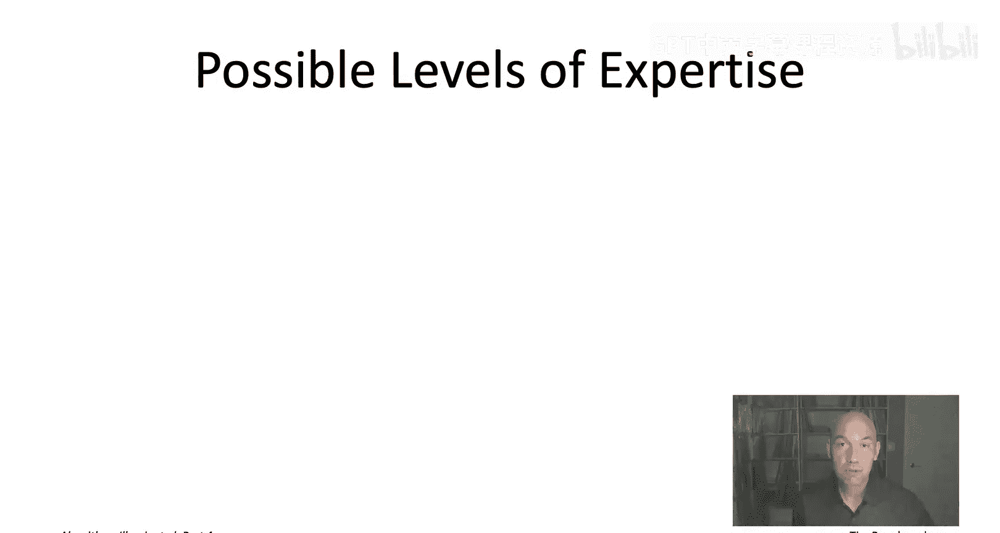

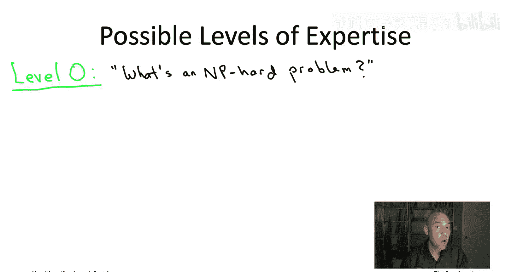

Problem， you need to do something about it。 You need to reformulate the problem。

 You need to scale down your ambitions for solving the problem or you need to invest a lot more resources。

 probably both human and computational into getting that problem solve So for example。

 if you're managing a software project that has an algorithmic component you're going to want to have at least level1 expertise in case one of the engineers on your team tells you that they've encountered an NP hard problem in the course of the project If you're content to stop at level1。

 it's sufficient to just read chapter 19 of the book。

 So just to watch this initial sequence of videos that will bring your level up to level 1 So if you're a software engineer interested in algorithms reaching level2 that's probably the level that's the most empowering at level2 you have a rich algorithmic toolbox for making headway on NP hard problems when you encounter them in your own project happily we'll see that all of the algorithm design paradigms that showed up in previous books of the series especially greedy algorithms in an。

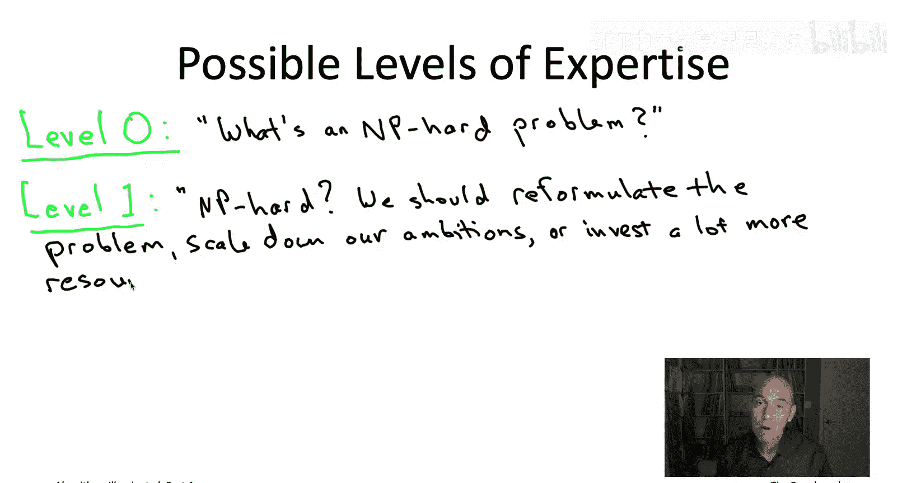

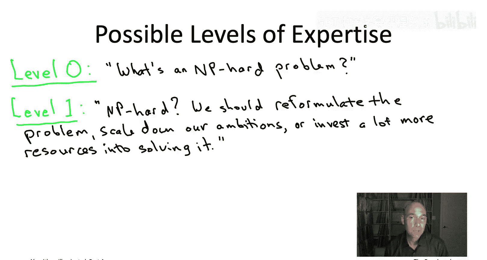

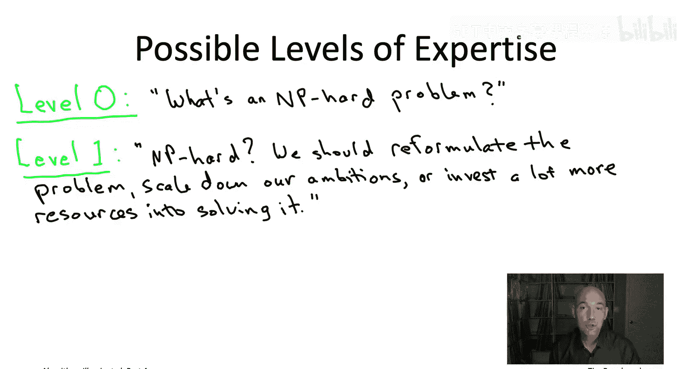

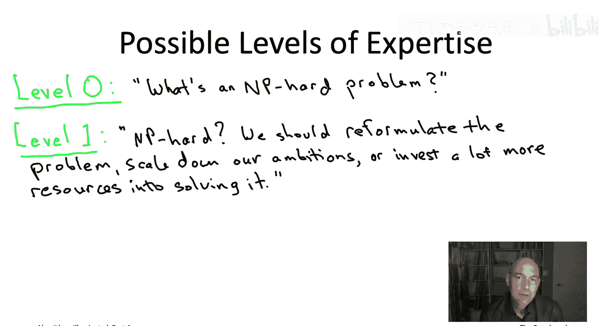

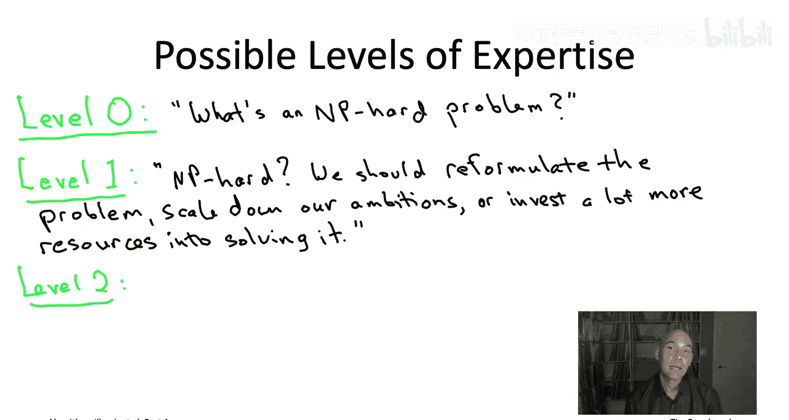

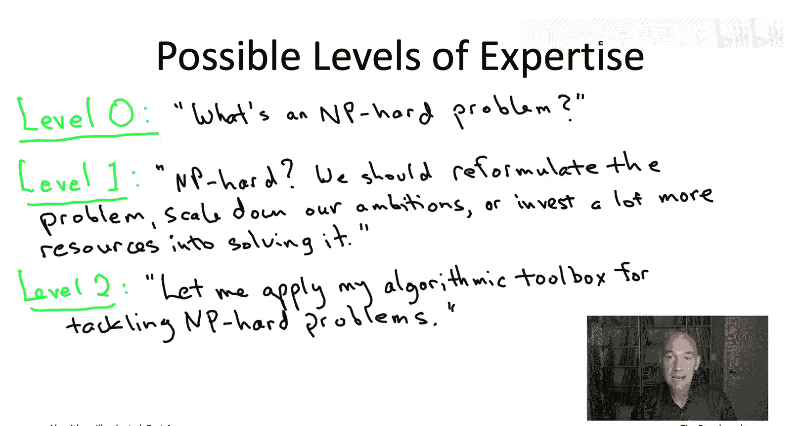

Dynamic programming they will also be part of the toolbox for making progress on NP hard problems and we'll also see some new tools to add to the toolbox like local search and mixed inger programming solvers to bring your level up to level 2 you'll want to read chapters 20 and 21 of the book or watch the corresponding videos chapter 20 will specializing in fastturistic algorithms or where you give up on correctness but retain speed and then chapter 21 is the opposite compromise where you're always correct and you hope to do at least somewhat better than naive exhaust search So at level3 of expertise you not only know what to do with NP hard problems when you encounter one you also know how to spot them so at this level your colleagues will actually come to you with your problems to help you diagnose whether they need to just think harder about a fast and correct algorithm or whether indeed that problem is NP hard so as you can imagine when I'm sort of advising either students or colleagues or people from industry。

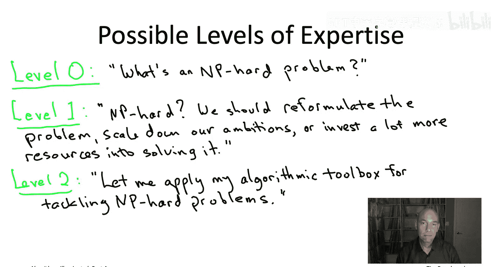

UmI often draw on both the level two and level three toolboxes。

 of course once you've applied the level three toolbox to figure out that the problem is NP hard。

 at that point you can switch to the level toolbox and design algorithms to do the best that you can given that the problem is NP hard。

Finally， the black belt level of mastery and NP hardness level4。

 that's really for sort of budding theoreticians are people who really want to a deep mathematical understanding of what NP hardness in the P versus NP conjecture is all about so at this level you could actually grab a marker and go to a whiteboard and sort explain to your colleagues exactly what this whole P versus NP business is so that'll be covered in the optional videos corresponding to chapter 23 everything else in the book we can understand perfectly without reading chapter 23。

 but if you want that deeper mathematical understanding you should definitely check out the videos corresponding to chapter 23 So those are the levels of expertise that you might want to shoot for and it's really up to you you should decide how much time you want to invest in mastering NP hardness and what level it's worth your time to get to I hope these videos that clified the optimal way to spend your time so that you know exactly what to read and what to watch given the level that you want to reach So having said all that now let's sort of proceed to the meat。

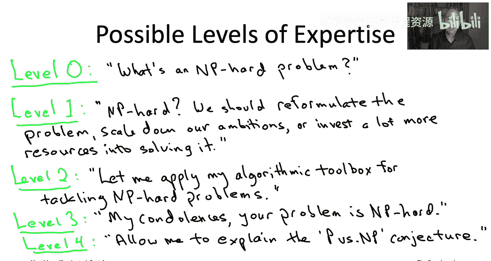

terial in chapter 19 and start developing our informal understanding of what do we mean by an easy problem and what do we mean by a hard problem I'll see you then。

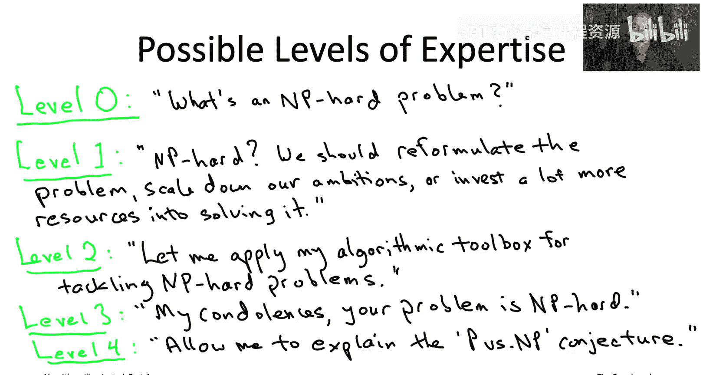

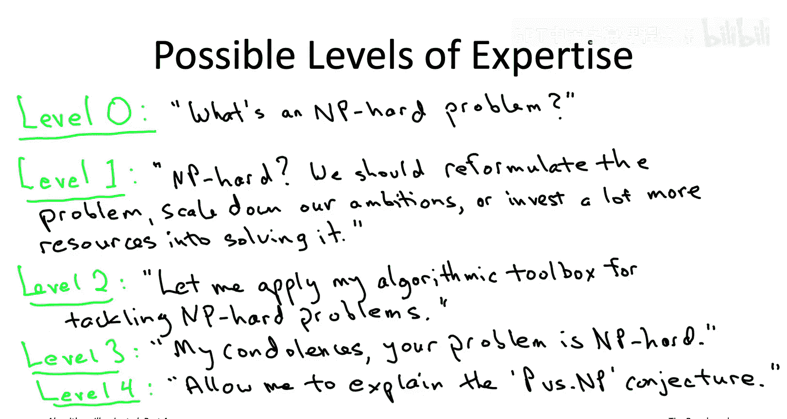