# 斯坦福大学《算法启蒙（第4册）：NP难｜Part 4 Algorithms for NP-Hard Problems》中英字幕（deepseek-R1） p04 -04-19.3_ Easy and Hard Problems).zh_en -BV1FAVUzXEum_p4-

Hi everyone and welcome to this video that accompanies Section 19。

3 of the bookArithms illuminated Part4。 It's a section about an initial informal understanding of what it means for a problem to be computationally easy or computationally hard so some computational problems are easier than others and the point of the theory of NP hardness is to classify in a precise sense which problems are easy like the minimum spanning tree being one example and which problems are hard。

 the traveling salesman problem being an example。 So let me just sort of give you an oversimplified dichotomy of what the theory of NP hardness says。

So in the theory of NP hardness， what we're going to mean by an easy problem is a problem that can be solved by an algorithm whose running time scales as a polynomial function of the input size Ideally you've got a blazingly fast implementation like a near linear time algorithm like we have for the minimum spanning tree problem。

 but for the purposes of the theory of NP hardness， a quadratic time algorithm would be fine。

 a cubic time algorithm would be fine， even a one to the 100 algorithm where n is the input size would qualify a problem as being easy for the purposes of this dichotomy。

Whereas a hard problem and TSP is conjectured to be hard in this sense。

 a hard problem is one that's going to require an exponential amount of time in the worst case。

 So any correct algorithm there will be inputs with a running time of that algorithm scales like an exponential function of the input size Now mind you。

 this dichotomy is not 100% accurate I I'm giving you an oversimplified version just to get us started overlooks a number of subtleties that we'll discuss in detail later but you know10 years from now。

 if you remember only kind of a few phrases about the theory of NB hardness and what it says。

 this is a pretty good oversimplified dichotomy to just。

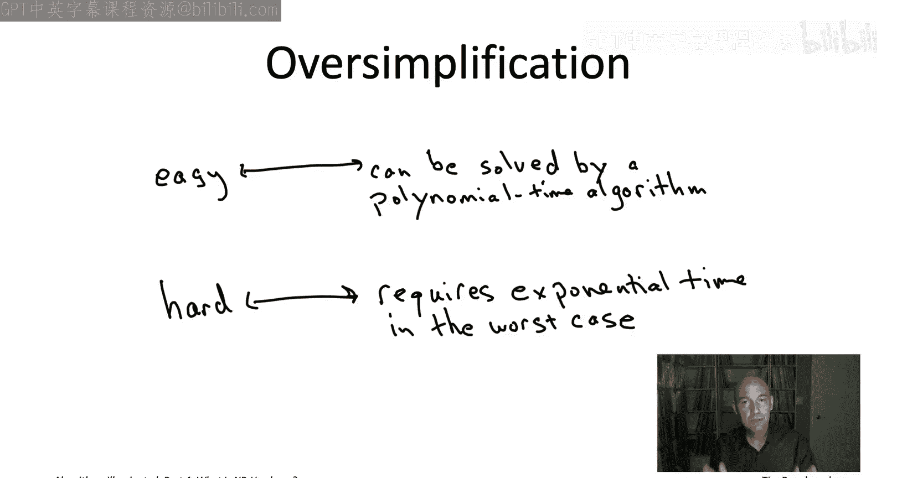

To keep in mind。So let's now go into the details a little bit more。

 let's start with easy problems problems that are solvable in polynomial time We've seen many such problems that's actually been the whole point of the first three parts of the book series in the previous video playlist so let's just recall some of the examples that we've seen so far of polynomial time algorithms that exactly solve interest computational problems So for example very early days we saw the merge short algorithm so we saw that sorting is an easy problem because as's an algorithm merge short whose running time runs in almost linear time So n log n or N is the array。

In the context of graph search， we saw Casa Raju's linear time algorithm for computing the strongly connected component of a directed graph。

 you might remember this was the algorithm where you do two passes of depth first search to compute the strongly connected components that was linear time O of M plus n but here I'm using M to denote the number of edges in the graph and n to denote the number of vertices。

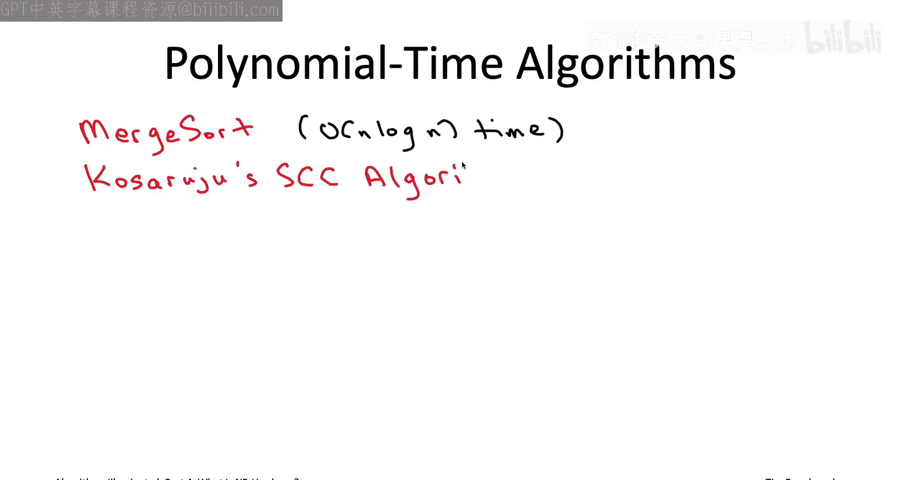

One of the greatest hits of what we've discussed so far， of course。

 is Dycetra's shortest path algorithm， so that takes I input a directed graph with nonnegative edge lengths along with the starting vertex and it tells you the distance of the length of a shortest path from the starting vertex to every other vertex in the graph。

 just like Prim's MST algorithm that runs for basically the same reasons in near linear time。

 so blazingly fast implementation， solving the shortest path problem when all the edge lengths are non-negative。

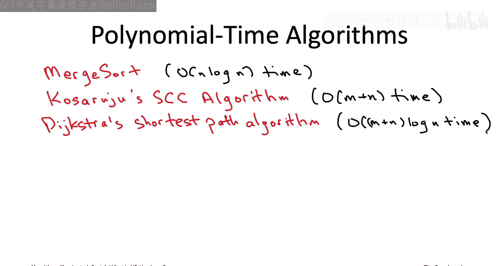

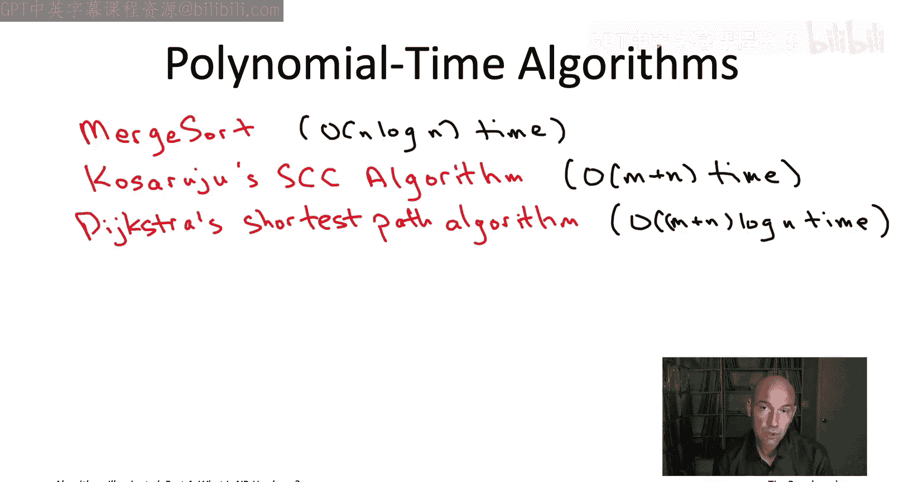

And as we mentioned， it's not just Prim's MST algorithm。

 the Cruescle's MST algorithm also implemented with suitable data structures gets you a blazingly fast near linear running time。

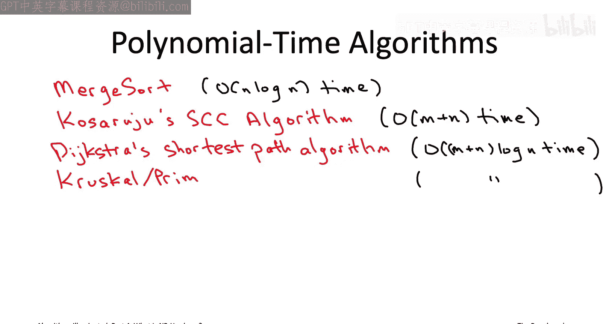

So back when we were discussing dynamic programming algorithms。

 we talked about the sequence alignment problem where you've given two strings and you want to find a nice alignment between them where you pay a penalty for inserting gaps and you pay a penalty for mismatching pairs of distinct characters so there we never saw a linear time algorithm for that problem and actually we'll see much later in this playlist evidence of why we haven't seen a linear time algorithm for it。

 but we did see a polynomial time algorithm for it。

 a dynamic programming algorithm ran an O of M times n time where M and N denote the length of the two input strings。

 so that's bounded above by a polynomial function of the input size the input size being M plus N。

And one of the slowest algorithms that we've seen also from the dynamic programming discussion is the Floyd Warshll algorithm for all pairs shortest paths。

 so here I give you a graph with real valued edge lengths but no negative cycle in the Floyd Warshll algorithms going are running cubic time into the third or n is the number of vertices and it's going to tell you the shortest path distance between each of the N choose two pairs vertices in the graph and the point of doing this enumeration is's just to observe that know we've talked about lots of efficient algorithms for lots of different computational problems you know it was great when we got linear and near linear time but that didn't always happen some of the harder problems we had algorithms that ran in quadratic or even cubic time but the point is all of these algorithms have running time bounded by some polynomial function of the input size all of these are polynomial time algorithms。

Precisely what is a polymermlhe algorithm， well just generalizing these。

 it's an algorithm that runs in time big O of n to the D。

 where n is the length of an input and D is some constant independent of n。So if D equals1。

 you'd be talking about a linear time algorithm if d equals 2， a quadratic time algorithm， D equal3。

 a cubic time algorithm and so on So in the definition of a polynomial time algorithm。

 it's crucial that the D， the exponent D is just a number like three or four it should not depend on N so n to N that's not a polynomial time algorithm because D depends on N。

Now this might seem like a very permissive definition right because yeah you know hopefully an algorithm you know has near linear time but in principle you know if D is equal to 77 that would still count as a polynomial time algorithm according to this definition That said I mean we have seen algorithms which are not even polynomial time you know even that even meet this very permissive definition remember any exponential function grows faster than any polynomial function so for example two to the end will eventually grow much。

 much much faster than end to the 77 now for example in the MST problem we saw that there is an exponential number of spanning trees and so exhaustive search for the MST problem would be exponential time that would not be a polynomial time algorithm there are other algorithms for the MST that are polynomial time like prim and crustco but exhaustive search is not a polynomial time algorithm for the MST problem so there's really something special and clever about the polynomial time algorithms that we've seen so far so here's just a quick。

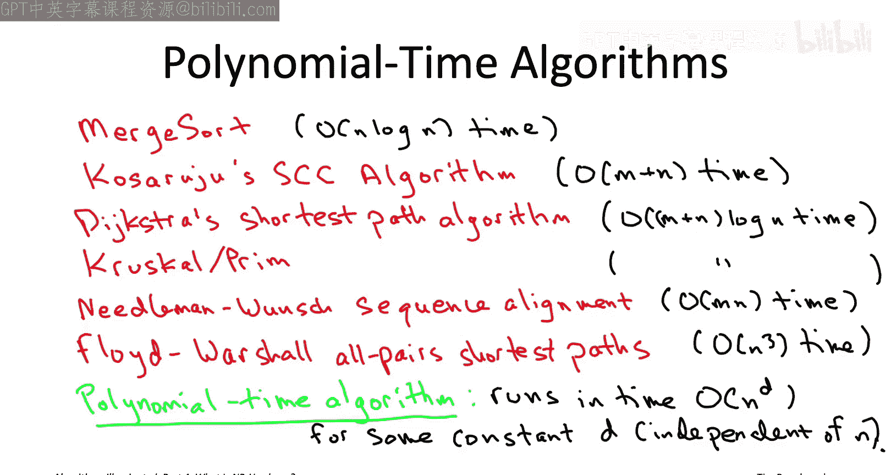

t to drive home this point that every exponential function eventually grows much， much， much。

 much faster than any polynomial function， this graph shows in the solid line。

 the graph of 100 times n squared， and in the dotted line shows the exponential function2 to the M。

And so initially for small values of n right the dashed line is lower because there's a high constant factor in front of the n square there's a factor of 100 there。

 but this picture is totally characteristic of what you see with polynomial versus exponential running times at a quite reasonably modest input size you input something like 13 or 14 the two curves cross and after they cross the exponential function grows way。

 way way faster than the polynomial function so the gulf between the two functions is huge and the bigger n is the bigger the gu gets。

One interesting implication of that is whenever anyone talks about sort of Moore's law and computers getting faster and just being able to over time solve kind of anything we could imagine。

 what's important to realize is that actually， Moore's law doesn't make sort of polynomial versus exponential time distinctions less relevant。

 it actually makes them more relevant。Because don't forget as our computational power grows so do our computational ambitions we look at bigger and bigger problem sizes once we have bigger disks。

 bigger memory， faster CPUs etc and the bigger the input size。

 the more dramatic the difference between a polynomial time algorithm and an exponential time algorithm so this is not a distinction that's going away this is distinction that's becoming ever more important as technology advances So for a different way to think about the difference between polynomial and exponential running times。

 you might want to think about the sort of very realistic scenario where you have some fixed time budget like you're willing to run a program for an hour but that's it are you willing to run it for a day but that's it and the question then is how big an input how big a problem size can you handle in this fixed time budget like in an hour and what's so great about polynomial time algorithms is that as you speed up your computer the input sizes you can accommodate it also speed up multiplicatively So for example。

 if you had a linear time algorithm and you double the amount of your computational budget you would double the size of the inputs that you can handle。

If you had a quadratic time algorithm， it wouldn't increase by as much。

 but it would still increase by a multiplicative factor of square root of two。

Whereas if you had an exponential time algorithm， like say something with running time2 to the N then all of a sudden you double your computing power and it increases the size of the problems you can solve by plus one So if you can handle inputs of length a million before you've just got a twice as fast computer and now you can handle inputs of size a million and one wow so that's a pretty big difference so really polynomial time algorithms are the one thats see benefits of increasing technology exponential time algorithms arere going to be slow till the end of time So in the theory of NP hardness then one defines an easy problem as a problem solvable by a polynomial time algorithm or equivalently solvable by an algorithm whose input size that can accommodate in a fixed period of time scales multiplicatively with the amount of computing power So for example all of the problems we just discussed like sorting shortest paths。

 all pair shortest path sequence alignment， minimum spanning tree So are all。

nomial timesvable problems because we've seen polynomial time algorithms that solve them Now in all of our examples。

 the exponent in the polynomial time algorithm was pretty reasonable， ideally it was one。

 but sometimes it was maybe two or even three in the floor Warhoaw but still there wasn't that big a number Now in principle。

 if a problem is solved by an algorithm running in time end to the 100 or n is the input length that counts as a polynomial time algorithm and so that would qualify for being a polynomial time solvable problem but actually what's really been interesting is if you look at the sort of if you turn the statement on its head。

 So what this means is that if I told you that a problem was not solved by any polynomial time algorithm I'd be saying there is not even an end to the 100 time algorithm that solves it there is not even an o of end to the 10000 time algorithm that solves it So that's a pretty crazy statement So if you can say that a problem is not polynomial timeslvable that's really saying in a strong way you cannot have any algorithm which is always guaranteed to be fast and always guaranteed。

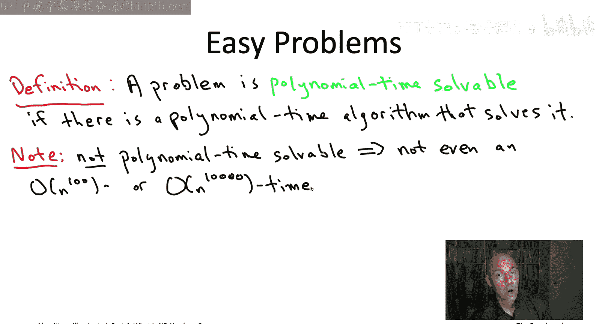

correctrrect for that problem so that's the definition of an easy problem。

 a problem that's solved by some polynomial time algorithm。

 let's get to the trickier point of how we wanted to define a hard problem。

So consider a problem like the traveling salesman problem right suppose you wanted suppose we sort of thought that the problem was not easy in the sense of the previous slide that as we thought we think there's no polynomial time algorithm for it。

How would we amass evidence to support that belief？Well， of course。

 you know the strongest evidence would be an actual mathematical proof that in fact there is no polynomial time algorithm for the TSP unfortunately to this day。

 the status of the TSP is in limbo nobody knows whether there is a fast algorithm for it and we haven't found it yet or whether in fact no such algorithm exists so we don't have airtight mathematical evidence that the TSP is not polynomial timesolvable but can we at least amas some kind of circumstantial evidence so the first piece of circumstantial evidence which is somewhat weak but still kind of compelling is that this is a super famous problem that a lot of super smart people have worked on for a very long time we're talking about probably thousands of people extremely well-trained brilliant minds over really 70 years have failed to find a polynomial time algorithm solving the traveling sales problem that does not mean it's impossible but it makes you wonder makes you wonder if actually there's nothing to be found given all of。

People have failed and certainly if there is such an algorithm it's not going to be something you write down on a cocktail napkin it's going to be something presumably quite quite ingenious and possibly very complicated so that's the first thing it's like okay it's famous 70 year old problem probably if there was an algorithm someone one of these people would have found it during this time。

But the magic and power of NP hardness is that it gives much stronger evidence that there's no polynomial time algorithm for the TSP by showing that if there were a polynomial time algorithm for the TSP。

 that would automatically give you polynomial time algorithms for thousands of other currently unsolved problems。

So in effect， the theory of NP hardness shows that thousands of computational problems。

 including the traveling salesman problem are all variations of the same problem in disguise。

 all destined to suffer identical computational fates if you're trying to devise a polynomial time algorithm for an NP hard problem like the TSP you're inadvertently attempting to come up with such algorithms also for these thousands of related problems Now Plan Deville's advocate。

 you might say but you know maybe a lot of people have tried to do a polynomial time algorithm for the TSP but haven't a lot of people tried to prove that there is no polynoial time algorithm for the TSP and it's true hundreds if not thousands of brilliant minds have failed to prove the other direction that the TSP is not polynomial timesvable so you might argue isn in that sort of equally strong evidence that that might be true and you know the difference is that human beings we seem so far at least much better at proving computational tractability that is coming up with clever algorithms when they exist。

Of the examples that we've seen in this book series and throughout these video playlists and we've seen much worse at proving unsolvability are not that many successful examples of us showing what can't be done computationally if the TSP were polynomial timeslvable it would really be quite surprising that no one had found that algorithm yet whereas if it's not polynomial timeslvable given the mathematical sort of state of the art。

 it's maybe not that surprising we haven't yet figured out how to prove it so that's sort of where the belief comes from that it seems much more likely to most experts that there is no polynomial time algorithm for the TSP as opposed to the minority who believes that actually there is one and we just haven't found it yet All right so let's now finally talk about what we mean by anmp hard problem basically what we mean is that there's strong evidence of intractability like we saw in the previous slide that a polynomial time algorithm would automatically give a polynomial time algorithm for thousands of related problems That said I'm not going to give you a formal mathematical definition of NP hard until。

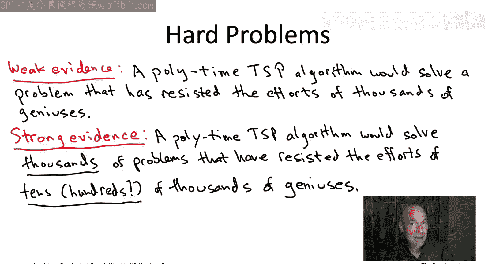

Get to those optional videos deep in the playlist， but let me tell you what's going to be our provisional definition for the next large number of videos So the provisional definition is that a problem is going to be deemed NP hard if a polynomial time algorithm solving it would refute a famous mathematical conjecture known as the p not equal to NP conjecture So turning this statement around what this says is that if the p equal to NP conjecture is true which most people believe that it is if that conjecture is true then no NP problem including the TSP is polynomial timesovable mean there is not even an end to the 100 time algorithm solving it or an end to the 10000 times algorithm that solved So you must be wondering what is this p equal to NP conjecture Well it is a little technical to formally we will do it but we're not going to do it until those optional videos late in the playlist So let's just settle for now for an informal understanding P not equal to NP。

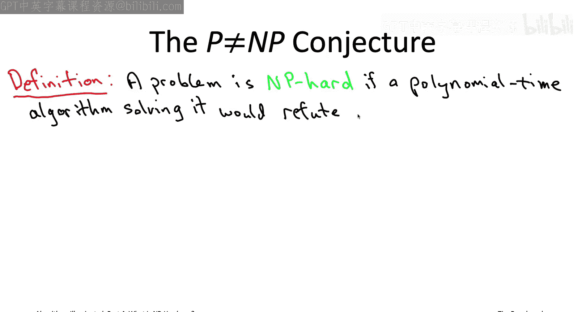

And it's a statement that should resonate with anybody who's had experience both doing homeworks and grading other people's homeworks So the informal version of the conjecture states something very intuitive。

 it states that checking someone else's alleged solution to some computational problem should be a fundamentally easier task than coming up with that solution yourself think for example about like a Sudoku or Ken Ken puzzle if someone handed you their solution。

 it would be quite straightforward to just quickly check that indeed they obeyed all the rules of the puzzle whereas this for the more difficult puzzles they seem to take a long time to come up with a solution from scratch。

 at least they take me a long time to come up with a solution from scratch or in the context of the traveling salesman problem it would be very easy to check that someone had found a good tour say a tour with total cost at most 1000 it feels like it's probably a lot easier than actually having to come up with a tour yourself that has cost at most 1000。

 you'd be happy to have someone else do that work。

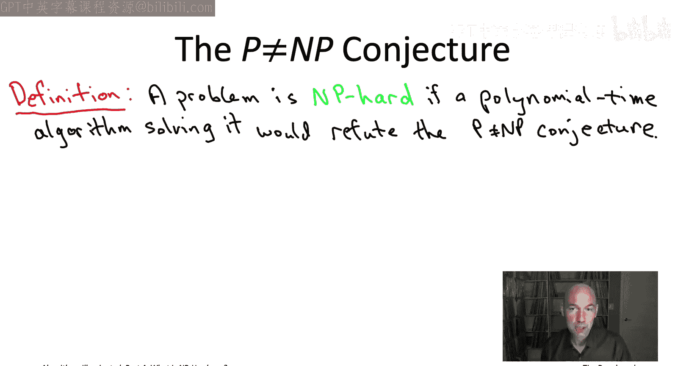

For you so that's the peanut equal to N conjectures the checking solutions is fundamentally easier than finding yourself maybe it seems obvious so it turns out that you know we don't actually know if this is true or not this is an open question most people believe it's true but we havet improved it why isn't it obvious it's not obvious because polynomial time algorithms can be like completely crazy and ingenious we've seen a lot of examples。

 maybe I think the most vivid example is if you saw stress ins subcubic algorithm for matrix multiplication just kind of mindblowing how he beats cubic time from matrix multiplication So once you see a bunch of examples like that these sort of crazy ingenious polynomial time algorithms it starts feeling pretty intimidating to argue that there's something you can't do with polynomial time algorithms right so who's to say you can't solve the TSP given that the polynomial time algorithms can be the space is so rich That said kind of most experts not 100% but most experts believe that the peanut equal to N conjecture is in fact true and remember that if it is true。

That implies that all NP hard problems including the traveling salesman problem cannot be solved by any algorithm exactly that runs in end of the 100 time or even end of the 10000 time So now it's time to revisit the oversimplified explanation of NP hardness that I gave you at the beginning of this video so back at the beginning I said that if you only remember a few words about the theory ofmp hardness sort of a few years from now remember that it identifies easy problems as those that are polynomial time solvable and it identifies hard problems as those that require exponential time to solve in the worst case so I said that at the beginning of the video but now I've actually told you what I really mean by a hard problem is NP hard and an NP hard problem is one that if you solved it with a polynomial time algorithm then it would refute the peanut equal to NP conjecture that's not the same thing that we said at the beginning that it requires exponential time in the worst case so let's just actually kind of clarify everything and talk about what are the differences between the real definition of NP hardness and the oversimplified definition at the。

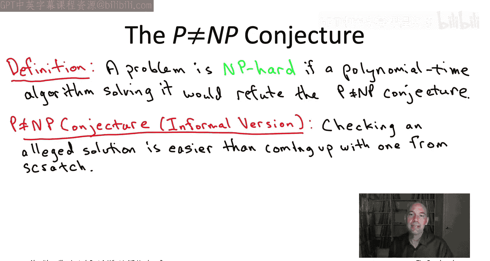

So the first discrepancy between what I said at the beginning of the video and our actual definition of a hard problem is thatmp hardness。

 it's relevant primarily if the P equal to NP conjecture is true。

 and again this is not a proven conjecture most people believe it but it has not been proved So if the peanut equalmp conjecture is false。

 then all bets are off and in fact if it's false then we know that many。

 many problems MP hard problems， including all the problems we'll see in this playlist in fact can be solved in polynomial time So in other words。

 the computational intractability is conditional on this unproven mathematical conjecture。

 the P equal to NP conjecture。 That's the first discrepancy。

 So the second discrepancy is that even in the likely events that the P equal to NP conjecture is true It only rules out polynomial time algorithms formp hard problems does not imply that the algorithms need to run an exponential time there are running time bounds that are in between that grow faster than polynomials but slower than。

ialSo for example， n raised to the log n that's an example of something that's in between or two raised to the square root of n that's another function which grows more slowly than any exponential but more quickly than any polynomial and so these would remain candidates for running times of algorithm solving NP hard problems That said for all of the problems that we're going to discuss in this video playlist。

 experts believe that not only is there no polynomial time algorithm but there's in fact no subex time algorithm either you really do require exponential time to solve the NP hard problems we're going to be discussing so that's formalized by something known as the exponential time hypothesis which is a strengthening of the P equal their NP conjecture which we'll discuss briefly in those optional videos about the P versus NP question。

So I should also mention that know all the problems we discuss in this playlist can be solved in exponential time using exhaustive search in general there are problems that are even harder than that there are problems out there in the world that can't even be solved in exponential time In fact there are famous problems like maybe you've heard of the halting problem which can't be solved at all in any finite period of time by computers so we'll say a little bit more about the halting problem in the complexity theory lectures but for the most part we're going be discussing problems that if nothing else could be solved in exponential time so the strongest possible computational intractability statement you could make is that exponential time is required and that's exactly what the exponential time hypothesis asserts for the MP hard problems we' be discussing in this playlist so finally know I sort of painted a picture at the beginning of this video of a rigid dichotomy like every problem has to be either easy or if it's not easy than it has to be hard。

And that's actually that's true for 99% of the problems you're going to come across。

 but just so you know， there are a couple natural problems that seem to reside in between problems that seem too hard to be polynomial timesolvable but too easy to be NP hard there's at least two famous examples the two most famous ones being factoring so I give you an integer I want you to find me a nontrivial factor of that integer or correctly to clear that none exists that's an important problem for example for the security of the RSA cryptoyt or graph isomorphism so given two graphs is one really just sort of a relabeling of the other So those are pretty natural intermediate problems that people believe are neither polytimeollvable normp hard but again still this is sort of approximate dichotomy is going to cover almost everything that you're going to come across and more generally that oversimplified version ormp hardness what it generally means it generally means that exponential time is required in the worst case again there are these subtleties but I think that's a pretty good one sentence summary to keep in mind。

自己 for？So coming up next let's do an overview of what does the algorithmic toolbox look like for tackling NP hard problems if one comes up in your own application。

 what should you do I'll see you then。

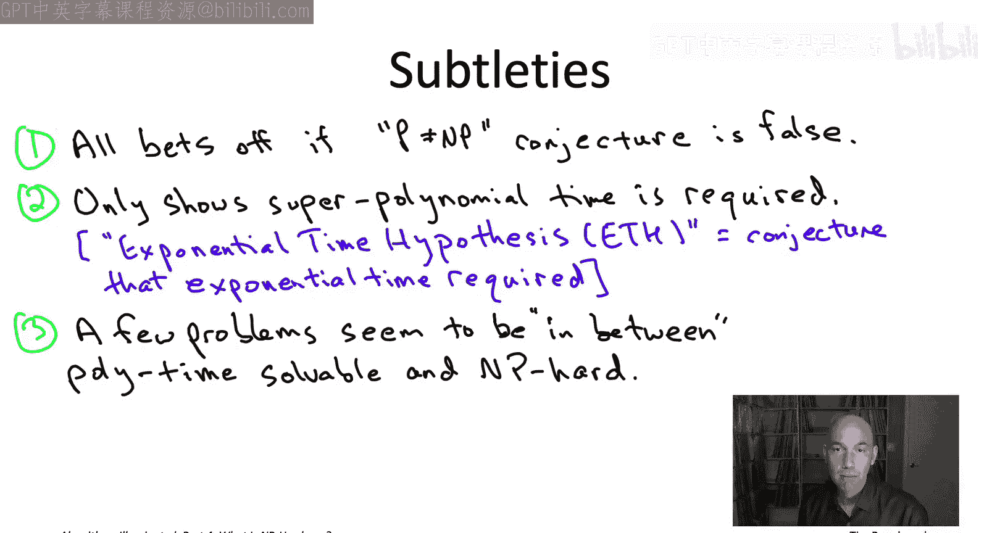

