# 斯坦福大学《算法启蒙（第4册）：NP难｜Part 4 Algorithms for NP-Hard Problems》中英字幕（deepseek-R1） p05 -05-19.4_ Algorithmic Strategies for NP-Hard Problems).zh_en -BV1FAVUzXEum_p5-

Hi everyone and welcome to this video accompanying a six and 19。

4 of the bookArithms illuminated Part4 section about algorithmic strategies for NP hard problems。

So suppose you've been working on a project and a few weeks ago you identified a computational problem that's really intrinsic to the success of this project。

Because of its importance， you've spent the last few weeks throwing the kitchen sink at it。

 but nothing seems to work。 You've tried all the algorithm design paradigms you know。

 you've tried to speed things up with data structures。

 you've tried to hit it with four free primitives， but still no efficient algorithm。 Finally。

 you realize or maybe someone tells you that the problem is actually NP hard and therefore at least assuming the peanut equal the NP conjecture。

 there is no guaranteed correct and guaranteed fast algorithm for the problem。

But you know that doesn't make the problem go away。

 it explains why all your efforts have come to not。

 but it doesn't change the fact that this is the problem which really governs the success of your project。

 what should you do？

So the bad news is that NP hard problems are pretty ubiquitous。

 and it would not be surprising at all if you encountered one in your own work。

The good news is that NP hardness isn in a death sentence。

 doesn't literally mean it's completely hopeless to solve an NP hard problem in practice and indeed。

 you know often not always， but often NP hard problems can be solved in practice at least approximately and at least if you use invest sufficient resources and algorithmic sophistication N hardness does throw the gauntlet down to the algorithm designer。

 however， and it tells you where to set your expectations。

 you should not be expecting some superfa and always correct algorithm akin to the ones that spoiled us for problems like sorting shortest paths。

 sequence alignment and so on unless you're lucky enough to deal only with very small instances or very well structured instances。

 you're probably going to have to work pretty hard to solve the problem and maybe even be ready to make some compromises So what kinds of compromises N hardness rules out algorithms that share three desirable properties or at least assuming the peanutnot equal to NP conjecture is true they rule out having all three of these simultaneously。

So the first desirable properties， you'd like an algorithm， which is general purpose。

 meaning it doesn't matter you make no assumptions about the input， no matter what the input is。

 you want the algorithm to solve the problem。 This is as opposed to solving only a special case of a problem handling only a subset of the instances that you might encounter。

 So obviously， general purpose would be nice。 Second。

 we would of course like the algorithm to correctly solve the problem。

 ideally for every single input， Similarlyly， we would like the algorithm to be fast。

 ideally something like linear time， but at the very least polynomial time， again。

 without any extra assumptions about the inputs， no matter what the inputs。

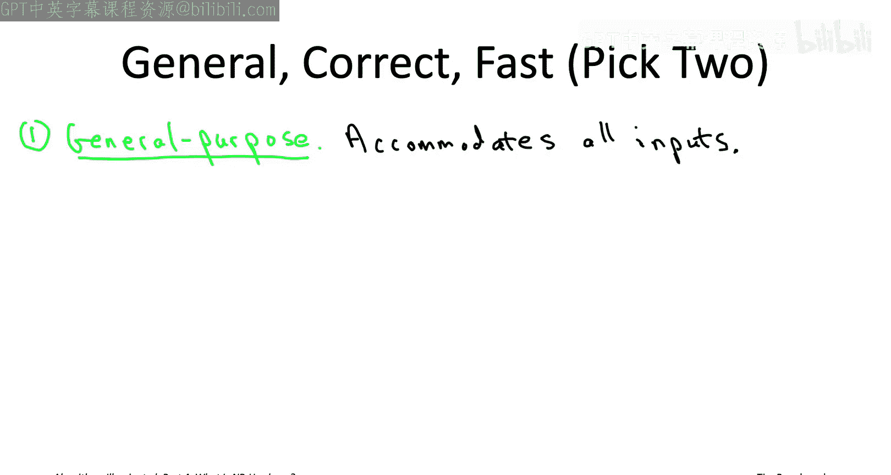

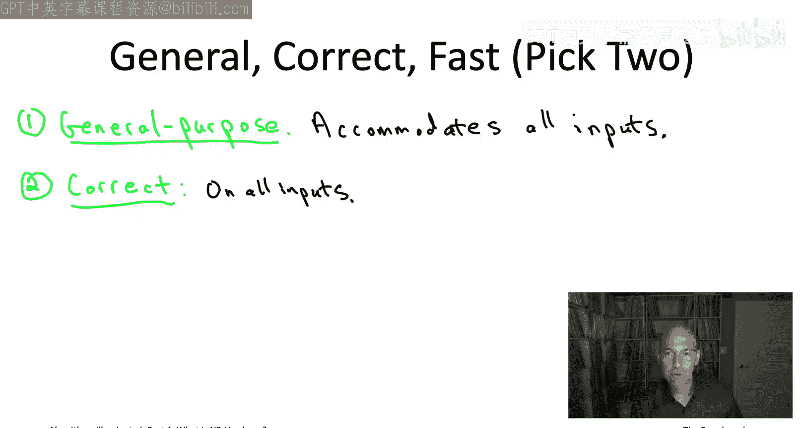

And accordingly， you can choose from three types of compromises， you can compromise on generality。

 give up on being general purpose and handle only a special subset of all of the possible instances。

 you can compromise on correctness and actually not solve the problem correctly。

 at least on some of the inputs， or you can compromise on speed and run in super polynomial time at least on some of the possible inputs。

For the rest of this video we're going to elaborate on all three of these algorithmic strategies。

 all of them are quite common and useful in practice and then later the next two batches of videos in the playlist corresponding to chapters 20 and 21 their deep dives on the latter two types of compromise so a deep dive on how to compromise on correctness and a deep dive on how to compromise on worst case polynomial running time as always our focus is going to be on powerful and flexible algorithm design principles they're applicable to a wide range of problems as always you should take these principles as a starting point and run with them augmenting them with whatever domain expertise you have for the specific problem that you need to solve。

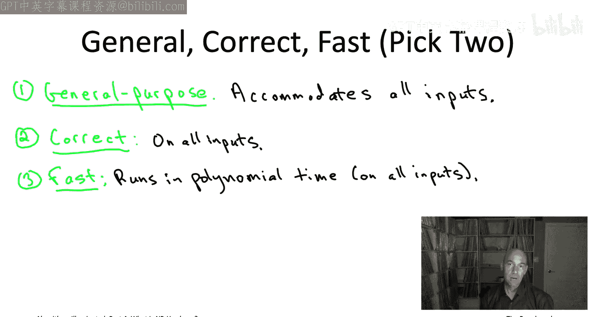

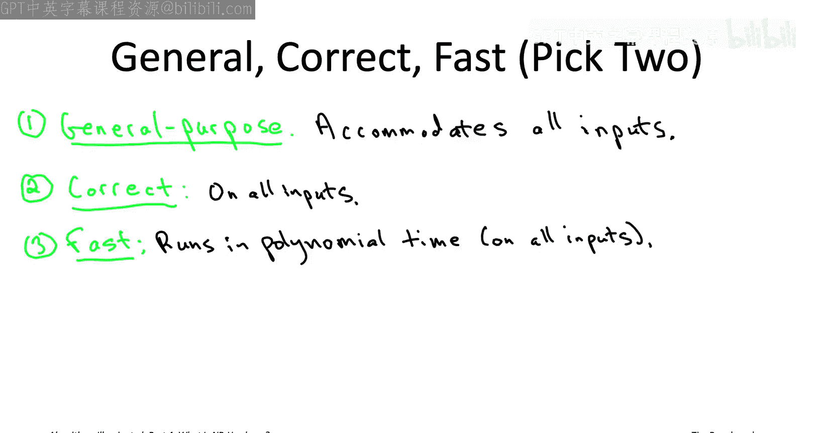

So the first step of compromise is to compromise on generality so to give up trying to solve the NP hard problem on all inputs and instead restrict your attention to a subset of all possible inputs in the best case scenario for the subset that you restrict your attention to we actually become polynomial timeslvable you'll be able to come up with an always fast and always correct algorithm for that special subclass of inputs Now if you've been following along with this book series or with these video playlists you've actually already seen a couple of examples of exact and fast algorithms for what if we zoom out are really special cases of NP hard problems So let me remind you of two of the problems you might have seen in the past if you haven't heard of these two problems before don't worry about it feel free to skip on to the next slide without loss of continuity So the first example is the weighted independent set problems So this is a graph problem and the input you're given an undirected graph and also each vertex comes with a non-negative weight So for example one input could be。

The five cycle， as you see on this slide， and I've labeled the vertices with their weights。

 so the vertex weights are one， two， three， four， five as you go around the cycle。

Now what's an independent set， an independent set is a subset of mutually non- adjacentjacent vertices case of vertices that do not have edges between them so for example。

 if you want to think about the vertices as representing people or maybe tasks and you want to think of the edges as conflicts like two people who don't get along or two tasks that can't be done at the same time。

 then the independent sets， the mutually non-adjacent vertices。

 those correspond to conflictfr subsets of tasks or of people so for example in the five cycle there's no independent set that has three different vertices。

 if you have three vertices two would be neighbors and that's not allowed。

 but there's a bunch of different pairs of vertices you could pick and that would be an independent set。

And if you wanted to maximize the total weights of the independent set。

 which is the objective in this problem in this example。

 you would choose the vertices of weights 5 and three。

 you can't pick the five and the four because those are adjacent So the weighted independent set problem turns out to be NP hard in general so just like the TSP equally so the weighted In set problem is NP hard we will actually see a proof of that later on in this video playlist Now for those of you who are graduates of the dynamic programming boot camp in part3 of the book series you might recall that the way I introduced you to dynamic programming was actually with this exact same weighted In set problem and in fact we use dynamic programming to give a linear time algorithm for computing the maximum weight independence set。

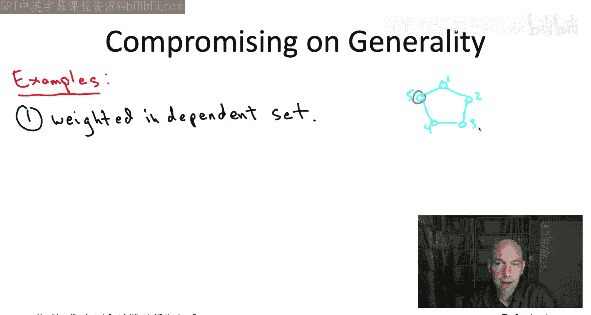

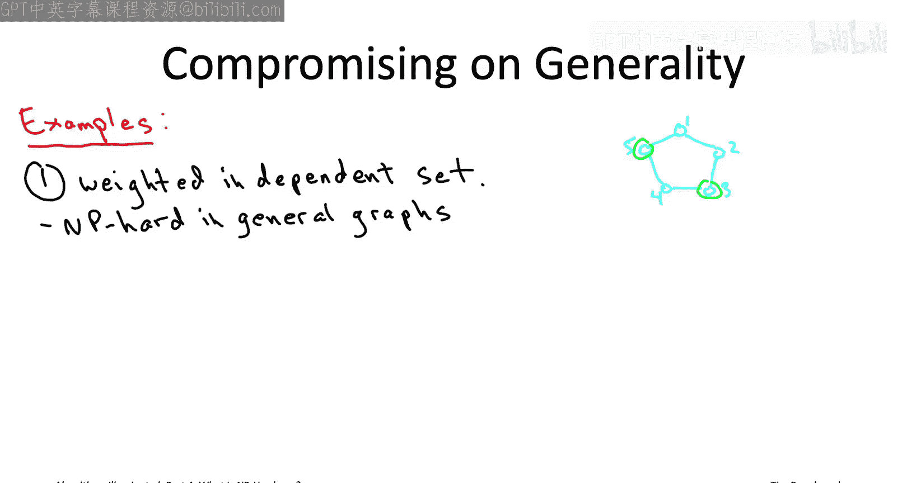

So what's the catch the catch if you remember is that we only talked about path graphs Okay so you just had a bunch of vertices in a line with an edge between each adjacent pair of vertices and that was it so it was a super simple class of graphs even that class was a little bit tricky we needed dynamic programming but that's all we talked about we didn't talk about five cycles we didn't talk about more complicated graphs so in the special case of path graphs this NP hard problem flips and becomes polynomial time solvable even linear timeslvable In fact that dynamic programming algorithm for path graphs can be extended to tree graphs that's one of the end of the problem exercises in chapter 16 again in linear time So in general graphs with independent that is NP hard we don't believe it's polynomial time sovable but if you can get away with just thinking about tree graphs boom linear timesvable So a second example of a polynomial timeslvable special case of an NP hard problem that you might have seen in the past concerns。

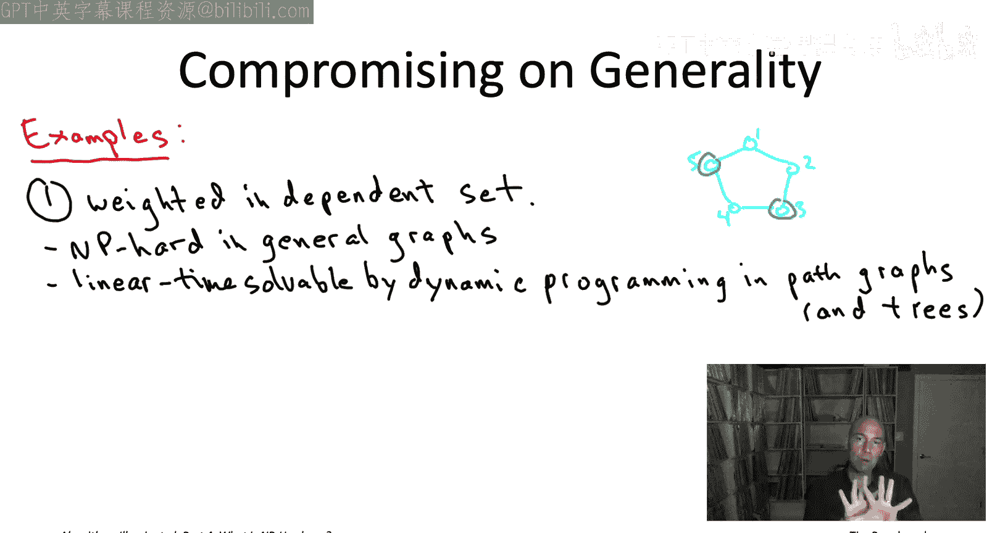

napsack problem so as a reminder in the Napsack problem you're given n items each item has an integer value and an integer size and you're also given an integer Napssack capacity and the goal basically is to stuff the Napsack in the most valuable way possible so you're looking for a subset of the N items whose total sizes at most the Napsack capacity sort of subset that fits in the Napsack and subject to that constraint you'd like to maximize the value of the items that you choose so Napsack problem show up all the time in real life whenever you have basically a single scarce resource that you want to spend in the smartest way possible that's going to be a Napsack problem so for example if your boss gave you an operating budget to hire people and you have a bunch of candidates that differ in their productivity levels and in the requested salaries figuring out how to hire the most productive group of people subject to your budget that's exactly a NApsack problem so the Napsack problem is another canonical and killer application of the dynamic programming algorithm design paradigm。

In particular， if you read Part three or saw the corresponding videos。

 I showed you a dynamic programming algorithm which runs in bigO of n times capital C time。

 or N here denotes the number of items and capital C denotes the NApsA capacity。

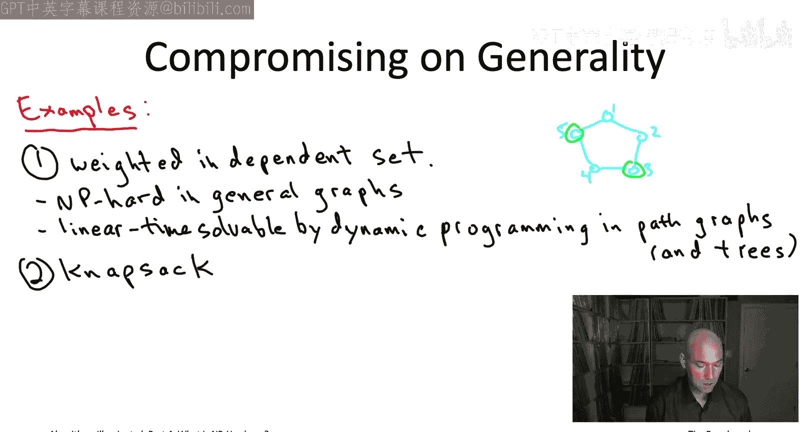

On the other hand， as we will ourselves prove later in this video playlist。

 the Napsack problem in general is an NP hard problem Now you might be puzzled when you look at these two statements that the Napsack problem is NP hard and that on the other hand we gave an O of N time C time algorithm for it using dynamic programming so why doesn't this O of NC time algorithm for the Napsack problem refute the P nu equal to NP conjecture that would be a pretty big deal？

The reason is that running in time O of n times capital C is not a polynomial time algorithm。

I would agree with you that it's a polynomial time algorithm if。

In the special case where the Napssack capacity capital C is bounded by a polynomial function of n。

 So， for example， if capital C was n to the fifth， we'd have a running time of n to the sixth。

 And yes， I would definitely agree that's a polynomial running time。 In general， however。

 there's no reason to think that the Napssack capacity is going to be merely polynomial in the number of items N。

 it could be2 to the n。 for example， And if the Napssack capacityac is 2 to the n。

 then the running time of this dynamic programming algorithm is also going to scale with 2 to the n It will be exponential in n。

On the other hand， the input size is not exponential in N。

And the reason is remember what does input size mean。

 it means the number of keystrokes that you need to specify that input to a computer and to specify a number to a computer。

 the number of keystrokes is not proportional to the magnitude of the number its proportional to the number of digits in that number so the logarithm of the magnitude So for example if you want to describe the number 1 million to a computer。

 you don't need 1 million keystrokes all you need is seven， or if you're working base two。

 you know you need 20 you need much much less than the magnitude of the number so in our example。

 where we have n items and all of the numbers are of magnitude roughly2 to the n we would be using n digits for each of the roughly n numbers。

 so that would give us n square digits overall so the input size would only be polynomial and n quadratic and n while the running time of this dynamic programming algorithm would be exponential in n。

So that shows why running in time0 of n times capital C that is not a polynomial time algorithm in general。

 it is a polynomial time algorithm when capital C is not too big when it's bounded by a polynomial function of N but it is not polynomial time in general and that is why even though NApsack is NP hard and even though we have this algorithm this does not refute the P equal to NP conjecture So those are two examples you may already be familiar with of special cases of NP hard problems that can be solved in polynomial time there's many more examples I'll actually see a couple other examples as we go through the video playlist for example to graph coloring and satisfiability we'll see polynomial time solvable special cases we're not going to have any dedicated portion of the book or of the playlist to compromising on generality and that's because work in that direction looks exactly the same as all the work we've been doing in parts one through three the whole point of parts one through three was to develop a toolbox to design algorithms that are always correct and always。

And that toolbox in particular can be applied to special cases of NP hard problems when they are。

 in fact， polynomial timesvable So this is a good point to make a sort of general comment and give a bit of a pep talk which is that if you have to tackle on NP hard problem in real life it's important that you're persistent and that you don't give course you already know that as algorithm designers but it's sort of more important than ever for making progress onmp hard problems often you have to throw the kitchen sink at the problems to really get the kind of progress you want So let me just give you like a random example of how you could combine different tools in the toolbox imagine your boss is's given you a pretty big graph let's it's 10000 vertices or something and they want to know the maximum weight independence set so they want a lot of value without any conflicts that's exactly the maximum weight independent set problem Now you can't use exhaustive search because the graph has 100 vertices if it was a tree you could solve the problem in linear time using dynamic programming let's suppose it's not a tree let's suppose the graph has a bunch of cycles。

Maybe it seems like you're stuck。But then imagine you use your sort of domain expertise and you realize actually this kind of like of these 10000 vertices。

 there's 20 vertices that are really kind of the most important ones。

 and imagine that these 20 vertices actually intersect every cycle of the graph In other words。

 imagine that when you remove these 20 vertices from the graph， the graph that remains is acyclic。

 It's just a collection of trees。 Well if that's the case。

 if there are these 20 vertices whose removal makes the graph acyclic。

 all of a sudden you really could solve this problem exactly。

 you compute a maximum weight independent set by using a hybrid of exhaustive search and dynamic programming。

😊，So the way it would work is you would do exhaustive search over all of the subsets of the special vertices。

 so there's 20 vertices and you're just going to guess or enumerate over which of those 20 vertices belong to the independent set and which ones do not。

 then you take those vertices out and you're left with an acyclic graph and now you can apply dynamic programming and solve the residual problem in linear time。

So how long would this take， well， if you have 20 special vertices。

 two to the 20 things to enumerate， that's like a million different subsets to look at。

 which is not actually that bad。Then you're left with an ascyclic graph with less than 10。

000 vertices on which you can compute an independent set in linear time So if you put all that together you get you require maybe tens of billions of operations overall to compute the MaxW independent set maybe hundreds of billions depending on the implementation and that may sound like a lot。

 but that's really something that your modern laptop could do in not that much time in a sort of acceptable amount of time。

Meanwhile， if you just tried to do just direct exhaustive search without any of the cleverness。

 you would be over a trillion operations already when n exceeds 40， but again。

 sort of the takeaway point is that you know even if your application doesn't literally boil down to one of these computationally tractable special cases of an NPharR problem。

 you might still be able to use a solution to the special case as a building block in a more sophisticated algorithm。

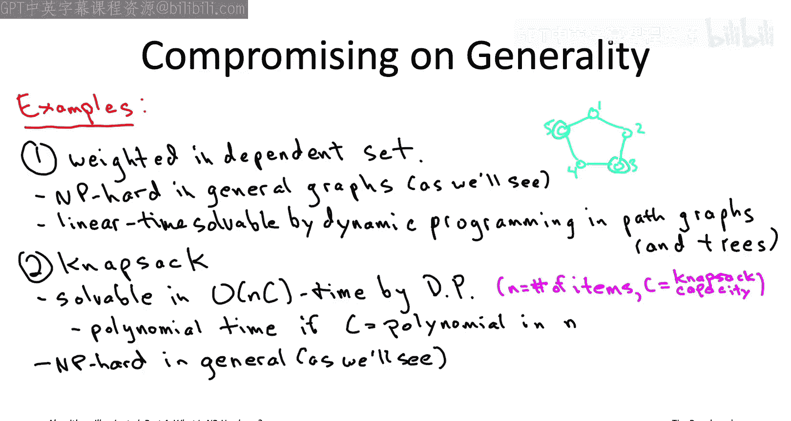

So the second algorithmic strategy for NP hard problems is to compromise on correctness。

 And this is an especially popular choice in time criticalitical applications。

 but you really need your algorithm to be fast and you're willing to give up a little bit on correctness in order to make it happen。

 algorithms of this type which are not guaranteed to be correct。

 They're often called heuristic algorithms。 So we have not really seen many examples in this book series of any kind of algorithmic solution that was not guaranteed to be correct。

 In fact， the only thing I can think of is our discussion of bloom filters back at the end of our data structuress discussion at the end of part2。

 remember， a bloom filter is sort of a cousin of a hash table which is uses less space but an exchange has a small rate of false positives。

 So that was an example of the data structure that didn't always give correct answers。

 So I think will be the first time we talk about algorithms that don't always give the correct answer。

 So when you're designing heuristic algorithms， you're intentionally giving up on correctness。

 but of course， you'd like to give up on correct。

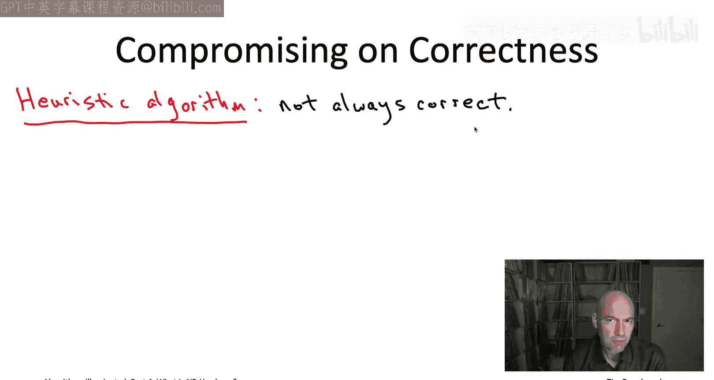

This as little as possible， you'd like a heuristic algorithm。

 which is still approximately correct in some sense of the word。

 so maybe it's correct on most of the inputs that you're ever going to encounter。

 or maybe even you have some kind of provable guarantee that for all inputs。

 the algorithms guaranteed to be at least approximately correct。

So what do I mean by almost correct on every input， Well。

 that's probably easiest to interpret for optimization problems where the goal is to compute a feasible solution。

 like say， a traveling salesman with the best objective function value。

 like say you want to minimize the total cost of the tour。Almost correct。

 then means that the algorithm outputs a feasible solution with objective function value close to the best possible。

 like a traveling salesman tour with total cost， not much more than that of an optimal tour。

Your existing algorithmic toolbox for designing fast exact algorithms is directly useful for designing fast heuristic algorithms。

 So， for example， later in the video playlist， we'll be looking at greedy heuristics for problems rang from scheduling to team hiring problems to influence maximization in social networks。

 All of these heuristic algorithms that willll discuss come with proofs of approximate correctness。

 guaranteeing that for every input， the output of the heuristic algorithm is within a modest constant factor of the best possible objective function value。

 I should say that some authors call algorithms of this type algorithms that guarantee a constant factor within the optimal objective function value。

 Sometimes those are called approximation algorithms and those authors reserve the term heuristic algorithms for algorithms that do not have such provable guarantees。

 We won't be making that distinction for us a heuristic algorithm will be something which is not always correct。

 It may have appvable guarantee of approximate correctness or it may not。

 So those examples are really revisiting a tried and true。

of our algorithmic toolbox greedy algorithms and repurposing them not for exact algorithms。

 but for fast juuristic algorithms The other thing I want to tell you about is a technique that we haven't discussed previously in the book series which is particularly well suited for lots of different MP hard problems even though it often doesn't have provable guarantees it often is unreasonably effective and making progress on NP hard problems in practice and that technique is local search。

So the third and final strategy for NP hard problems that we'll talk about is compromising on speed so here we're going to be looking at exact algorithms so this is suitable for applications where you really cannot compromise on correctness subject to being correct you'd like to have an algorithm which is fast as possible Now with an NP hard problem again assuming the peanut equal to NB conjecture。

 you're not expecting polynomial time。 you're not even expecting subex time in the worst case you really got to be ready for an exponential time worst case running time but the hope is that you still do quite a bit better than exhaustive search a lot of the time So that could mean a couple of different things。

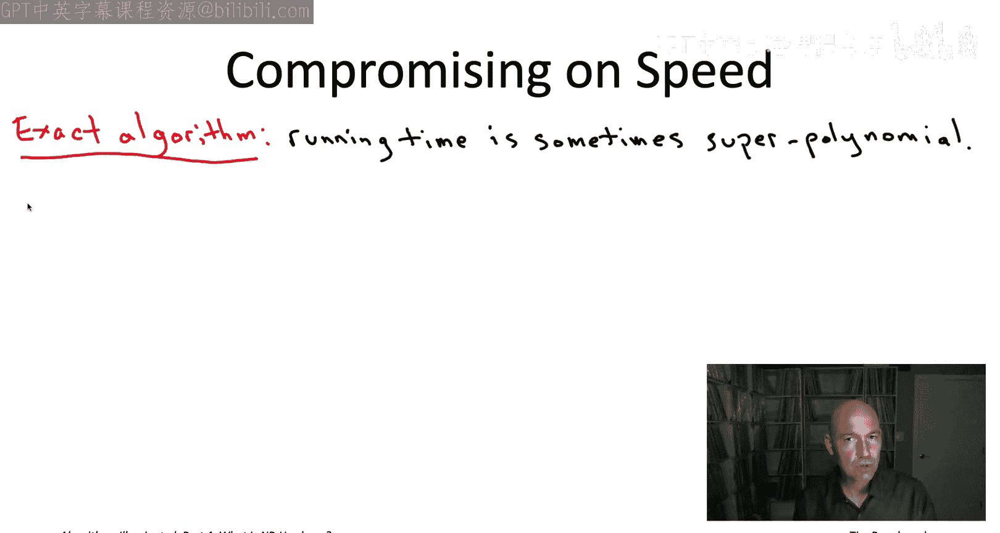

So one thing it could mean is that the algorithm typically runs quickly。

 like say in polynomial time or maybe even a low polynomial time。

 at least for the inputs that tend to show up in your own application， so maybe not always。

 but most of the time you're seeing very fast running times you might also hope for approvalable guarantee which says that for every single input of the problem。

 you are guaranteed to run faster than exhaustive search。Now。

 in the second of these two cases where we're beating exhaustive search for every single input。

 we should still expect the algorithm to run an exponential time in the worst case。 After all。

 the problem is NP hard， but we'll see a couple of examples where while still being an exponential time algorithms that do significantly better than exhaustive search guaranteed the first example will be to the traveling salesman problem。

 where as we've seen exhaustedive search takes time scaling with n factorial and we'll use dynamic programming to come up with an algorithm that instead scales in the smaller running time2 to the n still exponential。

 but better than n factorial，2 to the n times a polynomial function of n。

 We'll also look at a dynamic programming algorithm。

 which coupled with randomization gives a very beautiful algorithm for finding long paths and graphs。

 which has been applied to finding signaling pathways in protein protein interaction networks。

Specifically if we're looking for a path of length K in the graph。

 meaning a path of spans K vertices with K minus-1 edges。

Nive exhaustive search would scale as n to the K where n is the number of vertices and K is the path length we're after。

 but our combination of randomization and dynamic programming will bring the running time down to easese to the K times linear in the graph size where here E is indeed 2。

718 do dot do So those are two super cool examples where we again revisit one of the tools that was already in our toolbox dynamic programming we worked very hard to master that skill and so here we're seeing a couple more really nice applications applying it actually the NP hard problems and speeding up even in the worst case over exhaustive search so making progress on relatively large instances of NP hard problems。

 say if problem sizes in the thousands or more that typically requires additional tools that do not have better than exhaustive search runningtime guarantees but are nonetheless unreasonably effective in practice and so there's two of those tools I want to tell you a little bit about later on in the video playlist namely solvers for mixed integer programming。

Problems or so-called miPS solvers and also solvers for satisfiability problems or sat solvers here a solver is just kind of a readymade implementation you know that's been expertly implemented and sort of finely tuned to work really well in practice so it turns out that many NP hard optimization problems the traveling salesman problem and many others can be encoded as MIps as mixed inger programming problems mean。

 a lot of yes， no questions know like checking whether a bunch of requests for scarce resources can all be fulfilled or not a lot of those yes no questions naturally translate to satisfiability problems and whenever you're faced with an NP hard problem that can be easily specified as a MIPS or satAT problem it's really worth trying to apply the latest and greatest solvers to it there's no guarantee that a miPS or SAT solver will solve your particular instance in a reasonable amount of time the problem is NPp hard after all but they constitute cutting edge technology for tackling NP hard problems in practice。

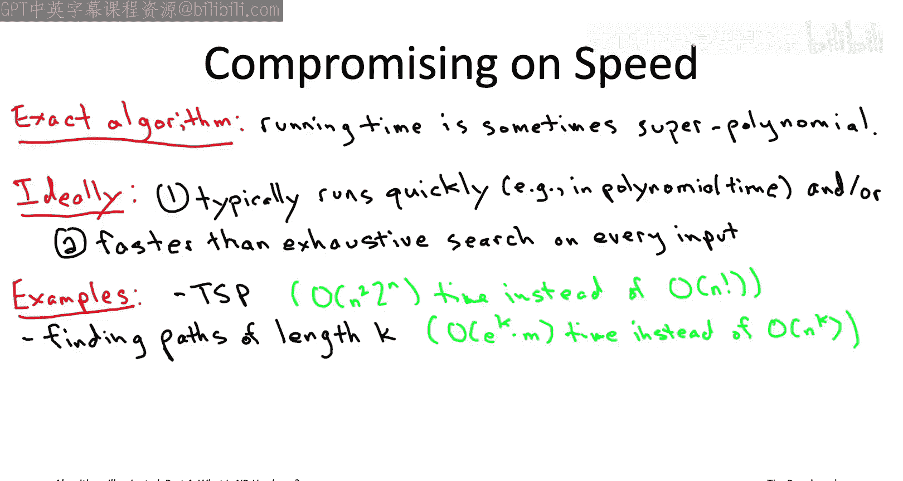

So two videos ago I talked about the various levels of expertise you might want to have in the mastery of NP hardness。

 level1 sort of cocktail party awareness， so at least you know if you're a program manager。

 you know what one of your engineers means if they tell you that they're working on an NP hard problem we're pretty much now up to the upto level1 we have a couple more videos to go in this chapter but you pretty much up to level1。

 So just to kind of consolidate， let me tell you what are the three biggest takeaways from what we've discussed so far。

 So things you just really have to know about NP hard problems So first of all。

 it's important to know that NP hard problems are everywhere。

 despite the fact that most algorithms textbooks talk mostly about polynomial timesvable problems in real life you are very likely to encounter NP hard problems So no one did anything wrong if an NP hard problem all of a sudden shows up in some important project It's just inevitable。

 So the second thing to know is sort of at a high level what does it mean that these NP hard problems are hard。

What it means that under a technically mathematically open but widely believed mathematical conjecture。

 the peanut equal to NP conjecture， if that conjecture is true then no NP hard problem has any algorithm which is always guaranteed to be correct and always guaranteed to run in polynomial time which is a big contrast to the problems that we've talked about in the previous books in this series So if there's a silver lining to all this it's the NP hardness generally isn't a death sentence and people do often not always。

 but often have successes making progress on NP hard problems in practice provided they're willing to apply some serious algorithmic sophistication and provided they enough invest enough resources into the project human resources。

 computational resources and financial resources So if you have an NP hard problem that you really care about you're going to want someone on your team who's well versed with the tools that we're going to be describing in the rest of this video playlist and you're going to want to give that person the time and money that they need。

To apply that toolbox after all， it's not called an NP hard problem for nothing so we'll get back to algorithmic strategies for tackling NP hard problems soon enough。

 but in the next video I want to talk a little bit about this question how how can you recognize NP hard problems in your own work so that you don't waste time trying to design a perfect algorithm for them turns out there's a very simple twostep recipe for recognizing the problems are NP hard and I want to give you a glimpse of that in the next video so see it then。

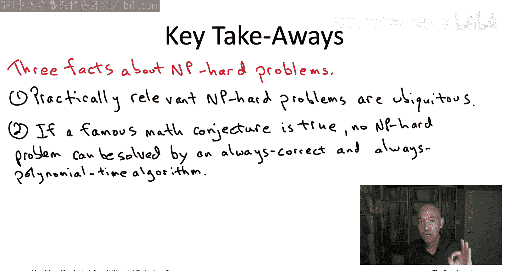