# 斯坦福大学《算法启蒙（第4册）：NP难｜Part 4 Algorithms for NP-Hard Problems》中英字幕（deepseek-R1） p06 -06-19.5_ A Simple Recipe for Proving NP-Hardness).zh_en -BV1FAVUzXEum_p6-

Hi everyone， and welcome to this video that accompanies Section 19。

5 of the book Algorithms illuminated Part 4。 This is a section about a simple recipe for proving the problems are NPhar。

So how can you recognize if one of these NP hard problems shows up in one of your own projects and you definitely want to recognize it because you don't want to inadvertently waste a whole bunch of time trying to come up with some too good to be true algorithm for an NP hard problem Well。

 there's two skills that are really necessary。 The first one is you should know a bunch of known NP hard problems So there's thousands and thousands of NP hard problems out there in the world and we're going to get you started in the fourth section of this playlist corresponding to chapterpt 22 will'll get you started with a list of 19 NP hard problems In the simplest case。

 your application will simply include this NP hard problem and then you know that your problem is NP hard as well。

More generally， if your problem isn't exactly map onto a known NP hard problem。

 you can prove that it's NP hard using a reduction。

 So this is the second skill that you'll want to hone。

 spotting reductions between different computational problems Now。

 as students of algorithms we're quite accustomed to looking for reductions right when we see a new problem。

 we want to say， oh， does this just reduced to some problem I already know how to solve that would be sort of the easiest way out So reductions as we know。

 spread tractability from one problem to another。 But actually if you turn that statement on its head。

 you realize that reductions also spread computational intractability NP hardness from one problem to another and the opposite direction。

So what that means is that there's a very， very simple two step recipe for establishing that a problem that you care about is NP hard。

 step one， pick some known NP hard problem， step two。

 reduce that known heart NP hard problem to the problem you care about that implies that your problem is also NP hard。

So in the rest of this video we're going to elaborate on all of these points for a deep dive。

 check out the fourth part of the playlist corresponding to chapter 22 so as you might guess。

 if you have one problem which is NP hard and you have a second problem which is at least as hard as the first。

 then that second problem is itself NP hard。

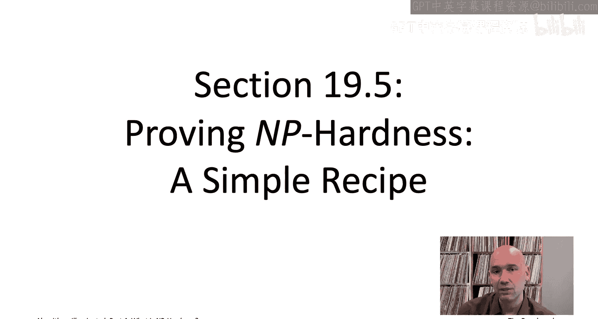

Sottle sounds very reasonable， but what does it actually mean in particular。

 what does it mean to say that one problem is at least as hard as another？

That's a concept we can make precise using the idea of a reduction So what's a reduction between two problems Well。

 we're going to say that first problem A reduces to a second problem B。

 if any algorithm solving B is easily translated into an algorithm that solves a。

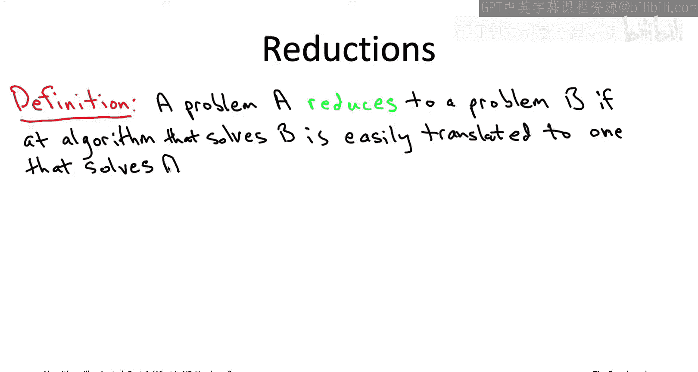

And this is still not really a precise mathematical definition because I haven't said what I mean by easily translate。

 so let's consider the following picture。

So here's the way to think about this picture you want to imagine someone gives you on a silver platter。

 this magenta box， kind of a magic box that can just at will solve the problem B。

The question then is， can you build on that to design this light blue box is something responsible for solving problem A。

 so it's going to be given an input at A， It can query the subroutine or invoke the subroutine for B whenever it wants。

 solve instances of problem B and using the solutions from the magenta box along with any additional work that it did outside of its subroutine cause at the end of the day the light blue box should output the correct solution to the instance of problem A that it was given in the first place。

 Now， what do I mean by easily translate in this definition。 Well。

 you know the ground rules are in this reduction， we want it to be efficient。

 So this reduction should only invoke the magenta box， the subroutine for B。

 a polynomial number of times， meaning the number of ins is bounded above by a polynomial function of the input size the input size of the problem A that the light blue box was given Moreoverover。

The light blue glass can do additional work outside of the subroutine calls to the magenta box。

 but that again should be bounded by a polynomial function of the input size Again the reductions of polynomial time algorithm plus a polynomial ins of the subroutine for the problem capital B。

Seasoned algorithm designers such as yourself are accustomed to looking for reductions。

 trying to spot them between computational problems。 After all。

 why solve a problem from scratch if it's a special case or a thinly disguised version of some other problem that you already know how to solve。

 So just to jogger our memory， let's actually recall some of the reductions that we've seen previously in this book series。

 So for example， I think the first reduction that we saw as we saw the computing the median of an array of integer reduces to sorting the array of integers because after all。

 if you sort the array， the median's just going to be the middle element So for example。

 if you use the merge sort algorithm which runs in O of n log n time on arrays of length N。

 that immediately gives you an o of n log n time algorithm for median finding more generally whatever the running time of the subroutine sorting subroutine that you use is you'll get a median finding algorithm which has the same running time with a larger constant factor。

 Another reduction we saw is when we first started talking about the all pair shortest path problems。

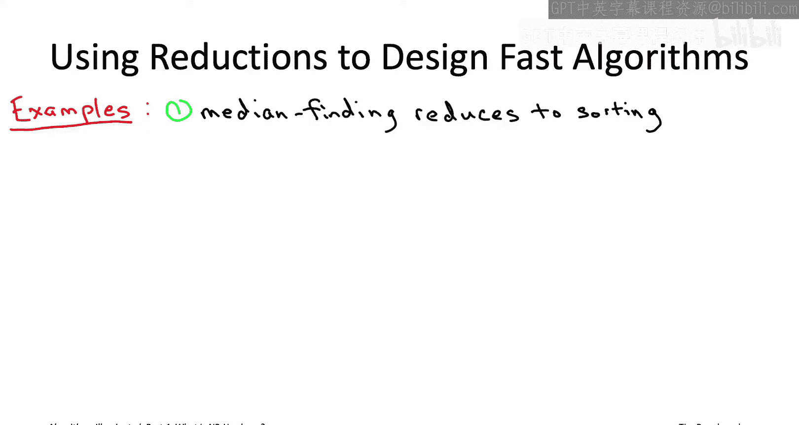

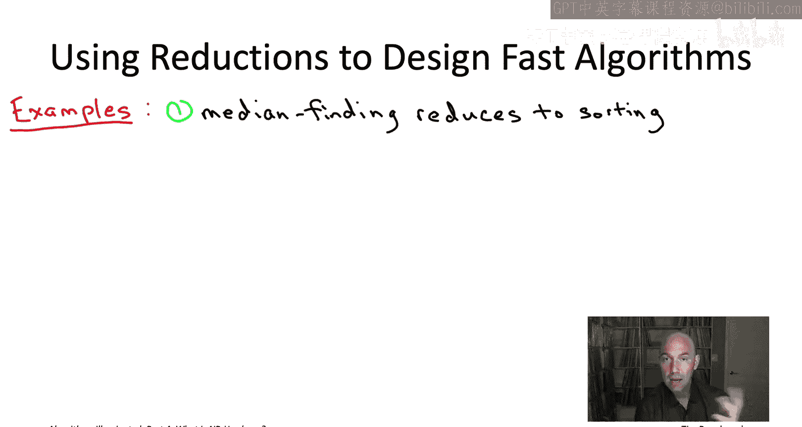

where I give you a directed graph and you want to compute the shortest path distance between each ordered pair of vertices in the graph and just to draw a line in the sand kind of the first thing we observed is that if you handed me a subroutine that solves the single source version of the problem so compute shortest path distances from a starting vertex S to all of the n minus one possible destination vertices well I can use that subroutine to solve the all pair of the shortest path problem just by running that subroutine once from each of the n vertices so just taking turns with which vertex is serving as the starting vertex so that's going to translate single source shortest path algorithm into an all pair's shortest path algorithm who's running time is a factor of n larger or n is the number of vertices so if you're using like the Belman forward algorithm for your single source shortest problem that has running time o of M times n where end's the number of edges ands the number of vertices so if you did this reduction you would get an o of m and squared algorithm for all pairs shortest paths。

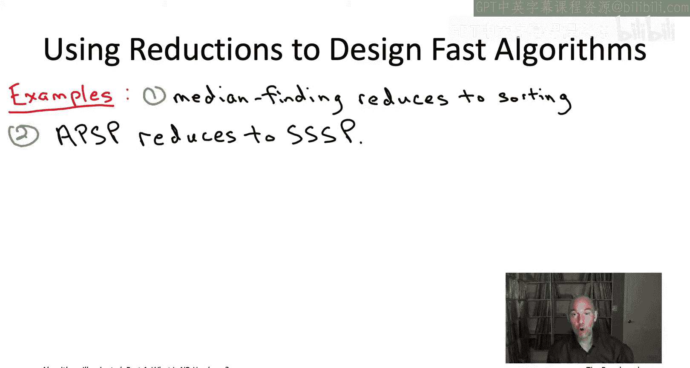

A third example which showed up in some of the end of chapter problems in part three is that the longest common subsequence problem can be viewed as a special case of the sequence alignment problem。

 so we gave a full blown dynamic programming algorithm solving sequence alignment and O of M times n time or M and N were the length of the two input strings and basically if you just set the parameters in the sequence alignment problem correctly so you set the gap penalty to one and you set the cost of mismatchching two symbols to be a very large number that actually will just immediately find you the longest common subsequence of the two strings in the same running time O of M times n where those are the lengths of the input strings。

So these are all examples of reductions which we use to spread tractability from one problem to another to take a fast algorithm that we'd already designed for one problem and to translate it into a fast algorithm for some other problem right so taking a fast sorting algorithm。

 getting a fast median finding algorithm， taking a fast single source short as path algorithm and getting a not quite as fast but reasonably fast all pair shortest path algorithm and so on so in general。

 if you have a reduction from a problem A to a problem B and B can be solved by a polynomial time algorithm。

 then that immediately gives you a polynomial time algorithm for the problem A as well。

Right so for example， know the problem A could correspond the all pair shortest paths。

 the problem B could correspond to single source shortest paths。

 and because we have a polynomial time algorithm for the latter problem that immediately gives us a polynomial time algorithm for the former problem as well So reduction spread tractability spread polynomial time solvability from one problem to another noticeice that the direction in which tractability spreads is the opposite direction in which the reduction proceeds。

 so a reduces to B and then tractability flows in the opposite direction from B back to a。

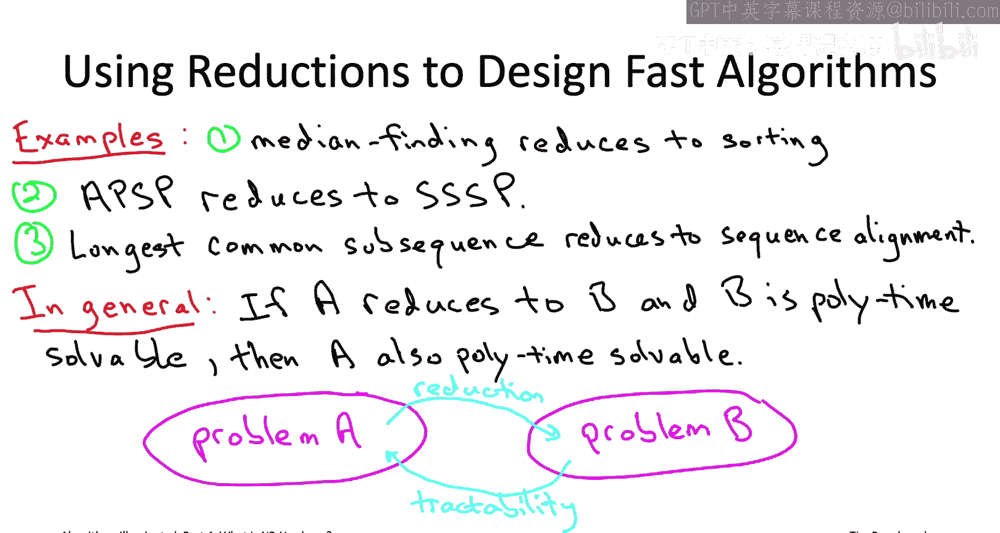

All of these reductions serve the honorable mission of expanding the frontier of computational tractability。

 So taking existing fast algorithms and using them to get fast algorithms for further problems。

 The theory of NP hardness， however， revolves around a much more nefarious use of reductions to spread intractability。

 spreading NP hardness from one problem to another Now， in contrast to the spread of tractability。

 the spread of intractability will go in the same direction as the reduction So if a is NP hard and reduces to B B is going to be NP hard as well。

 So why is this true， Why is it that a reduction spreads computational intractability spreads NP hardness in the same direction of the reduction。

 Well， suppose a problem A reduces to a problem B and suppose problem A is NP hard。

 What does that mean Remember a problem is NP hard if a polynomial time algorithm solving it would refute the peanut equal to NP conjecture。

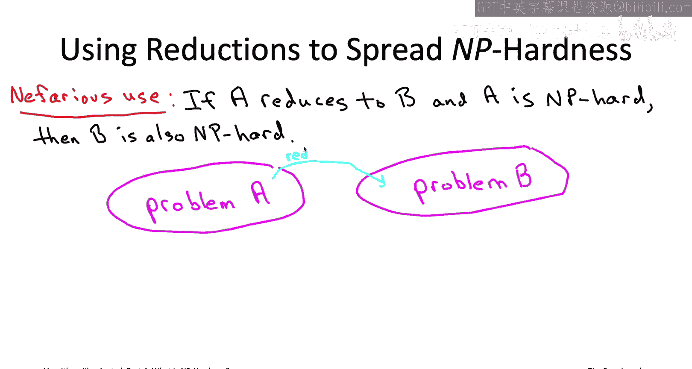

So now think about B， okay， suppose you had a polynomial time algorithm for B。Because A reduces to B。

 you're going to automatically get a polynomial time algorithm for A。But a was n hard。

wouldSo that would refute the peanut equal to NP conjecture。So putting that together。

 a polynomial time algorithm for B would refute the peanut equal to NP conjecture。

 so B itself must be NP hard。So what this means is that we actually have a super simple two step recipe for proving that a problem is NP hard。

 So suppose problem B is the problem that you really care about。

 That's the one that's showed up in your own work。 And you're trying to figure out whether it's NP hard or whether you should try to design an always correct an almost fast algorithm for it。

 If it's going to be NP hard。 here's how you would prove it。

So first you need to make a decision of what's going to be your problem A。

 so what problem are you going to use in the left part of the reduction then once you've settled on the right NP hard problem A。

 your second goal is to reduce it to the problem B to show that a polynomial time algorithm for B would allow you to solve A。

If you can do that by this argument， you have proved that your problem B is in fact NP hard and you should be making some of the compromises either on generality or on speed or on correctness So carrying out the first of these steps well to do that you need to kind of know some NP hard problems you'll learn a pretty reasonable list later on in this playlist and the videos corresponding to chapter 22 we'll talk about 19 different NP hard problems and give you some references for many more if you need them to carry out the second step of the recipe that just involves kind of building on your already developed skills and identifying reductions between problems and we will hone these skills further in that same part of the playlist corresponding to chapter 22 What I want to do in the rest of this video is to give you a quick glimpse of this twostep recipe just to give you the gist with a relatively simple example for a problem that we know and love the single source shortest path problem when you can have positive or negative edge lengths All right so we've mentioned in passing。

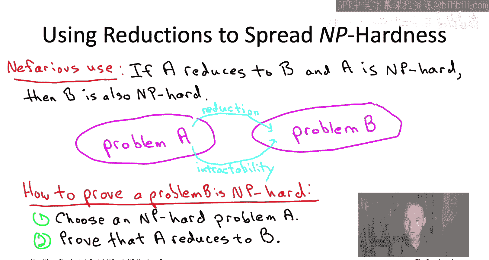

Single source shortest path problem， which is something hopefully you've seen before。

 but let me just actually briefly remind you exactly what this problem is。

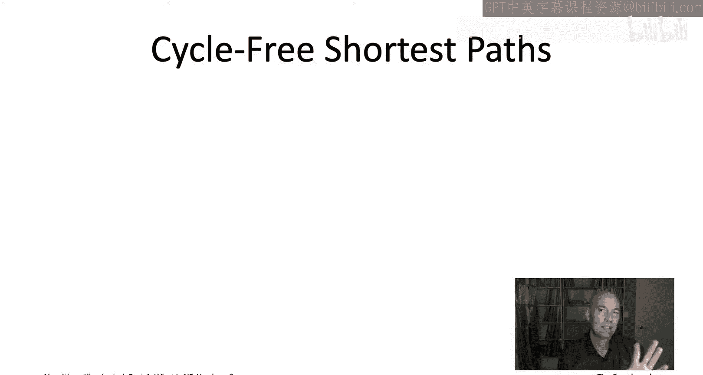

So the input to the problem is a directed graph and one of the vertices is designated as the starting vertex Moreover。

 each of the edges has a length。Now， in this version of the problem。

 we're going to allow length to be positive or negative or zero。 So any real value for edge length。

 And just in case you sort of scoff and like， well。

 why does that even make sense to have negative edge length in a shortest path problem。

 let me remind you that you know paths and graphs might represent abstract sequences of decisions rather than something physically realizable。

 So for example， if you want to compute a profitable sequence of financial transactions that involves both buying and selling。

 you're looking for a shortest path in a graph with edge links that are both positive and negative。

 So they do show up in applications， and this is the version of the problem that I want to talk about So the goal naturally is to compute the shortest path distance from this starting vertex S to every other possible destination vertex。

 So the length of a shortest path between this vertex S and every other vertex。

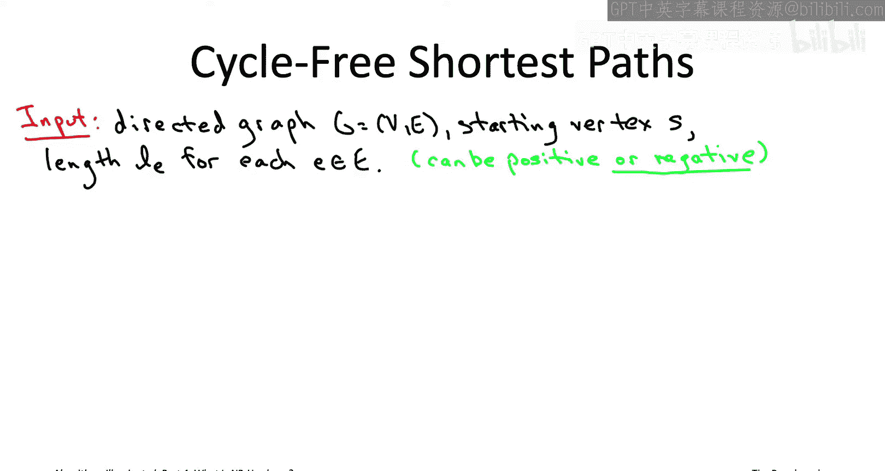

Now it's actually a little bit subtle to define what I mean by shortest path distance。

 But let's start with a simple example。 So， for example， consider this simple three vertex graph。

 So the shortest path distance from S to itself。 Well that's easy。

 Only the empty path goes from S to itself。 So that has length 0 is also only one path in this graph that goes from S to V。

 And that's a path that has length 1。 So that would be the shortest path distance from S to V。

 Now there are two different paths going from S to T。

 the one that goes through the one that's just one hop that goes directly there。

 that would be length minus2。 and then there's the two hop path that goes through V。

 that has total length 1 plus5， which would be equal to-4。

 So that would actually be the shorter path-4 is is more negative than-2。

 So maybe no big deal you say。 So what was so hard about defining shortest path distance was pretty obvious what they're supposed to be。

 But let's look at a second example。

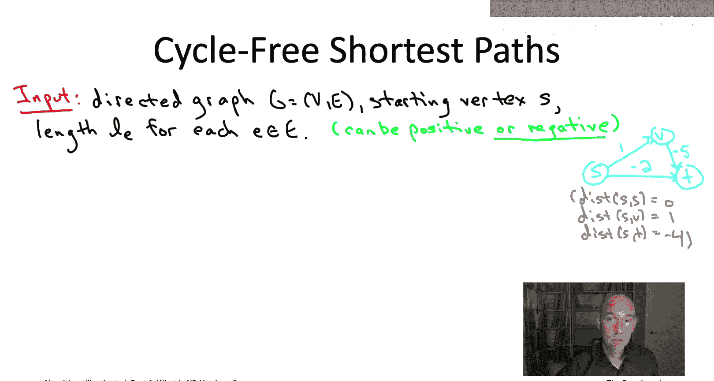

So what makes this graph more confusing is that it has a negative cycle。

 meaning it has a directed cycle for which the sum of the edge lengths is negative cycle going from v to U to W to x back to v again。

 you'll notice that the overall the sum of the edge lengths in that cycle is minus2。

 So consider the shortest path distance， whatever that means from S to V。On the one hand。

 there is that one hop path， so that has length 10， fine。

 but then actually you could tack on a cycle traversal at the end of that one hop path。

 so you'd now have five hops in your path， but the length would have dropped from 10 to8。

And why stop with one cycle traversal by traverse it again。

 you have a nine hop path with length 6 again， you have a 13 hop path with length4 and so on。

 So by traversing the cycle， an arbitrary number of times you can push this path length to be as negative as you want So the shortest path distance between S and V you could define it as mine is infinity you could say that it doesn't exist anyways。

 it's confusing what you're supposed to do in the presence of a negative cycle So one thing you could do that would seem to make a lot of sense is just be clear in the problem specification that you're not interested in these path that loop back on themselves in infinite number of times So just say look I what the shortest path distance but there's no loops in your path your path should be cyclefr So that's a perfectly natural and perfectly welldefined algorithmic problem you might well say hey。

 wouldn't it be cool to have a fast algorithm to compute shortest cycle free path in the presence of negative edge lengths Unfortunately。

 this is the shortest path problem which we do not think has any polynomial time solution The cyclefr shortest。

Pro is an NP hard problem。 So let me now show you how you would actually prove this fact。

 prove that it's NP hard to compute cyclefree shortest paths。

 I should have mentioned this NP hardness sort of explains know the limitations that we saw when we talked about shortest path algorithms in parts2 and3。

 All of our algorithms succeeded only when grass that did not have negative cycles。 So for example。

 we had diykester's algorithm that actually made a stronger assumption that assumed all edge lengths are non- negativeg。

 So certainly all cycles are non- negative。 and there we got a near linear time algorithm。

 we were able to solve that super quickly。 We also saw that Belman Ford and Fd Warshall algorithms。

 those did not assume non-neg edge length they allowed negative edges but they promised correct shortest path distances only in the absence of a negative cycle。

 if there was a negative cycle， the algorithm would tell you that， which is good to know。

 but it wouldn't give you any shortest path distances。

 So those were all polynomial time algorithms and we now see why they didn't do more because if they actually were going to correct compute correct shortest。

Path distances for cyclefree paths in the presence of a negative cycle they would have been solving an NP hard problem in polynomial time thereby refuting the P not equal to NP conjecture so how would we prove this how would we convince ourselves that the cyclefree shortest path problem is NP hard well we just use the two step recipe so we're just going to pick some NP hard problem A this is going to be our problem B and we want to show that this known NP hard problem A reduces to the problem we care about cyclefree shortest paths。

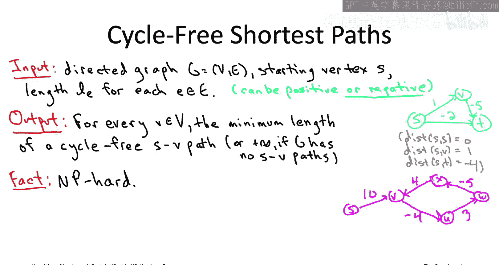

So let me tell you about each of those steps in turn first I want to tell you what's going to be are the known NB hard problem A that we're going to reduce from。

 then I want actually show you the reduction from that problem to cyclefree shortest paths So for our known NB hard problem A will use a famous problem you may not have heard of it but it is a famous problem the Hamiltonian path problem specifically in directed graphs。

So in the directed Hamiltonian path problem， the input is just a directed graph along with one designated starting vertex S and one designated ending vertex T。

 and the goal of the problem is simply to identify whether or not this graph G has what's called an ST Hamiltonian path。

So that's a directed path from S to T。And it should visit every vertex exactly once。

 so it's going to have n minus1 edges if n is the number of vertices。

 and it's just going to visit every single vertex once starting at S ending a T。

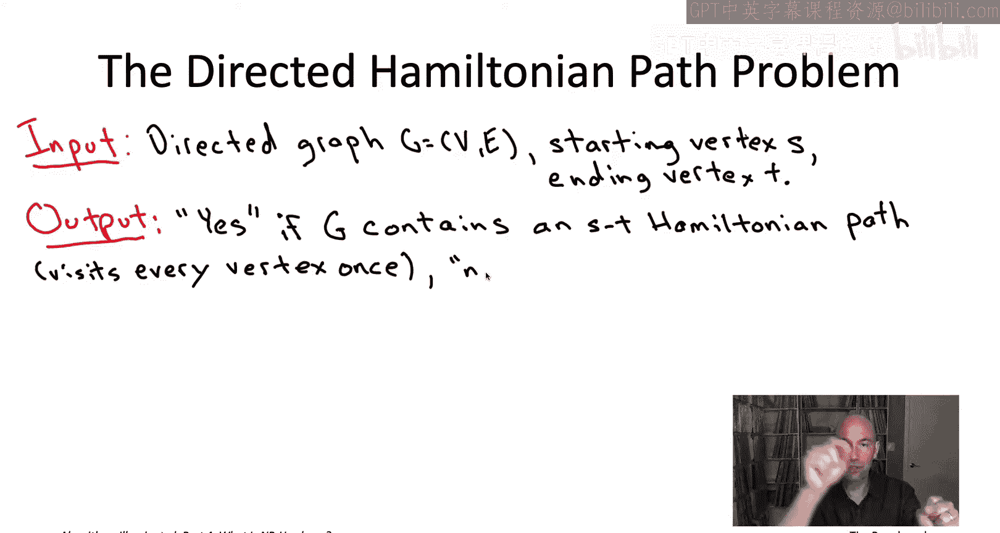

So for example， here are two very similar looking directed graphs。

 one of which has an ST Hamiltonian path and one of which does not。So in the graph on the left。

 as you can perhaps see， there is an ST Hamiltonian path。 It snakes back and forth between S and T。

 whereas in the right graph， I kind of messed up this path by reversing the orientation of the rightmost edge in the second row so now if you check there's actually no longer an ST Hamiltonian path in this graph on the right because I reverse the direction of that one edge So some graphs have ST Hamiltonian paths and some graphs don't and it can be quite subtle to figure out which of the two cases you're in but that's exactly the directed Hamiltonian path problem So I give you the directed graph I give you the start and I give you the end and I just want to know yes no。

 does it have an ST Hamiltonian path or not turns out this seemingly innocuous sounding problem is in fact NP hard So for this video I just want to take this on faith I just want to sort of assume that directed Hamiltonian path problem is NP hard and use that to spread its NP hardness。

The problem that we care about cyclefree shortest paths Now later on in the playlist in the videos corresponding the chapter 22。

 we will in fact see why directed Hamiltonian path is NP hard we will prove that it's NP hard using this exact same twostep recipe But again for now let's just take it on faith and spread that intractability to cyclefree shortest paths by reducing directed Hamiltonian path to cyclefree shortest paths remember intractability spreads in the same direction of the reduction we want to spread intractability to cyclefree shortest paths so that's also the direction of the reduction that we want All right so we need a reduction so remember what that means。

It means that if someone gave us a magic box that could solve the psychofree shortest path problem。

 then we could use that magic box to come up with an efficient algorithm for the directed Hamiltonian path problem So we're given this magenta box case so problem B is the psychofree shortest path problem or're given a subroutine for it and from that we want to build the light blue box。

 an algorithm that solves the directed Hamiltonian path problem So the reduction is going to start with an instance of the directed Hamiltonian path problem that's specified by a directed graph G along with a starting vertex S and a destination vertex T。

So what's sort of the simplest thing that we could do to this instance so that it makes sense to feed it into a psychofree shortest pass problem Well psychofree shortest pass it expects a direct graph we've already got that。

 it expects a starting vertex we've already got that it's not expecting a destination vertex but so let's just not tell this sub routine about the destination vertex T The other thing that psychofree shortest path is expecting is edge lengths。

So we need to just put some edge links on the edges of the graph。

 and then we could try feed to get into the subbeachine and see what happens。Specifically。

 here would be the steps that we're going to follow in the reduction。 Step 1。

 we're going to give lengths to all the edges。 What's that length going to be。

 The length is going to be  -1。Y-1。 but we're looking for a Hamiltonian path。

 So that's really long path。 The subroutine computes short paths。

 So to make it think that short paths to make it think that long paths are actually short。

 we trick it by giving all the edges a length of -1。

 The second step is where we're going to invoke the assumed subroutine for computing cyclefree shortest path。

 Invoke this magic box， which have've drawn in magenta。 So we're going to feed the magic box。

 the same graph G that we were given。 we're going to feed it the same starting vertex S that we were given and we're going to feed it in these edge lengths that we made up these minus1s。

 And then we're going just run it， see what we get。

 it's going to tell us the length of a cyclefree shortest path between the starting vertex S and everybody else。

 So in the last step we need to somehow read the t leaves。

 We need to look at the answer that our subroutine gave us back and deduce from that answer what's up in the original original directed graph。

 Does it have a Hamiltonian path or not。 And that's going to be very simple。

 we're going to ignore distances between S and al vert。

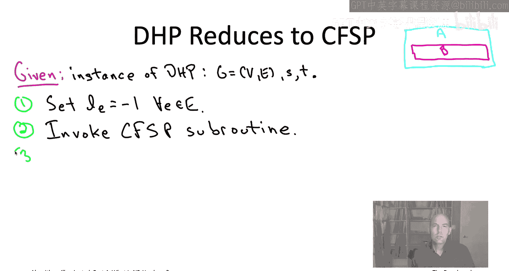

other than t and we're going to look at what this17 tells us is the shortest path distance between S and T。

 and if that is minus quantity n minus1， so in other words，1 minus n， then we'll return yes。

 if it's anything else， we're going to return no。So we're claiming that whether or not the shortest path distance is minus quantity n minus1 tells us whether or not that graph has an ST Hamiltonian path。

 so to understand what's going on， let's sort of revisit our two example graphs。

 one was Hamiltonian one was not Hamiltonian and let's see what happens in the reduction to those two graphs。

So these are the exact same two graphs that we looked at earlier。

 the only differences as I've now written a minus1 by each of the edges reflecting their edge length so in the first graph on the left that was the one that had a Hamiltonian path that snakes back and forth from S to T So that path visits all nine vertices exactly once so as a result it has eight edges which means that its length is minus8 and indeed in the reduction if this happens the reduction is going to return the answer yes so it's looking for a shortest path distance of minus quantity n1 so with nine vertices when n equals9 that would be looking for a shortest path distance of minus8 and that's indeed what it would be if you think about it there's no way you could have a path it was even more negative than minus8 because if you had nine edges that means you'd be visiting 10 vertices so you'd have to visit one of the vertices twice so it couldn't possibly be a Hamiltonian path Now in the second graph there is no ST Hamiltonian path。

For that reason， there is not going to be any path from ST T that has length minus8 whatever the shortest path distance is from ST T。

 it's going to be bigger than minus8 because there's no ST Hamiltonian path。

And if you think about it， you realize that the best you can do is minus6 in this graph on the right。

 So indeed， the reduction is going to do the right thing in this graph we fed the reduction was given a graph that has no ST Hamiltonian path when it invokes the cycle-fr shortest path subroutine it's going to find that the shortest path distance cyclefree path distance from S T is minus6 and then it's going know it's going to know there's no ST Hamiltonian path it's going return no and those same arguments work totally generally。

 we really use nothing about these particular non vertex graphs to argue the correctness of the reduction so if the reduction starts with a directed graph that does have an ST Hamiltonian path that path will immediately translate to cyclefree ST path in the shortest path instance that has length exactly minus times quantity n minus1 times the number of hops in that ST Hamiltonian path so the shortest path subrtine will tell the reduction as much say hey the shortest path distance from S to T is minus times n minus1 and then the reduction is like oh cool that meant there was a Hamilton。

In path， and so you return yes。In the other case， if the reduction is given in a graph that does not have an ST Hamiltonian path。

 well then all of the ST cyclefree paths in the graph have fewer hops than a Hamiltonian path。

 which means that in the shortest path instance， all of the cyclefree paths will have length strictly bigger。

 less negative than a Hamiltonian path would have so it'll have length strictly bigger than minus times quantity n minus1 the subroutine will report that back and that signals the reduction。

 okay I was given a graph that did not have an ST Hamiltonian path and now I'm just going to report as much。

So it doesn't matter whether the reduction is given a graph with a Hamiltonian path or not。

 either way it can correctly deduce which case it's in according to the output of the cyclefree shortest path subrine and that's a reduction that shows that given a magic box solving cyclefree shortest path you could indeed solve the directed Hamiltonian path problem So under our assumption that the directed Hamiltonian path problem is NP hard by our twostep recipe。

 this reduction spreads the intractability spreads the NP hardness to the cyclefree shortest paths problem as well So later on in the video playlist we will see many。

 many more examples of the twostep recipe in action but I just wanted to give you an early glimpse of it because I think it's really empowering to know how easy the theory of MP hardness is to apply how easy it is to generate your own NP hard problems when you need to。

So the last thing I want to discuss in chapter 19 is a collection of rookie mistakes around NP hardness。

 which you're going to want to avoid， so that's coming up next， I'll see you then。

