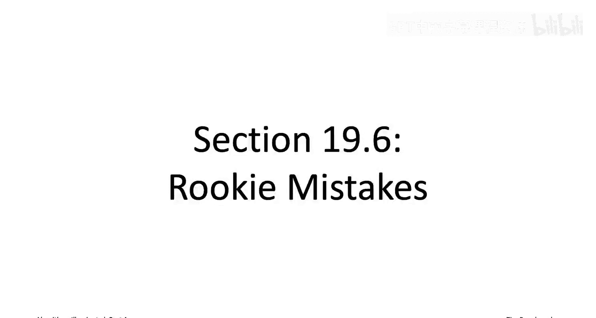
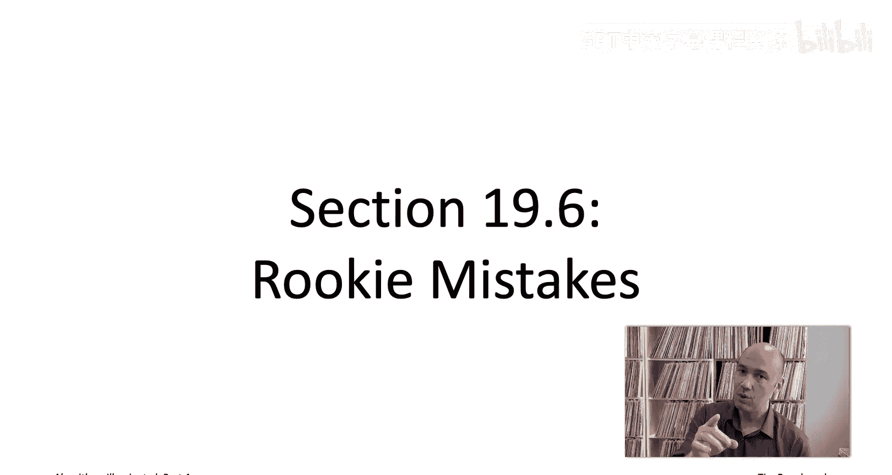
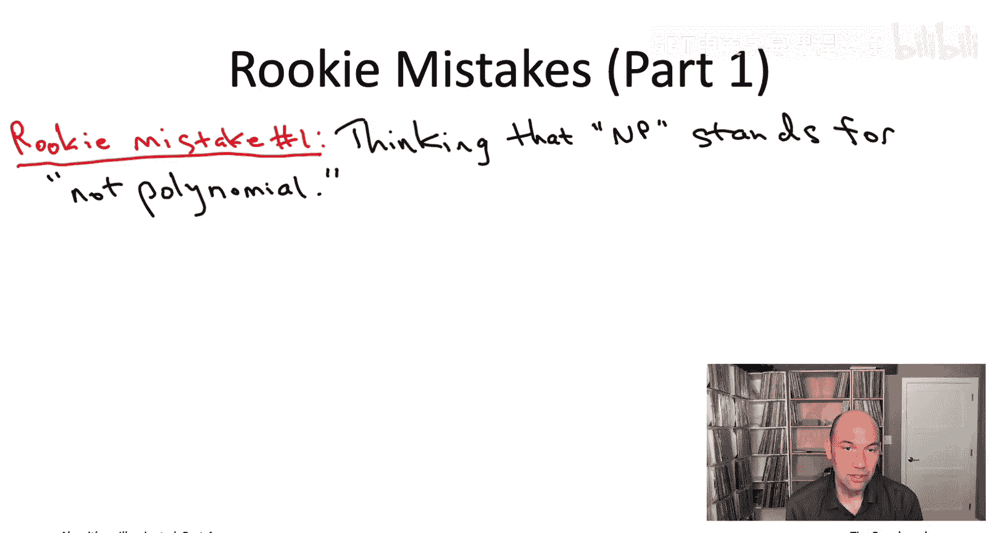
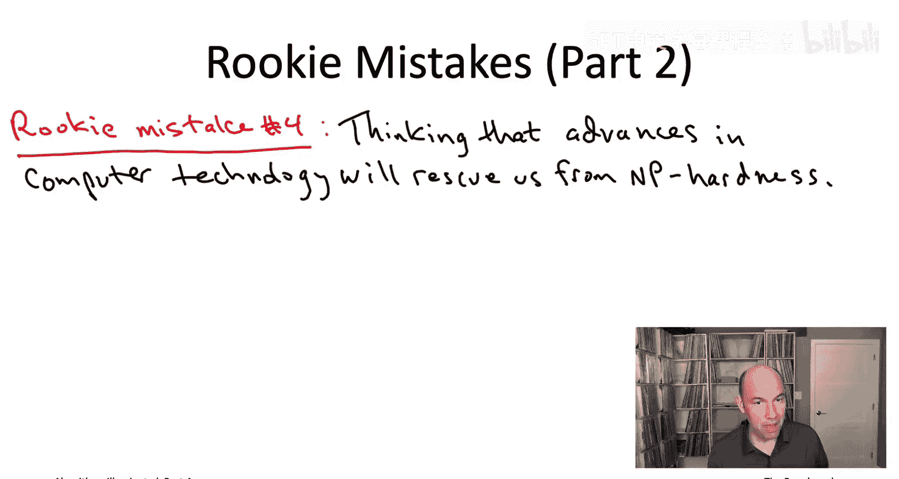
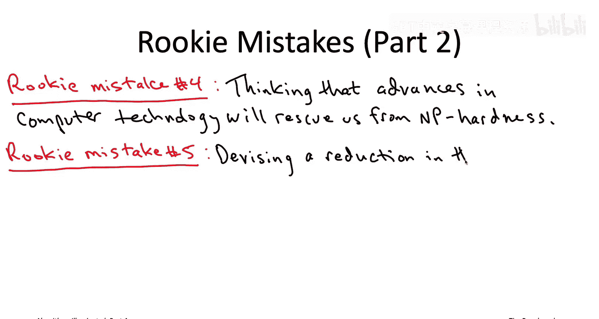
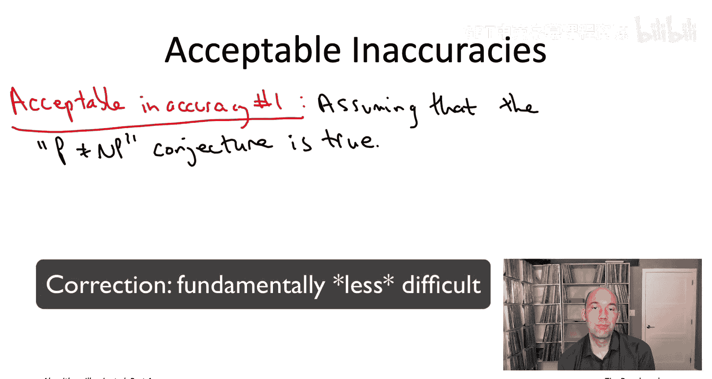
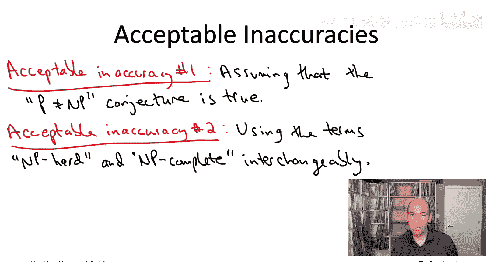
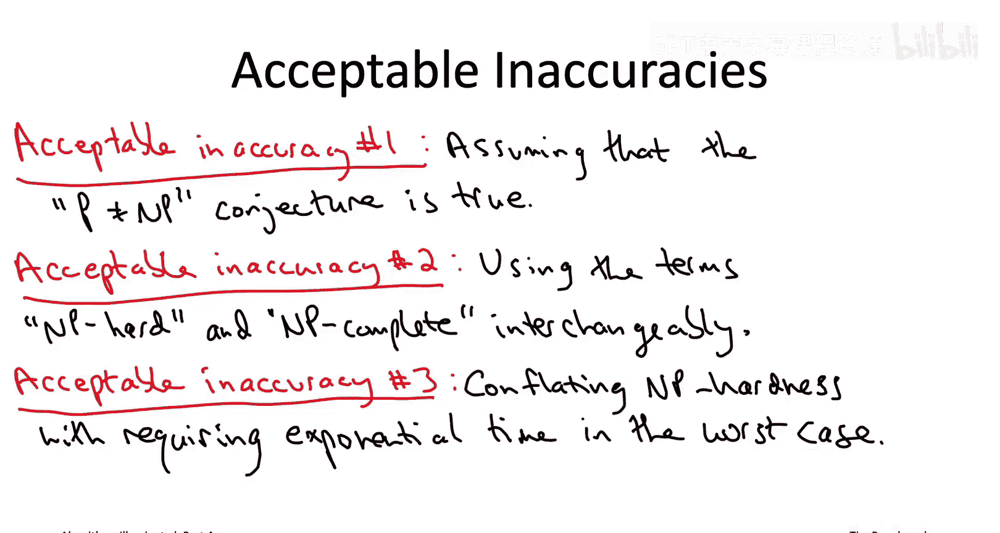

# 斯坦福大学《算法启蒙（第4册）：NP难｜Part 4 Algorithms for NP-Hard Problems》中英字幕（deepseek-R1） p07 -07-19.6_ Rookie Mistakes).zh_en -BV1FAVUzXEum_p7-

Hi， everyone， and welcome to this video that accompanies Section 19。

6 of the book algorithmgorims illuminated Part 4， a section about rookie mistakes。 Now， NP hardness。

 on the one hand， it's a pretty technical topic。 On the other。

 it's highly relevant for practicing programmers and computer scientists。

 And when computer scientists speak about NP hardness outside of a sort of academic setting。

 like a classroom or a textbook。 We generally take some liberties with the exact mathematical definitions。

 just in the interest to sort of easier communication。😊，However。

 some inaccuracies around N hardness will mark you as a clear as a clueless newbie。

 others more culturally acceptable。How would you ever know which is which。

 because I'm going to tell you right now？

So let's begin with a list of five common rookie mistakes。

The first rookie mistake concerns the acronym N P， meaningan what does it stand for。

 And it's actually not that important that you remember what it stands for As long as you remember what it doesn't stand for。

 It does not stand for quote unquote， not polynomial。 Now， Well。

 it's true that most people believe that N hard problems cannot be solved in polynomial time。

 Nevertheless， that is not not polynomial is not what N stands for。

 You could ask what does it stand for， you might regret， if you ask the question。

 But if you're really curious， the answer is nondeterministic polynomial time。

 And if you want more details about that， will'll cover it in the optional lectures toward the end of this playlist。

 when we discuss P N P and all that。 Moving on to rookie mistake number2。

 which is something I I hear quite commonly， is when someone means to say that a problem is N hard。

 they instead say that it's either an N problem or is in N。

For those of you that go on and watch the optional videos about the formal definition of the complexity class N。

 you'll learn that when you say a problem is in N or is an N problem。

 you're actually saying something positive about the problem。

 something about tractability rather than about intractability。 specifically problem is an N。

 if you can quickly verify solutions to that problem。

 The way that if I give you a filled out Sudoku puzzle。

 it's easy for you to check that indeed it is a valid solution。 it follows all the rules of Sudoku。

 So you really want to say with NP hardness， you want to say a problem is intractable， not tractable。

 So don't forget the hard after the N。 Rokie mistake number3 is another one that I encounter all too often。

 which is assuming that N N hardness is a merely academic concept and is not relevant for pra that again is a big mistake。

 Now， it's true that N hardness is not a death sentence and there are numerous success stories of taming NP hard problems and practical。

s providedvied you use enough human and computational effort。 Indeed。

 we'll see several examples of this later on in this video playlist。

 But there's plenty of other real world applications where computational problems have had to be modified or even just completely abandoned because of the challenges posed by N hardness。

 And don't forget， you know， people are much more likely to brag you about the one time that they did successfully solve an N hard problem as opposed to the dozens of times where they failed to solve an N hard problems。

 So you hear about the successes much more than the failures， But believe me。

 the failures are out there and they are abundant。 Indeed。

 know if N hardness didn't matter in practice， why would fast heuristic algorithms be so prevalent in practice。

 if you could always solve hard problems， there'd be no reason to resortary heuristic。

 but people do all the time。 In fact， you could even argue， you know。

 how does modern commerce even exist if N hardness is sort of relevant and they practically easy problems。

 modernern ecommerce-com relies on the。Assumed security of cryptoysems like RSA。

 and that security rests on the assumption that it's computationally difficult to factor large numbers。

 but if you had some magic box that could reliably solve NPR problem super quickly。

 that would give you an efficient factoring algorithm。

 therefore breaking the RSA crypto system that obviously that hasn't happened yet as far as we know。

So let's move on to the last two rookie mistakes。 The fourth rookie mistake is something I'm hoping that all of you having now worked with asymptotic analysis for some time would not make。

 So rookie mistake number four is assuming that well you know computers keep getting faster and faster so problems that are hard today are going to be easy tomorrow。

So as we've discussed in the past， advances in computing technology。 and， for example。

 Moore's law stating that computers will keep getting faster and faster。

 that all actually only makes the theory of N hardness even more relevant。 Remember。

 as our computing power scales， So does the problem sizes。

 so do the sizes of problems that we're interested in solving。 And the bigger the problems。

 the bigger the gu between a polynomial running time and an exponential running time。

 So as technology gets better and better， MP hardness becomes more relevant than ever。

 rookie mistake number 5 is a very difficult one to avoid。 In fact。

 you people who do theoretical computer science for a living。

 you still see them making this mistake once in a while。

 So this rookie mistake concerns designing a reduction in the wrong direction。

 So remember that when we're doing， we're proving that a problem is NP hard。

 the intractability spreads in the same direction as the reduction。

 So if you're reducing a problem A to a problem B。

Intractability spreads from A to B。 Now， when you're coming up with an NP hardness proof and the reduction that it involves。

 there's usually an overwhelming temptation to do it in the wrong direction。

 just because that's the direction that we're used to。

 So you have to remember if you're trying to prove that a problem B is intractable the intractability has to spread from some other problem in the direction of that reduction。

 So you have to reduce a hard problem A to your target problem B， rather than vice versa。 And again。

 this is a very easy mistake to make all of us make this mistake sometimes。

 So really the only cure is to every time you think you've proved a problem is NP hard。

 go back and triple check that the reduction is going in the right direction。

 that the intractability is flowing from a known hard problem to the problem of interest。

So that wraps up the five rookie mistakes I wanted to tell you about。

 Let me conclude with three sort of acceptable inaccuracies。

 So these are gonna to be three statements， which strictly speaking。

 you know mathematically aren't quite correct。 but everyone will know what you mean if you make these inaccuracies。

 It won't shake anybody's confidence that you're a master of N Harness。

 So the first acceptable inaccuracy is to just assume that the peanut equal to Np conjecture is true。

 And it really is fundamentally more difficult to verify solutions to problems than to come up with your own solutions from scratch。

 Now， as we've discussed， we actually do not know to this day。

 whether or not the peanut equal to NP conjecture is true or false。

 our intuition is strong that it should be true。 And so really。

 while feels like we're waiting for our mathematical techniques to catch up to our intuition。

 most computer scientists sort of think of peanut equal to NP as a law of nature and then just proceed as if it as if it was true。

So the second socially acceptable in accuracy is to treat two terms of synonyms when really they're not。

 those two terms being， first of all， NP hard， as we've been using it so far and we'll continue to use in most of these video lectures。

 and then a second term which you may have heard of called NP completete。

Basically， NP complete is a specific form of being NP hard。 The details are kind of technical。

 So I'll discuss them only in those optional videos。

 I discuss formally what the complexity class N is and what N hardness actually means to first order。

 if you're focused on the algorithmic side， it really doesn't matter。

 whether a problem is N complete or N hard。 the takeaway is the same either way。

 These are problems that assuming the peanut equal to NP conjecture there is no polynomial time algorithm that solves it。

 So whether your NP complete or your NP hard， you're going to have to make the types of compromises that we're going to discuss in the videos to come。

 So the final acceptable inaccuracy is to equate N hardness with requiring exponential time to solve in the worst case。

 that's basically the oversimplified summary of N hardness I gave to you when I first introduced the term。

 As we've seen since then， there's some subtleties that that overlooks。 So， for example。

 there are problems that you can't even solve an exponential time。

LikeThe halting problem， there are a few problems that seem to be sort of intermediate。

 you know too hard to be polynomial timesovable， but too easy to be NP hard。

 like factoring large integers is a major one， but you know generally speaking dayto- day computer scientists do more or less equate NP hardness with worstcase exponential timeslvability So no one will ever bat an eyelash if you find yourself implicitly sort of making this equating these two things in casual conversation So that wraps up the sequence of videos for the first chapter of the book。

 chapter 19 just sort of explaining what is NP hardness intuitively what are the consequences for an algorithm designer what might you do about it when you encounter an NP hard problem how do you prove problems or NP hard on your own and sore where we're going go next is we're going to enrich your algorithmic toolbox with some new tools to make progress on NP hard problems when you do encounter them and so coming up next we're gonna to be focusing on fast heuristic algorithms。

So this is going to be a compromise we make for NP hard problems when we're willing to give up a little bit on correctness or're willing to be a little bit wrong。

 you know some of the time， but we really want a fast algorithm。

 So that's where we're going to be going in in the next sequence of videos see then。

