# 斯坦福大学《算法启蒙（第4册）：NP难｜Part 4 Algorithms for NP-Hard Problems》中英字幕（deepseek-R1） p08 -08-20.1_ Makespan Minimization) -Part 1 of 2-.zh_en -BV1FAVUzXEum_p8-

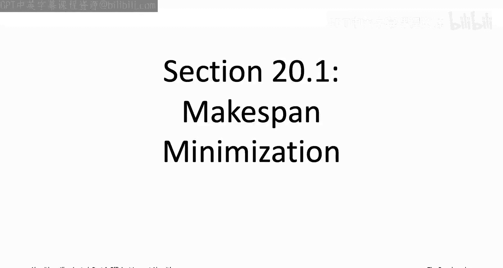

Hi， everyone， and welcome to the portion of the video playlist that accompanies Chapter 20 of the book algorithmrims illuminated Part 4。

 This is a chapter about efficient inex algorithms。 So you can't have it all with n be hard problems。

 You have to give up on at least one of generality， speed or correctness。

 So in applications where generality and speed are both mission critical。

 but you have no choice but to relax correctness and consider fast heuristic algorithms that are not going to be correct on every input。

That said， you know， you'd still like to minimize the damage。 you'd like to。

 if you can use a fastturistic algorithm， which is approximately correct in some sense。

 So maybe you can prove that it's approximately correct on every input。

 or maybe at least your empirically doing really well on the instances that you care about。

 So we'll revisit an old algorithm design paradigm， the paradigm of greedy algorithms。

 So turn out to be particularly well suited for the design of fastturistic algorithms。

 including some that have provable guarantees。 and will also augment your toolbox with a new tool local search。

 which often lacks provable guarantees， but it's nonetheless extremely effective at tackling a number of different andp hard problems in practice。

 So the case studies will look at throughout this chapter include scheduling problem。

 a problem in selecting a team the analysis of social networks and finally will revisit the famous travel and salesman prop。

 The first section， section 20。1 concerns that make span minimization problem。

 So this is a case study in scheduling。 We're going to be thinking about assigning。

As to a bunch of shared resources so for concreteness。

 you could think of the resources as being various computer processors and we're assigning the task being computer jobs。

 you could think of the resources as being different classrooms where we're assigning different classes that have to take place to those classrooms or you could think about the resources is different days on your calendar and what has to be assigned at various meetings that you have to have during the week so let's get straight into the problem definition。

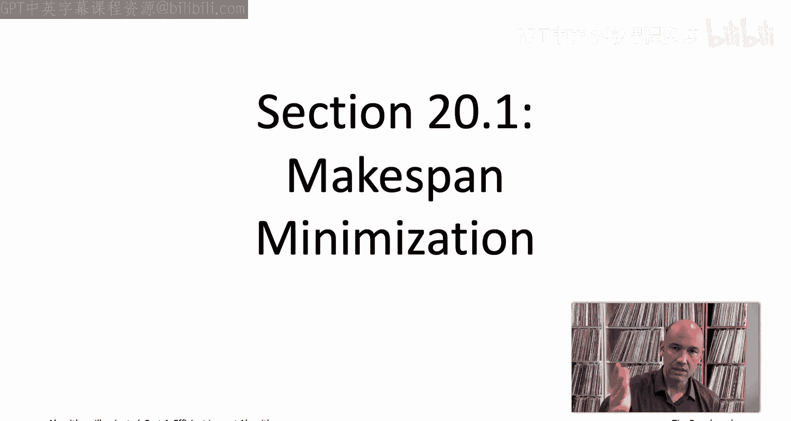

So in scheduling problems， the tasks to be assigned are usually referred to as jobs and then the resources are referred to as machines。

 and what we mean by a schedule is just an assignment specification for each job of which machine processes which resource it is assigned to So there's a lot of different schedules we could implement so which one should we prefer。

 but we're going to assume that different jobs have different lengths。

we'll denote the length of a job J by L sub J and so you can think of this as just like the length of a class or the length of a meeting We're going to be thinking about the objective that occurs probably the most commonly in practice。

 which is how to assign the job so that they all complete as quickly as possible。

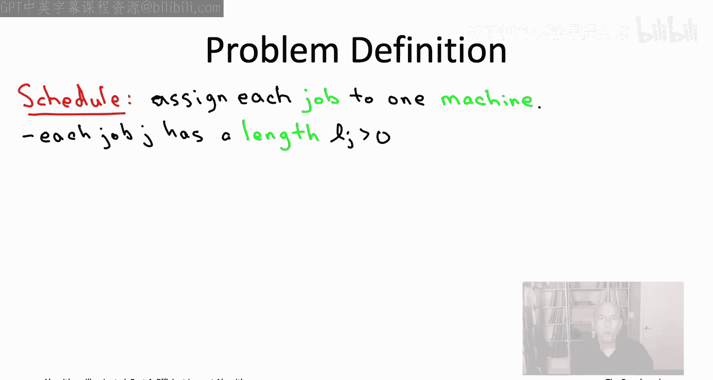

So to formalize this idea， we need to define a precise objective function。

 which assigns a numerical score to each schedule and quantifies exactly what it is we want。

 So first， let's define the load of a machine。 that's just going to be the sum of the lengths of the jobs that are assigned to that machine。

 So we're going to be interested in the largest of the machine loads。

 the most heavily loaded machine。 and that's going to be known as the makepan of a schedule。

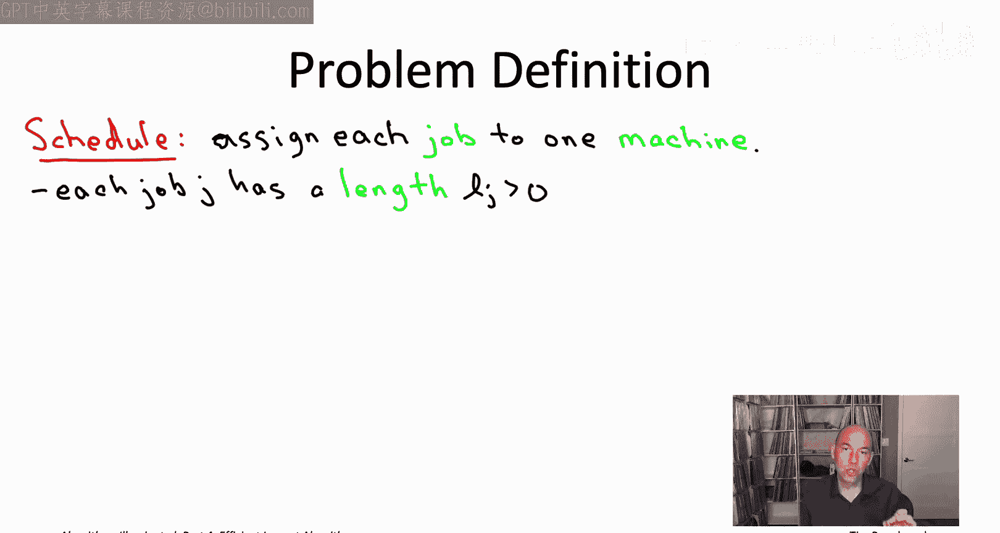

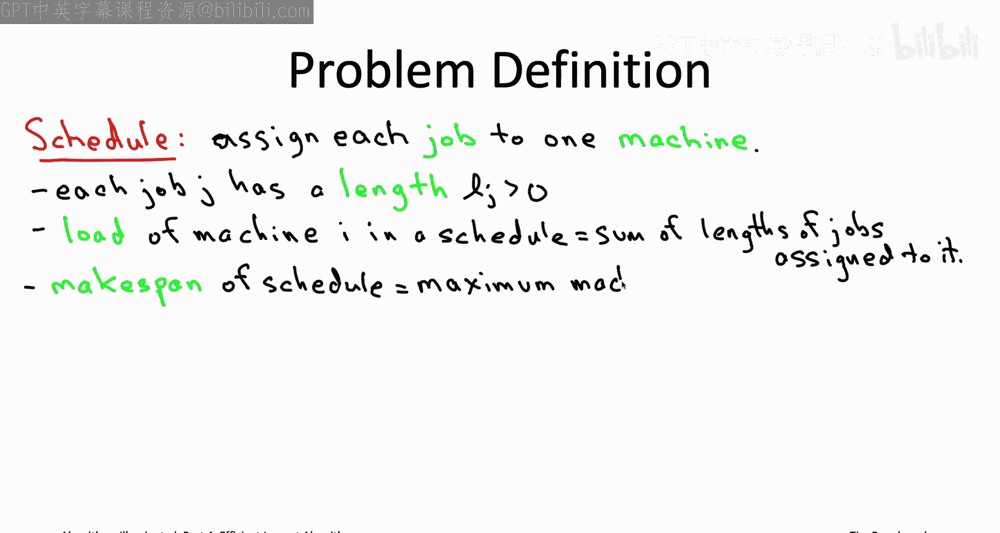

So this， the makepan of a schedule that's exactly what we're going to want to minimize。

 Now notice the load on a machine， it's the same no matter what order the jobs are processed on that machine。

 it's just the sum of their lengths and so therefore machine loads and therefore the makepan don't depend on the ordering of jobs on machines so we're not going to worry about that。

 we're just going to worry about which machine each job gets assigned to and we want to do that to make this makepan as small as possible。

So just to make sure these definitions of machine loads and if make span of a schedule that they're crystal clear。

 let's pause for a quick quiz。

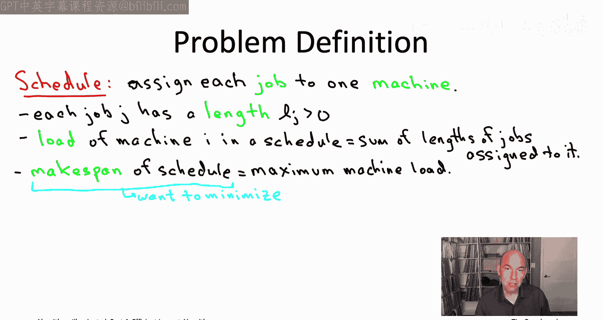

All right， so if the definitions on the previous slide were clear。

 then this quiz should have been straightforward， the answer is C。

 So remember the load of a machine is the sum of the links of the jobs assigned to it So in this first schedule the first machine has load two plus2 equals4。

 the second machine one plus3 equals 4 whereas in the second schedule the first machine has load two plus3 which is5 whereas the second machine has load1 plus2 which is3 The make span remember is the largest of all of the machine loads So in the first schedule both the machines have load 4 so the maximum is also four in the second schedule the loads are three and5 and the maximum those would be 5。

So now you should be able to guess exactly what the makepan minimization problem is， I give you。

 I tell you that theres M different machines， I tell you that there are n jobs and I tell you there are lengths and your goal is to assign each job to a single machine so that the makepan of the resulting schedule。

 the maximum machine load is as small as possible So for example。

 if the jobs represent parts of a computational task which are to be processed in parallel。

 like the jobs that would make up a mapred or Hadoop program。

 then it is the makepan of the schedule that governs when the entire computational completes so those applications are some of the reasons why this is possibly the most commonly studied objective function for scheduling in practice。

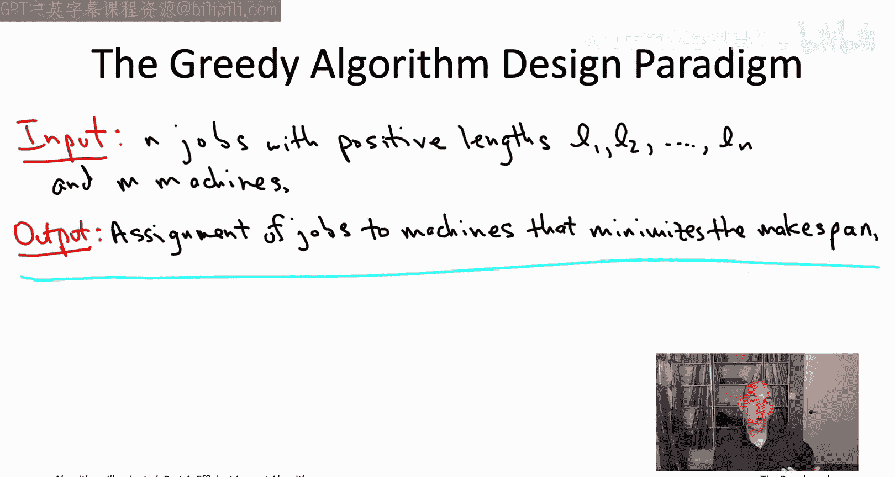

Now， like all of the problems we're going to be discussing in this video playlist。

 the Makepan minimization problem is an NP hard problem。

 and we will actually prove that once we get to the part of the playlist where we talk about how to prove the problems are NP hard。

 so we need to give up on a general， fast， always correct algorithm but we can ask could there be a fastturistic algorithm。

 an algorithm which works on all inputs is always fast and is in some sense approximately correct。

So as we've discussed in previous parts the greedy algorithm design paradigm。

 that's usually a great algorithm design paradigm to start with when you're first trying to understand a problem。

 so they're really good for brainstorming greedy algorithms。

 so we've seen that so far for polynomial time solvable algorithms like the minimum spanning tree。

 but it turns out greedy algorithms are equally well useful for brainstorming about what to do with NP hard problems。

 including the make expand minimization problem so let me just jog your memory real quick about what is the greedy algorithm design paradigm。

So the philosophy in designing a greedy algorithm is you're going to construct a solution iteratively piece by piece via a sequence of myopic decisions。

 and then you hope that everything works out in the end。

 So in previous books in the series by works out in the end。

 we meant that hopefully you correctly solve the problem like we did with say ditra's algorithm or prims algorithm in this part with Np hard problems we're going to be hoping by working out in the end。

 we're going to hope that we're reasonably close to a best possible solution。

 So the two main selling points of greedy algorithms are the first of all。

 as we've said good for brainstorming so easy to come up with in many cases for different problems。

 And second of all， because they're so simple they're often very fast。

 So it's common to see greedy algorithms are running linear or near linear time。

 Now the main issue with greedy algorithms is they're often too simple to be correct and that's true even for problems where more sophisticated approaches like dynamic programming can solve a problem correctly in polynomial time。

 greedy algorithms are often too simple to be correct in all cases now。

Hard problems on the other hand right if we're looking at polynomial time algorithms。

 we're going to be stuck with an algorithm which is not always correct no matter what so this kind of flaw of greedy algorithms would be shared by any other polynomial time heuristic algorithm for the problem and that's one of the reasons why greedity algorithms are such a great starting point for fast heuristic algorithms their weakness that they're not always correct is actually the perfect fit for the compromise you're making with a fast heuristic algorithm。

And for this reason， greedy algorithms are going to play a starring role in this part of the video playlist。

 so we're going to look at three successive problems。

 all of which have a good fast heuristic algorithm based on a greedy algorithm。

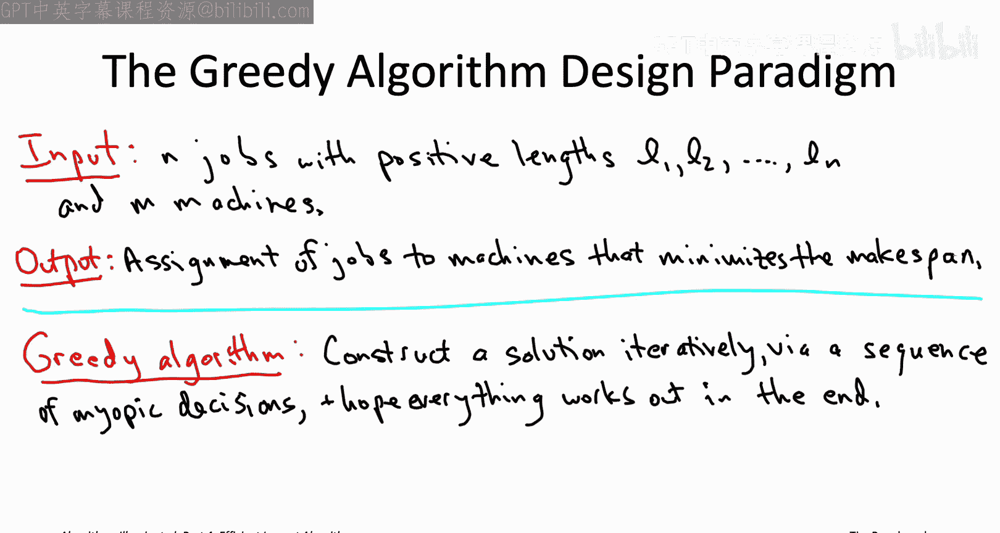

So let's go ahead and apply the greedy algorithm paradigm to the current problem。

 the mixedpan minimization problem， so in this problem we have to assign each job to one machine。

 the greedy paradigm says you know build up a solution piece by piece。

 so it would be natural to go through the jobs one by one when a single passover the jobs。

 assigning each job irrevocably to one of the machines。The question then is， okay。

 so when it's time to assign job number 17 to some machine， where should you assign it， Well。

 given that we're trying to have the machines as balanced as possible that we want to minimize the maximum load。

 the obvious greedy criterion would be to say， well look at the machine that can best tolerate this new job。

 the machine that has the smallest load of all M machines and let's put job number 17 there。

That greedy algorithm is actually a famous one known as Graham's algorithm。

 So that's going to be our first heuristic algorithm for an NP hard problem Graham's simple algorithm。

 which just does a single passover the jobs in arbitrary order always assigning the next job to the machine that currently has the lightest load。

 given where the previous jobs had been assigned Now as usual， with greedy algorithms。

 it's not that difficult to figure out that this is the fast algorithm。

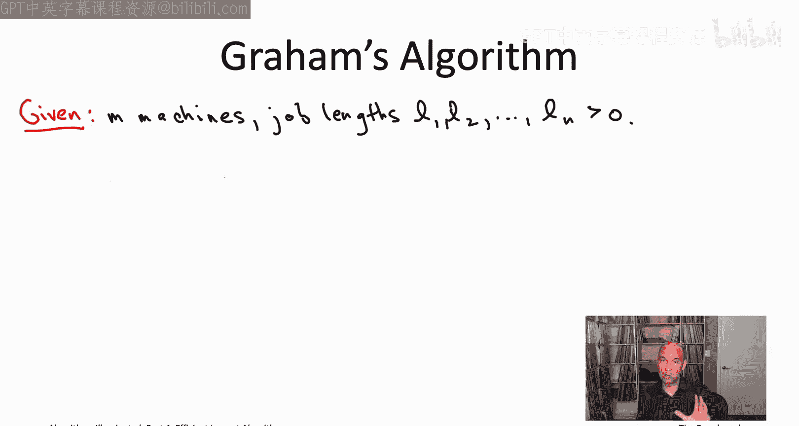

So suppose you implemented the algorithm in the most straightforward possible way so you'd have an outer for loop which has n iterations。

 it goes through the n jobs one at a time so n loop iterations。

 what happens inside an iteration Well you have to figure out which of the M machines is currently the lightest so that would be a simple linear search through the M machines I'm assuming here that you just keep a running count of the current load of each machines So every time you assign a job do machine you increment that machiness load by the appropriate amount by the length of the job So overall n loop iterations within each you do a linear search over the M machines to check which one has the smallest load boom。

 you've got an O of M times n algorithm where m is the number of machines and n is the number of jobs Those of you that have some experience with data structures I hope will recognize an opportunity for improvement So fundamentally what is the work that we're doing in each of these n loop iterations we're just computing the minimum of M numbers we have these。

We're keeping track of a load of each machine， and each iteration we want to know what is the minimum of those M numbers of the M machine loads。

 so the work done by this algorithm is just repeated minimum computations。

When you say it that way so hopefully like a bell rings you're like repeated minimum computations。

 this is an algorithm that calls out for a heap data structure because the raon detra of a heap is exactly to speed up repeated minimum computations from linear time to logarithmic time so I'll leave it to you to think through but with a pretty straightforward heatbased implementation of this algorithm you still pay the factor of n for the n loopiterations but now in each loop iteration it's going to run in time logarithmic in the number of machines rather than linear in the number of machines for an overall running time of o of n log m So as usual with greedy algorithms。

 it was not that hard to analyze the running time and it wasn't that hard to implement the algorithm so that it runs blazingly fast so that it runs an almost linear time let's turn to the trickier issue which is the quality of the solution the quality of the schedule returned by grams algorithm。

 let's get an initial feel for this question in the following。

quiz。

So the question is suppose I give you an input， theres five machines and there's 21 jobs and the list of jobs。

 the first 20 of them， all of those jobs have length one and then the 21st job has length 5 so figure out this schedule computed by the Grahams algorithm and it's makepan and figure out also know in a perfect world with a perfect schedule how small could the makepan possibly be I'll let you think about that for a few seconds。

So the answer is C so let's see why let's first start and understand what Graham's algorithm is going to do on this particular input Well Graham's going to process those first 20 jobs and it's going to spread them as equally as possible so it will assign each of the first five length one jobs to different machines。

 the next batch of five will also go to different machines similar for the third and the fourth batches of five so after those first 20 length one jobs you're going to have four length one machines on each of the length one jobs on each of the five machines。

So that's the status when Graham comes to the 21st job which unfortunately is a big job of length5 and there's nowhere to put it。

 all the machines are at load4， so you've got to stick it on one of them， say the first machine。

 that machine's load is going to jump up to nine and then that'll be the final mix span of the schedule。

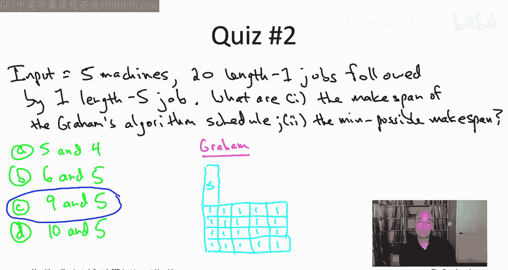

So what about in a perfect world Could we do better。

 Is there a schedule out there with makepan smaller than 9。 Well， yeah， sure， Basically。

 the idea is you're going to save one of the machines to process the big job， the length 5 job。

 That has four machines left over。 And they have to spread out the 20 length 1 jobs among them。

 So each of them will also have total load 5。 So you wind up with five machines， each with load 5。

 And so that's going to be the makepan as well。

So the example in that quiz shows that the GraM algorithm may output a schedule which makes span strictly larger than the minimum possible。

 so it's not always correct。Now， you know we're not actually surprised to see an example like this right I've told you that the makepan minimization problem is NP hard。

 Graham's algorithm clearly runs in polynomial time。

 so we're certainly not expecting it to be correct on all inputs if it were correct on all inputs that would re the P equal to NP conjecture and we're not expecting that to happen That said。

 I mean it's a very simple example and already sort of gram's algorithm is off by four it has a makespan of nine instead of a makespan of five so it's almost a factor of two bigger and you might well be wondering know that was such a simple example。

 maybe there's other more complicated examples out there where the schedule output by graham's algorithm is really just totally horrible。

 it's just like completely unacceptable but it turns out what we're going to prove next is an approximate correctness guarantee for graham's algorithm which says that that example in the quiz and the corresponding generalizations to more machines are actually the worst possible examples you will never see a more serious flaw in Gham's algorithm than is。

ready a appearance in the example in that quiz。So precisely Graham's algorithm is approximately correct in the sense that no matter what the input is。

 no matter how many machines you have， how many jobs what the job lengths are。

 the makepan of the schedule produced by the GramM algorithm will never be too much worse。

 too much higher than the minimum possible at worst it will be off by a factor of two minus1 over a little M where again M is the number of machines。

 So for example if M equals 2， this would say that the heuristics schedule has make span at most 1。

5 times the minimum possible if M equals 5 it would be at most 1。8 times the minimum possible。

 that's exactly what we saw in the quiz when the best possible makepan was 5 and Gham's makepan was 1。

8 times larger equal to9 and you can generalize the example in that quiz to any number of machines M showing you that you get worst examples possible for any number of machines M that's as bad as it gets in the quiz you're always at least as good with as fast heuristic algorithm as you are in the quiz。

So how should you interpret an approximate correctness guarantee like this， Well。

 think of it as an insurance policy， right， what this guarantee is saying is that even in the doomsday scenario of a supercontrived input like the one we saw in the quiz。

 even then Graham's heuristic algorithm is going to is going to give you Make span no more than twice the minimum possible so not that bad。

Also， empirically on more realistic inputs， the algorithm is going to overdeliver and you're not going to necessarily see the optimal makepan but you will you know in real world instances typically see the makepan of the heuristic algorithm be much closer than the minimum possible off by maybe you you might expect to be off by 10% or 20% or something like that so we will be proving this guarantee in full over the next two slides so if you want to see that proof great go ahead and watch those two slides for those of you that may be mathphobic or time constrained let me just give you sort of three steps of brief but accurate intuition and if then this is satisfying enough for you you can skip over the next couple slides and then we'll get to another algorithm So the first part of the intuition has nothing to do with Graham's algorithm that's just about sort scheduling in general which is that any schedule you look at there will be one machine at least whose machine load is small is no more than the minimum possible makepan because sort of the best case scenario for minimizing the。

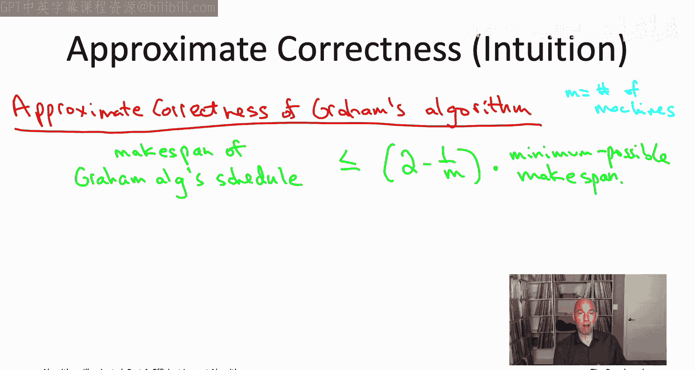

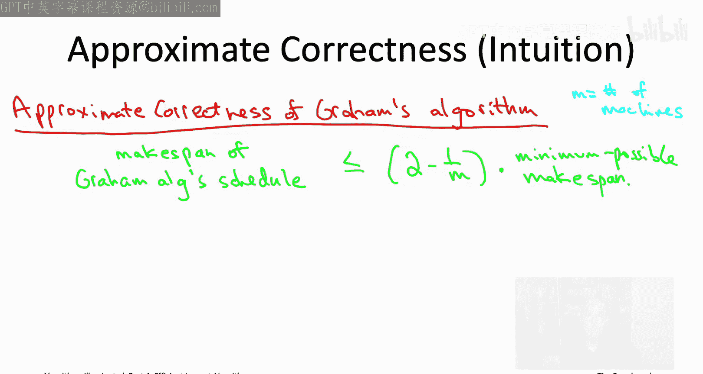

expand is that you spread the jobs perfectly evenly across the machines and then in any schedule you might have some machines that are sort of bigger than that。

 but then other machines will be smaller than that Okay so any schedule doesn't matter how smart or how stupid there will be at least one machine whose's load is small at most the minimum possible make expand。

So the second piece of intuition does concern Graham's algorithm and its greedy criterion， which is。

 you know， think about the machine that winds up having the maximum load at the end of the day when Gham's algorithm completes by the algorithm's greedy criterion at the time that that machine got its last job。

 at that time it was actually the least loaded machine。

So the final job we scheduled on that machine flipped its status from being the least loaded machine to the most loaded machine。

So what that means is the grams algorithm will ensure this sort of approximate balancing of the machine loads。

 Okay there may be a difference between the least loaded machine and the most loaded machine。

 but that difference will be at most the length of some job again because a single job toggle that machine status from the minimum load to the maximum load Also if you think about it。

 the length of a single job that can't be more than the minimum possible makepan if you have a job that has length 12 every schedule has to put that length 12 jobs somewhere and therefore every schedule has to have make span at least 12 So there can be a difference between the most and least loaded machine to the end of grams algorithm。

 but that difference is going to be bounded above by the minimum possible makepan of any schedule So if we put those two things together on the one hand the least loaded machine at the end of the day the end of grams algorithm that can't be that big that's most the minimum make span possible Now the maximum machine load might be bigger so the make span might be bigger than that but it's only going to be bigger by something which is at most the minimum possible make span so you put those。

Two things together at the end of the day the make span。

 the max machine load can't be more than double the minimum possible make span and in the more careful analysis we'll do in the next couple of slides we'll see that actually you get a bound better than two you get a bound of quantity2 minus one of our M where M is the number of machines but know if that's enough for you great skip the next two slides for the rest of you let's now really kind of do this for real。

