# 斯坦福大学《算法启蒙（第4册）：NP难｜Part 4 Algorithms for NP-Hard Problems》中英字幕（deepseek-R1） p09 -09-20.1_ Makespan Minimization) -Part 2 of 2-.zh_en -BV1FAVUzXEum_p9-

Alright， so let's jump into the formal proof。 So first just to remind you of the notation。

 little M that denotes the number of machines， and then we have job length L1 up to Ln N is the number of jobs。

 let me introduce some notation for the two quantities that we really care about for this approximate correctness guarantee。

 So first of all we care about the minimum possible makepan we're going to call that capital m star。

 and of course we care about the make span of the schedule produced by Gham's algorithm we're going to call that capital M。

 The whole point of this proof is to show that capital M is not too much bigger than capital M star specifically bigger by at most a factor of quantity 2 minus1 over little M。

 So it's pretty tricky to directly compare M and M star。

 So instead we're going to introduce two intermediate quantities。 One is the maximum job length。

 The other is the average machine load which will then be able to relate directly to both M and M star giving us a relationship between the two。

So the first intermediate quantity which is a lower bound on the minimum possible mix span。

 it's easy enough and actually we sort of already mentioned it。

 so remember that if some job has length 12，Any schedule has to put that job somewhere。

 So there's going to be some machine that has load at least 12。

 which means the makepan is going to be at least 12。 So in other words。

 you know whatever the best possible makepan M star is。

 it can't be any smaller than the length of a job。 So it's at least as big as every job or if you like at least as big as the longest job。

 So with the second lower bound basically says is that the best case scenario for the makepan is for every machine load to be exactly the same for everything to be perfectly balanced。

 And we saw that， for example， in the quiz where the optimal schedule balanced everything and had load5 across all the machines。

 So that's as good as it gets。 and that's what the second lower bound asserts。

 So a little more precisely， what is the sum of all of the machine loads in a schedule where you've got your end jobs。

Each job is assigned to exactly one machine and then the job of length。

 say 12 will then contribute exactly 12 to the load of the machine to which it is assigned。

 So in other words， you know the sum of all of the machine loads is exactly the same as the sum of all job Some over j equal1 to N of L sub j because every job has to go to exactly one machine So what does it mean for them to be perfectly balanced。

 it means that all of the machine loads are exactly the same。

 which means that each of the little M machines has an equal share of the total sum of the jobs。

 so one over little M times the sum of the job length。 that's the best case scenario。

 perfectly balanced schedule， no schedules better than the perfectly balanced ones So in particular。

 and star， the minimum mix span can't be any better than that idealized machine load for the perfectly balanced case。

So this is good。 we've introduced two simple intermediate quantities and we've related both to the minimum possible make expand。

 specifically each of these intermediate quantities can only be less than the minimum possible makepan so what remains to be done and what we'll do on the next slide is to relate the make span capital M of the schedule produced by Gms algorithm to the same two intermediate quantities so let me just sort of circle the key inequalities is these are going to be used crucially and the proof I show you on the next slide。

So let's move on to the analysis of the schedule produced by Graham's algorithm。

 And what we want to do here is formalize the second step of our intuition。

 Remember what we said then we said， well you know the difference。

 you know there's going to be some imbalance maybe in the schedule but the difference between the maximum machine load at the end of the Gram algorithm versus the minimum machine load it's going to differ by most a job because a single job toggled some machine status from the minimum to the maximum let's make that precise。

 let's start with some notation。 So first of all， by machine I。

 we're going to mean the machine that has the maximum load under the schedule produced by Graham's algorithm。

 So in other words， the machine that achieves whose load achieves the makepan of the Gram algorithm。

 So it has load capital M。

Meanwhile， J that's going be we're going to use that to denote the final job that the algorithm assigns to this most loaded machine I。

 This is going be the one that toggles its status。 So this job J。

 it may be the last one in the input or it may not。

 So what I want you to think about doing is rewind Ghams algorithm to the iteration in which J is assigned so after this iteration no more jobs get assigned to machine I Also let L hat sub I denote the load of machine I just before this job J was assigned to it。

 Okay what's load just before it got its final job J So over on the right。

 let me show you a cartoon of what this might look like。 So suppose you have five machines。

 they have pretty balanced loads， but if you had to pick it would be the first machine that at this moment in time had the lightest load and then job J comes in piles on and maybe job J was a pretty big job。

 Now maybe there's some more jobs to schedule and maybe Graham's algorithm goes ahead and schedules them but by definition it's not going to schedule。

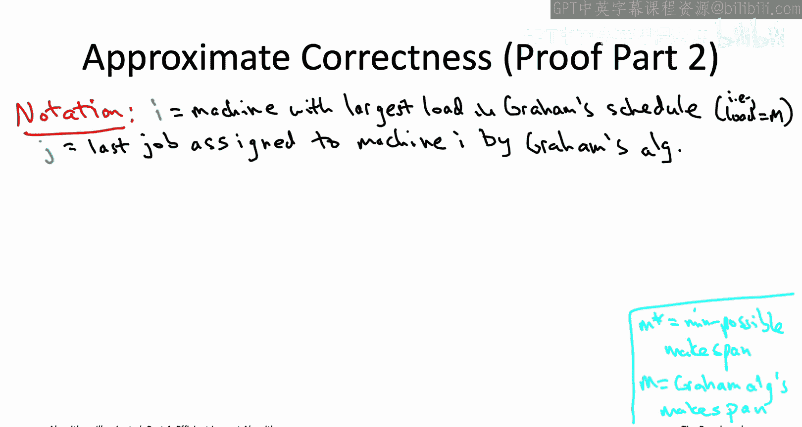

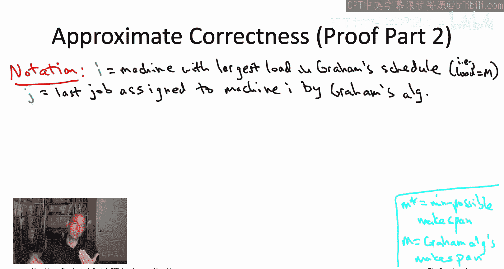

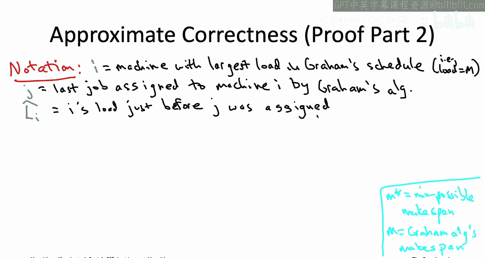

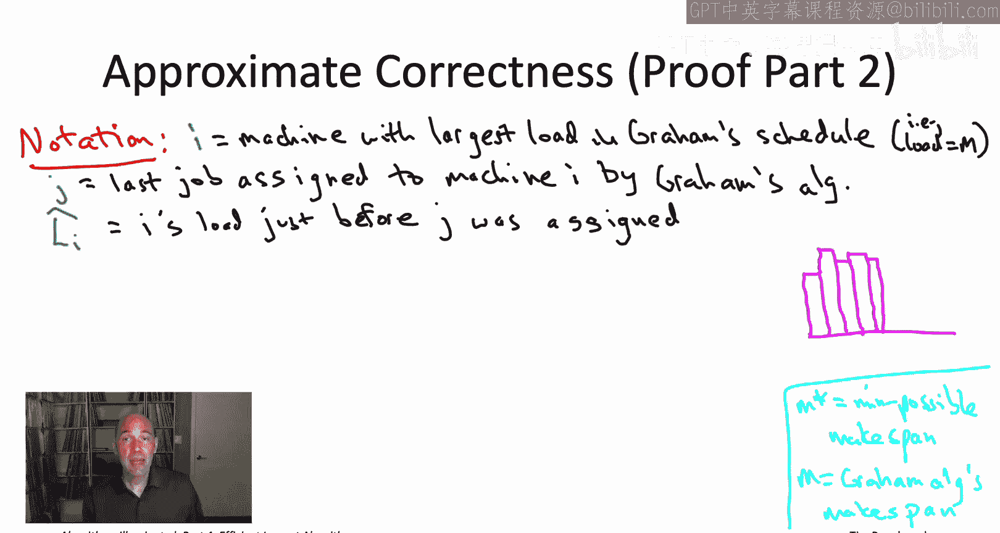

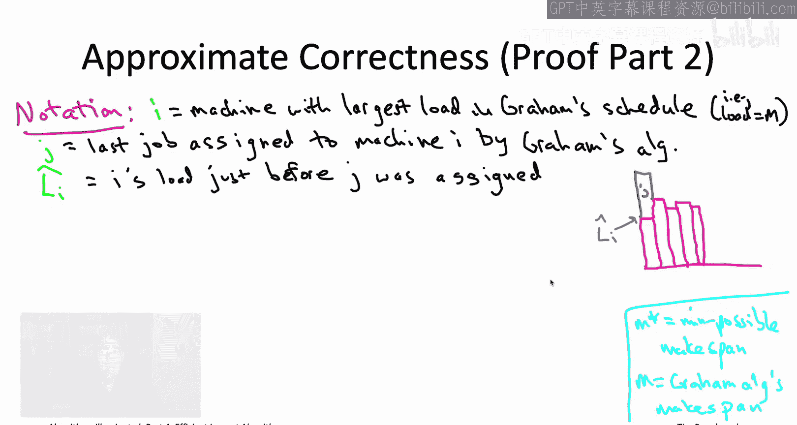

More on the first machine that's by the definition of this job J being the last one assigned to this machine。

 but maybe a little more stuff sort of get sprinkled on top of the other four machines So how big could capital M how big this make span possibly be Well let's first think about how big could L hat I possibly be how much could the load to this machine had been before job J was assigned and then let's think about what's the extra machine load contributed by job J So first of all。

 machine I load at that time So capital L hat I that cant have been any bigger than the average machine load at that time because remember I had the minimum machine load at that time So for example。

 if things were perfectly balanced at the time job J showed up what would that mean that would mean the sum of the job links of the previous jobs So the jobs1 to up to j1 the sum of those job length would have to be spread exactly evenly over the M So in a perfect schedule all the loads would be one over M times the sum of the first。

1 job length in general， in any schedule， there might be some machines that are smaller than that and then other machines that are bigger than that。

 but in any case there's going to be machines that have at most this average load and so I as the one that had the minimum load is one of those machines。

So the final makespan capital M， we know that's just the load L hat I before the last job J was assigned to I plus the length of Jo J itself。

 so let's just add those two things together and then simplify or in this last inequality just for fun just for convenience。

 I've thrown in the lengths of the jobs that come after job J if there are anyy so I've just added in the length of the jobs J plus1 up to job n to the sum length are positive so that only makes this quantity larger。

Now， let's just move a one over M fraction of job J's length into the sum。

 So now that that sum is going to be a sum over all of the job length。 Why did I do this。

 Because now we have an upper bound on the make span of the schedule produced by Graham's algorithm。

 which is in terms of the two intermediate quantities that we introduced on the previous slide。

 are two lower bounds on the minimum possible make span， there's two circled inequalities。

 So specifically， remember that in our first lower bound。

 we just said that every job has to go somewhere。 So whatever the minimum makes span is。

 there's no way that it's any less than the length of some job。 So we can upper bound in particular。

 the length of job J by the optimal makes span capital M star。 Don't forget。

 we also had a second intermediate quantity， another lower bound on the minimum possible make span。

 But we just said that the best case scenario from minimizing the make span is that the machine loads are perfectly balanced that they're all exactly the same。

 If they were all exactly the same。 then each machine would have load one over little M times the sum of all the job lengths because they'd be sharing equally。

And in general， any schedule can only have makepan worse than that。

 so this quantity and our second term here， the sum of the job length divided by the number of machines。

 the perfectly balanced machine load， that's also a lower bound on the minimum possible mix expand capital and star。

And now we are done， we can upper bound the first term by 1 minus1 over little M times capital M star。

 we can bound the second term by capital M star at together。

 there is that quantity 2 minus1 over little M times the optimal makes band M star。

So that is pretty cool， that is an approximate correctness guarantee for Graham's fast juuristic algorithm。

 Graham's greedy algorithm， and it's great to have an insurance policy like the one that we get from that that no matter what happens。

 even in a doomsday scenario that makes spans never going to be worse than double the minimum possible。

But as always， as algorithm designers。It's our duty to ask。Can we do better。

 Could there be another fastturistic algorithm with an even better approximate correctness guarantee。

 an insurance policy with an even lower deductible。 In fact， we can do better。

 And all we need to do is make use of a very familiar for free primitive。

 one of those things which you can throw in as a pre processingces step whenever you want。

 even if you don't know quite why you need it。And which for free primitive well you can sort of already get an idea from the contrived example we had in the quiz a couple slides back where Graham's algorithm unfortunately considered all of the length one jobs first perfectly balanced them and then got stuck with this sort of really big job at the end so we'd like to somehow avoid sort of saddling Graham's algorithm with really big jobs at the end。

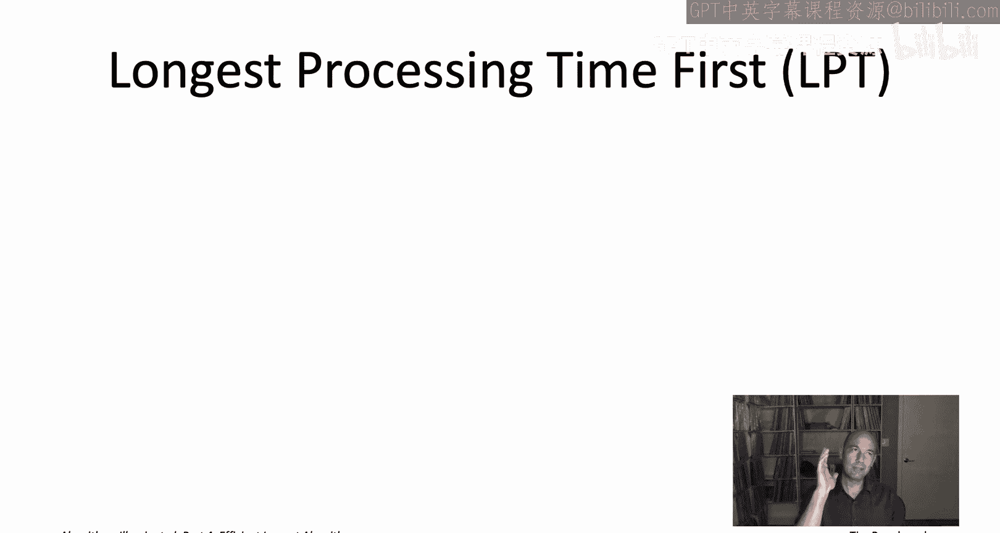

How would we do that， Let's just sort the jobs by length at the beginning。

 starting with the biggest jobs and concluding with the smallest jobs that is an algorithm known as the longest processing time algorithm or the LPT algorithm。

 So that's the LPT algorithm it's obviously again quite simple and accordingly it can be implemented to run in in a blazingly fast fashion with running time close to linear。

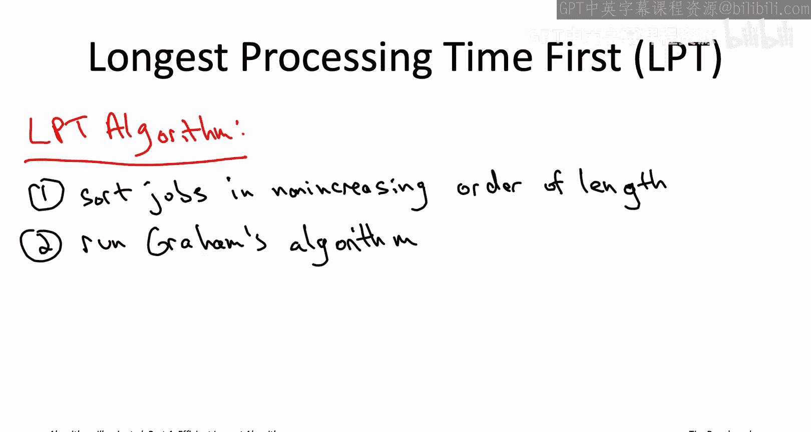

I'm assuming here that to use a sorting subroutine that runs in near linear times， for example。

 merge short would take O of n log N time to sort n jobs。

 and then for the second step I'm assuming that we're implementing it using heaps as we discussed back when we first talked about the running time of Graham's algorithm。

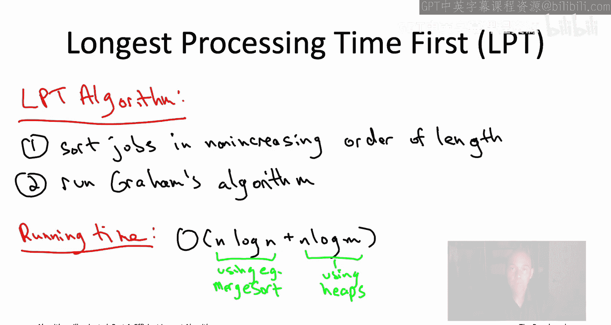

So again， you the question is not so much is it a blazingly fast algorithm clearly it is The question is how good is it。

 what is the quality of the solution produced the makepan of the schedule output by the LPT algorithm to get a feel for that let's move on to another quiz So the input in this quiz is going to be a little more complicated than in the previous one we're still going have five machines we're going to have 11 jobs but are're going to have five different possible length So three jobs with link5 and two jobs with links each of 6。

7，8 and 9 And the question then of course is what is the makepan of the schedule output by the LPT algorithm and how does that compare to the minimum possible makepan the best makepan you could achieve say using exhaustive search。

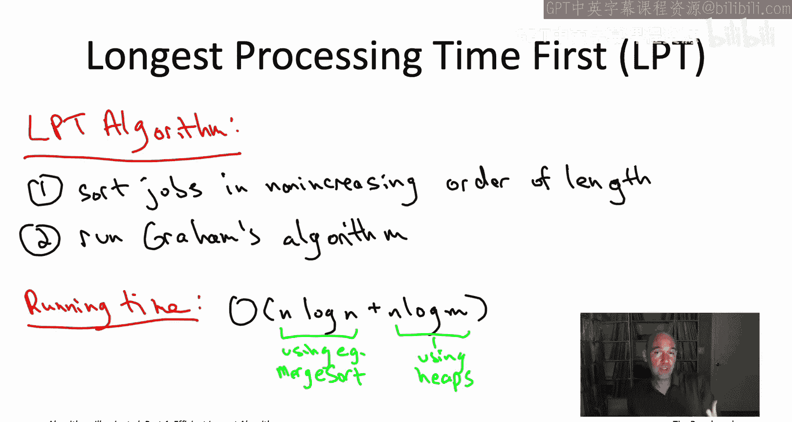

All right， so the correct answer is D and let's actually answer the questions in reverse order。

 let's start with the minimum possible schedule of these 11 jobs。

As you've seen the best case scenario is the perfectly balanced case So we can ask the question。

 does there exist a schedule that makes all of the machine loads exactly the same And if you stare at it you're like yeah there is we can get all five machines to have load exactly 15 we pair up the sixes with the nines the sevens with the eights and then the three length five machines all are have a dedicated machine Meanwhile。

 what's going to happen with the LPT algorithm remember the LPT algorithm processes jobs from biggest to smallest so it's going to process the two length  nine jobs then the two length eight jobs the two length 7 jobs and so on。

 So for the first four iterations， things look pretty good So the LPT algorithm schedules the two nine jobs on separate machines then uses a third and fourth machine to schedule the two length eight jobs exactly mimicking what's happening in the best possible schedule So the change difference happens in the fifth iteration where you in a perfect world。

 the LPT algorithm would put a job length of seven sort of on top of one of the job length jobs of length 8。

Thereforefo keeping the fifth machine in reserve for the length five jobs that are eventually going to come。

 that of course is not how the LPT algorithm works。

 it's going to schedule that first length 7 job on the most likely loaded machine that's currently a machine with load zero。

 so that's where it's going to put the job of the first job of length 7。Now。

 when it gets to the second job of length 7， Well， the lace loaded machine is still machine number 5。

 now with load 7， but still the best。 So that's where the second length 7 machine length 7 job will go as well。

 The two length 6 jobs come next and they'll be scheduled on the two machines that have current load 8。

 that'll bring their loads also up to 14。 And then， of course。

 the two length 5 jobs will be scheduled on the first two machines to join their length 9 counterparts。

 At this stage， everything looks rosy。 we've got perfect balance across all the machines。

 Every one of them has load exactly 14。 Unfortunately， you know， here's the cabo。

 one final third job of length 5， and now we're out of options of where to put it。

 Everything has load 14， we have to put it somewhere。 wherever we put it。

 it's going to boost the makepan up to 19。So what's the point of this quiz point of this quiz is that the LPT algorithm is not always optimal so it's a concrete instance where it makes span 19 is bigger than the minimum possible 15。

 And again， this isn't surprising we know it's an empty hard problem we know this algorithm runs in polynomial time unless we're trying to refute the penical NP conjecture orre fully prepared for there to be examples where the LPT LPT algorithm schedule is suboptimal。

 but again we're kind of worried about how bad could this get and in particular you might be wondering know why did we bother to sort the jobs for all we know LPT is just as bad as grams algorithm It's not any worse but is it really an improvement。

In fact， the answer is yes， as I will prove to you next。

 the LPT algorithm does indeed have a better insurance policy than Graham's algorithm it does guarantee a schedule that has make span strictly less than twice the minimum possible。

So in terms of the notation we were using before， remember capital M star denotes the minimum possible mix span。

 capital M before that was the make span achieved by Graham's algorithm。

 now it's going to be the make span achieved by the LPT algorithm。

 we're going to prove that it's no more than 1。5 times the minimum mix span。

 actually 3/2s minus1 over 2 m or little M is the number of machines。

So the e eye among you may have noticed that this doesn't actually quite answer the question of exactly how good is the LP algorithm。

 So we had this bad example in the quiz。 and we saw that the LP algorithm may blow up that may span by a factor of 19 over 15。

 that's roughly 1。267。 So that's the blow up we saw from this heuristic algorithm in that example。

 that example had five machines。 If you plug in M equals 5 into this bound。

 you'll see that this claim only promises a blow up of at most 1。4。

 leaving open the possibility that there are worse examples than the ones the one we saw in the quiz。

 Well， I'm happy to report that if you're willing to work a little bit harder and encourage you to do this in the privacy of your own home。

 if you're interested， if you're willing to work a little bit harder。 In fact。

 you can show that the bad example in the quiz is as bad as it gets。

 This factor of three/hals-1 over 2 m can actually be proved with a little bit more difficult argument to a factor of4ts-1 over 3 m。

 And if you plug in M equals 5 into that formula， you will get。

There's a guaranteed blowup of only 195s and more generally for any number of machines M。

 the natural generalization of the example in the quiz is as bad as it gets and it approaches a factor of four thirdds so worse by 33% as the number of machines grows large So just like with our approximate correctness guarantee for grams algorithm you should view this as a kind of insurance policy about the doomsday scenario of the most contrived inputs that could possibly exist and as with Graham's algorithm if you run this on realistic inputs empirically you will see that it usually over deliverlivers an output schedules that are much closer to the minimum possible Indeed if you find yourself needing to solve the minimum makes spend problem in one of your own applications the LP algorithm is probably the perfect place to start maybe add some bells and whistles if you want but LP already will do very well for the basic makes spend minimization problem So let's move on to the proof proof is basically a refinement of the same argument we used for Gham's algorithm you might recall the threestep into。

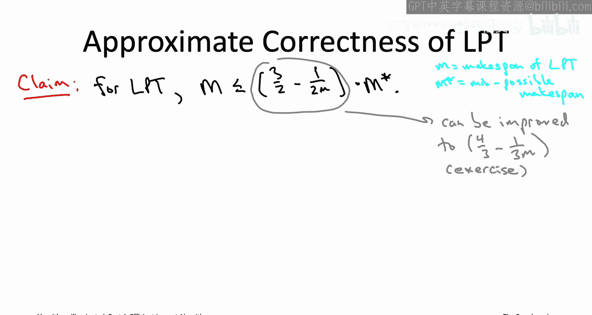

And we had for that analysis， we're basically going to have a better version of the second step of that analysis。

 so in Graham's algorithm we said oh， the damage that could be caused by a single job。

 sort of the difference between the maximum and the minimum loads。

 a single job could cause damage no worse than the minimum possible to expand。

Here because we've sorted the jobs from biggest to smallest and we're only going to be dealing with small jobs at the end of the algorithm。

 we can actually say that the damage is only going to be the minimum makes band divided by two M star over two and with a more refined argument which again I'll leave to you。

 you can actually even improve the worst case damage to M star over three。

 but let's just prove the M star over two band。So precisely we're going to use the following variant of the first lower bound that we used in the analysis of Graham's algorithm in Graham's algorithm we just said you know whatever the job J is。

 the minimum makes span has to be at least as big as the length of that job。

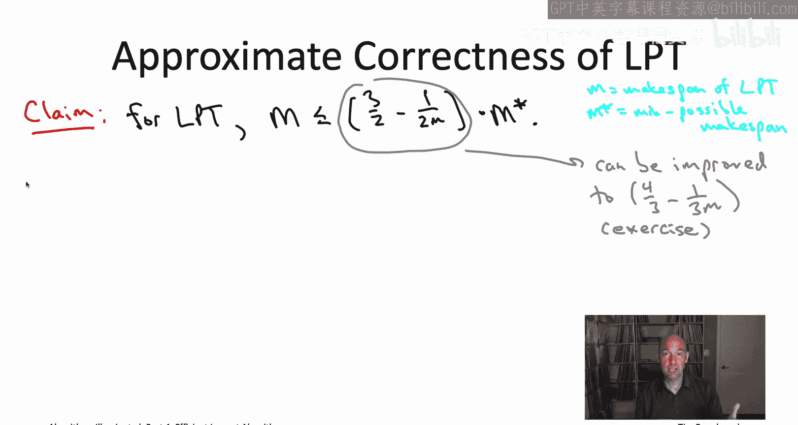

This version we're going to say now consider a job which is not one of the M longest jobs so it's one of the other jobs so forget about the M longest jobs and just think about the rest for one of those jobs J actually you can say that the minimum makes span has to be at least twice as long as that job。

 not one time as long as that job but twice as long as that job。

So the reason this inequality holds is basically due to the pigeonhole principle。

 which is the intuitively obvious statement that if you stuff n plus one pigeons into n holes。

 there's going to be a hole with at least two pigeons。

 So for us the machines are playing the role of the holes and we're looking at the longest M plus one jobs as playing the role of the pigeons So by the pigeonhole principle。

 no matter how smart your schedule is， you have to put two of the longest m plus one jobs on the same machine So that means that machine has length at least as long as sum of those two jobs。

 each of which is at least as long as the m plus1 longest overall So now that we have this refined version of the first lower bound。

 we can finish the proof of approximate correctness basically following the exact same argument we did in Ghams algorithm So like in our previous proof we're going to use I to denote the machine that winds up with the largest load in LP's schedule and we're going to denote by J the final。

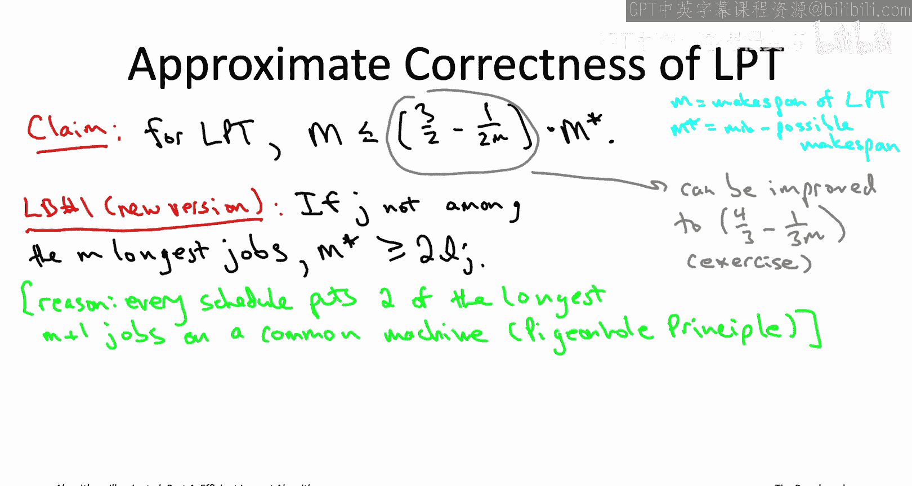

Job that LPT assigns to that most loaded machine I So one edge case。

 which is actually quite easy for us， is if actually LPT only assigns this one job J to this machine I it never assigns any other job to I Why is that easy Well you know maybe this is like a huge job know it has length 173 Well this is our most loaded machine right so this is going to be our make span 173 but again。

 any other schedule also has to have to make span at least 173 because it has to put this job J somewhere So we're actually optimal if it turns out that no other job is ever assigned to machine I。

So suppose that the LPT algorithm does assign at least two jobs to machine I。

 the last job J plus some previous job Now if you think about it。

 this means the Js last job assign the machine I it actually cannot be one of the longest M jobs and this is where we're using the fact that it's the LPT algorithm what does LPT do it sorts the jobs right up front from the biggest jobs to the smallest jobs Now the first M iterations of LPT are like super uninteresting there's always some machine that's empty that has load zero。

 So it's just going to take the current job and assign it to some empty machine It's only after the first M iterations of LPT that anything interesting happens。

So by virtue of this job J not being the first one assigned to this machine I。

 some other job was assigned to it beforehand that that means that J cannot be one of the first M jobs。

 it has to be outside of the first M jobs and because LPT sorts the jobs that means it's not one of the longest M jobs and that means our variant of lower bound number one applies to this job J and in fact the minimum mixpan has to be at least double the length of this job J。

So that means that we just sort of reboot or restart our proof of the analysis of Gham's algorithm with that second to last inequality。

 So if you go back and check， you'll see that that inequality said that the makes span capital M of our algorithm schedule。

 it's bounded above by two terms first the length of this last job on machine I times quantity 1 minus1 of a little M plus the sort of what would be the case if the schedule was perfectly balanced。

 So one over M times the sum of all the jobs。 Now before in the analysis of Ghamms algorithm。

 we bounded each of these two terms above by M star。 And here。

 though because J is not one of the M longest jobs。

 we can use the stronger version of lower bound number1。

 And therefore this LJ length of j is actually going to be a most m star over 2。

 The second term we're going to bound just like before using our second lower bound。

 So that's going to be a most M star。So if you add these two things together and let let the dust settle。

 you see you get this three/ halfs minus1 over a2 m insurance policy approximate correctness guarantee So that wraps up our first case study of using the greedy algorithm design paradigm to design fastturistic algorithms for an application to a scheduling problem let's move on to another application of greedy algorithms to another NP hard problem concerning assembling a team in the best possible way。

 something known as the maximum coverage problem I'll see you then。

