# 斯坦福大学《算法启蒙（第4册）：NP难｜Part 4 Algorithms for NP-Hard Problems》中英字幕（deepseek-R1） p10 -10-20.2_ A Greedy Heuristic for Maximum Coverage) -Part 1_2-.zh_en -BV1FAVUzXEum_p10-

Hi everyone and welcome to this video that accompanies Section 20。

2 of the book algorithmriths illuminated Part 4， This is a section about greedy heuristic algorithms for the maximum coverage problem。

So imagine you've been put in charge of assembling a team。

 maybe it's a team to complete a project at work， maybe you just want to assemble a good team for your upcoming fantasy Sports League for this next season。

In any case， you have a budget and can only hire a limited number of people。 Meanwhile。

 the people you could hire have various skills， either they correspond to programming languages and the work example or what positions they can play on the field in the fantasy sports example。

 You'd like to hire a diverse team with as many different skills as possible。 Whom should you pick。

Well this is exactly an example of the maximum coverage problem， let's now define it formally。

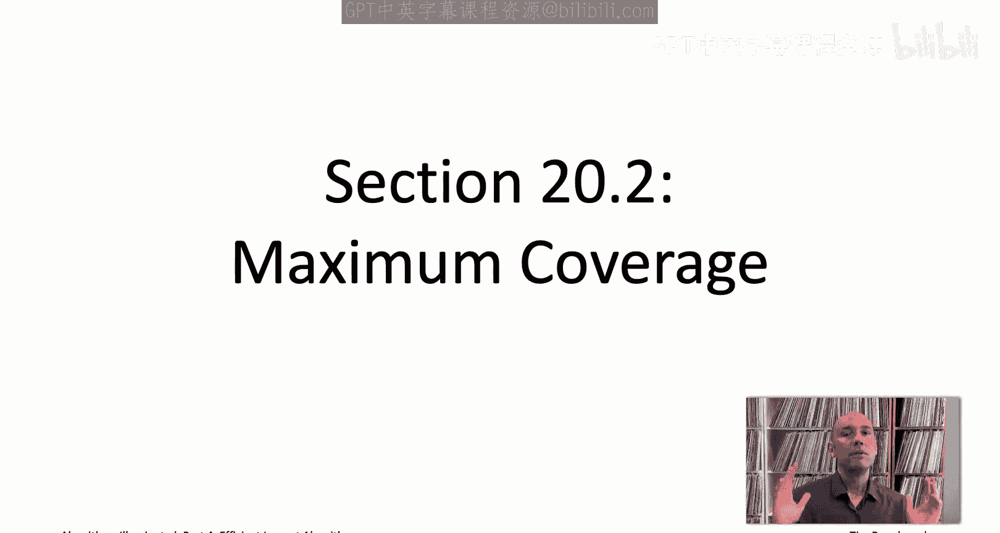

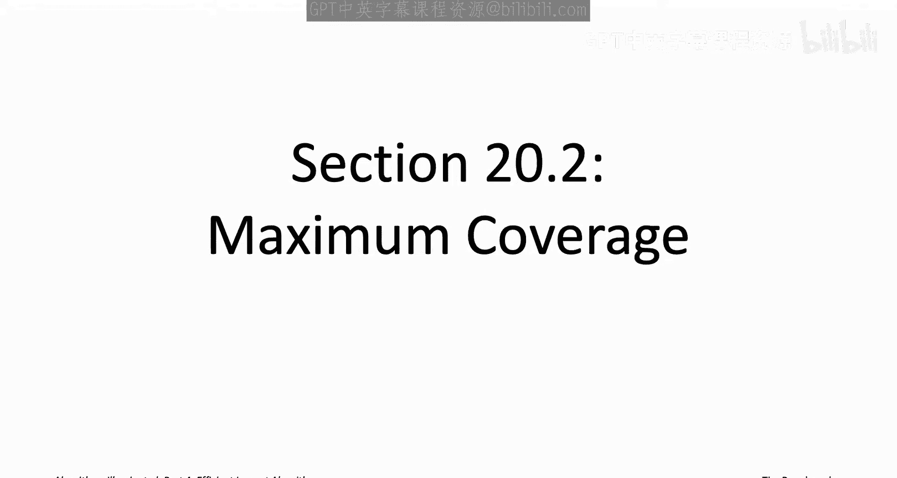

So in the maximum coverage problem， the input comprises M subsets。

 we're going to note them by t1 up to TM of some ground set U as well as a budget。

 which is a positive integer K For example， in our team hiring example you could imagine capital U is being all the sets of skills that someone could have for all the possible positions on the field Meanwhile you're going to have one subset for each person you could hire where that person is represented by the subset of the skills that they possess K meanwhile is your budget that's how many people you're allowed to hire Now what's the objective。

 the objective is to hire k people so that you have as much different skills represented as possible or in set thetic terminology you want a collection of k of these subsets so that the union of those subsets covers as many elements of capital U as possible that's something known as the coverage of a collection of subsets So for example。

 for concreteness you can imagine you're given an array of corresponding to the subsets and another array corresponding to the elements of capital U。

And then you can have pointers going back and forth accordingly。

 so pointers from each subset to the elements it contains and then back pointers from each element to the subsets that contain it so just to make sure that the problem is crystal clear。

 let's move on to a quick quiz。

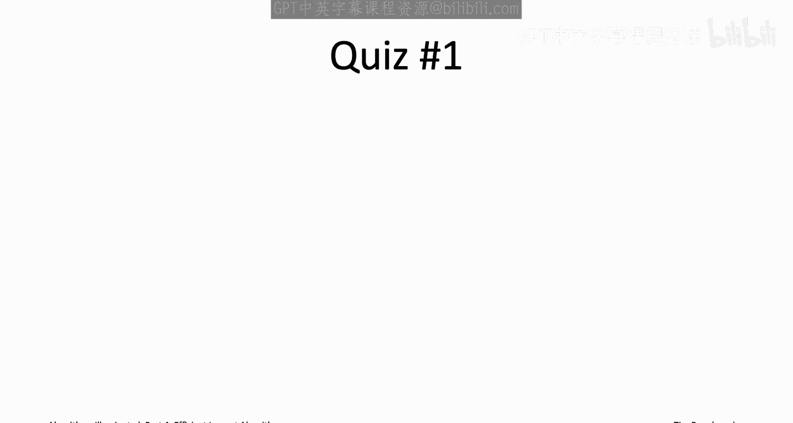

All right， so on the right part of this slide I've shown you a possible input of the maximum coverage problem。

 so there was 16 elements， so all the little black circles those are the elements and you see there's a  four by four grid of them so 16 in total。

 and then the six different subsets which with a different color Now the final part of the input is a budget。

 the value of k so let's say I'm going to let you pick four out of the six subsets。

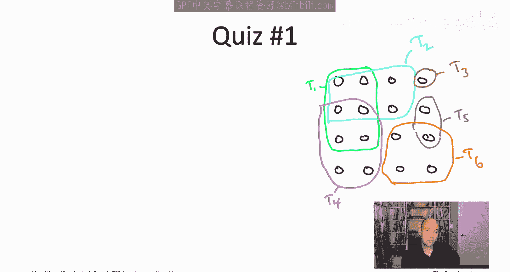

So the question then is of all ways of picking choosing four out of those six subsets。

 what's the maximum possible coverage you can attain？

So the correct answer is the third one there's no way to cover all 16 elements using four subsets but you can cover 15 of them actually in a couple different ways so you have to want to pick know the sets t4 and t6 they don't overlap at all and together they already cover 10 elements then you want to pick T2 for sure is's a couple redundant elements but it does cover four new ones so that gives you 14 total and now it doesn't matter you can either pick t3 or you can pick t5 either one is going to get you one additional element for a total of 15 One thing to notice is that you never want to bother picking the subset T1 it's a big set it has six elements in it but those elements are kind of already basically going to be covered by other subsets so T1 while large is somewhat redundant so that's why it doesn't show up in any of the optimal solutions。

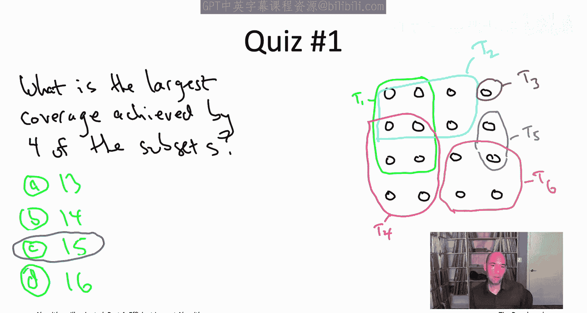

In general， the reason maximum coverage problems are tricky is because of the overlaps between subsets。

 for example， some skills may be common， meaning that they're covered by many subsets。

 others may be rare， covered only by a few， so an ideal subset is large with few redundant elements。

 basically a team member blessed with many unique skills。

Some maximum coverage problems show up all the time。

 and not only in these team hiring applications we've been mentioning thus far。 So， for example。

 imagine you wanted to choose locations for K new firehouses in a city in order to maximize the number of residents that live within one mi of some firehouse。

 This is exactly a maximum coverage problem。 The ground set elements correspond to the residence and each subset corresponds to a possible firehouse location with the elements of that subset the residents who live within one mile of that location。

 for a more complex example， imagine you want to get a bunch of people to show up at an event。

 know something like a concert。 you need to start setting up for the event and only have time to convince K of your friends to come。

 However， whichever friends you successfully recruit。

 They can then bring along their friends and their friends will bring along friends of friends and so on。

So we can visualize this problem using a directed graph。

 The vertices of this graph are going to correspond to people and we'll have an edge directed from one person V to another person W if W would automatically follow V to the event if V1s that is W is some friend of V that will come along with V if V decides to come。

 So for example， consider this directed graph in blue with8 vertices。 So for example。

 suppose you recruited vertex1。 Well then2 would follow one to the events and then once2 comes。

3 and5 would follow as well。So if you recruit one， you're going to get this whole subset of four different vertices showing up at the event。

Now another interesting case is vertex 6 you'll see that6 has no incoming arcs That means there is no one else capable of convincing six to come。

 However， if six decides to come， then many will follow in particular8 will follow followed by five and7 followed by three So if you decide to recruit both one and six。

 you actually wind up getting seven of these eight people to show up at the events and maximizing of an attendance like this is exactly a maximum coverage problem The grounds that elements correspond to people or equivalently to vertices of this graph there is one subset per person indicating who ultimately would follow that person to the event graph theoretically the subset corresponds to the vertices reachable by a directed path from that vertex So for example。

 from this vertex 1， you see that its blob contains all of the vertices that are reachable from one。

By directed paths， similarly the light blue blob that has all the vertices reachable from six via a directed graph。

The overall attendance due to the recruitment of a set of K people is then exactly the coverage achieved by the corresponding case subsets。

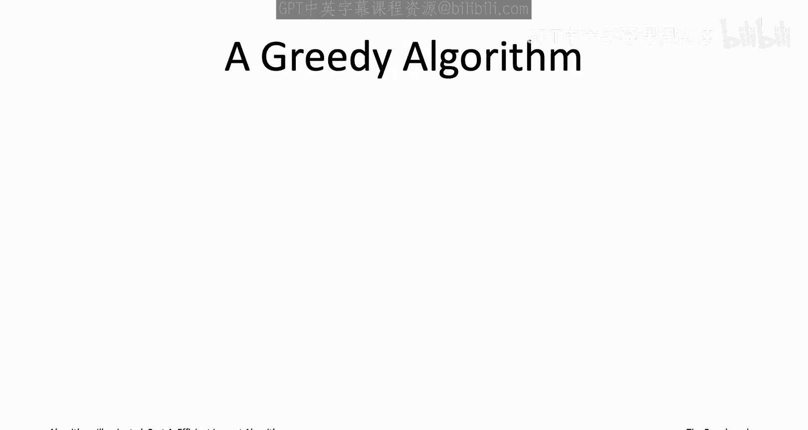

All right so I hope this convinces you that the maximum coverage problem is a basic problem It would be actually really nice to have an off the shelflf subroutine that could just solve this problem for you really quickly Unfortunately and we'll see this in the fourth part of the video playlist the maximum coverage problem is an NP hard problem so we're gonna to have to compromise on something and again this is the part of the playlist where we're compromising on correctness so we're going to have a general purpose and fast algorithm but it won't be always optimal we'd love it if it was close to optimal the same way our to scheduling greedy algorithms were in the previous section that would be sort of the bestcase scenario given that the problem is NP hard。

Now， once again， just like with so many problems， greedy is a very natural place to start with the maximum coverage problem。

 ultimately responsible for outputting k of the subsets。

 so why not just build up our solution iteratively one set at a time。

 making a myopic decision with each of those K steps。Now if k equals one。

 if you're only allowed to pick one subset， this is not a hard problem right if you can only pick one subset。

 the one you want to pick is the biggest one because the coverage is just going to be the size of whatever set you happen to pick。

Already when k equals two， things get a little interesting but so suppose you're allowed to pick two subsets and you've already committed to picking the biggest one。

Which one do you want to pick next， You could pick the second biggest one。

 But as we saw in the example， overlaps really matter。

 So what really matters is how many new elements does this next subset cover by how much does it increase the coverage。

 So the most sensible greedy criterion would be to always choose the subset。

 which covers the maximum number of new elements that were not covered by previous subsets。

So that's a famous greedy algorithm for the maximum coverage problem。

 we're just going to call it greedy coverage for short。

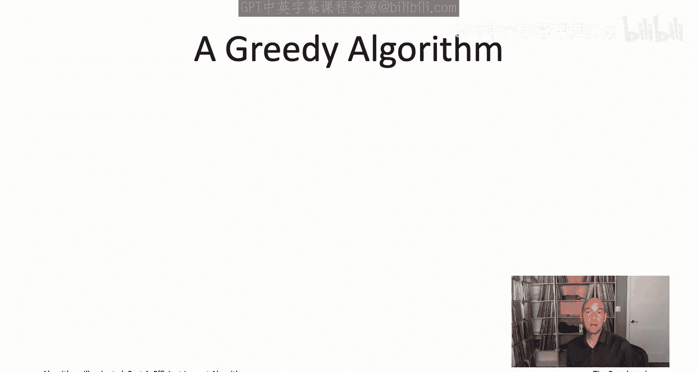

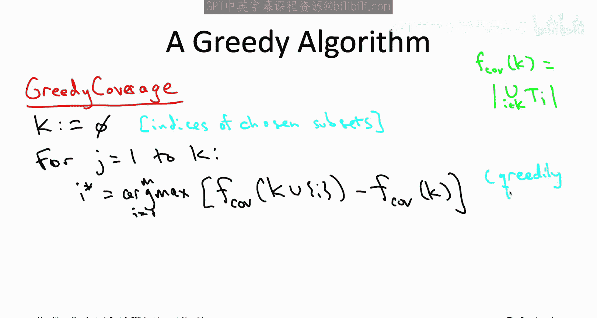

So the pseudocode of the algorithm is quite simple。

 there's just going to be a simple for loop with k iterations。

 one for each of the subsets we need to pick， we initialize a set capital K。

 these are the indices of our chosen sets， initially it's empty in each of the K iterations we pick one subset which subset do we choose we just greedily increase coverage so in the J iteration we pick the subsets that maximizes the number of newly covered elements。

 meaning elements not already covered by the first J minus1 subsets that we've chosen。

I'm using the notation F subc here， which we introduced a couple slides ago and again that's just the size of the union of all of the subsets within indices and capital K Also notice that in this argm。

 this is the step which is sort of searching over all the subsets for the one that increases the coverage the most you' this aG max is never going to be attained by a subset that's already in capital K because that would increase the coverage by zero so if it's clearer to you think of this aG max as only being over the subsets we haven't already chosen。

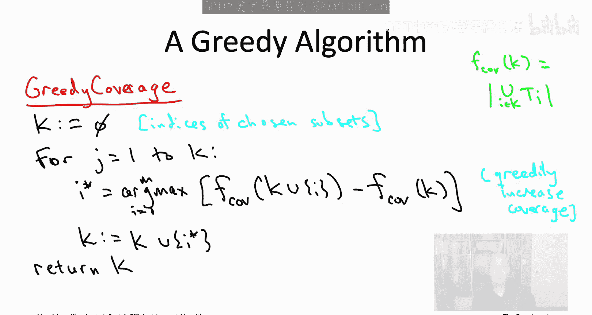

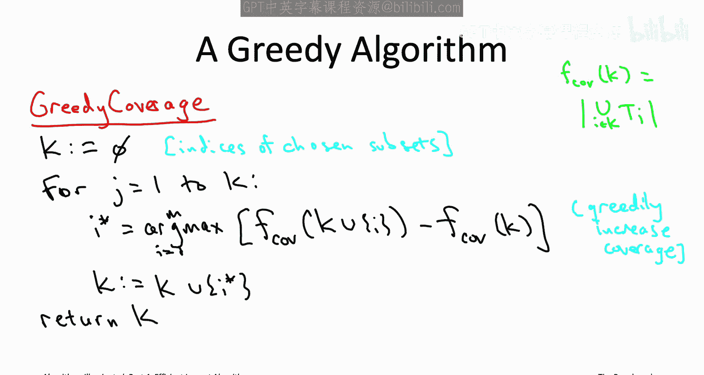

So as usual with greedy algorithms the running time analysis is not so interesting。

 at least not for a straightforward implementation of the algorithm so what would that look like well you know you have each of these k iterations over the main loop。

 how are you going to implement one of the loop iterations well you have to evaluate this am so you have to take the best over the M subsets so you could just do exhaustive search over the M possibilities for the subset for each of those subsets you have to compute the increase in coverage that selecting that subset would give you and you can do that just by visiting the elements in that subset one by one and checking which ones have already been covered and which ones have not already been covered so that straightforward implementation you sort of have a factor of K from the number of loop iterations a factor of M from doing the exhaustive search over the M choices of the subset and then also evaluating the coverage increase would take time proportional to the size of that subset。

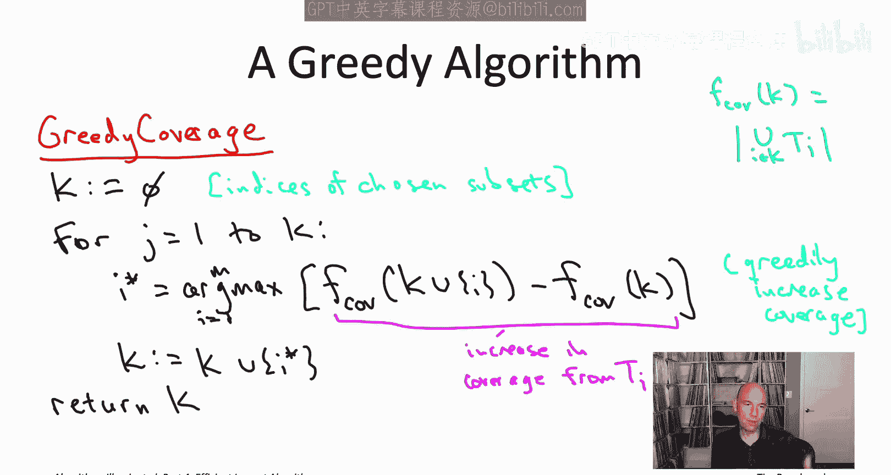

So the greedy algorithm may not be as blazingly fast as the ones we saw for our scheduling application。

 but still it's certainly a polynomial time algorithm so the real question then is。

 as usual with heuristic algorithms， how good is it。

 how good is the solution output by the greedy coverage algorithm compared to what you could achieve in a perfect world using。

 for example， exhaustive search。

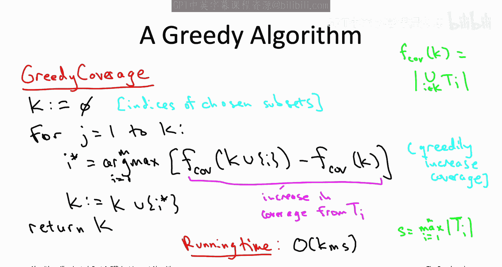

Well it's very easy to come up with a simple example where the greedy coverage algorithm doesn't do the right thing where it potentially outputs a suboptimal solution。

 So for example on the upper right of this slide there's an example with just four elements and three subsets think of the parameter K as being equal to 2 so if I let you choose two of the subsets it's clear you can cover all four elements if you make the right choice if you choose t1 and T2。

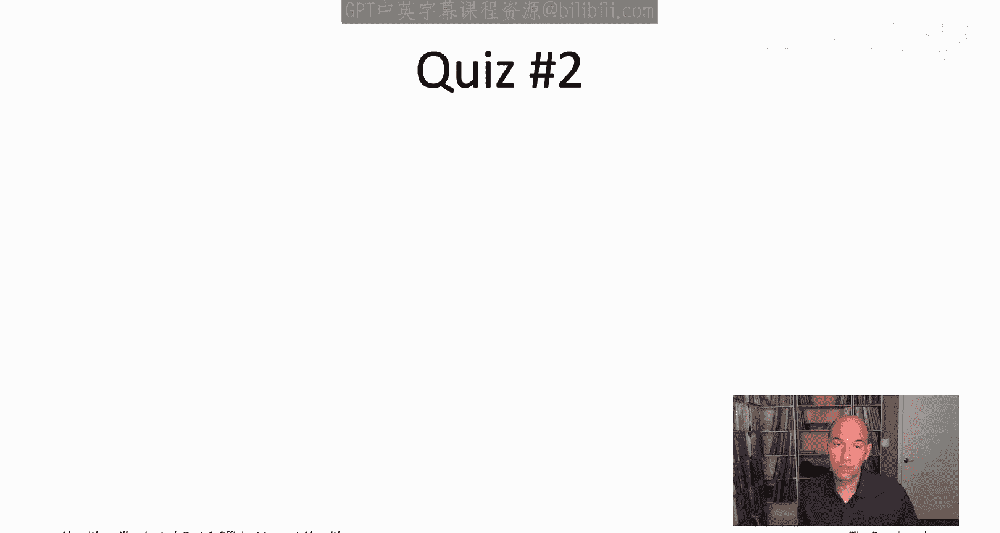

But our greedy algorithm right we don't know what it's going to do in the first iteration。

 at least assuming it break ties arbitrarily So in the first iteration it might well choose these sets T3 and at that point there's nothing it can do once it's chosen t3 doesn't matter if it chooses t1 or t2 in the second iteration is's going to wind up covering only three out of the four elements And if it bothers you that we're sort of assuming worst-case tiebreak by the greedy algorithm rest assured that a more complicated version of this example shows the exact same thing even even with bestcase tie breaking by the greedy algorithm So once again this is not a surprise。

 we are fully prepared for there to be examples where the greedy coverage algorithm does not cover as many elements as you could in a perfect world。

 remember I told you this was an NP hard problem we've seen that the greedy coverage algorithm runs in polynomial time so unless we plan on refuting the p equal to NP conjecture there must be examples where it does not output an optimal solution and this is one of them。

But as usual， you know the concern once you see a simple example like this is you're like， well。

 what's up in more complicated examples， maybe things can get a lot worse and at least if the parameter K is a little bit bigger than two。

 they can get somewhat worse， so let's see that in this quiz。

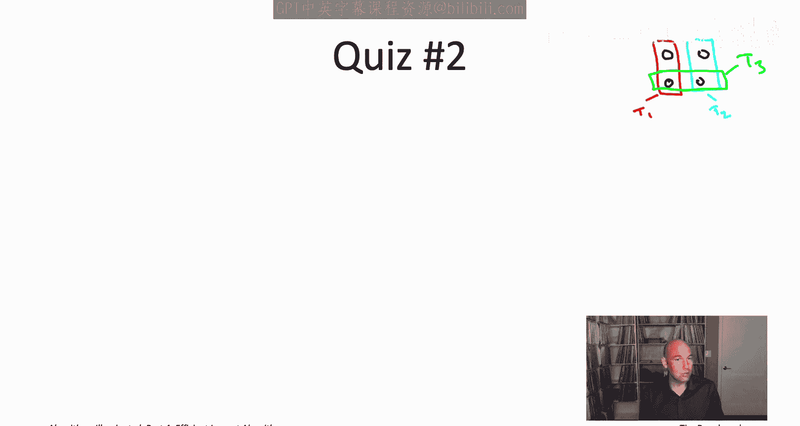

So let's look at a more complicated example that has 81 elements they were arranged into a 9 by9 grid and then there are also five subsets the budget here is going to be three so you're allowed to choose three of the five subsets and the questions are the usual ones so first of all in the best case scenario what's the maximum coverage that can be achieved by any three of the five subsets secondly。

 what is the coverage that will be achieved by the greedy coverage algorithm and I'm looking for an answer under arbitrary tiebreak。

All right so the correct answer is the second one answer B。

 it's pretty easy to see that there is a way to choose three subsets to cover all 81 elements。

 just cover T1， T2 and T3， the red light blue and magenta subsets and that's one thing the greedy algorithm might wind up doing but in their hand with arbitrary tiebreak for all we know in the first iteration of the greedy algorithm it's going to pick the set T4 that covers 27 new elements just like T1 T2 and T3 do so T4 is fair game and the greedy algorithm might pick it。

And then if it does pick the set T4 now it has to decide what to do next so T5。

 the brown set that would cover 18 elements， none of which were covered by T4 so that would be 18 new elements covered by T5 on the other hand。

 if you look at t1 T2 and T3 nine of their 27 elements are already covered by T4 so picking any of them would only cover 18 new elements so again it's a four way tie all of them were fair game for all we know greedy algorithm the greedy algorithm will pick T5 and if it does that now with its last set it can pick either T1 T2 or T3 it doesn't matter which one it picks and the overall coverage is 27 from T4 plus 18 from T5 bringing the total to 45 plus another 12 from whichever of T1 T2 or T3 it picks for a total of 57。

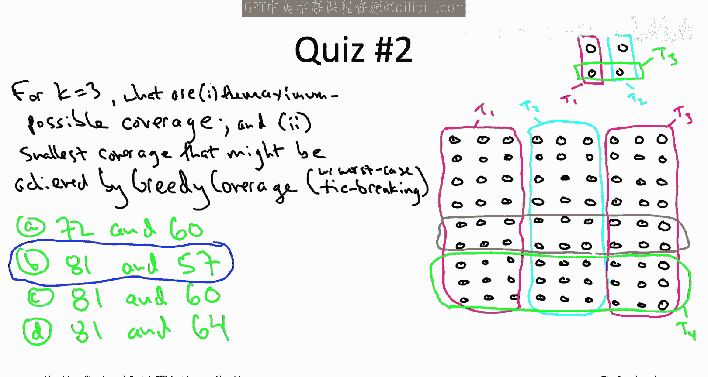

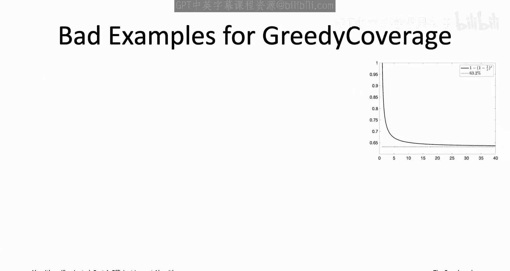

So we've now seen two different examples， one where two subsets could be chosen and the greedy algorithm might achieve only a coverage of three when four would be possible。

 so in other words it might obtain only 75% of the maximum possible coverage。

 and then with K equal 3 in that last quiz we saw an example where it only gets a 57 over 81 fraction of the maximum possible coverage。

 which is roughly 70。4%。

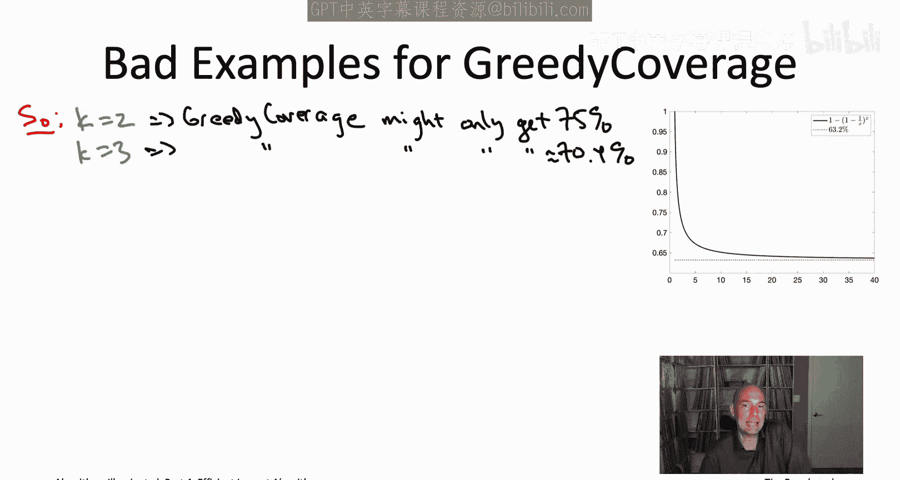

So hopefully the two examples we've seen so far， the one with four elements and the one with 81 elements。

 hopefully they kind of have a similar flavor like you see there might be some sort of pattern emerging and you can imagine trying to extend those two examples for all values。

 all positive integers K and in fact you can do that I encourage you to work it out as an exercise for example you can arrange a bunch of elements in a grid where the side length is k raised to the k minus1 power so that generalizes our 2 by2 and9 by9 grid so far so k to the minus1 power on either side and you're going to wind up with 2 k minus1 subsets so we had three when k equals 2 we had5 when k equals 3 and in general you're gonna have 2k minus1 subsets and so if you generalize that example for all positive integers K here is what you learn about the greedy coverage algorithm and the quality of its solution So that's right in general。

 for every positive integer K the generalization of the two examples we've seen so far shows that the greedy coverage algorithm might。

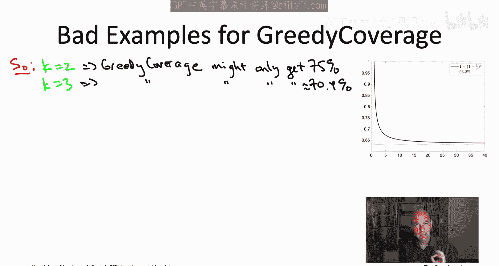

Output a solution whose coverage is only a， wait for it， one minus quantity。

 1 minus1 over k raised to the K power times the maximum possible。

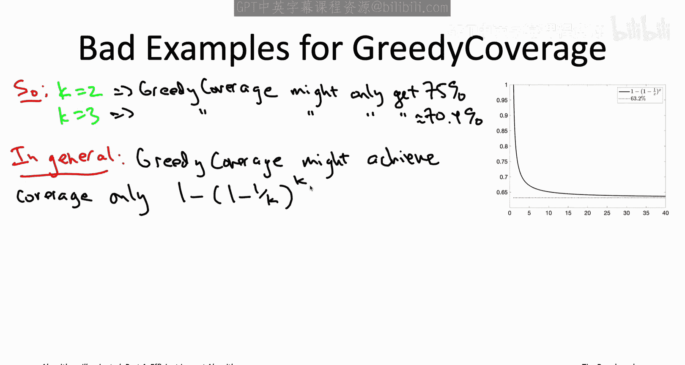

That's a little bit of a mouthful， but let's just sanity check this formula for a second。

 Let's plug in k equal 2。 What do we get Well then one minus1 over k would be equal to half that's being squared so that's three quarters that's getting subtracted from1 so that's that's three quarters So that verifies that this does generalize what we saw in the k equals 2 case if you plug in k equals 31 minus1 over k is twots now we're cubing that that gives us an8 over 27 and then we subtract that from one giving us 19 over 27 which is exactly the same ratio as the 57 over 81 that we saw in the quiz So this formula does indeed extrapolate the k equal2 and k equal three cases that we've already seen and if you work out the generalization of those two examples this is what you will find is true So okay but how should you interpret this we know this is 75% when k equals 2 roughly 70。

4% when ks 3 but like what is this doing for other K So whenever you have a crazy univariate expression like this one and you want to understand what's going on。

With it you should just immediately plot it。 So I've taken the liberty of doing that for you。

 That's the graph you see here on the right。 So the solid line。

 that's just the interpolation of this expression 1 minus quantity 1 minus1 over k to the K extended to all of the positive reels。

 And you look at that curve and you sort of immediately see what's going on're like okay it's decreasing we sort of expected that。

 the bigger k is the smaller sort of the fraction you're getting from the greedy coverage algorithm on the other hand。

 what's sort of nice is it's not going all the way down to0。 there's an asymptote。

 And if you sort of zoom in， you see that the asymptotes at roughly 63。

2% So no matter how big we make this particular family of examples。

 we never are able to show that the greedy coverage algorithm gets less than 63。

2% of the maximum possible coverage So some of you may be wondering like what is up with this。

 Why is this thing asympting in 63。2% and what's going on is that as k grows large one over k is growing small。

 And in general for small X。

The two quantities 1 minus x and e to the minus x are very similar and I encourage you to just plot that and see it yourself。

1 minus x is going to be the straight line and then e to the minus x is going be this curve。

 which kisses that straight line exactly at0 So if you're close to 0 they're very close to each other So that means1 minus1 over k is behaving like e to the minus1 over k where here E is 2。

71 do do do So Euler's number So11 over k is behaving like e to the minus1 over k。

 so we're taking that to the k power so we get a1 over e and then1 minus1 over e is well approximated by 0。

632 So that would be formally how you'd prove that this expression。

 no matter how big you take k it's never going to get less than 63。

2% Now the greedy coverage algorithm， it's so simple it's so natural it's maybe like the first algorithm you'd write down as a heuristic for the maximum coverage problem And so given it simplicity you're probably wondering like what is this weird irration number11 over E doing in pro。

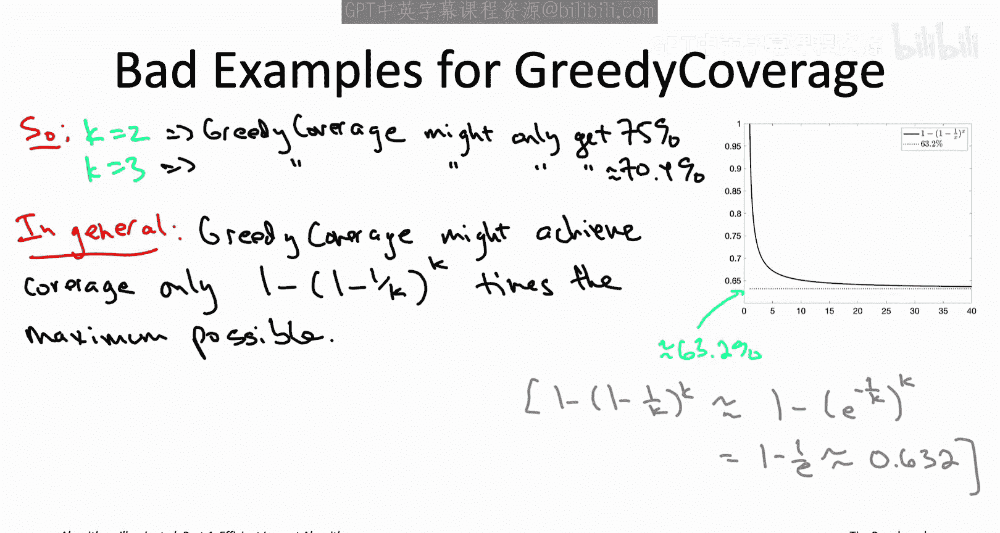

To the supernatural algorithm and you might be wondering wow。

 you know maybe it's an artifact of this kind of family of examples that we've cooked up that we're discussing on this slide we're going to see next is that actually the total opposite is true we're going to prove an approximate correctness guarantee max for the greedy coverage algorithm which shows that this is the worst family of examples you could possibly have for every possible value of k In other words the 1 minus1 over e is not at all an artifact of our particular examples it's fundamental to the approximate correctness of this supernatural greedy algorithm。

