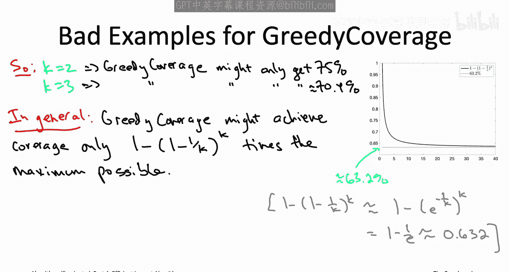
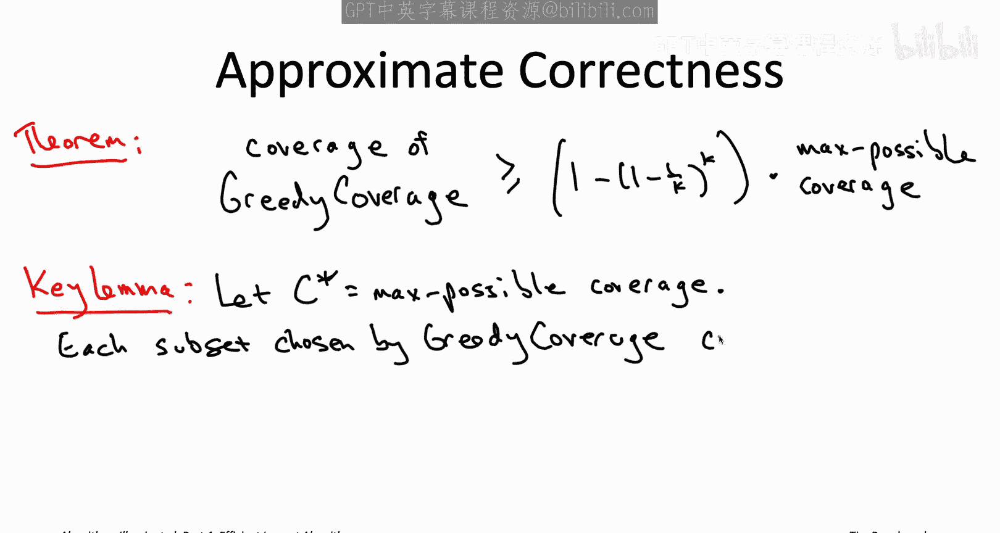
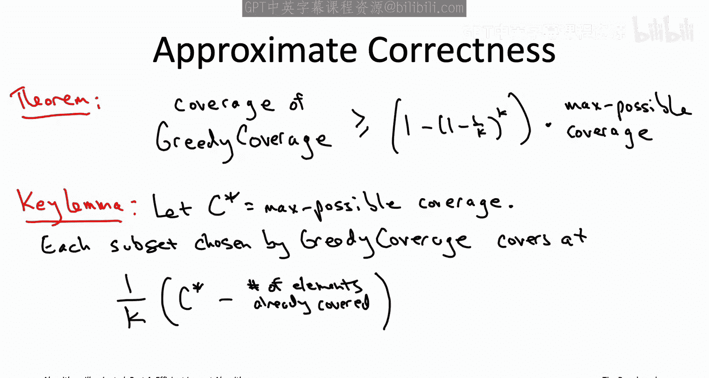
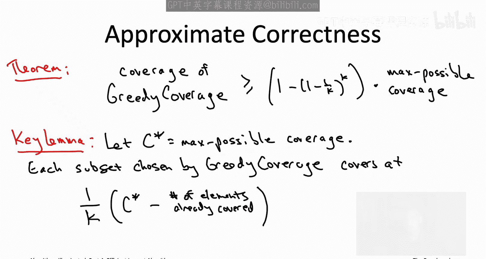
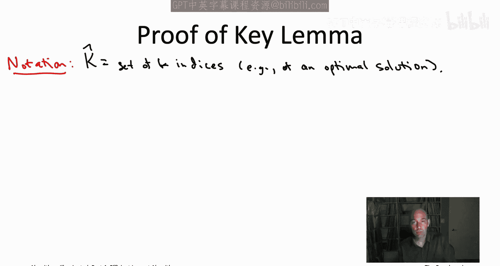
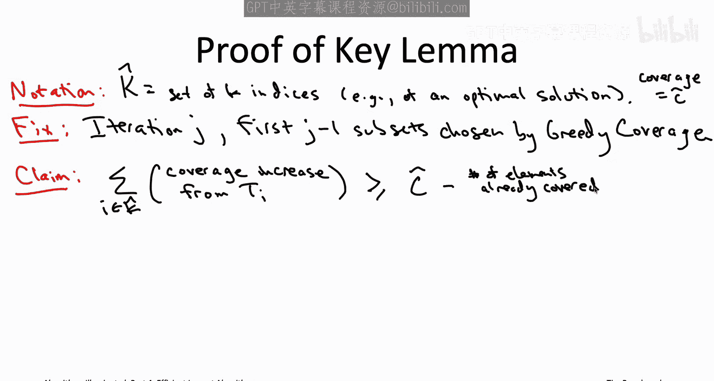
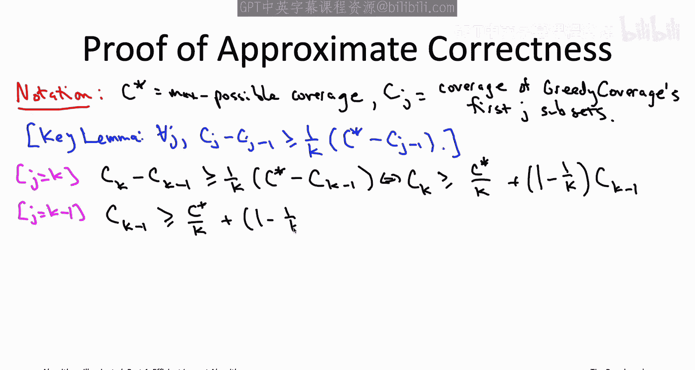
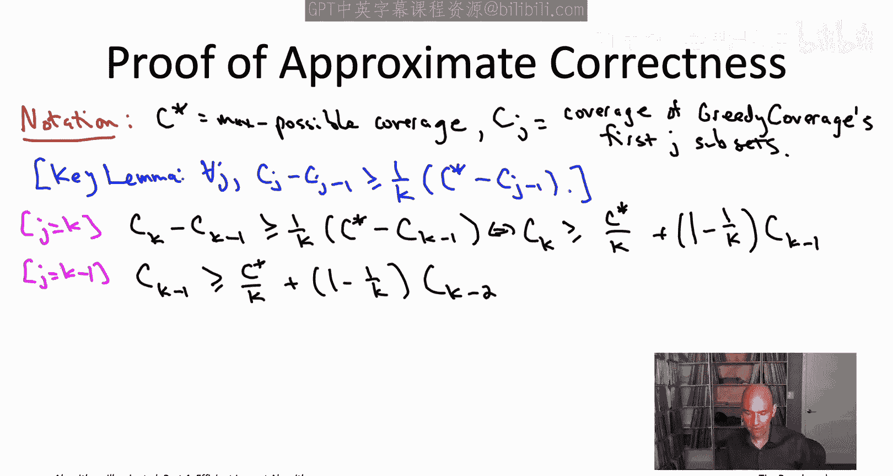
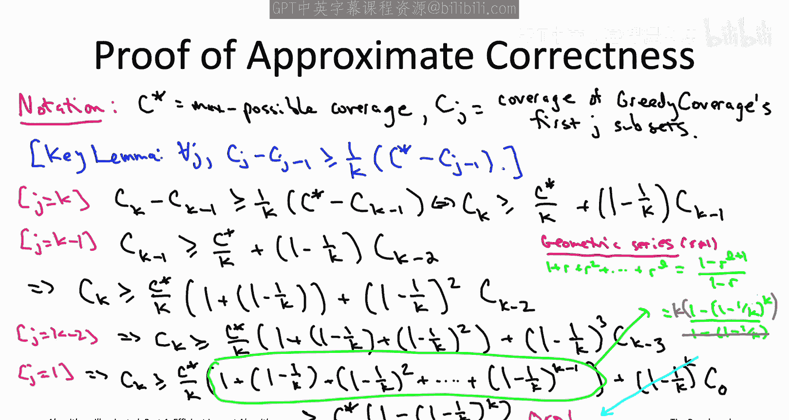

# 斯坦福大学《算法启蒙（第4册）：NP难｜Part 4 Algorithms for NP-Hard Problems》中英字幕（deepseek-R1） p11 -11-20.2_ A Greedy Heuristic for Maximum Coverage) -Part 2_2-.zh_en -BV1FAVUzXEum_p11-

So in other words， for every possible input of the maximum coverage problem doesn't matter how big the universe is。

 doesn't matter how many subsets you have， if you have a budget of k。

 then the greedy coverage algorithm will guaranteed output'll a solution might not be optimal。

 but its coverage at least will be a1 minus quantity 1 minus1 over k to the K fraction of the best case scenario of the maximum coverage possible using K subsets。

For example， if k equals2， this says the greedy algorithm is guaranteed to get to at least 75% of the maximum possible coverage if k equals 3。

 at least 70。4% of the maximum coverage and no matter how big K is at least 63。

2% of the maximum coverage and as usual this is just an insurance policy this is just you know what you're guaranteed even in the most contrived doomsday scenario on realistic inputs this greedy algorithm will generally get quite a bit closer to 100% All right so we will actually prove this theorem in full But first let's spend a little time developing your intuition for it and let's revisit the 81 element example that we had in that last quiz so why doesn't the greedy algorithm just produce the optimal solution in this example Well in the first iteration it had the option of picking any of the three sets in the optimal solution So T1 T2 or T3。

Unfortunately， the algorithm was tricked by a fourth set， T4， the green set that was equally large。

 it had 27 elements in it just like T1， T2 and T3。In the second iteration。

 the algorithm was tricked once again， it had the option of picking any of T1 T2 or T3。

 but it was tricked by T5， which covered just as many new elements， namely 18 new elements。

But so in general， this kind of suggests that every miscu by the greedy algorithm can be attributed to a subset the one it chose that covers at least as many new elements as each of its K options from the optimal solution。

But you know if greedy had the K options of the sets and the optimal solution then it chose something even better than any of those。

 doesn't that mean it should be making a lot of progress in each iteration and the answer to that question is yes and that's going to be formalized in the following key lemma。

So what is this key lemma saying basically it's saying that the greedy algorithm keeps successfully nibbling off pieces of the optimal solution each iteration just like we saw in the examples。

 so it's going to be a guarantee that's going to hold for each of the K iterations so you know maybe k equals 10 maybe you know we want to focus on iteration number7 right now but it doesn't matter so the progress in iteration7 is going to be measured according to the deficiency of the current solution that is the coverage of the six subsets chosen by greedy thus far so imagine for example imagine that the optimal coverage。

 the maximum coverage you could ever achieve by choosing 10 subsets imagine that was 173 and imagine the greedy algorithm over the course of its first six iterations has managed to cover 133 elements so that's a deficiency of 40 relative to the maximum possible。

So what this lemma says that in every iteration the greedy algorithm captures at least a one over k fraction of its current deficiency。

 so in our example where the optimal solution covers 173 we're currently covering 133 so we have a deficiency of 40 if k equals 10 then this lemma is guaranteeing that in the next iteration you will be covering at least four new elements if not more so that's the key lemma and there are now two remaining orders of business so first of all we need to prove this key lemma we need to see why this is true。

 the greedy algorithm does indeed make healthy progress in every iteration。

Then we have to show that this lemma that this healthy progress actually does result in a good approximate correctness guarantee So we'll do each of those in turn。

 The proof of the keylemma this is kind of the conceptually most interesting part once we know the greedy algorithms always making progress intuitively there has to be some kind of approximate correctness guarantee and the question is just what is it exactly So that's more or less going to be algebra So let's dive in now to the proof of the key lemma。

 then we'll see why it implies this one minus1 over E type guarantee So first a little bit of notation by capital K with a hat on top that's just going to denote some subset of k ind C。

 So k of the subset So maybe it's subset 3712 and 19 So k hats going to be our competition We're aspiring to do almost as well as k hat so you can think about k hat is being an optimal solution when that maximizes the coverage although that is actually not important for the proof hat can be whatever you want Now let's zoom in on any iteration of the outer for loop of greedy coverage that you want So again。

 for example。

Number7 out of 10F also whatever subsets the greedy algorithm may have chosen in the previous iteration。

 so in our example， the first six subsets that it's chosen。

So that brings us to the most important inequality in the proof and I want to explain this inequality using this cartoon on the right so in this cartoon I have a blue circle that's meant to represent all of the elements covered by some by our reference solution is we have these indices and K hat that corresponds to little K subsets they have some coverage called their coverage C hat and this blue circle then contains the C hat elements covered by this reference solution like the 173 elements covered by all 10 subsets chosen in K hat。

Meanwhile， we have the magenta circle and that's meant to indicate the elements that have been covered so far by the greedy algorithm。

 So for example， the 133 elements that might have been covered by the first six subsets chosen by the greedy algorithm Now I want to pay particular attention to the green region the green region。

 what is that， that's all of the elements that are covered by this reference solution covered by the subsets in K hat。

 but are not at least not yet covered by the greedy solution。

 what we're going to do is relate the area of this green region。

 the number of elements in it will relate that to the left and right hand sides of this inequality that I've written on the slot we will show that the green region on the one hand its area is at least as big as the right hand side and on the other hand it's at most as big as the left hand side and that'll prove that the left hand side is indeed at least as large as the right- hand side because you've got the area of the green region wedged right in between。

So let's start with the right hand side， which I'm claiming is no bigger than the area of the green region the green region should be at least as big as this right hand side So what's the right hand side。

 this is exactly the deficiency of the greedy solution so far that we've been talking about right so C hat that would be like the 173 elements covered by a reference solution the number of elements already covered that would be like the 133 elements covered by the first six subsets So that would be a difference of 40 So the claim is this green region has to have at least 40 elements in it So in fact。

 if the 133 elements covered by the greedy algorithm were also covered by a reference solution K hat that is if the magenta circle lay entirely inside the light blue circle then actually the green region would have exactly 40 elements。

More generally， if， for example， the greedy solution so far maybe it covered 123 of the elements in the optimal solution in the blue circle。

 then it sticks out a little bit。 and there's 10 elements that have been covered by the greedy solution that actually are never covered by the reference solution K hat。

 Well in that case， the green region is going to have an even bigger area。

 right If 123 are inside the blue circle and 10 or outside。

 That means the other 50 elements in the blue circle are going to belong to the green region。

 So that's why the green regions' area is at least as big as the right hand side of this inequality of the current deficiency of the greedy solution。

 So now let's move on to the lefthand side， which I want to argue has value at least as big as the green region。

So now we're going to want to think about the K subsets that belong to the reference solution to the subsets corresponding the capital K hat So in the cartoon and I've drawn two of them I've drawn a T1。

 I've drawn a T2 both of those are part of the 10 subsets say of the reference solution K hat you'll notice that they overlap a little bit so that's the dark shaded region in brown is where those two subsets overlap So the quantity on the lefthand side is basically the sum of K different thought experiments so we say hey know the greedy algorithm。

 it had the option of including the first subset from the reference solution K hat it could have done that if it wanted to what would have been the coverage increase had the greedy algorithm done that。

Then we asked the exact same question about the second subset in the reference solution capital K hat what if the greedy algorithm added that second subset right now。

 what would the increase in coverage be So we asked that question K times one for each subset in the reference set and then we add up the results。

That's the left hand side of this inequality。 So， for example， going back to our cartoon。

 we're going to ask the thought experiment once using the set T2。

You'll notice that T2 is actually disjoint from all of the elements that greedy covers so far。

 so the increased coverage from choosing T2 is just going to be the size of T2。

 the number of elements in it。On the other hand， we ask a separate thought experiment about adding T1。

 T1 does overlap the greedy solution a little bit， so the increase in coverage is going to be the part of T1 which is not already covered by the greedy solution by the magenta circle。

 so how do we relate the sum of these ktht experiments to the area of the green region？Well。

 here's how I'd like you to think about it。Imagine that unlike our thought experiment。

 where we look at the increased coverage of adding just one of the 10 subsets。

 say in the reference solution， imagine we instead go crazy and we add all 10 of those subsets all at once。

 so greedy had its six subsets and we just say here take all 1 that are in the reference solution capital K hat。

What's going to happen， What's the increased coverage of that？Well。

 we know those 10 subsets they cover the blue circle right they cover whatever the optimal solution covers。

 and so the increase in coverage when you add them to the six degree sets。

 that's just going to be whatever' is in the green region。

 you're going to cover exactly the elements covered by by the reference solution that are not yet covered by the greedy algorithm。

 so that would be exactly the green region。So what's the difference between adding all 10 sets at once and looking at the increase in coverage and the sum of our 10 thought experiments of adding just one subset at a time？

Well， we're only going to get a larger number from the sum of the ten0 thought experiments involving a single set。

 than the increased coverage from adding all 10 at once。To see why。

 look at the subsets T1 and T2 in the cartoon and so in the thought experiment involving T2。

 we get credit for every element in T2 so the increase in coverage is just its size。

In the thought experiment involving T1， we get credit for every element in T1 that is not already in the greedy solution。

 and here's the important point is that the elements in the overlap in the brown shaded region。

 we get credit for those twice once for the thought experiment involving T1 and again for the thought experiment involving T2。

Whereas if we think about the increase in coverage by adding T1 and T2 both。

Then we get credit for each element and the overlap in the shaded brown region only once。

So that's why we get an only bigger number when we look at the sum of these k different thought experiments we're going get double counting whenever you have an element which appears more than in more than one of the subsets of the reference solution so that's why the left hand side is at least as big as the green region it's basically the same as the green region except with multiple counting of elements who lie in more than one of the subsets of capital K hat All right。

 you can breathe the sigh of relief that was the most difficult part of the proof of the key lemma So next let's observe that the lefthand side of this inequality it's the sum of K different terms。

Now， one of those K terms must be at least as big as the average value of one of those K terms。

So for example， if I tell you I have 10 positive numbers and that they sum to 100。

 you know immediately one of those 10 numbers has to be 10 or larger。

 has to be at least the average value right because if all of the numbers were less than 10 then the sum wouldn't be 100 it would be less than 100 So the same thing going on here we're looking at the left-hand side of the inequality we're saying okay that's the sum of the K terms the average value of the K terms it's just that sum divided by k that's the average value across the K terms and we're just saying one of those K terms has to be at least as big as that average So with this new inequality。

 it says that one of the little K subsets in the reference set capital K hat makes at least this much progress one over little K times the deficiency of the current greedy solution Now by the greedy criterion of the greedy coverage algorithm。

 it picks some subset which is at least as good maybe it doesn't pick one of these subsets in the reference solution maybe it's tricked by something else but whatever it picks does at least as well as all of its options in the。

said capital K hats。And now we really are done for all we know the reference solution to be an optimal solution。

 so this capital C hat would then be the same as the capital C star， we have an thelemma statement。

 the maximum possible coverage of any collection of K subsets。

 and then this is exactly the guarantee that we stated that each iteration of the greedy algorithm。

 it makes progress lower bounded by one over k times the deficiency of the current solution。

So that finishes the first part out of the two parts in the approximate correctness guarantee for the greedy coverage algorithm。

 but that was the harder part。 that's the trickier part。

 The second part we have to show that now that we have this lower bound on the progress made by the algorithm in each iteration we do indeed get an approximate correctness guarantee and in fact the factor is exactly that magical1 minus quantity 1 minus1 over k raised to the K that's just going to be algebra So a little notation capital C star that's going to mean the same thing that it's meant before that's going to be the maximum attainable coverage so the maximum number of elements that you can cover using just k of the given subsets and then we're also going to be tracking the coverage attained by the greedy coverage algorithm So c sub j is going to be the number of elements the greedy algorithm is covered in its first j iterations we can succinctly recap the key lemma in terms of this notation So remember what that said it said the increased coverage that the greedy algorithm enjoys so that's just going to be the difference between a capital C sub j and。

' C sub J minus1， that's the increased coverage that you get in iteration J of the greedy algorithm and what's the lower bound in the key lemma it says you get at least a1 over k fraction of the current deficiency so in the J iteration the deficiency is going to be C star the maximum coverage minus t J minus1。

 which is the coverage of the first J minus1 subset。

So all we're going to do is apply this keylemma over and over again。

 basically unrolling the progress made by the greedy algorithm。

 then we'll see when the dust settles we'll get exactly the approximate correctness guarantee that we wanted all along。

 So let's apply the keylemma， first of all， to the final iteration of the greedy algorithm。

 So that just means we're plugging in K， the last iteration in for the in for J。

So let me just rearrange terms a little bit so that this is stated as a lower bound in the coverage achieved by the greedy algorithm at the end of all it iterations in terms of a coverage。

 the coverage that it had already achieved in the previous iteration。

So there's that term1 minus1 over k we were sort of hoping would show up in the analysis let's now do exactly the same thing for the previous iteration。

 so in other words apply the klemma with j now equal to k minus1。

So now we're in a position to combine the two inequalities。

 so we're just going to take the first inequality and substitute for CK minus1。

 the lower bound that we have in the second inequality。

 we're just going to substitute c star over k plus quantity1 minus1 over k C minus2 in for CK minus1 in the first iteration and the first inequality。

So let's do the same thing one more time， apply the key lemma to the third to last iteration when j equals k minus2。

 and then we'll see the pattern。

So all I've done here is apply the key limit with J set equal to k minus2 and then taking the resulting lower bound on capital C K minus2。

 the coverage after k minus2 iterations， I've just plugged in our lower bound on that into the previous inequality and then simplified terms and you can now sort of see the pattern right so in the first term the C star over k term we keep getting an additional power of1 minus1 over k and in the second term know we're sort of rolling back so we look at the coverage one iteration back and then we're getting increasing power is there of1 minus1 over k。

So you can imagine what this is like in the end once we get all the way down to j equals1。

So we've applied thelemma K times。 that's why in the first term， the C star over K term。

 we have the sum of K things the powers of1 minus1 over K starting from the zeroth power ending in the K minus1 power。

 As usual we have sort of the final residual term but this time the residual term has C0 which is the coverage of greedy after it's chosen zero subsets。

 and we certainly know what that is that's going to be equal to0。 All right。

 so we had this crazy expression， and now it's got at least a little less crazy that residual term has disappeared。

 but we're still left with this crazy thing in the parentheses the sum of all of these powers of one minus1 over K。

 but maybe you recognize that this is actually an old friend。 This is actually a geometric series。

 we've seen occasionally at other times， for example。

 in the proof of the master method way back in part one of this book series。

 So I don't expect you to have the closeform formula for a geometric series memorized So let me just sort of remind you what it is So suppose you're summing up powers of。

RHere R can be any number you want as long as it's not equal to1。 And again for us。

 it's going to be1 minus1 over K。 so it's not going to be equal to1。

 So suppose you're summing up the powers of r1， the zero power of r plus R plus r squared all the way until let's say the e power of R That sum is exactly equal to1 minus r raised to the l plus first power divided by1 minus R in case this looks weird。

 notice that it's super easy to check just clear denominators multiply both sides by one minus R on the left hand side。

 almost all of the terms you're going to cancel out like you're going get a minus R and a plus R they'll drop out you'll be left only with a plus1 and a minus R to the L plus1 So that verifies the equation by just clearing the denominators So this is exactly what we need。

 This is our night and shining armor we have this crazy messy expression。

 but now we realize it's really just summing up powers of1 minus1 over K where the last of those powers is equal to。

-1 so we're just going to plug in this crazy expression into the geometric series setting r equal to1 minus1 over k and setting L equal to k minus1。

 So plugging in on the top we get one minus quantity1 minus1 over k raised to the k power and the denominator we get one minus quantity1 minus1 over k the denominator you'll notice is also known as just1 over k So this is the same is just forgetting about the denominator and multiplying the numerator by k So remember in sort of our main arguments this geometric series was multiplied by this leading coefficient of c star divided by k that k in the denominator cancels out with this k we just got in the numerator。

 the geometric series leaving us with exactly what we wanted the coverage of the greedy algorithm after all k of its iterations well it may not be as big as the maximum possible coverage but it's not that much smaller not not no smaller than 63。

2% times the best you could do and again precisely it's going to be1 minus。

Quantity 1 minus1 over k raised to the K power。So that concludes the proof of the approximate correctness guarantee of this fast greedy heuristic for the maximum coverage problem。

 indeed this shows that the family of examples that were suggested by that quiz。

 they actually are the worst possible examples， no matter what your budget K is。

 you're guaranteed to get at least a1 minus quantity 1 minus1 over a K raised to the K fraction of the maximum possible coverage。

And again， that means you get at least 75% of the maximum coverage of k equals 2， 70。

4% for k equals 3， and no matter how big K is， you're getting at least a1 minus1 over E also known as roughly 63。

2 fraction。That concludes what I wanted to tell you about the maximum coverage problem。

 let's go on to an application in the analysis of social networks where we'll see that a generalization of this greedy algorithm gives us a fast heuristic solution for what's known as the influence maximization problem See then。

