# 斯坦福大学《算法启蒙（第4册）：NP难｜Part 4 Algorithms for NP-Hard Problems》中英字幕（deepseek-R1） p12 -12-20.3_ A Greedy Heuristic for Influence Maximization)  -1_2-.zh_en -BV1FAVUzXEum_p12-

Hi everyone and welcome to this video that accompanies Section 20。

3 of the book algorithmrims illuminated Part4。 It's a section about the influence maximization problem。

 Now both of the last couple videos， we were looking at the greedy coverage algorithm。

 which is a fast heuristic algorithm for the maximum coverage problem。

 And that's a pretty classic algorithm， It's from the late 70s and originally people were motivated by old school applications like you know where to locate factories。

 But in an interesting twist in the 21st century， generalizations of that algorithm have actually found applications。

 new applications in some emerging subfields of computer science And so in these videos。

 I want to discuss a representative example concerning the analysis of social networks and specifically cascades in social networks。

 So for the purposes of this section， we can just think of a social network as a directed graph。

 The vertices of the graph correspond to people and directed edges correspond to one person influencing。

So for example， you might have a directed edge from a person V to a person W if W follows V on a social network such as Instagram or Twitter So a cascade model posits how information like say a news article or a meme how it propagates through a social network There's a lot of different well- studieded cascade models for social networks。

 let's just look at a very simple one it's parameterized by what's called an activation probability P。

 So that's a real number between0 and1 and also a subset of the vertices。

 which we're going to call seed vertices。 So in this cascade model。

 every vertex is going to have a status and that status will either be active or inactive。

 You can think of active is maybe like a person who actually clicked on a link to a news article and an inactive person who is someone who has not clicked on a link to a given news article Initially the seed vertices they're all going to be active。

 So these are the people that sort of initially read a news article without any prompting。

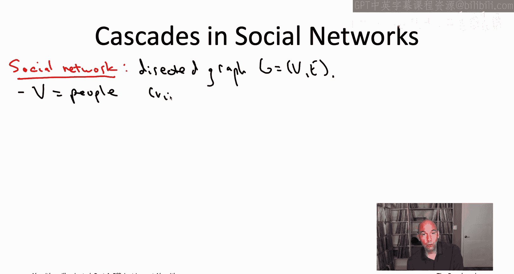

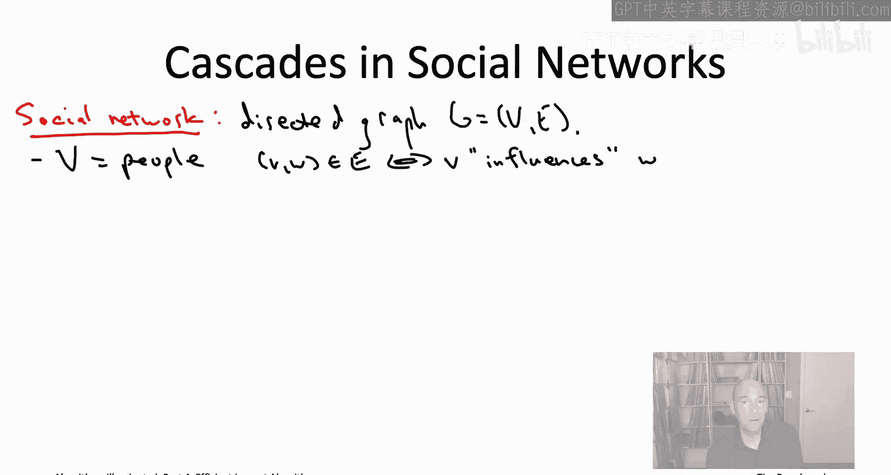

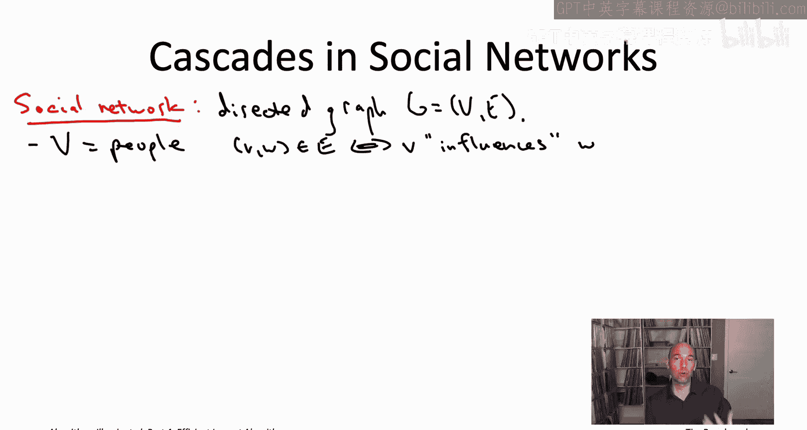

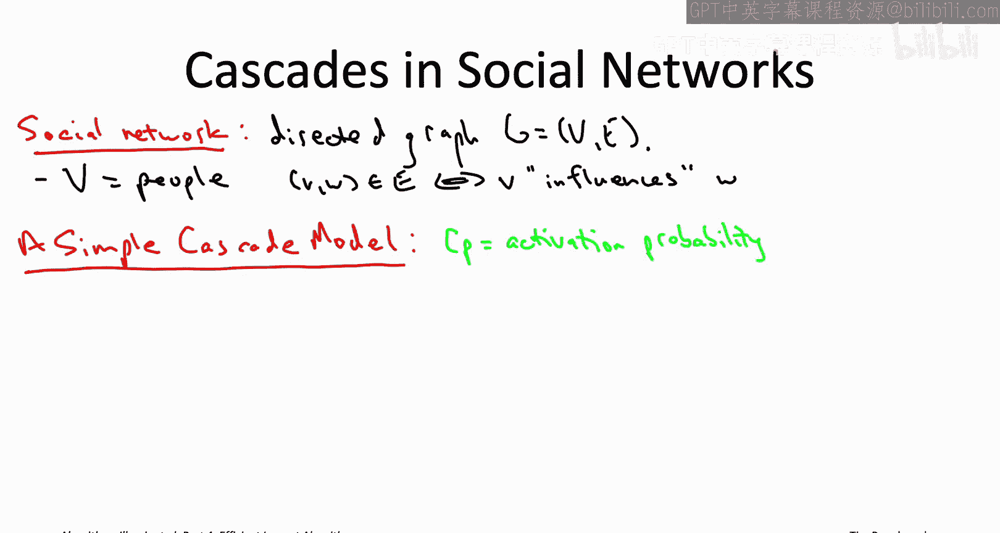

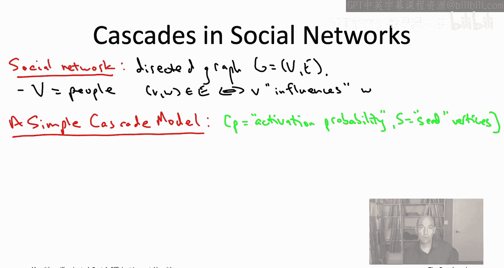

All of the vertices are initially inactive， so vertices will never go from active to inactive if at some point you clicked on the link then hey you clicked on the link。

 but vertices can go from inactive to active so maybe a person eventually does click on a link to a certain news article So what's the process by which that happens by which vertices become activated Well currently active vertices have the opportunity to activate any inactive vertices that they influence。

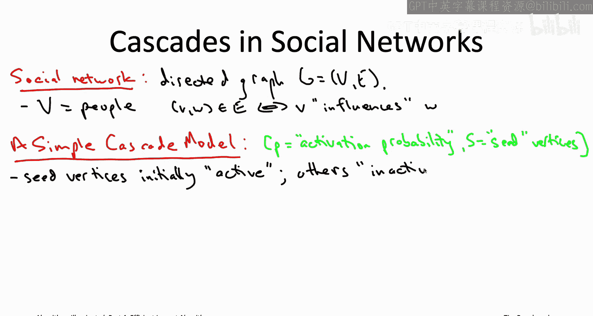

Now each vertex V only gets one shot at activating the vertices that it influences。

 so we're also going to associate a status with each edge and all the edges initially we're going to call unfpped。

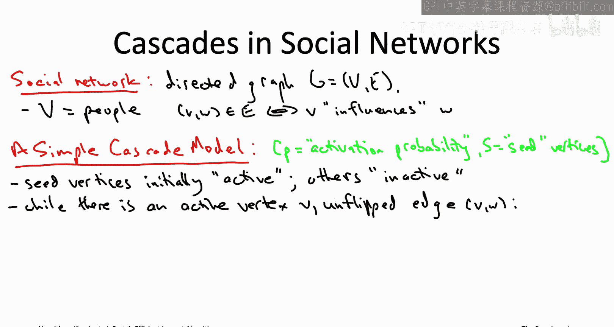

So whenever you have an active vertex V and V influences some other vertex W and the edge from V to W has not yet been flippeds。

 that is an edge that is eligible to be flipped in this iteration of the main while loop So these activations are going to continue as long as there are opportunities。

 So as long as there's an currently active vertex V and there's some outgoing edge from V So some W that V influences such that that edge hasn't been flipped yet。

 such that that opportunity to influence W hasn't been taken yet The formal model involves this activation probabilities。

 you might want to think the activation probability is say 20% something like that。

 So you choose some activation opportunities。 So an active V and an un flippedpped outgoing edge V comm a W and you flip a coin and the coin is going to be a biased coin is going to come up heads with probability P So in our example comes up heads 20% of the time。

 80% of the time is going to come up tails。 Now， if the coin comes up heads。

 that means that v successfully did influence W。 So for example。

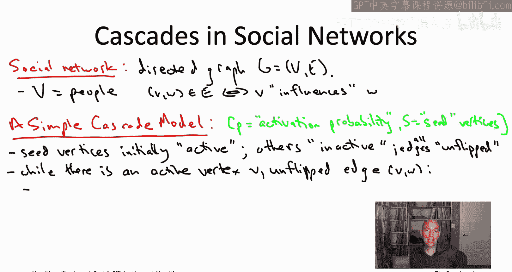

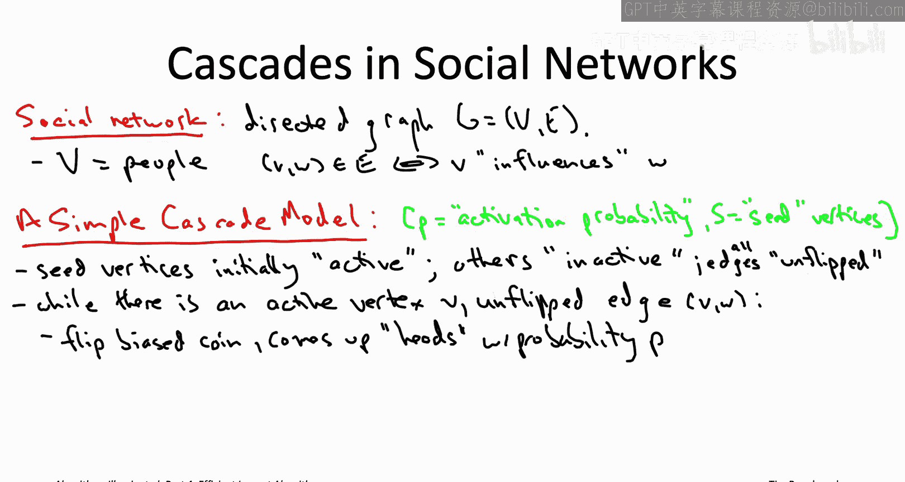

If V tweeted with some link and then W clicked on it， that would be a successful activation。

 so that would correspond to heads。 if W just ignored that link and never clicked on it。

 that would be the 80% case tails So in the event that this coin comes up heads we need to change the status of both the edge and possibly the vertex W。

 So the edge is obviously no longer un flippedpped。

 So we're going to call it active because the coin came up heads it may not W may have been active already。

 they may have already clicked on that link before they saw the tweet from V in which case fine they stay active or if they were previously inactive and this was the first time they clicked on the link now their status changes to active。

 So meanwhile， if the coin comes up tails that's a failed influencing opportunity again we want to record the fact that the edges coin has been flipped so we change the edge's status from un flippedpped to inactive because it didn't work and W status stays whatever it was before。

 So if it was already active it's still active if it was inactive， it's still inactive。

 So that's how this process works more and more vertices keep getting activated。

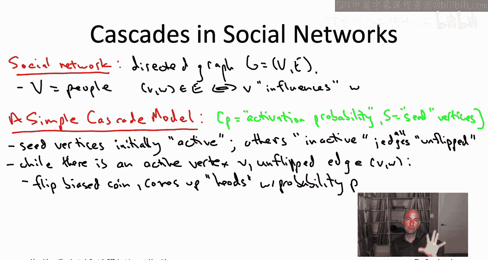

Till at some point all of the edges going from an activated vertex to some other vertex they've all been flipped that's when the process stops noticeice that a vertex can have multiple activation opportunities。

 it has one for each of its activated influencers and you know for example。

 maybe the first two times that two of your friends recommend you to go see a new movie。

 you kind of don't pay attention but then suddenly when you the recommendation from the third friend。

 that's what triggers you to go see it。

So let's look at a simple example。

So we're gonna to look at a social network that just has four people in it， A， B。

 C and D in general you can have more than one seed vertex。

 but in this example we're only going have one seed vertex and that'll be a so as promised a starts out with its status as active the other three vertices are inactive and of course initially all five of the edges have not yet been flipped So when the cascade process starts。

 it says okay so is there an active vertex with unf outgoing edges yes there is A is active and none of its outgoing edges have been flipped yet so a has the opportunity to influence each of B C and D So suppose the process flips each of those three coins in turn and suppose the first coin comes up heads so that's the edge from A to B but the coins corresponding to A the D and A to C come up tails。

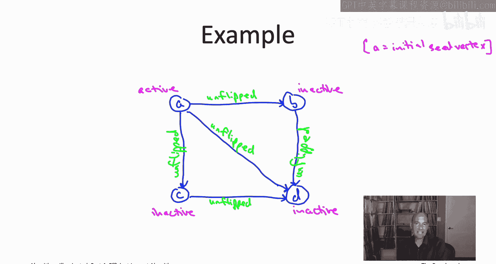

Here's how the picture changes。 So first the edge from A to B， that goes from unfpped to active。

 it's active because that's the coin came up heads。Now， B B used to be inactive。

 but we just had a successful activation event， a successful influencing opportunity。

 So B is going to become active at this point。 The coins for edges A C and A D come up tails。

 so no change to the status of either C or D， they stay inactive。 but of course。

 we want to record that those coins have been flipped。

 So we change the status of the two edges to inactive。

 So you'll notice that at this point there's no hope of ever activating the vertex C。

 The only opportunity was from A and that didn't work out。 However。

 there's still a chance that D could be activated can't happen from a that attempt failed。

 But maybe the second activation opportunity now that B is active will work out。

 So that corresponds to flip choosing the edge from B to D and flipping a coin。

 And if the coin comes up edges then indeed D does become active。 and of course。

 the edge becomes active as well。 So that's how the process stops at this point。

 there's nothing more to do there's only one unfpped edge remaining。

 and it emanates from an inactive vertex C。 So C。Being inactive can't has no opportunity to activate D So optionally。

 if we're sort of annoyed by these unfpped edges that remain that remain。

 we can add a postprocesing step that flips coins for any remaining un flippedpped edges and updates those statuses accordingly is active or inactive and importantly。

 in this postprocessing step while we change the status of edges。

 we make no changes to the statuses of any vertices So for example， in our running example。

 maybe we flip that final coin for the edge going from C to D， maybe it comes up heads。

 we make the edge active just to reflect that the coin came up heads but C stays inactive D was already active。

 but if D had been inactive， it would stay inactive despite the fact that C D came up heads。

 and in general， the thing to notice is that whether or not you have this postprocesing step。

 the vertices that wind up activated at the end of the process are precisely the vertices that are reachable from a seed vertex by a directed path of activated edges。

So in this example， we only have the one seed vertex A。

 and we see that A can indeed reach B by a directed path of active activated edges。

It can also reach D by a2h path of activated edges。

 but you'll notice there's no path of activated edges from A to C。

 and so that's why it's exactly B and D that have the status active in this process so basically if there wind up being some directed path from a seed vertex to you where the path comprises only active edges。

 then you wind up active， not if there's no path of active edges from a seed vertex to you。

 then you stay inactive。So now I can tell you about the influence maximization problem the input to the problem it's just a social network in the way we've been talking about a directed graph along with a seed vertex and then also a budget K which is a positive integer and I forgot to mention just like in our cascade model part of the input is an activation probability so it's a real number P between zero and1 so informally the goal in the influence maximization problem is to choose a bounded number of vertices to designate as the seed vertices and you want to do it in a way to influence as many people as possible to have as many vertices activated by our case cascade process as possible。

Now it's a little tricky because the number of vertices that get activated， that's a random variable。

 it's going to depend on how the coin flips come up， so sometimes it'll be big。

 sometimes it'll be not so big。So it's a random variable and we'll do the sort of most straightforward thing and we'll focus on its average value that is the expected value of the random variable which is equal to the number of vertices that eventually get activated in the cascade model So a little notation to make this idea precise by capital A of S So here capital S is a subset of seed vertices capital A of S means the set of vertices that eventually wind up getting activated from this seed vertex set capital S Now this is random again so this will depend on how the coin flips come up so you'll get different sets with different random experiments even with the same seed set。

So let's define the influence of a group of variables as the expected number of vertices activated when those are the vertices chosen as the seeds we' here the expectation。

 the averaging that's over the coin flips that are part of the cascade model So another way to think about it is so you imagine you designate these 10 vertices as seeds you could imagine now just sort of running a simulation like where you literally just flip these coins and see what happens and then you count how many vertices eventually get activated you could imagine repeating that experiment a million times and taking the average value that's going to be basically this expectation so the average value of the number of activated vertices。

 given that you choose this subset capital as is the seed vertices So this influence this is going to be our objective function going we are going to want to choose the seed vertices to make this influence the expected number of activated vertices as big as possible So that's the influence maximization problem。

 Very cool problem。

And this one actually is from the 21st century， just barely， but it is from the 21st century。

 unlike almost everything we've talked about in these videos so far。

 the definitive research paper on this problem， the one that introduced it and also gave the analysis we'll be discussing came out in 2001 by David Kempie。

 John Kinberg and Ava Tdo So if you want to have a concrete example of an influence maximization type problem in mind。

 you could imagine that you've been given you by your employer K copies of a product to give away for free。

And you want to choose the recipients of those products in a way that maximize its eventual adoption。

 So then you want to give it to people who are likely to trigger many other people to adopt the product and you're facing an influence maximization problem。

 So if you watch the past couple videos on the max coverage problem。

 you may have noticed some similarities between influence maximization and max coverage。

 especially if you looked at the example of maximum coverage where we were talking about choosing people to maximize attendance at an event like a concert。

 that should have felt the influence maximization problem should remind you of that。 And indeed。

 and I'll leave this for you to do the privacy of your own home。 the maximum coverage problem is。

 in fact， a special case of the influence maximization problem。 In maximization is only more general。

 Now， even the special case is NP hard as we discussed。 So the more general problem。

 influence maximization is certainly NP hard as well。

 the best case scenario would be fast and approximately correct， heuristic algorithm。 Is there one。

Yes， there is， and again， it will be a natural greedy algorithm。

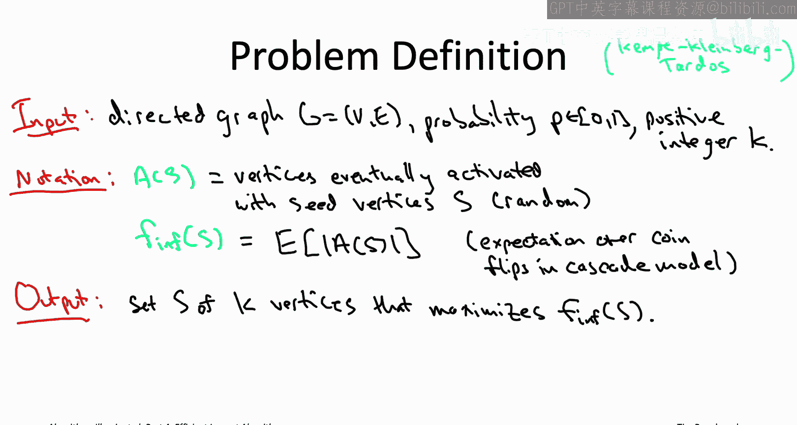

So the greedy algorithm will look very similar to the one we saw for the maximum coverage problem there's again K things to choose K vertices so we're going to be picking them one by one。

 we don't care about coverage， we care about influence。

 but again in each iteration of the greedy algorithm we're going to be myopic and we're going to pick the vertex that increases the current influence as much as possible。

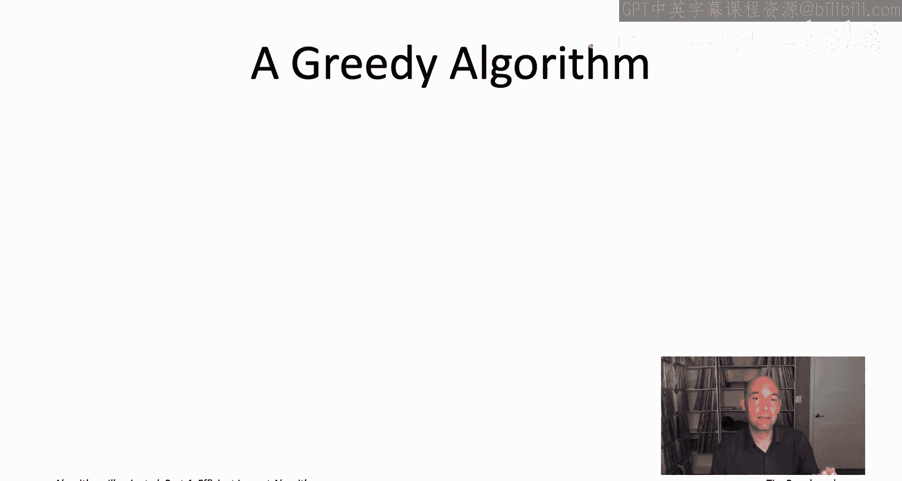

So that is the KKT algorithm for influence maximization。

 and it is the one we will be analyzing in the rest of this video。

 unlike the other greedy algorithms we've discussed at the running time of the KKT algorithm is actually there's some subtle stuff going on。

 so let's think that through in the next quiz。

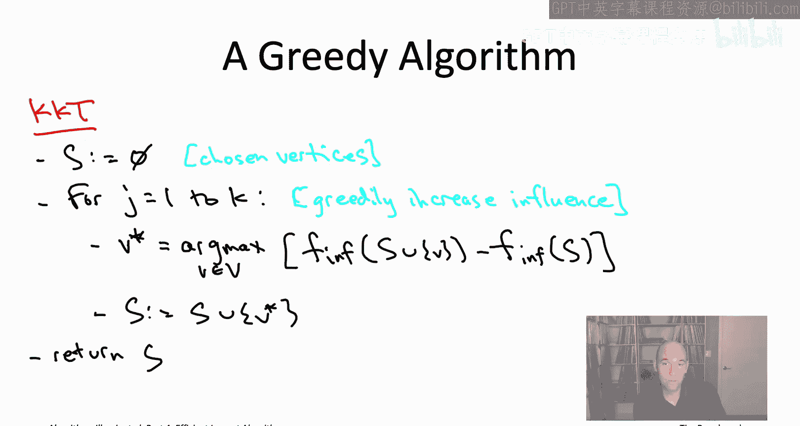

Specifically， I'd like you to choose the tightest upper bound on the running time of a straightforward implementation of the KKT algorithm that you believe is correct。

 take a few seconds to think about it。

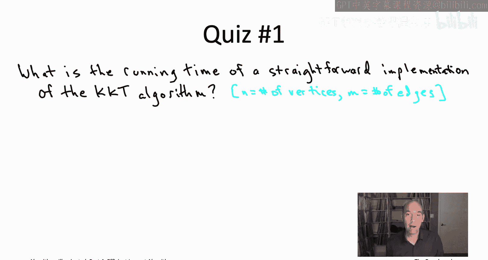

Al right so this quiz is a little tricky I'd be willing to accept either C or D as a correct answer So let's talk through the running time right there's K iterations of the main loop。

 each of what's each of which involves computing a maximum over the n vertices So in other words。

 the running time of the straightforward implementation is big O of K times n the number of iterations ten number vertices times the number of operations required to compute the additional influence you would get by adding one additional vertex to your current solution that in turn boils down to evaluating the influence of two different sets。

So how many operations do you need for that to compute the influence of a given set of vertices？

While， unlike for the coverage objective function we were working with last section。

 the answer isn't obvious because of the pesky expectation and the definition of influence。

 let me remind you what it is。So for a given subset of vertices。

 remember we look at the set of vertices that wind up being activated and how many there are That's a random variable。

 the number of activated vertices depends on the results of the coin flips and so we were just doing the most straightforward thing and looking at the average or the expected number of activated vertices for a given set of seats。

 that was the influence function Now unfortunately。

 what this expectation is over is two to the M different possibilities So here M denotes the number of edges because for each edge。

 you might flip heads or you might flip tails So there's two to the m possible things that could happen and this expectation is averaging over those two to the M things So if you compute this expectation in the most naive way just as a sum over2 to the M terms。

 then you're going to get a running time like in the answer C big go of K times N for the number of times you have to compute influence times2 to the M the time required to compute influence in this naive way you may be wondering whether or not you really need to do。

Exentially big sum， so that's why I'd be totally sympathetic if you chose answer D just thought it was unclear what was the running time of this algorithm。

Now maybe you're saying you know wait a minute why am I even telling you about this algorithm if you have to sort of evaluate these sums of an exponential number of things This is the whole point of everything we're doing in this chapter to avoid using exponential time well actually this greedy algorithm is still completely implementable useful It is true that the influence of a set of vertices can be difficult to compute exactly to arbitrary precision but it's pretty easy to estimate the influence of a set of seed vertices using random sampling so basically you just flip coins for all of the edges。

 you see what happens you count up the number of activated vertices and then you just average that over a bunch of different independent random trials that won't be exactly the influence。

 but that'll be pretty close to the influence and then you can just run the same greedy algorithm using these estimates of the influence that you got through this sampling procedure that's how you'd actually implement it in practice。

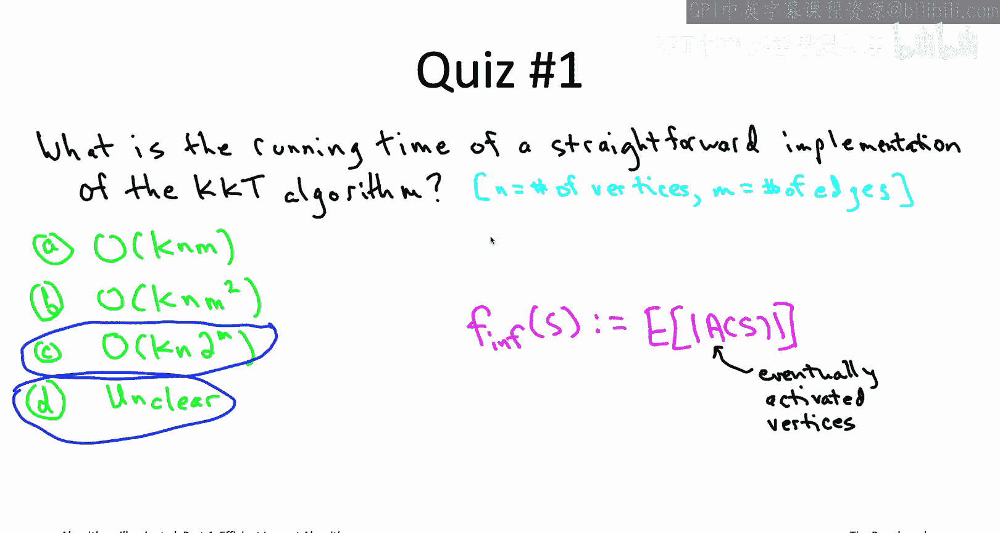

So that's what I wanted to say about the running time。 Now。

 let's go back to the original version of the KKt algorithm where you're not doing the sampling business。

 You're just somehow computing these expectations， computing the influence。

 and let's analyze the solution quality of the seed set output by that greedy heuristic。

 happily the guarantee for this greedy heuristic is just as good as the approximate correctness guarantee we had before for greedy coverage for the maximum coverage problem。

 That's right。 The output of this algorithm is guaranteed to be at least a one minus quantity 1 minus whenever K raised to decay fraction of the maximum possible influence of any set of k seed vertices。

 and we should be very， very happy about this guarantee。

 The reason is remember that we can actually think of maximum coverage problem as a special case of influence maximization。

 So influence maximization being at least as hard and general as max coverage。

 That means the best case scenario we could possibly hope for is to do just as well for the more general influence maximization。

😊。

bleAs we've done for the more special maximum coverage problem and that is exactly what this guarantee is saying。

 So I will give you a full proof of this approximate correctness guarantee。

 if you just want sort of one line of intuition about why this is true but we observed in the past that there is a pretty close connection between influence maximization and maximum coverage。

 especially in that example we discussed about maximizing event attendance by recruiting people who are then going to recruit all of their friends So basically what's going to be going on is that the influence of a set of seed vertices is going to be nothing more than a weighted average of different event attendance problems one for each possible subset of the vertices that might have been activated So all we have to do really is go back and check that our analysis for the maximum coverage problem which applies in particular to event attendance we just need to make sure that that same analysis works if we're looking at a weighted average of event attendance problems rather than just one but as we'll see it does indeed extend。

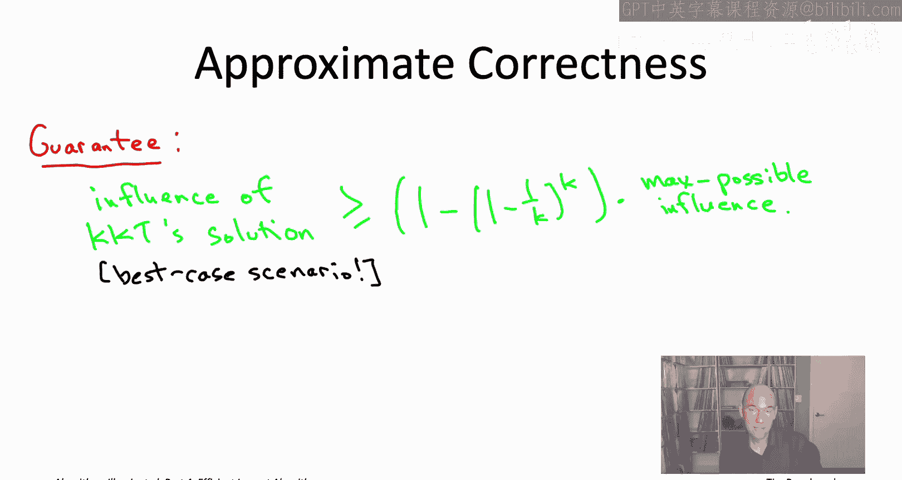

