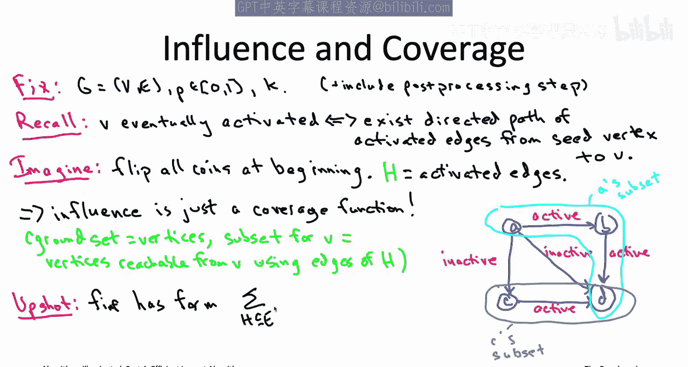
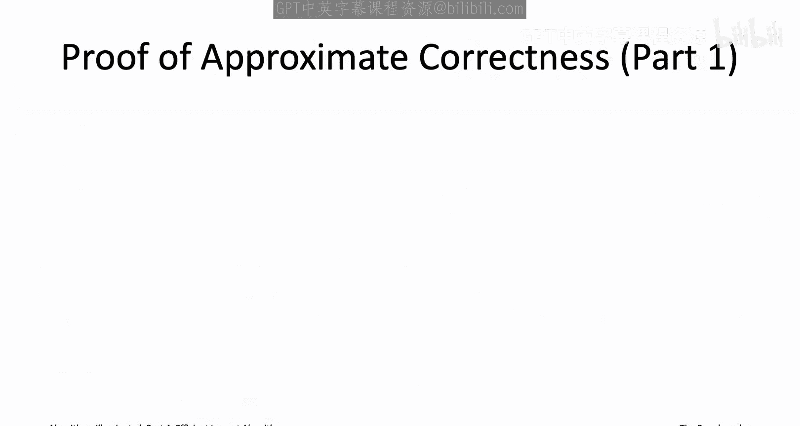
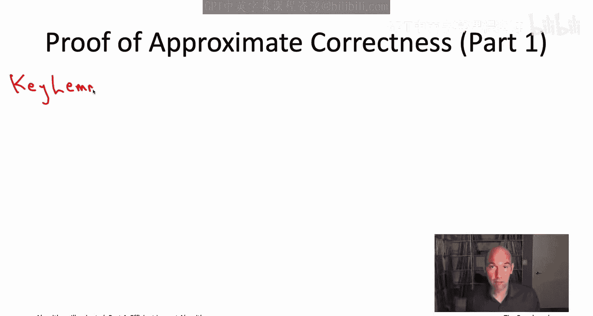
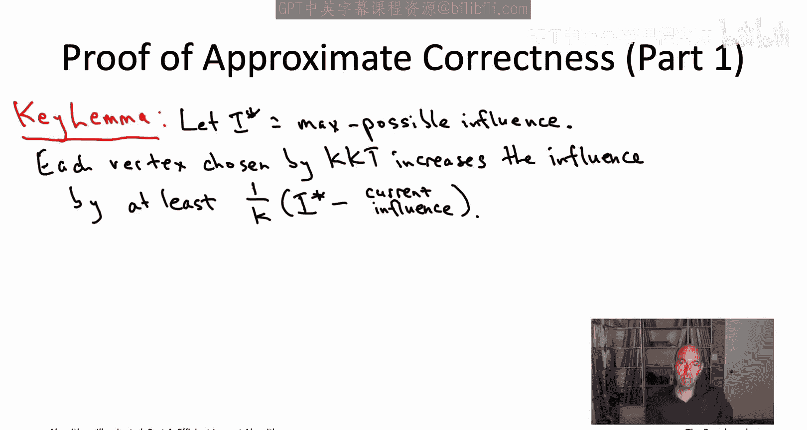
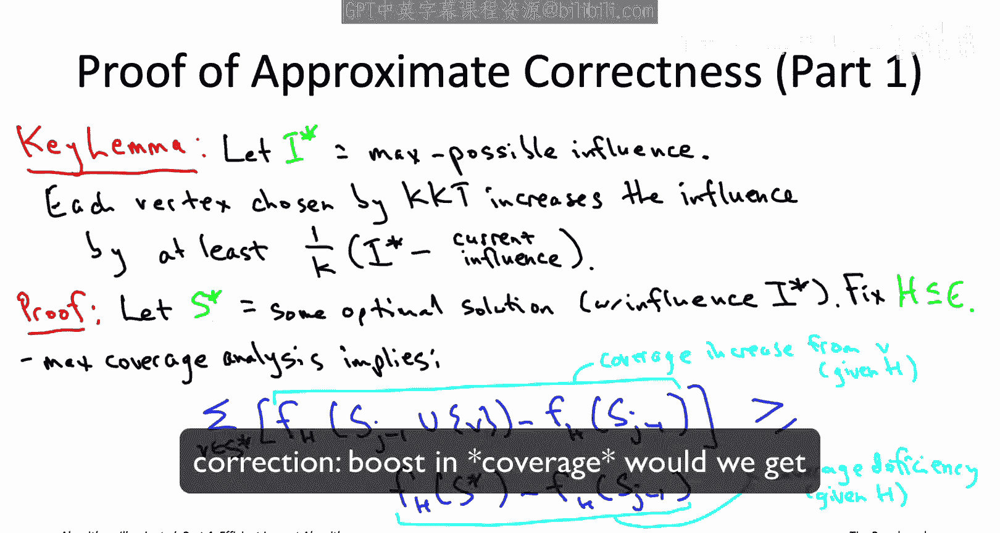
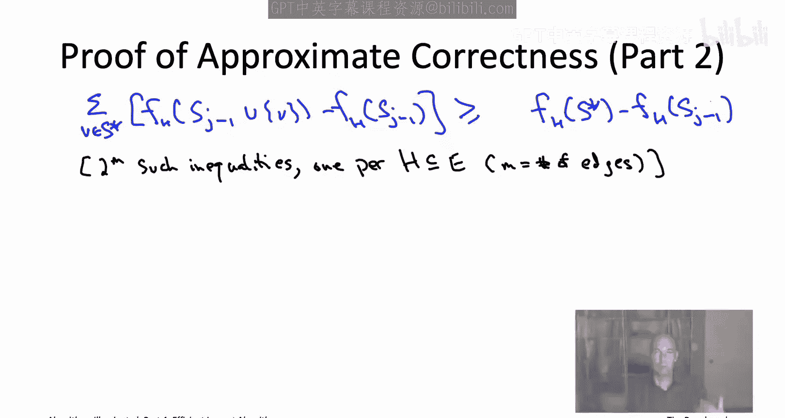

# 斯坦福大学《算法启蒙（第4册）：NP难｜Part 4 Algorithms for NP-Hard Problems》中英字幕（deepseek-R1） p13 -13-20.3_ A Greedy Heuristic for Influence Maximization)  -2_2-.zh_en -BV1FAVUzXEum_p13-

So for the formal proof， let's start by formalizing what I asserted that this influence function is nothing more than a weighted average of coverage functions。

 coverage functions from those event attendance problems。

So formally， let's fix an input of the influence maximization problems So we've got a directed graph G。

 We've got an activation probability P between 011 and a positive integer or K。

 the number of seed vertices that we're picking and for convenience on this slide。

 we're going to think about the version of the cascade model that includes that post processing step。

 So remember that means that even after the process concludes if some of the edges are still unfpped just go ahead and flip them to the end of the day。

 all of the edges will be either active or inactive and the key thing to remember about that cascade process is that the vertices that wind up activated。

 given a set of seeds are precisely those reachable from a seed vertex by a directed path of activated edges。

 So next， as a thought experiment， imagine that we actually had telepathy。

 and we just knew in advance exactly which edges are going to wind up being activated。 In effect。

 imagine that we just tossed all of the coins up front rather than on a need to know basis like we do in the cascade model。

 Then if we knew the。Acivated edges capital H the influence maximization problem would literally boil down to a maximum coverage problem。

 The ground set would just be the vertices v of the social network。

 and there would be one subset per vertex with the corresponding subset containing all the vertices reachable from V by a directed path of activated edges that is by a directed path in the subgraph V comma capital H So for example。

 going back to our four vertex graph we looked at earlier。

 So suppose that the activated edges happen to be the edge from a to B。

 the edge from B to D and the edge from C to D so those three edges constitute the set capital H。

 then we've got one subset corresponding to the vertex A which includes all of the vertices reachable from a along activated edges So that's going to be a B and D。

 Similarlyly， the set corresponding to C that's going to be all the vertices reachable from C along a direct。

pathath of activated edges so you can get from C to itself you can get from C to D and that's going to be it So what you can then say is that the number of people that wind up activated is exactly the coverage of the subsets corresponding to the seed vertices So for example in this example if you pick the subset corresponding to a and the subset corresponding to C then you wind up activating all four vertices and that's because the coverage of those two sets is all four vertices Now of course we don't know all of the activated edges in advance capital H that's not fixed that's some random set different Hs have different probabilities attached to them but at the end of the day the influence of a given set of C vertices is just going to be the expected value of this coverage function where the expectation is over all possible subsets capital H so all two to the M subsets of possible active edges。

So what does that expectation look like well we can just sum over all of the different subsets H of activated edges that we might encounter again there's two to the M of those where m is the number of edges。

 each one of those has some probability p of H actually is a simple formula for that we're not going to need the formula but basically for the set H to be exactly the set of activated edges you need to flip heads for all of the coins in corresponding to edges of H so that is a p to the size of H probability you also have to flip tails for all of the edges outside of H so that is a one minus p raised to the number of edges outside of H probability but whatever there's some probability piece of H that H is exactly the subset of activated edges and then as we saw once you've fixed the activated edges you just have a coverage function with the ground set being the vertices also one subset per vertex where the subset corresponding to a vertex is the other vertices reachable from that vertex along a directed path of edges that are active edges。

C H for the rigor obsessed among you， what we're really doing is we're using what's called the law of total expectation to write the original expectation。

 the definition of influence as a probability weighted average of conditional expectations where the conditioning is on the activated edges capital H if that didn't make sense don't worry about it I hope it's intuitively clear that there are these two to the M possibilities for the different subsets of activated edges。

 each of those possibilities has its own probability each of those situations has its own coverage function and the influence is just the corresponding weighted average of those two to the M coverage functions。

All right so that sounds like good news， we already know that the greedy algorithm for one coverage function gets the approximate correctness guarantee that we want all right now we're not dealing with a one coverage function it's an average of a bunch of them。

 but hopefully the analysis still works and so let's check that that is indeed the case。

The main thing we need is a new version of what we were calling the key lemma for the maximum coverage problem so this is thelemma that asserts that the greedy algorithm makes progress in each iteration so back in maximum coverage we wanted to say that each of the K iterations increases the coverage by a healthy amount here we want to argue that each iteration of the KKT algorithm increases the influence of the current set of seed vertices by at least a given amount。

And the form of the key lemma will be exactly the same as it was in the maximum coverage problem。

 So we're going to lower bound the progress。 The increase in influence in each iteration in terms of the deficiency of the current solution at that iteration。

 So we're going to let I star denote the maximum influence possible using a Kc vertices。

 and then the deficiency in a given iteration of Kkt will be the extent to which the influence of Kkt's current solution falls short of the maximum possible I star。

 and the guaranteed progress is that each iteration you will increase the influence by at least a one over k fraction of that deficiency。

 So this is literally exactly the same as the lemma in the maximum coverage problem except what used to be C star for the maximum coverage is now I star for the maximum influence and what used to be the number of elements already covered is now just the current influence of the Kkt solution。

 Otherwise it's exactly the same。 Now you we might recall that in our approximate correctness guarantee for the。

Greedy coverage algorithm， we had two parts。 We had a key lemma like this one guaranteeing progress and then we had a second part which was doing some algebra to get the final approximate correctness guarantee Now this keylemma is exactly the same guarantee that we had for maximum coverage So the second part of the proof continues to apply completely unchanged given that this lemma is actually true。

 you just do the exact same iterated k times invoke the geometric series formula simplify and if this lemma is true。

 we will get what we want that the Kkt algorithm guarantees at least a1 minus quantity 1 minus1 over k raised to decay fraction of the maximum possible influence so we're going conclude this video by proving the key lemma。

 we will declare victory at that point because the approximate approximate correctness guarantee follows in exactly the same way as before So some notation let's consider an arbitrary optimal solution So some k vertices call them capital S star by optimal I just mean they have the maximum possible influence so influence I star。

So the plan is is we're going to fix some subset of the possible activated edges that gives us a coverage function as we've seen。

 then we're going to just piggyback on the analysis that we already did for the coverage problem and then we'll take a weighted average at the end So to get started fix your favorite subset of edges there's two to the impossibil I don't care which one you pick just pick one capital H we then have a corresponding coverage function which I'm going to call F sub H and again remember what is that coverage function that just says given that H is exactly the active edges given that you picked a particular set S of seed vertices how many vertices are reachable from a seed vertex along one of those active edges and as we've seen that's exactly a coverage function so that's what I mean by F sub H Now we worked pretty hard to prove that approximate correctness guarantee for the maximum coverage problem and that greedy algorithm so we'd certainly like to reuse as much of that work as we can here and if you recall or if you go back to that video I that approximate correctness。

We had a keylemma just like this one involving the coverage rather than involving the influence and then improving the keylemma。

 we had this key claim so this really important inequality and this is when we were talking about the green region。

 one thing being bigger than the green region and the other thing being smaller than the green region so what did we say what we said on the one hand let's consider the deficiency and coverage up to this point and then on the other hand we said let's look at how much extra coverage you would get under this thought experiment of adding each subset from the optimal solution to what you have so far and the latter is at least the former so in other words。

 there's always going to be one option one of the subsets from the optimal solution which will get you a one over K fraction of your deficiency。

 the extent to which your coverage is less than the maximum possible coverage So we just copy that exact same inequality down here where we instantiateiate it with the coverage function induced by the subset capital F of activated edges so that's F sub H and again that's just。

Given sets that's just the number of vertices reachable from S via a path of active edges。

 path of edges that are in capital H so I've literally just copied that inequality down here using our current coverage function F sub H the left-hand side it's doing a thought experiment for each of the vertices V and the optimal solution I star it's asking how much boost and influence would we get if we added to the greedy solution sj minus1 if we added this vertex v from the optimal solution S star we do that thought experiment K times once for each of the K vertices in the optimal solution S star we sum up the results。

 so that's the bigger quantity and then the smaller quantity is our current coverage deficit deficiency with respect to this coverage function F H so the extent to which our coverage under F sub H is not as big as the coverage of S star would be。

All right， so this we really haven't proven anything right now。

 this is all stuff we proved a couple videos ago， this is literally just piggybacking directly on the key inequality from the key claim in our coverage analysis。

 so let's now actually use the fact that influence is a weighted average of coverage functions and complete the proof of the guarantee for the KKT algorithm。

All right， so that inequality， you know， I don't expect you to remember it。

 so let me write it down again here at the top of the slide is exactly the same inequality we had before。

Now this is an inequality for a fixed choice of capital H。

 a fixed set of edges that wind up being active， so we actually don't just have one inequality like this。

 we actually have two to the M inequalities like this where M is the number of edges。

 so we have an inequality of this form for each choice of capital H， each subset of edges。

So now the trick we're going to do。 we're like well we already know that weighted influence is a weighted sorry the influence is a weighted average of coverage functions。

 So let's just take these inequalities one for each coverage function and take the weighted average of them using the exact same weights that we have in the definition of influence So weighted by the probability the capital H really is the set of activated edges so let me show you exactly what I mean by taking a weighted average of these two to the m inequalities。

 let me give myself a little more room to work with here on the right hand side So whenever you have an inequality like this。

 know that some number a is at least as big as sum number B if you multiply both sides by the same positive number。

 the inequality is still true。 So if a is at least B twice a is at least twice B1 half a is at least one half B and so on So let's take the inequality corresponding to a subset H of active edges and multiply through by the probability that that set really is the set of active edges in the cascade model So now we have the inequality weighted by the probability that that actually is the。

We're going to be living it weighted by the probability P sub H Again。

 we don't really care what p of H is， but there is that closed form formula P raised to the number of edges in H times one minus p raised to the number of edges not in H All right so that's again we have one of these inequalities for each possible subset of edges we want a weighted average so finally let's just sum up the2 to the m inequalities。

 we get another inequality if a is at least as big as B and a2 is at least as big as B well then a1 plus a2 is definitely at least as big as B1 plus B So we did this just following our notes where we wanted to piggyback on our coverage analysis we knew we had a coverage function only when we fixed a set h of active edges and then we knew we needed to get back to the influence we knew that influence was this weighted average of the coverage functions So it made sense to just take the same weighted average of the inequalities that we got for each coverage function individually so that was all a reasonable thing to try but now actually it's really going to work out just magically so watch what happens when。

Innerterschan a couple sums。So all I've done here is multiplied through by piece of H I've pushed the piece of H n as far as I can and also on the left hand side。

 I harmlessly reversed the order of sumation so now I'm summing over the vertices in the optimal solution first and then over the possible subsets of active edges second Now why was this such a good move well we've seen this sum over H piece of H times F sub H before。

 remember influence is exactly a weighted average of coverage functions the coverage functions involved are exactly these F sub Hs and the weighted the probabilities are exactly the P of H's so the influence F IF is exactly sum over H P FH。

And that means we are good to go。 That means all of these sums over H's。

 We know another name for these things。 This is just the influence of the corresponding vertex subset。

 So， for example， this first sum over H on the left hand side。

 that's nothing more than the influence。Of the first J minus1 vertices chosen by the KKT algorithm along with this one vertex V from the optimal solution S star。

Similarly， that second， sum over H on their left hand side。

 that's just the influence of the first J minus1 vertices。

Chsn by the KKT algorithm， and then on the right hand side， we get the influence。Of S star。

And we get the influence of Sj minus1。So that's the analog of the most important inequality that we had for the maximum coverage analysis。

 this is the analogous inequality that we now have for influence maximization and now that we know this we pretty much good to go the rest of the proof goes exactly the same as it did for maximum coverage So what is this key inequality tell us it tells us that if we think about these k thought experiments so we have the greedy solution so far as j minus-1 the j -1 vertices picked in its first j -1 iterations we do k thought experiments。

 one for each vertex and the optimal solution as star we say how much would the influence jump if we included that particular vertex right now as part of the greedy solution and this inequality says the sum of those thought experiments can be bounded below by the current deficit and influence the extent to which the maximum possible influence is bigger than the influence achieved by the Kkt algorithm already Now the next step is we just use the same maneuver that the maximum of k numbers has to be at least the average so on the lefthand side of this inequality we have the sum of K things the average。

Vue is just one over k times the sum of k things and so one of the numbers has to be at least that big。

 So again remember that if I have 10 numbers that sum to 100 one of them has to be at least 10 that's just one of them has to be at least the average so that means that there exists a vertex in a star that captures at least a one over k fraction of that left hand side which of course means it also captures at least a one over k fraction of the right hand side because the right hand side is only less In other words there's a vertex in the optimal solution s star so that if you added it right now to the greedy solution so far you guaranteed the influence would go up by at least one over k times the current influence deficit Now Kkt algorithm may or may not pick that vertex。

 but it's a greedy algorithm it picks the best vertex for this iteration that maximizes the influence increase so whatever the KKt algorithm does it's going to get at least the same lower bound on the influence increase at least one over k times the left hand side of the inequality hence one over k times the right。

side of this inequality also known as one over K times the influence deficit f of S star minus f of Sj minus1 the J minus-1 vertices chosen in the first J1 iterations If you go back and look at the statement of the klemma that is exactly it we have now finished the proof of the keylemma and once again the approximate correctness guarantee for the Kkt algorithm from here proceeds by the exact same algebra that we used for the maximum coverage analysis So this shows that even though influence maximization is a more general problem。

 the maximum coverage the analogous greedy algorithm the Kkt algorithm gets us just as good a guarantee two seed vertices you're going to get at least 75% three seed vertices you're going to get at least 70。

4% no matter how many seed vertices you're choosing you're get you will get at least 63。

2% and again this is just an insurance policy this is just sort of telling you what would happen in the doomsday scenario of a most contrived possible instance on。

Realistic instances， you should expect this heuristic algorithm to over deliver。

 you expect to actually get influence quite a bit closer to 100% than this worst case analysis would suggest。

So that wraps up the part of our discussion of fast heuristic algorithms which uses the greedy algorithm design paradigm。

 it also wraps up the part of our discussion on heuristic algorithms where we have provable approximate correctness guarantees so but we're not done with chapter 20 yet because I do want to add one new tool important tool to your toolbox even though there aren't usually provable guarantees it's still extremely effective on NP hard problems in many cases in practice so that's going to be a local search and I'll see it there。

