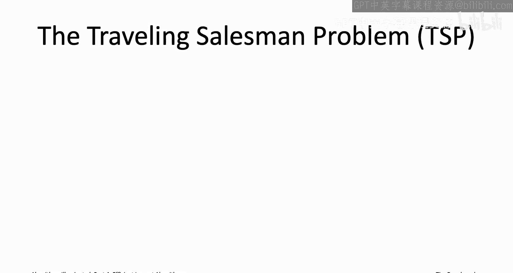
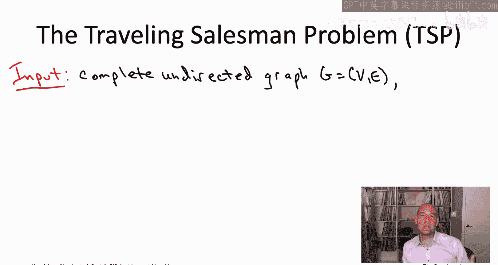
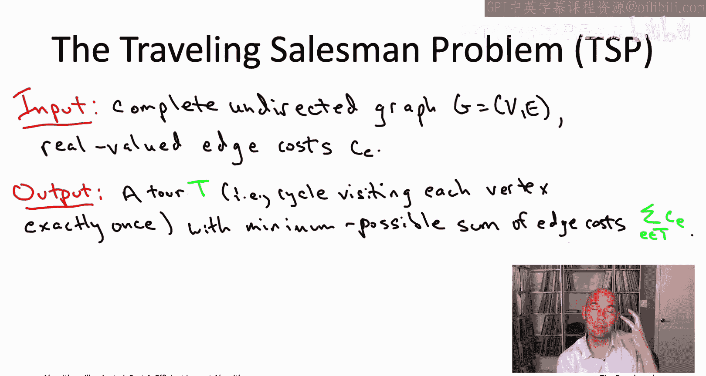
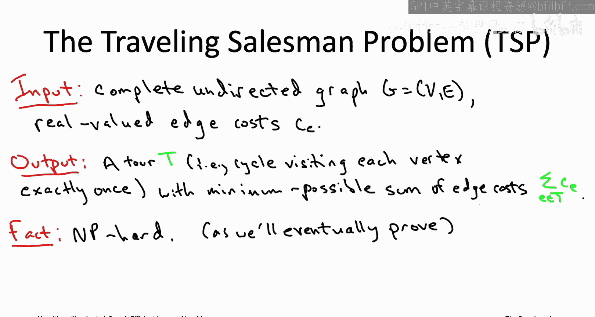
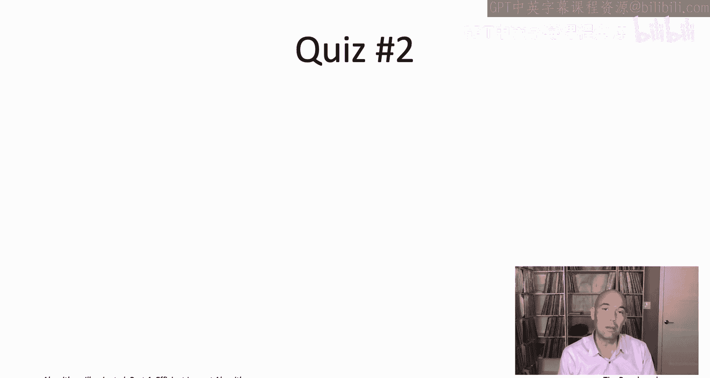
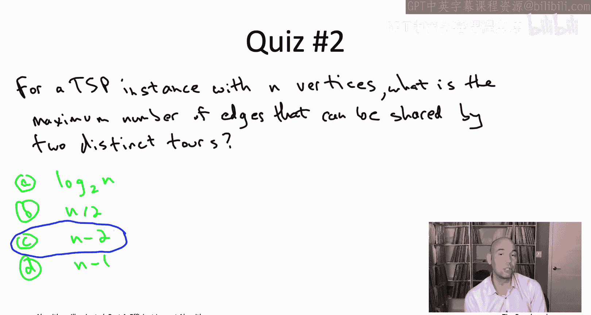
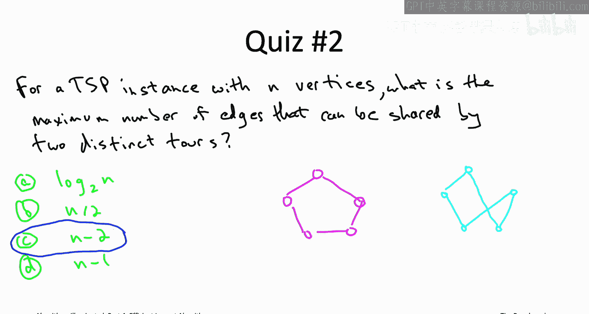
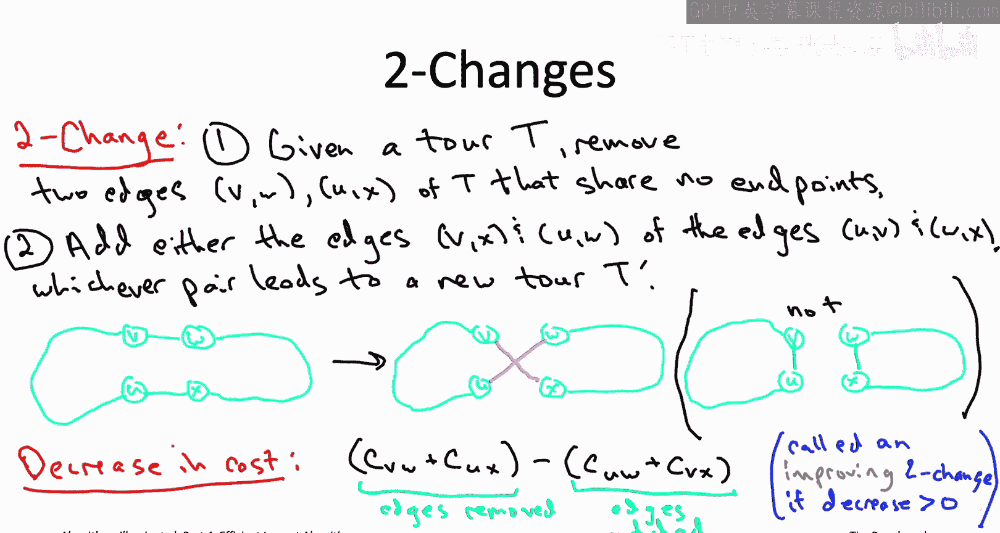
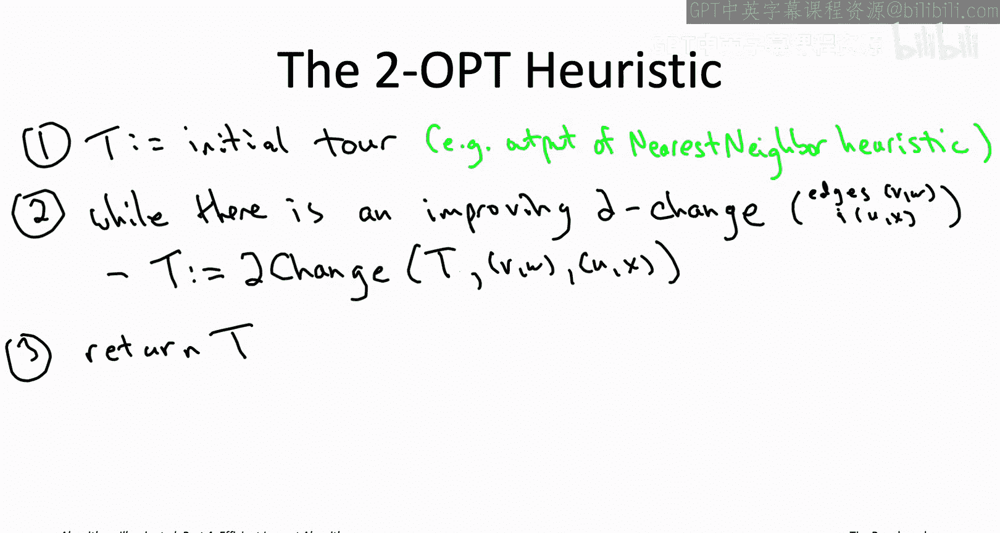

# 斯坦福大学《算法启蒙（第4册）：NP难｜Part 4 Algorithms for NP-Hard Problems》中英字幕（deepseek-R1） p14 -14-20.4_ The 2-OPT Heuristic for the TSP)  -Part 1 of 2-.zh_en -BV1FAVUzXEum_p14-

Hi everyone， welcome to this video that accompanies Section 20。

4 of the book algorithmris illuminated Part4， it's a section about the two hop heuristic for the TSP。

 So MP hardness is always a drag， but at least in those last few problems that we studied so makepan minimization。

 the maximum coverage problem and the influence maximization problem。

 at least in all three cases we did have fast heuristic algorithms that enjoyed approximate correctness guarantees that had an insurance policy。

Unfortunately there's a bunch of other NPR problems including the traveling salesman problem where we don't expect there to be fast algorithms with such approximate correctness guarantees where in fact such an algorithm would refute the Pnot equal to NP conjecture so if that's the kind of problem you're dealing with and you really want a fast algorithm your only choice is to design a heuristic algorithm that while having no insurance policy at least performs well on most or all of the inputs that arise in your application so local search along with as many variants as one of the most powerful and flexible techniques of this type so I'm not going to tell you what I mean by local search just yet instead what I want to do is in this pair of videos I want to develop from scratch a heuristic algorithm for the traveling salesman problem and it's going to force us to develop a number of new ideas then in the next pair of videos I want to zoom out and will identify the ingredients of that TSB heuristic algorithm that exemplify the principles of local search。

Then armed with a template for applying local search。

 along with a specific instantiation for the traveling salesman problem。

 you'll be well positioned to apply this technique in your own projects。

So let me just remind you real quick about the definition of the traveling salesman problem。

So the input to the problem is a complete undirected graph。

 so there's some number n of vertices and all n chooseose to undirected edges are present。

 Moreoverover each of those edges has a real valued cost。

 just like in say the minimum span tree problem。

And the goal then is to compute a tour and by a traveling salesman tour what we mean is we mean a cycle that visits every vertex exactly once。

 so you start somewhere， then over the course of NHOs。

 you visit all of the rest of the vertices and come back to where you started and of all the tours you want to identify the one that minimizes the sum of the edge costs。

So the traveling salesman problem the TSP it's a very famous problem。

 so if you're wondering why we never discussed it in the first three parts of this book series was because unfortunately it's an NP hard problem。

 we will actually prove this ourselves once we get to the relevant part of the video playlist corresponding to chapter 22。

 but for now let's take it on faith that TSP is NP hard。

 we're going to need to compromise on either correctness or speed。

So to get a feel for how we might come up with a heuristic algorithm for the TSP， let's in this quiz。

 explore maybe the simplest one you might think about， sort of an analog of PRMS algorithm。

 but for the TSP problem。

So it's going to be a greedy heuristic and it's heuristic known as the nearest neighbor heuristic for the TSP So you just start you wherever you want at your favorite vertex call it little a and then you just build up a tour one edge at a time in the greedy kind of myopic way So from the starting vertex A you have n minus one of the vertices you can travel to next and you just go to the one which is closest to you the one for which the corresponding edge has the smallest possible cost at that point you visit two vertices there's n2 left among all those n minus2 vertices you go to the one that's closest so the one where the edge is as smallest possible and then you just repeat that So after you've repeated it at n minus1 times at that point you have a path that visits every vertex exactly once and then of course in the final step you got to go back to where you started So that's the nearest neighbor heuristic for the TSP。

So next， I would like you to work out what the nearest neighbor sheuristic is going to do in this five vertex example I'm going to draw on the right part of the slide。

In addition to figuring out the output of the nearest neighbor heuristic。

 I'd like you to figure out what is the best， the minimum cost traveling salesman。

 so take a few seconds， work both of them out and then we'll discuss the solution。

Yeah。So the answer is a， the minimum possible tour cost is 23 and the tour cost of the nearest neighbor heuristic is 29。

Let's see those two facts in reverse orders， let's start with the nearest na heuristic so the nearest na heuristics is going to start the vertex A and I looks at the other four vertices and it says。

 hey， the cheapest edge in the whole graph is adjacent to me and it takes me to B。

 so that's certainly what I'm going to be taking in the first iteration of the nearest na heuristic。

Now， once the tour reaches B， it has to decide whether it's going to go to C or D or E next amongst those three vertices。

 B is closest to C， cost only2 to get to C， whereas it would have cost3 or6 to get to D or E respectively。

Now that the towards at seed has only two options left。

 it has to go next to either vertex D or vertex E， neither the one's that great an option。

 but the better the two options is to go to E next along the edge that has cost7。

And from here on out， the tour is its choices are forced。

 so there's only one unvisited vertex at this point， so it's got to go from E to D。

And then of course， it has to return to the starting point， so finally it goes from D to A。

So the nearest neighbor heuristics towards as follows the perimeter and its overall cost。

 if you add it up， is indeed 29。So how about the optimal tour， well。

 it's not necessarily immediately obvious， but if nothing else there's only 12 options so you can just do exhaustive search over the 12 and there is one that has cost 23 and I'll trace that out here in the magenta。

So what's the takeaway from this quiz well you know we see in this concrete example that the nearest Navy heuristic need not compute a minimum cost traveling salesman tour we're hardly surprised by that fact I've told you that the TSP problem that the TSP is NP hard。

 this algorithm obviously runs in polynomial time so if it were was correct。

 that would refute toe unequal to NPB conjecture we're not expecting that to happen。However。

 unlike the three heuristic algorithms we've seen so far。

 which had good approximate correctness guarantees。

 this greedy algorithm may be nowhere near the best possible tour to see that。

 remember that the last hop of this tour was forced。

 so even if that last hop from D to E had cost a billion this tour still would have wound up taking that edge because that was the only option left to it after it traversed the rest of the perimeter。

So that would be a pretty terrible example for the nearest Ne heuristic now you could imagine using a more sophisticated greedy algorithm to escape this particular example。

 but unfortunately all greedy algorithms indeed all polynomial time algorithms seem to suffer similar fates in more complicated instances of the TSP。

So can we do better Well here's one natural idea which is you know who says we have to stop as soon as the nearest neighbor heuristic ends。

 what if we take that heuristics tour as a starting point and greedily look for ways to improve it further？

So to understand how that might work in this quiz， I want you to think about what is the minimum modifications you could make to a tour to get a different tour。

So the answer to this quiz is the third one， so two tours of n vertices can share n minus2 edges but no more than that so why can't they share n1 edges what's because once I tell you n minus one of the edges of a to it uniquely determines what the last one must be the only way to turn it into a to is to take two endpoint and connect them directly so if two tours share n minus1 edges they have to actually share all edges and are not distinct on the other hand you can have distinct tours with with the differ in only two edges so let's see an example on a five vertex instance。

So on the one hand， you could imagine a five cycle。

 so this is like going around the perimeter of our example in the previous quiz。

Or you could have this light blue tourra which uses three of the edges on the outer perimeter and uses two that are sort of internal crossing edges。

 so that would be two different tos both the five vertices with three edges in common and that's the most you can have。

So remember the point of this quiz right we sort of weren't happy with the nearest neighbor heuristic but then we ask you know why did we have to stop with its output。

 why can't we just greedily improve it further so we wanted to know the minimal change that might lead us to a better tour and in that quiz we saw that two edges you might be able to remove and then put in a different pair of edges that conceivably could give you a better tour so that type of modification taking two edges out and putting two different ones back in that's known as a two change。

So how exactly does a two change work where you you're given some initial tourr capital T and you're just going remove two edges from it and then plug into different edges so you want to pick two edges they should all have different endpoints okay so one edge was going to be V comma W the other one's going to be u comma X so four distinct endpoints you're going to take them out that will disconnect your to into two paths so four endpoints total between the two paths there's a total of three different ways to pair up four vertices one of them will give you the tour you started from one of them will give you two disjoint cycles which is not a to and then the third one will give you a new tour and that's the one that you want。

So for example， on this cartoon I've shown on the slide V currently is paired with W and so the two candidate changes are to pair V instead with x or to pair V instead with U if we pair V with x and therefore pair U with W then we get a new to using these two magenta edges but if we pair V with U and then being forced to pair W with x and we add these green edges then we don't get a feasible solution so we just get two disjoint cycles so that's certainly not what we want to do so that's what a two changes you take these two blue edges and then you put in the corresponding magenta edges to get a new to so naturally modifying a to can change its total cost so what is the drop in tor costs that we get from a given two change。

Well the good news is that we remove the edges V comma W and Ucoma X so the tor cost is going to drop by whatever the cost of those edges were that we were paying before the other hand we've plugged in these new edges in the example at least Ucoma W and V comma X so those are edges that we now have to pay for so those gets attracted off of the decrease in tor cost so we're interested in two changes where this decrease is positive where the sort of benefit of the edges that we've removed outweighs the cost of the new edges that we added if you have a two change with that property。

 a two change that strictly decreases the tor cost we're going to call that an improving to change。

Yeah。So now you can probably guess what the two opt heuristic for the TSB is you just initialize it with an arbitrary tour。

 for example， maybe the output of the nearest neighbor greedy heuristic and then you keep greedily improving the to further as long as you can or when each improvement you make the minimal modification necessary to get a new tour that is you make a two change and the two change should be improving meaning the cost of the edges that you remove。

 should exceed the cost of the edges that you stick in you keep doing that for as long as you can when there's no more improving two changes you stop and return that as your final tour。

So in the pseudocode2 change， I mean the subroutine that takes in as input a tour and two edges of that tour that share no endpoints and then executes the correspondent two change。

 so removes the given edges of V comma W and U comma X。

 and then adds the pair of edges that gives you a new tour， so pairing up V either with U or with X。

 and then W with the other one， whichever one gives you a new tour。

